# ComfyUI Layer Style

[中文说明点这里](./README_CN.MD)    

商务合作请联系email [chflame@163.com](mailto:chflame@163.com).

For business cooperation, please contact email [chflame@163.com](mailto:chflame@163.com).

A set of nodes for ComfyUI that can composite layer and mask to achieve Photoshop like functionality.  

It migrate some basic functions of PhotoShop to ComfyUI, aiming to centralize the workflow and reduce the frequency of software switching.  

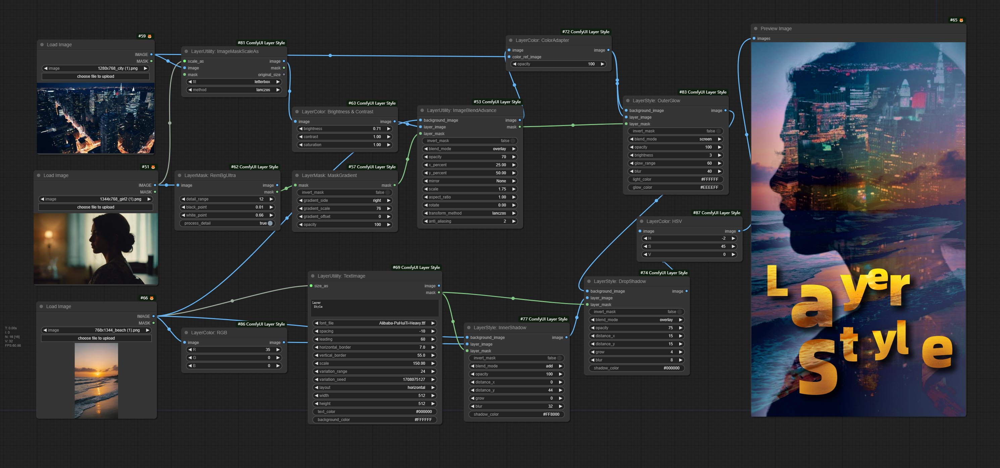    
<font size="1">*this workflow (title_example_workflow.json) is in the workflow directory.  </font><br /> 

## Example workflow

Some JSON workflow files in the    ```workflow``` directory, That's examples of how these nodes can be used in ComfyUI.

## How to install

(Taking ComfyUI official portable package and Aki ComfyUI package as examples, please modify the dependency environment directory for other ComfyUI environments)

### Install plugin

* Recommended use ComfyUI Manager for installation.

* Or open the cmd window in the plugin directory of ComfyUI, like ```ComfyUI\custom_nodes```，type    
  
  ```
  git clone https://github.com/chflame163/ComfyUI_LayerStyle.git
  ```

* Or download the zip file and extracted, copy the resulting folder to ```ComfyUI\custom_ Nodes```    

### Install dependency packages

* for ComfyUI official portable package, double-click the ```install_requirements.bat``` in the plugin directory, for Aki ComfyUI package double-click on the ```install_requirements_aki.bat``` in the plugin directory, and wait for the installation to complete.

* Or install dependency packages, open the cmd window in the ComfyUI_LayerStyle plugin directory like 
  ```ComfyUI\custom_ Nodes\ComfyUI_LayerStyle``` and enter the following command,

&emsp;&emsp;for ComfyUI official portable package, type:

```
..\..\..\python_embeded\python.exe -s -m pip install .\whl\docopt-0.6.2-py2.py3-none-any.whl
..\..\..\python_embeded\python.exe -s -m pip install .\whl\hydra_core-1.3.2-py3-none-any.whl
..\..\..\python_embeded\python.exe -s -m pip install -r requirements.txt
.\repair_dependency.bat
```

&emsp;&emsp;for Aki ComfyUI package, type:

```
..\..\python\python.exe -s -m pip install .\whl\docopt-0.6.2-py2.py3-none-any.whl
..\..\python\python.exe -s -m pip install .\whl\hydra_core-1.3.2-py3-none-any.whl
..\..\python\python.exe -s -m pip install -r requirements.txt
.\repair_dependency.bat
```

* Restart ComfyUI.

### Download Model Files

Chinese domestic users from  [BaiduNetdisk](https://pan.baidu.com/s/1T_uXMX3OKIWOJLPuLijrgA?pwd=1yye)  and other users from [huggingface.co/chflame163/ComfyUI_LayerStyle](https://huggingface.co/chflame163/ComfyUI_LayerStyle/tree/main)  
download all files and copy them to ```ComfyUI\models``` folder. This link provides all the model files required for this plugin.
Or download the model file according to the instructions of each node.

## Common Issues

If the node cannot load properly or there are errors during use, please check the error message in the ComfyUI terminal window. The following are common errors and their solutions.

### Warning: xxxx.ini not found, use default xxxx..

This warning message indicates that the ini file cannot be found and does not affect usage. If you do not want to see these warnings, please modify all ```*.ini.example``` files in the plugin directory to ```*.ini```.

### ModuleNotFoundError: No module named 'psd_tools'

This error is that the ```psd_tools``` were not installed correctly.   

Solution:

* Close ComfyUI and open the terminal window in the plugin directory and execute the following command:
  ```../../../python_embeded/python.exe -s -m pip install psd_tools```
  If error occurs during the installation of psd_tool, such as ```ModuleNotFoundError: No module named 'docopt'``` , please download [docopt's whl](https://www.piwheels.org/project/docopt/) and manual install it. 
  execute the following command in terminal window:
  ```../../../python_embeded/python.exe -s -m pip install path/docopt-0.6.2-py2.py3-none-any.whl``` the ```path``` is path name of whl file.

### Cannot import name 'guidedFilter' from 'cv2.ximgproc'

This error is caused by incorrect version of the ```opencv-contrib-python``` package，or this package is overwriteen by other opencv packages. 

### NameError: name 'guidedFilter' is not defined

The reason for the problem is the same as above.

### Cannot import name 'VitMatteImageProcessor' from 'transformers'

This error is caused by the low version of ```transformers``` package. 

### insightface Loading very slow

This error is caused by the low version of ```protobuf``` package. 

#### For the issues with the above three dependency packages, please double click ```repair_dependency.bat``` (for Official ComfyUI Protable) or  ```repair_dependency_aki.bat``` (for ComfyUI-aki-v1.x) in the plugin folder to automatically fix them.

### onnxruntime::python::CreateExecutionProviderInstance CUDA_PATH is set but CUDA wasn't able to be loaded. Please install the correct version of CUDA and cuDNN as mentioned in the GPU requirements page

Solution:
Reinstall the  ```onnxruntime``` dependency package.

### Error loading model xxx: We couldn't connect to huggingface.co ...

Check the network environment. If you cannot access huggingface.co normally in China, try modifying the huggingface_hub package to force the use hf_mirror.

* Find ```constants.py``` in the directory of ```huggingface_hub``` package (usually ```Lib/site packages/huggingface_hub``` in the virtual environment path),
  Add a line after ```import os```
  
  ```
  os.environ['HF_ENDPOINT'] = 'https://hf-mirror.com'
  ```

### ValueError: Trimap did not contain foreground values (xxxx...)

This error is caused by the mask area being too large or too small when using the ```PyMatting``` method to handle the mask edges.    

Solution:

* Please adjust the parameters to change the effective area of the mask. Or use other methods to handle the edges.

### Requests.exceptions.ProxyError: HTTPSConnectionPool(xxxx...)

When this error has occurred, please check the network environment.

### UnboundLocalError: local variable 'clip_processor' referenced before assignment
### UnboundLocalError: local variable 'text_model' referenced before assignment
If this error occurs when executing ```JoyCaption2``` node and it has been confirmed that the model file has been placed in the correct directory, 
please check the ```transformers``` dependency package version is at least 4.43.2 or higher.
If ```transformers``` version is higher than or equal to 4.45.0, and also have error message:
```
Error loading models: De️️scriptors cannot be created directly.                                                                                           
If this call came from a _pb2.py file, your generated code is out of date and must be regenerated with protoc >= 3.19.0.                                
......
```
Please try downgrading the ```protobuf``` dependency package to 3.20.3, or set environment variables: ```PROTOCOL_BUFFERS_PYTHON_IMPLEMENTATION=python```.


## Update

<font size="4">**If the dependency package error after updating,  please double clicking ```repair_dependency.bat``` (for Official ComfyUI Protable) or  ```repair_dependency_aki.bat``` (for ComfyUI-aki-v1.x) in the plugin folder to reinstall the dependency packages. </font><br />    

* Due to the high version requirements of the [LlamaVision](#LlamaVision) node for ```transformers```, which affects the loading of some older third-party plugins, so the LayerStyle plugin has lowered the default requirement to 4.43.2. If you need to run LlamaVision, please upgrade to 4.45.0 or above on your own. 

* Commit [JoyCaption2](#JoyCaption2) and [JoyCaption2ExtraOptions](#JoyCaption2ExtraOptions) nodes. New dependency packages need to be installed.
Use the JoyCaption-alpha-two model for local inference. Can be used to generate prompt words. this node is https://huggingface.co/John6666/joy-caption-alpha-two-cli-mod Implementation in ComfyUI, thank you to the original author.
Download models form [BaiduNetdisk](https://pan.baidu.com/s/1dOjbUEacUOhzFitAQ3uIeQ?pwd=4ypv) and [BaiduNetdisk](https://pan.baidu.com/s/1mH1SuW45Dy6Wga7aws5siQ?pwd=w6h5) , 
or [huggingface/Orenguteng](https://huggingface.co/Orenguteng/Llama-3.1-8B-Lexi-Uncensored-V2/tree/main) and [huggingface/unsloth](https://huggingface.co/unsloth/Meta-Llama-3.1-8B-Instruct/tree/main) , then copy to ```ComfyUI/models/LLM```,
Download models from [BaiduNetdisk](https://pan.baidu.com/s/1pkVymOsDcXqL7IdQJ6lMVw?pwd=v8wp) or [huggingface/google](https://huggingface.co/google/siglip-so400m-patch14-384/tree/main) , and copy to ```ComfyUI/models/clip```,
Donwload the ```cgrkzexw-599808``` folder from [BaiduNetdisk](https://pan.baidu.com/s/12TDwZAeI68hWT6MgRrrK7Q?pwd=d7dh) or [huggingface/John6666](https://huggingface.co/John6666/joy-caption-alpha-two-cli-mod/tree/main) , and copy to ```ComfyUI/models/Joy_caption```。

* Commit [LlamaVision](#LlamaVision) node, Use the Llama 3.2 vision model for local inference. Can be used to generate prompt words. part of the code for this node comes from [ComfyUI-PixtralLlamaMolmoVision](https://github.com/SeanScripts/ComfyUI-PixtralLlamaMolmoVision), thank you to the original author.
To use this node, the ```transformers``` need upgraded to 4.45.0 or higher.
Download models from [BaiduNetdisk](https://pan.baidu.com/s/18oHnTrkNMiwKLMcUVrfFjA?pwd=4g81) or [huggingface/SeanScripts](https://huggingface.co/SeanScripts/Llama-3.2-11B-Vision-Instruct-nf4/tree/main) , and copy to ```ComfyUI/models/LLM```.

* Commit [RandomGeneratorV2](#RandomGeneratorV2) node, add least random range and seed options.
* Commit [TextJoinV2](#TextJoinV2) node, add delimiter options on top of TextJion.
* Commit [GaussianBlurV2](#GaussianBlurV2) node, The parameter accuracy has been improved to 0.01.
* Commit [UserPromptGeneratorTxtImgWithReference](#UserPromptGeneratorTxtImgWithReference) node.
* Commit [GrayValue](#GrayValue) node, output the grayscale values corresponding to the RGB color values.
* [LUT Apply](#LUT), [TextImageV2](#TextImageV2), [TextImage](#TextImage), [SimpleTextImage](#SimpleTextImage) nodes to support defining multiple folders in ```resource-dir.ini```, separated by commas, semicolons, or spaces. Simultaneously supports refreshing real-time updates.
* [LUT Apply](#LUT), [TextImageV2](#TextImageV2), [TextImage](#TextImage), [SimpleTextImage](#SimpleTextImage) nodes support defining multi directory fonts and lut folders, and support refreshing and real-time updates.
* Commit [HumanPartsUltra](#HumanPartsUltra) node, used to generate human body parts masks. It is based on the warrper of [metal3d/ComfyUI_Human_Parts](https://github.com/metal3d/ComfyUI_Human_Parts), thank the original author.
  Download model file from [BaiduNetdisk](https://pan.baidu.com/s/1-6uwH6RB0FhIVfa3qO7hhQ?pwd=d862) or [huggingface](https://huggingface.co/Metal3d/deeplabv3p-resnet50-human/tree/main) and copy to ```ComfyUI\models\onnx\human-parts``` folder.
* ObjectDetector nodes add sort by confidence option.
* Commit [DrawBBoxMask](#DrawBBoxMask) node, used to convert the BBoxes output by the Object Detector node into a mask.
* Commit [UserPromptGeneratorTxtImg](#UserPromptGeneratorTxtImg) and [UserPromptGeneratorReplaceWord](#UserPromptGeneratorReplaceWord) nodes, Used to generate text and image prompts and replace prompt content.
* Commit [PhiPrompt](#PhiPrompt) node, Use Microsoft Phi 3.5 text and visual models for local inference. Can be used to generate prompt words, process prompt words, or infer prompt words from images. Running this model requires at least 16GB of video memory.      
  Download model files from [BaiduNetdisk](https://pan.baidu.com/s/1BdTLdaeGC3trh1U3V-6XTA?pwd=29dh) or [huggingface.co/microsoft/Phi-3.5-vision-instruct](https://huggingface.co/microsoft/Phi-3.5-vision-instruct/tree/main) and [huggingface.co/microsoft/Phi-3.5-mini-instruct](https://huggingface.co/microsoft/Phi-3.5-mini-instruct/tree/main) and copy to ```ComfyUI\models\LLM``` folder.
* Commit [GetMainColors](#GetMainColors) node, it can obtained 5 main colors of image. Commit [ColorName](#ColorName) node, it can obtain the color name of input color value.
* Duplicate the [Brightness & Contrast](#Brightness) node as [BrightnessContrastV2](#BrightnessContrastV2), the [Color of Shadow & Highlight](#Highlight) node as [ColorofShadowHighlight](#HighlightV2), and [Shadow & Highlight Mask](#Shadow) to [Shadow Highlight Mask V2](#ShadowV2), to avoid errors in ComfyUI workflow parsing caused by the "&" character in the node name.
* Commit [VQAPrompt](#VQAPrompt) and [LoadVQAModel](#LoadVQAModel) nodes.      
  Download the model from [BaiduNetdisk](https://pan.baidu.com/s/1ILREVgM0eFJlkWaYlKsR0g?pwd=yw75) or [huggingface.co/Salesforce/blip-vqa-capfilt-large](https://huggingface.co/Salesforce/blip-vqa-capfilt-large/tree/main) and [huggingface.co/Salesforce/blip-vqa-base](https://huggingface.co/Salesforce/blip-vqa-base/tree/main) and copy to ```ComfyUI\models\VQA``` folder.
* [Florence2Ultra](#Florence2Ultra),  [Florence2Image2Prompt](#Florence2Image2Prompt) 和 [LoadFlorence2Model](#LoadFlorence2Model) nodes support the MiaoshouAI/Florence-2-large-PromptGen-v1.5 and MiaoshouAI/Florence-2-base-PromptGen-v1.5 model.    
  Download model files from [BaiduNetdisk](https://pan.baidu.com/s/1xOL6x6LijIMSh_3woErjJg?pwd=t3xa) or [huggingface.co/MiaoshouAI/Florence-2-large-PromptGen-v1.5](https://huggingface.co/MiaoshouAI/Florence-2-large-PromptGen-v1.5/tree/main) and [huggingface.co/MiaoshouAI/Florence-2-base-PromptGen-v1.5](https://huggingface.co/MiaoshouAI/Florence-2-base-PromptGen-v1.5/tree/main) , copy to  ```ComfyUI\models\florence2``` folder.
* Commit [BiRefNetUltraV2](#BiRefNetUltraV2) and [LoadBiRefNetModel](#LoadBiRefNetModel) nodes, that support the use of the latest BiRefNet model.
  Download model file from [BaiduNetdisk](https://pan.baidu.com/s/12z3qUuqag3nqpN2NJ5pSzg?pwd=ek65) or [GoogleDrive](https://drive.google.com/drive/folders/1s2Xe0cjq-2ctnJBR24563yMSCOu4CcxM) named ```BiRefNet-general-epoch_244.pth``` to  ```ComfyUI/Models/BiRefNet/pth``` folder. You can also download more BiRefNet models and put them here.
* [ExtendCanvasV2](#ExtendCanvasV2) node support negative value input, it means image will be cropped.
* The default title color of nodes is changed to blue-green, and nodes in LayerStyle, LayerColor, LayerMask, LayerUtility, and LayerFilter are distinguished by different colors.
* The Object Detector nodes added sort bbox option, which allows sorting from left to right, top to bottom, and large to small, making object selection more intuitive and convenient. The nodes released yesterday has been abandoned, please manually replace it with the new version node (sorry).
* Commit [SAM2Ultra](#SAM2Ultra), [SAM2VideoUltra](#SAM2VideoUltra), [ObjectDetectorFL2](#ObjectDetectorFL2), [ObjectDetectorYOLOWorld](#ObjectDetectorYOLOWorld), [ObjectDetectorYOLO8](#ObjectDetectorYOLO8), [ObjectDetectorMask](#ObjectDetectorMask) and [BBoxJoin](#BBoxJoin) nodes. 
  Download models from [BaiduNetdisk](https://pan.baidu.com/s/1xaQYBA6ktxvAxm310HXweQ?pwd=auki) or [huggingface.co/Kijai/sam2-safetensors](https://huggingface.co/Kijai/sam2-safetensors/tree/main) and copy to ```ComfyUI/models/sam2``` folder,
  Download models from [BaiduNetdisk](https://pan.baidu.com/s/1QpjajeTA37vEAU2OQnbDcQ?pwd=nqsk) or [GoogleDrive](https://drive.google.com/drive/folders/1nrsfq4S-yk9ewJgwrhXAoNVqIFLZ1at7?usp=sharing) and copy to ```ComfyUI/models/yolo-world``` folder.
  This update introduces new dependencies, please reinstall the dependency package.
* Commit [RandomGenerator](#RandomGenerator) node, Used to generate random numbers within a specified range, with outputs of int, float, and boolean, supporting batch generation of different random numbers by image batch.
* Commit [EVF-SAMUltra](#EVFSAMUltra) node, it is implementation of [EVF-SAM](https://github.com/hustvl/EVF-SAM) in ComfyUI. Please download model files from [BaiduNetdisk](https://pan.baidu.com/s/1EvaxgKcCxUpMbYKzLnEx9w?pwd=69bn) or [huggingface/EVF-SAM2](https://huggingface.co/YxZhang/evf-sam2/tree/main), [huggingface/EVF-SAM](https://huggingface.co/YxZhang/evf-sam/tree/main) to ```ComfyUI/models/EVF-SAM``` folder(save the models in their respective subdirectories).
  Due to the introduction of new dependencies package, after the plugin upgrade, please reinstall the dependency packages.
* Commit [ImageTaggerSave](#ImageTaggerSave) and [ImageAutoCropV3](#ImageAutoCropV3) nodes. Used to implement the automatic trimming and marking workflow for the training set (the workflow ```image_tagger_save.json``` is located in the workflow directory).
* Commit [CheckMaskV2](#CheckMaskV2) node, Added the ```simple``` method to detect masks more quickly.
* Commit [ImageReel](#ImageReel) and [ImageReelComposite](#ImageReelComposite) nodes to composite multiple images on a canvas.
* [NumberCalculatorV2](#NumberCalculatorV2) and [NumberCalculator](#NumberCalculator) add the  ```min``` and ```max``` method.
* Optimize node loading speed.    
* [Florence2Image2Prompt](#Florence2Image2Prompt) add support for ```thwri/CogFlorence-2-Large-Freeze``` and ```thwri/CogFlorence-2.1-Large``` models. Please download the model files from [BaiduNetdisk](https://pan.baidu.com/s/1hzw9-QiU1vB8pMbBgofZIA?pwd=mfl3) or [huggingface/CogFlorence-2-Large-Freeze](https://huggingface.co/thwri/CogFlorence-2-Large-Freeze/tree/main) and [huggingface/CogFlorence-2.1-Large](https://huggingface.co/thwri/CogFlorence-2.1-Large/tree/main) , then copy it to ```ComfyUI/models/florence2``` folder. 
* Merge branch from [ClownsharkBatwing](https://github.com/ClownsharkBatwing) "Use GPU for color blend mode", the speed of some layer blends by more than ten times.
* Commit [Florence2Ultra](#Florence2Ultra),  [Florence2Image2Prompt](#Florence2Image2Prompt) and [LoadFlorence2Model](#LoadFlorence2Model) nodes.
* [TransparentBackgroundUltra](#TransparentBackgroundUltra) node add new model support. Please download the model file according to the instructions.
* Commit [SegformerUltraV2](#SegformerUltraV2), [SegfromerFashionPipeline](#SegfromerFashionPipeline) and [SegformerClothesPipeline](#SegformerClothesPipeline) nodes, used for segmentation of clothing. please download the model file according to the instructions.
* Commit ```install_requirements.bat``` and ```install_requirements_aki.bat```, One click solution to install dependency packages.
* Commit [TransparentBackgroundUltra](#TransparentBackgroundUltra) node, it remove background based on transparent-background model.
* Change the VitMatte model of the [Ultra](#Ultra) node to a local call. Please download [all files of vitmatte model](https://huggingface.co/hustvl/vitmatte-small-composition-1k/tree/main) to the ```ComfyUI/models/vitmatte``` folder.
* [GetColorToneV2](#GetColorToneV2) node add the ```mask``` method to the color selection option, which can accurately obtain the main color and average color within the mask.
* [ImageScaleByAspectRatioV2](#ImageScaleByAspectRatioV2) node add the "background_color" option.
* [LUT Apply](#LUT) Add the "strength" option.
* Commit [AutoAdjustV2](#AutoAdjustV2) node, add optional mask input and support for multiple automatic color adjustment modes.
* Due to the upcoming discontinuation of gemini-pro vision services, [PromptTagger](#PromptTagger) and [PromptEmbellish](#PromptEmbellish) have added the "gemini-1.5-flash" API to continue using it.
* [Ultra](#Ultra) nodes added the option to run ```VitMatte``` on the CUDA device, resulting in a 5-fold increase in running speed.
* Commit [QueueStop](#QueueStop) node, used to terminate the queue operation.
* Optimize performance of the ```VitMate``` method for [Ultra](#Ultra) nodes when processing large-size image.
* [CropByMaskV2](#CropByMaskV2) add option to round the cutting size by multiples.
* Commit [CheckMask](#CheckMask) node, it detect whether the mask contains sufficient effective areas. Commit [HSVValue](#HSVValue) node, it convert color values to HSV values.
* [BooleanOperatorV2](#BooleanOperatorV2), [NumberCalculatorV2](#NumberCalculatorV2), [Integer](#Integer), [Float](#Float), [Boolean](#Boolean) nodes add string output to output the value as a string for use with [SwitchCase](#SwitchCase).
* Commit [SwitchCase](#SwitchCase) node, Switches the output based on the matching string. Can be used for any type of data switching.
* Commit [String](#String) node, Used to output a string. It is the TextBox simplified node.
* Commit [If](#If) node，Switches output based on Boolean conditional input. Can be used for any type of data switching.
* Commit [StringCondition](#StringCondition) node, Determines whether the text contains or does not contain a substring.
* Commit [NumberCalculatorV2](#NumberCalculatorV2) node，Add the nth root operation. Commit [BooleanOperatorV2](#BooleanOperatorV2) node, Increasing greater/less than, greater/less then or equal logical judgment. The two nodes can access numeric inputs and can input numeric values within the node. Note: Numeric input takes precedence. Values in nodes will not be valid when there is input.
* Commit [SD3NegativeConditioning](#SD3NegativeConditioning) node, Encapsulate the four nodes of Negative Condition in SD3 into a separate node.
* [ImageRemoveAlpha](#ImageRemoveAlpha) node add optional mask input.
* Commit [HLFrequencyDetailRestore](#HLFrequencyDetailRestore) node, Using low-frequency filtering and high-frequency preserving to restore image details, the fusion is better.
* Commit [AddGrain](#AddGrain) and [MaskGrain](#MaskGrain) nodes, Add noise to a picture or mask.
* Commit [FilmV2](#FilmV2) node, The fastgrain method is added on the basis of the previous one, and the noise generation speed is 10 times faster.
* Commit [ImageToMask](#ImageToMask) node, it can be converted image into mask. Supports converting any channel in LAB, RGBA, YUV, and HSV modes into masks, while providing color scale adjustment. Support mask optional input to obtain masks that only include valid parts.
* The blackpoint and whitepoint options in some nodes have been changed to slider adjustment for a more intuitive display. Include [MaskEdgeUltraDetailV2](#MaskEdgeUltraDetailV2), [SegmentAnythingUltraV2](#SegmentAnythingUltraV2), [RmBgUltraV2](#RmBgUltraV2)，[PersonMaskUltraV2](#PersonMaskUltraV2)，[BiRefNetUltra](#BiRefNetUltra), [SegformerB2ClothesUltra](#SegformerB2ClothesUltra), [BlendIfMask](#BlendIfMask) and [Levels](#Levels).
* [ImageScaleRestoreV2](#ImageScaleRestoreV2) and  [ImageScaleByAspectRatioV2](#ImageScaleByAspectRatioV2) nodes add the ```total_pixel``` method to scale images.
* Commit [MediapipeFacialSegment](#MediapipeFacialSegment) node，Used to segment facial features, including left and right eyebrows, eyes, lips, and teeth.
* Commit [BatchSelector](#BatchSelector) node，Used to retrieve specified images or masks from batch images or masks.
* LayerUtility creates new subdirectories such as SystemIO, Data, and Prompt. Some nodes are classified into subdirectories.
* Commit [MaskByColor](#MaskByColor) node, Generate a mask based on the selected color.
* Commit [LoadPSD](#LoadPSD) node, It read the psd format, and output layer images. Note that this node requires the installation of the ```psd_tools``` dependency package, If error occurs during the installation of psd_tool, such as ```ModuleNotFoundError: No module named 'docopt'``` , please download [docopt's whl](https://www.piwheels.org/project/docopt/) and manual install it. 
* Commit [SegformerB2ClothesUltra](#SegformerB2ClothesUltra) node, it used to segment character clothing. The model segmentation code is from[StartHua](https://github.com/StartHua/Comfyui_segformer_b2_clothes),  thanks to the original author.
* [SaveImagePlus](#SaveImagePlus) node adds the output workflow to the json function, supports ```%date``` and ```%time``` to embeddint date or time to path and filename, and adds the preview switch.
* Commit [SaveImagePlus](#SaveImagePlus) node，It can customize the directory where the picture is saved, add a timestamp to the file name, select the save format, set the image compression rate, set whether to save the workflow, and optionally add invisible watermarks to the picture.
* Commit [AddBlindWaterMark](#AddBlindWaterMark), [ShowBlindWaterMark](#ShowBlindWaterMark) nodes, Add invisible watermark and decoded watermark to the picture. Commit [CreateQRCode](#CreateQRCode), [DecodeQRCode](#DecodeQRCode) nodes, It can generate two-dimensional code pictures and decode two-dimensional codes.
* [ImageScaleRestoreV2](#ImageScaleRestoreV2), [ImageScaleByAspectRatioV2](#ImageScaleByAspectRatioV2), [ImageAutoCropV2](#ImageAutoCropV2) nodes add options for ```width``` and ```height```, which can specify width or height as fixed values.
* Commit [PurgeVRAM](#PurgeVRAM) node, Clean up VRAM an RAM.
* Commit [AutoAdjust](#AutoAdjust) node, it can automatically adjust image contrast and white balance.
* Commit [RGBValue](#RGBValue) node to output the color value as a single decimal value of R, G, B. This idea is from [vxinhao](https://github.com/vxinhao/color2rgb), Thanks.
* Commit [seed](#seed) node to output the seed value. The [ImageMaskScaleAs](#ImageMaskScaleAs), [ImageScaleBySpectRatio](#ImageScaleBySpectRatio), [ImageScaleBySpectRatioV2](#ImageScaleBySpectRatioV2), [ImageScaleRestore](#ImageScaleRestore), [ImageScaleRestoreV2](#ImageScaleRestoreV2) nodes increase ```width```, ```height``` output.
* Commit [Levels](#Levels) node, it can achieve the same color levels adjustment function as Photoshop.[Sharp&Soft](#Sharp) add the "None" option.
* Commit [BlendIfMask](#BlendIfMask) node, This node cooperates with ImgaeBlendV2 or ImageBlendAdvanceV2 to achieve the same Blend If function as Photoshop.
* Commit [ColorTemperature](#ColorTemperature) and [ColorBalance](#ColorBalance) nodes, used to adjust the color temperature and color balance of the picture.
* Add new types of [Blend Mode V2](#BlendModeV2) between images. now supports up to 30 blend modes. The new blend mode is available for all V2 versions that support mixed mode nodes, including ImageBlend V2, ImageBlendAdvance V2, DropShadow V2, InnerShadow V2, OuterGlow V2, InnerGlow V2, Stroke V2, ColorOverlay V2, GradientOverlay V2.    
  Part of the code for BlendMode V2 is from [Virtuoso Nodes for ComfyUI](https://github.com/chrisfreilich/virtuoso-nodes). Thanks to the original authors.
* Commit [YoloV8Detect](#YoloV8Detect) node.
* Commit [QWenImage2Prompt](#QWenImage2Prompt) node, this node is repackage of the [ComfyUI_VLM_nodes](https://github.com/gokayfem/ComfyUI_VLM_nodes)'s ```UForm-Gen2 Qwen Node```,  thanks to the original author.
* Commit [BooleanOperator](#BooleanOperator), [NumberCalculator](#NumberCalculator), [TextBox](#TextBox), [Integer](#Integer), [Float](#Float), [Boolean](#Boolean)nodes. These nodes can perform mathematical and logical operations.
* Commit [ExtendCanvasV2](#ExtendCanvasV2) node，support color value input.
* Commit [AutoBrightness](#AutoBrightness) node，it can automatically adjust the brightness of image.
* [CreateGradientMask](#CreateGradientMask) node add ```center``` option.
* Commit [GetColorToneV2](#GetColorToneV2) node, can select the main and average colors for the background or body. 
* Commit [ImageRewardFilter](#ImageRewardFilter) node, can filter out poor quality pictures.
* [Ultra](#Ultra) nodes add ```VITMatte(local)``` method, You can choose this method to avoid accessing huggingface.co if you have already downloaded the model before.
* Commit [HDR Effect](#HDR) node，it enhances the dynamic range and visual appeal of input images.  this node is repackage of [HDR Effects (SuperBeasts.AI)](https://github.com/SuperBeastsAI/ComfyUI-SuperBeasts).
* Commit [CropBoxResolve](#CropBoxResolve) node.
* Commit [BiRefNetUltra](#BiRefNetUltra) node, it using the BiRefNet model to remove background has better recognition ability and ultra-high edge details.
* Commit [ImageAutoCropV2](#ImageAutoCropV2) node, it can choose not to remove the background, support mask input, and scale by long or short side size.
* Commit [ImageHub](#ImageHub) node, supports up to 9 sets of Image and Mask switching output, and supports random output.
* Commit [TextJoin](#TextJoin) node.
* Commit [PromptEmbellish](#PromptEmbellish) node. it output polished prompt words, and support inputting images as references.
* [Ultra](#Ultra) nodes have been fully upgraded to V2 version, with the addition of VITMatte edge processing method, which is suitable for handling semi transparent areas. Include [MaskEdgeUltraDetailV2](#MaskEdgeUltraDetailV2), [SegmentAnythingUltraV2](#SegmentAnythingUltraV2), [RmBgUltraV2](#RmBgUltraV2) and [PersonMaskUltraV2](#PersonMaskUltraV2) nodes.
* Commit [Color of Shadow & Highlight](#Highlight) node, it can adjust the color of the dark and bright parts separately. Commit [Shadow & Highlight Mask](#Shadow) node, it can output mask for dark and bright areas.
* Commit [CropByMaskV2](#CropByMaskV2) node, On the basis of the original node, it supports ```crop_box``` input, making it convenient to cut layers of the same size.
* Commit [SimpleTextImage](#SimpleTextImage) node, it generate simple typesetting images and masks from text. This node references some of the functionalities and code of [ZHO-ZHO-ZHO/ComfyUI-Text_Image-Composite](https://github.com/ZHO-ZHO-ZHO/ComfyUI-Text_Image-Composite).
* Commit [PromptTagger](#PromptTagger) node，Inference the prompts based on the image. and it can replace key word for the prompt(need apply for Google Studio API key). Upgrade [ColorImageV2](#ColorImageV2) and [GradientImageV2](#GradientImageV2)，support user customize preset sizes and size_as input.
* Commit [LaMa](#LaMa) node, it can erase objects from the image based on the mask. this node is repackage of [IOPaint](https://www.iopaint.com).
* Commit [ImageRemoveAlpha](#ImageRemoveAlpha) and [ImageCombineAlpha](#ImageCombineAlpha) nodes, alpha channel of the image can be removed or merged.
* Commit [ImageScaleRestoreV2](#ImageScaleRestoreV2) and [ImageScaleByAspectRatioV2](#ImageScaleByAspectRatioV2) nodes, supports scaling images to specified long or short edge sizes.
* Commit [PersonMaskUltra](#PersonMaskUltra) node, Generate masks for portrait's face, hair, body skin, clothing, or accessories. the model code for this node comes from [a-person-mask-generator](https://github.com/djbielejeski/a-person-mask-generator).
* Commit [LightLeak](#LightLeak) node, this filter simulate the light leakage effect of the film.
* Commit [Film](#Film) node, this filter simulate the grain, dark edge, and blurred edge of the film, support input depth map to simulate defocus. it is reorganize and encapsulate of [digitaljohn/comfyui-propost](https://github.com/digitaljohn/comfyui-propost).
* Commit [ImageAutoCrop](#ImageAutoCrop) node, which is designed to generate image materials for training models.
* Commit [ImageScaleByAspectRatio](#ImageScaleByAspectRatio) node, it can be scaled image or mask according to frame ratio.
* Fix the bug of color gradation in [LUT Apply](#LUT) node rendering, and this node now support for log color space. *Please load the dedicated log lut file for the log color space image.
* Commit [CreateGradientMask](#CreateGradientMask) node. Commit [LayerImageTransform](#LayerImageTransform) and [LayerMaskTransform](#LayerMaskTransform) nodes.
* Commit [MaskEdgeUltraDetail](#MaskEdgeUltraDetail) node, it process rough masks to ultra fine edges.Commit [Exposure](#Exposure) node.
* Commit [Sharp & Soft](#Sharp) node, it can enhance or smooth out image details. Commit [MaskByDifferent](#MaskByDifferent) node, it compare two images and output a Mask. Commit [SegmentAnythingUltra](#SegmentAnythingUltra) node, Improve the quality of mask edges. *If SegmentAnything is not installed, you will need to manually download the model.
* All nodes have fully supported batch images, providing convenience for video creation.
  (The CropByMask node only supports cuts of the same size. if a batch mask_for_crop inputted, the data from the first sheet will be used.)
* Commit [RemBgUltra](#RemBgUltra) and [PixelSpread](#PixelSpread) nodes significantly improved mask quality. *RemBgUltra requires manual model download.
* Commit [TextImage](#TextImage) node, it generate text images and masks.
* Add new types of [blend mode](#Blend) between images. now supports up to 19 blend modes. add **color_burn, color_dodge, linear_burn, linear_dodge, overlay, soft_light, hard_light, vivid_light, pin_light, linear_light** and **hard_mix**. 
  The newly added blend mode is applicable to all nodes that support blend mode.
* Commit [ColorMap](#ColorMap) filter node to create a pseudo color heatmap effect.
* Commit [WaterColor](#WaterColor) and [SkinBeauty](#SkinBeauty) nodes。These are image filters that generate watercolor and skin smoothness effects.
* Commit [ImageShift](#ImageShift)  node to shift the image and output a displacement seam mask, making it convenient to create continuous textures.
* Commit [ImageMaskScaleAs](#ImageMaskScaleAs) node to adjust the image or mask size based on the reference image.
* Commit [ImageScaleRestore](#ImageScaleRestore) node to work with CropByMask for local upscale and repair works.
* Commit [CropByMask](#CropByMask) and [RestoreCropBox](#RestoreCropBox) nodes. The combination of these two can partially crop and redraw the image before restoring it.
* Commit [ColorAdapter](#ColorAdapter) node, that can automatically adjust the color tone of the image.
* Commit [MaskStroke](#MaskStroke) node, it can generate mask contour strokes.
* Add [LayerColor](#LayerColor) node group, used to adjust image color. it include [LUT Apply](#LUT), [Gamma](#Gamma), [Brightness & Contrast](#Brightness), [RGB](#RGB), [YUV](#YUV), [LAB](#LAB) adn [HSV](#HSV).
* Commit [ImageChannelSplit](#ImageChannelSplit) and [ImageChannelMerge](#ImageChannelMerge) nodes.
* Commit [MaskMotionBlur](#MaskMotionBlur) node.
* Commit [SoftLight](#SoftLight) node.
* Commit [ChannelShake](#ChannelShake) node, that is filter, can produce channel dislocation effect similar like Tiktok logo.
* Commit [MaskGradient](#MaskGradient) node, can create a gradient in the mask.
* Commit [GetColorTone](#GetColorTone) node, can obtain the main color or average color of the image. 
  Commit [MaskGrow](#MaskGrow) and [MaskEdgeShrink](#MaskEdgeShrink) nodes.
* Commit [MaskBoxDetect](#MaskBoxDetect) node, which can automatically detect the position through the mask and output it to the composite node.
  Commit [XY to Percent](#Percent) node to convert absolute coordinates to percent coordinates.
  Commit [GaussianBlur](#GaussianBlur) node.
  Commit [GetImageSize](#GetImageSize) node.
* Commit [ExtendCanvas](#ExtendCanvas) node.
* Commit [ImageBlendAdvance](#ImageBlendAdvance) node. This node allows for the synthesis of background images and layers of different sizes, providing a more free synthesis experience. 
  Commit [PrintInfo](#PrintInfo) node as a workflow debugging aid.
* Commit [ColorImage](#ColorImage) and [GradientImage](#GradientImage) nodes, Used to generate solid and gradient color images.
* Commit [GradientOverlay](#GradientOverlay) and [ColorOverlay](#ColorOverlay) nodes. 
  Add invalid mask input judgment and ignore it when invalid mask is input.
* Commit [InnerGlow](#InnerGlow), [InnerShadow](#InnerShadow) and [MotionBlur](#MotionBlur) nodes.
* Renaming all completed nodes, the nodes are divided into 4 groups：LayerStyle, LayerMask, LayerUtility, LayerFilter. workflows containing old version nodes need to be manually replaced with new version nodes.
* [OuterGlow](#OuterGlow) node has undergone significant modifications by adding options for **_brightness_**, **_light_color_**, and **_glow_color_**.
* Commit [MaskInvert](#MaskInvert) node.
* Commit [ColorPick](#ColorPick) node.
* Commit [Stroke](#Stroke) node.
* Commit [MaskPreview](#MaskPreview) node.
* Commit [ImageOpacity](#ImageOpacity) node.
* The layer_mask is not a mandatory input now. it is allowed to use layers and masks with different shapes, but the size must be consistent.
* Commit [ImageBlend](#ImageBlend) node.
* Commit [OuterGlow](#OuterGlow) node.
* Commit [DropShadow](#DropShadow) node.

## Description

Nodes are divided into 5 groups according to their functions: LayerStyle, LayerColor, LayerMask, LayerUtility and LayerFilter.

* [LayerStyle](#LayerStyle) nodes provides layer styles that mimic Adobe Photoshop.
      
* [LayerColor](#LayerColor) node group provides color adjustment functionality.
  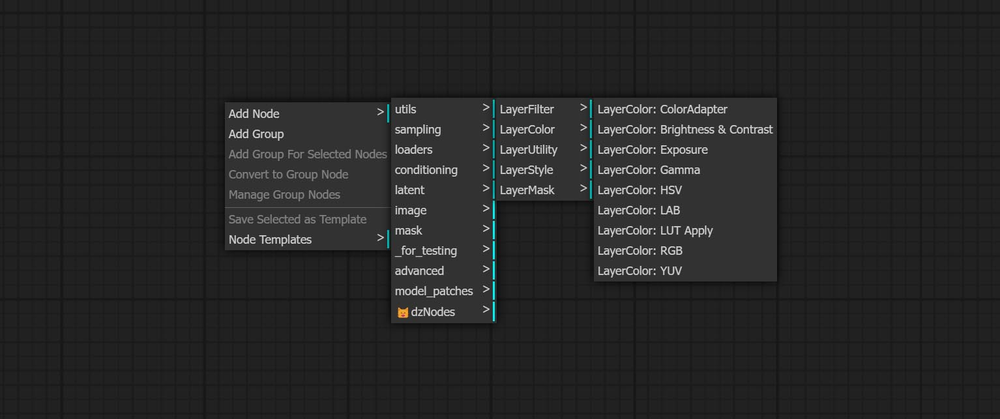    
* [LayerMask](#LayerMask) nodes provides mask assistance tools.
  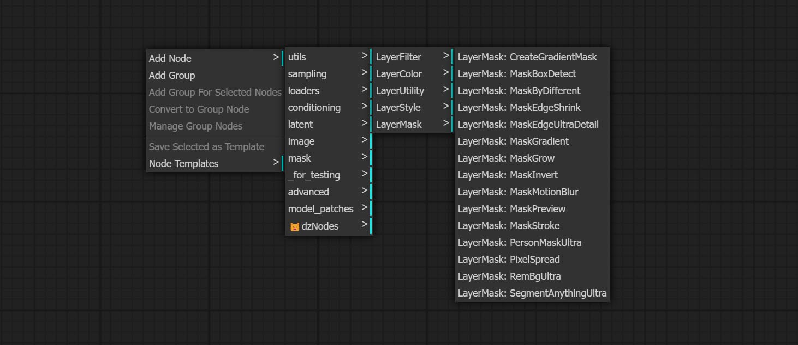    
* [LayerUtility](#LayerUtility) nodes provides auxiliary nodes related to layer composit tools and workflows.
  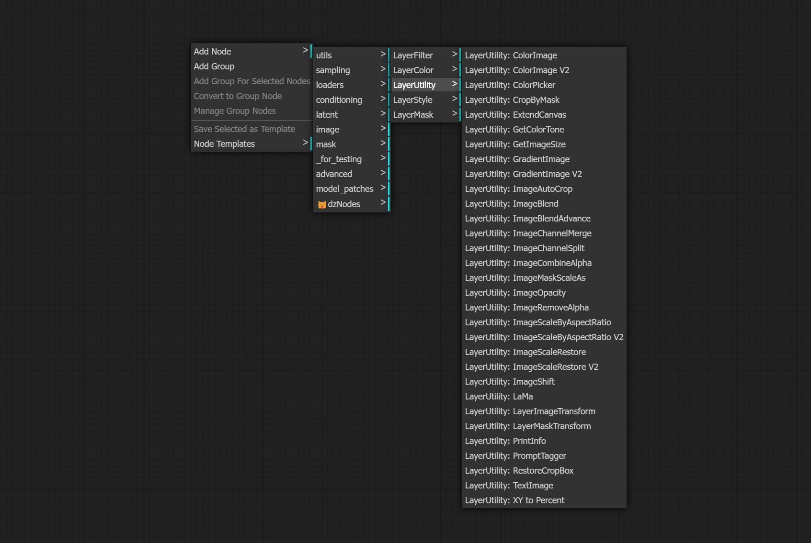    
* [LayerFilter](#LayerFilter) nodes provides image effect filters.
  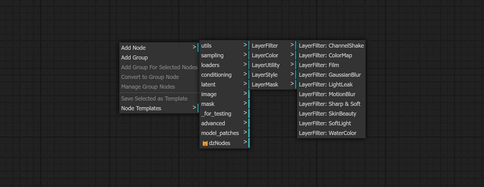    

# <a id="table1">LayerStyle</a>

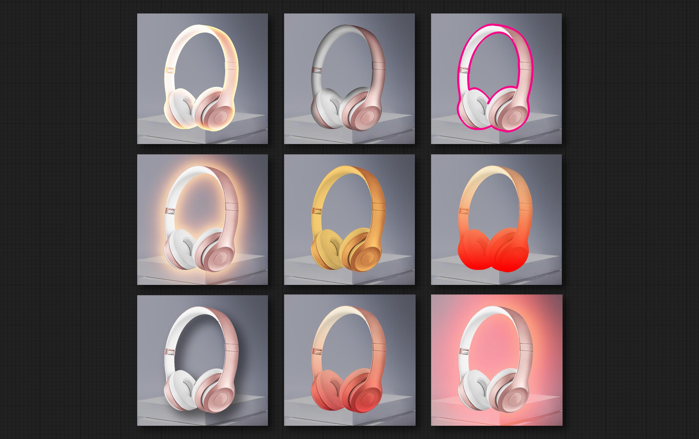    
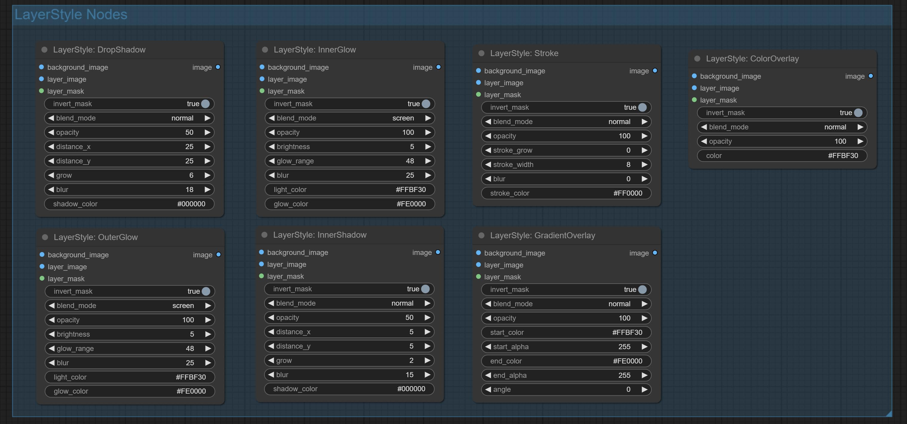    

### <a id="table1">DropShadow</a>

Generate shadow
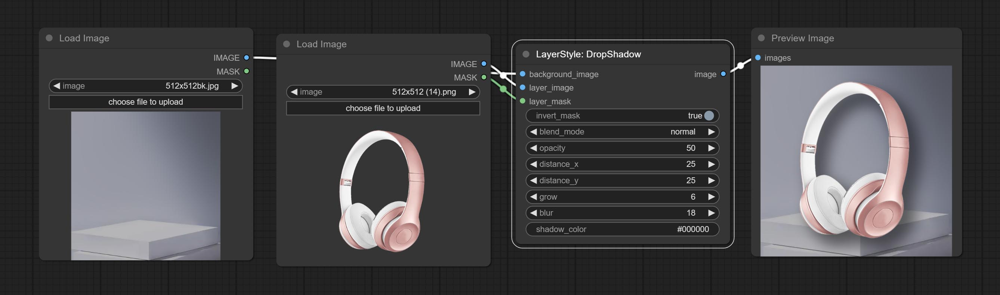    

Node options:
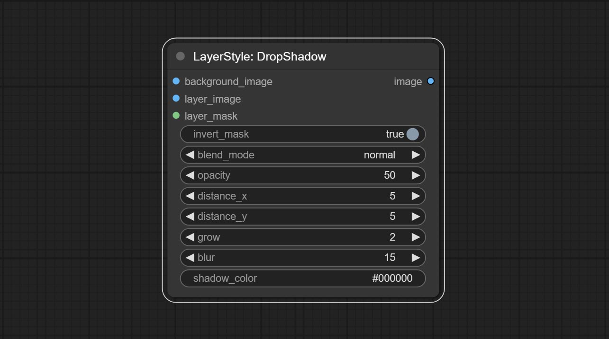    

* background_image<sup>1</sup>: The background image.
* layer_image<sup>1</sup>: Layer image for composite.
* layer_mask<sup>1,2</sup>: Mask for layer_image, shadows are generated according to their shape.
* invert_mask: Whether to reverse the mask.
* blend_mode<sup>3</sup>: Blending mode of shadows.
* opacity: Opacity of shadow.
* distance_x: Horizontal offset of shadow.
* distance_y: Vertical offset of shadow.
* grow: Shadow expansion amplitude.
* blur: Shadow blur level.
* shadow_color<sup>4</sup>: Shadow color.
* [note](#notes)

### <a id="table1">OuterGlow</a>

Generate outer glow
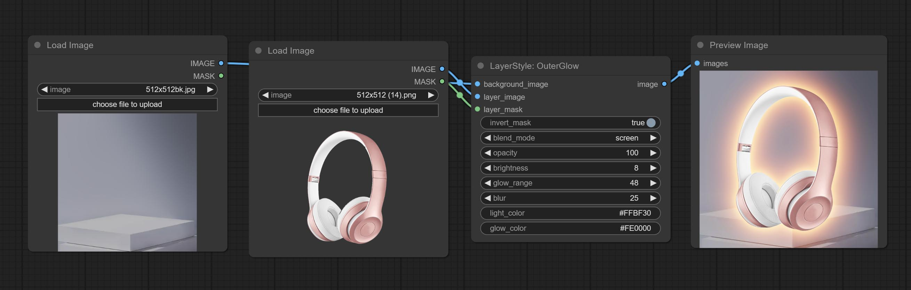    

Node options:
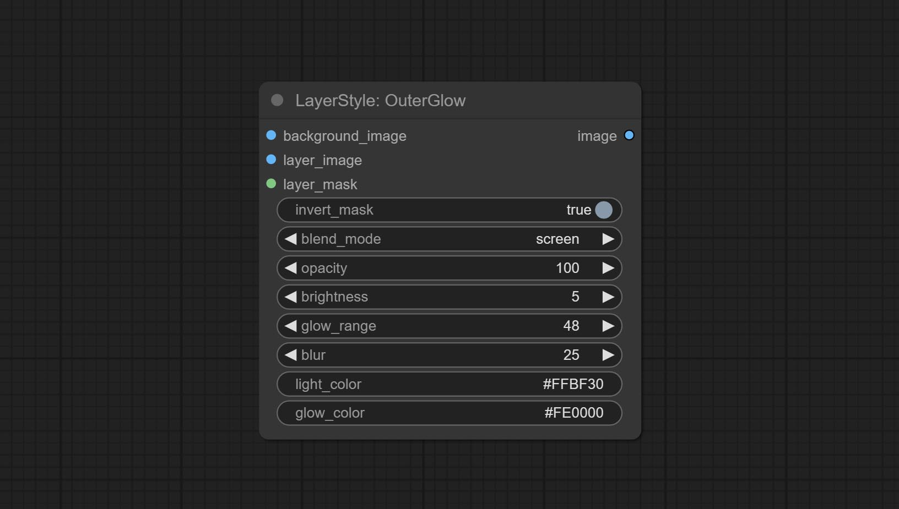    

* background_image<sup>1</sup>: The background image.
* layer_image<sup>1</sup>: Layer image for composite.
* layer_mask<sup>1,2</sup>: Mask for layer_image, grow are generated according to their shape.
* invert_mask: Whether to reverse the mask.
* blend_mode<sup>3</sup>: Blending mode of glow.
* opacity: Opacity of glow.
* brightness: Luminance of light.
* glow_range: range of glow.
* blur：blur of glow.
* light_color<sup>4</sup>: Center part color of glow.
* glow_color<sup>4</sup>: Edge part color of glow.
* [note](#notes)

### <a id="table1">InnerShadow</a>

Generate inner shadow
    

Node options:
    

* background_image<sup>1</sup>: The background image.
* layer_image<sup>1</sup>: Layer image for composite.
* layer_mask<sup>1,2</sup>: Mask for layer_image, shadows are generated according to their shape.
* invert_mask: Whether to reverse the mask.
* blend_mode<sup>3</sup>: Blending mode of shadows.
* opacity: Opacity of shadow.
* distance_x: Horizontal offset of shadow.
* distance_y: Vertical offset of shadow.
* grow: Shadow expansion amplitude.
* blur: Shadow blur level.
* shadow_color<sup>4</sup>: Shadow color.
* [note](#notes)

### <a id="table1">InnerGlow</a>

Generate inner glow
    

Node options:  
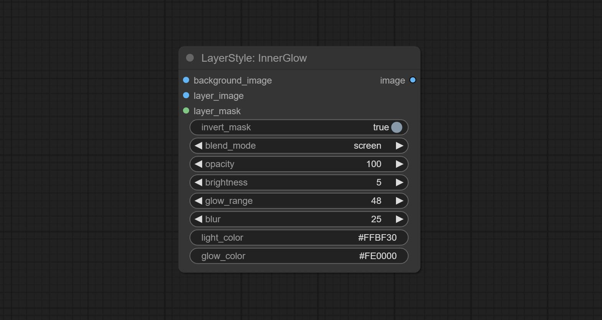    

* background_image<sup>1</sup>: The background image.
* layer_image<sup>1</sup>: Layer image for composite.
* layer_mask<sup>1,2</sup>: Mask for layer_image, grow are generated according to their shape.
* invert_mask: Whether to reverse the mask.
* blend_mode<sup>3</sup>: Blending mode of glow.
* opacity: Opacity of glow.
* brightness: Luminance of light.
* glow_range: range of glow.
* blur：blur of glow.
* light_color<sup>4</sup>: Center part color of glow.
* glow_color<sup>4</sup>: Edge part color of glow.
* [note](#notes)

### <a id="table1">Stroke</a>

Generate a stroke of layer。
    

Node options:   
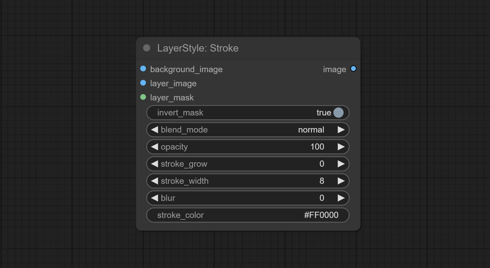    

* background_image<sup>1</sup>: The background image.
* layer_image<sup>1</sup>: Layer image for composite.
* layer_mask<sup>1,2</sup>: Mask for layer_image, stroke are generated according to their shape.
* invert_mask: Whether to reverse the mask.
* blend_mode<sup>3</sup>: Blending mode of stroke.
* opacity: Opacity of stroke.
* stroke_grow: Stroke expansion/contraction amplitude, positive values indicate expansion and negative values indicate contraction.
* stroke_width: Stroke width.
* blur: Blur of stroke.
* stroke_color<sup>4</sup>: Stroke color, described in hexadecimal RGB format.
* [note](#notes)

### <a id="table1">GradientOverlay</a>

Generate gradient overlay
    

Node options:   

* background_image<sup>1</sup>: The background image.
* layer_image<sup>1</sup>: Layer image for composite.
* layer_mask<sup>1,2</sup>: Mask for layer_image.
* invert_mask: Whether to reverse the mask.
* blend_mode<sup>3</sup>: Blending mode of gradient.
* opacity: Opacity of stroke.
* start_color: Color at the beginning of the gradient.
* start_alpha: Transparency at the beginning of the gradient.
* end_color: Color at the end of the gradient.
* end_alpha: Transparency at the end of the gradient.
* angle: Gradient rotation angle.
* [note](#notes)

### <a id="table1">ColorOverlay</a>

Generate color overlay
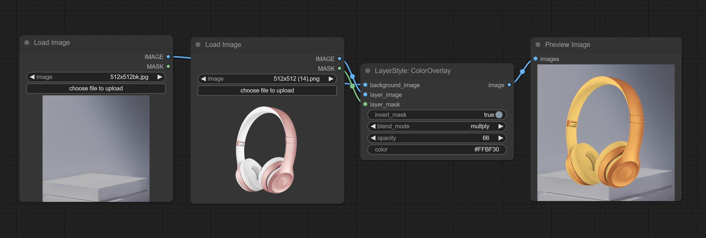    

Node options:
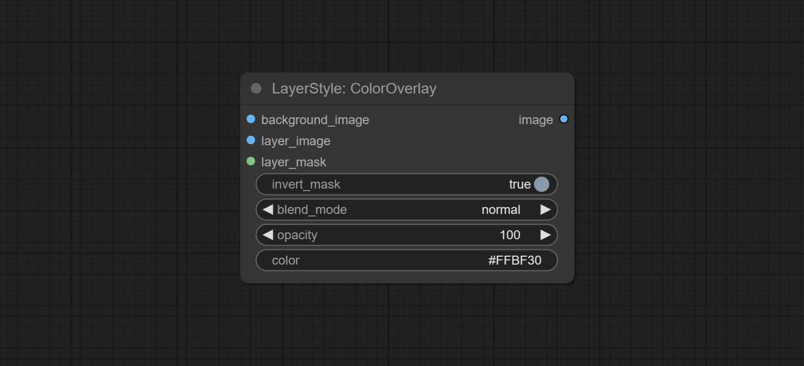    

* background_image<sup>1</sup>: The background image.
* layer_image<sup>1</sup>: Layer image for composite.
* layer_mask<sup>1,2</sup>: Mask for layer_image.
* invert_mask: Whether to reverse the mask.
* blend_mode<sup>3</sup>: Blending mode of color.
* opacity: Opacity of stroke.
* color: Color of overlay.
* [note](#notes)

# <a id="table1">LayerColor</a>

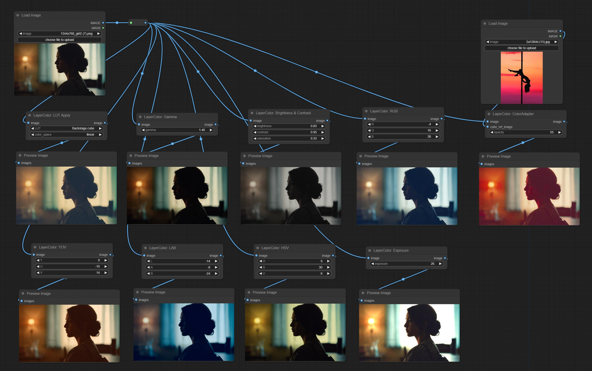    
    

### <a id="table1">LUT</a> Apply

Apply LUT to the image. only supports .cube format.
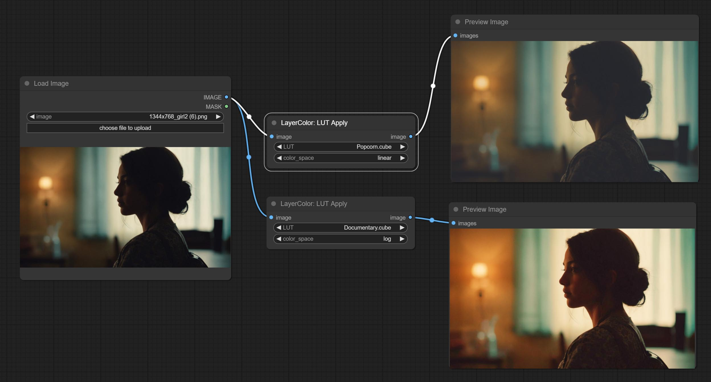    

Node options:  
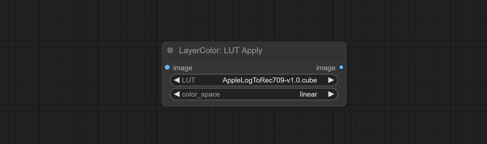    

* LUT<sup>*</sup>: Here is a list of available. cube files in the LUT folder, and the selected LUT files will be applied to the image.
* color_space: For regular image, please select linear, for image in the log color space, please select log.
* strength: Range 0~100, LUT application strength. The larger the value, the greater the difference from the original image, and the smaller the value, the closer it is to the original image.

<sup>*</sup><font size="3">LUT folder is defined in ```resource_dir.ini```, this file is located in the root directory of the plug-in, and the default name is ```resource_dir.ini.example```. to use this file for the first time, you need to change the file suffix to ```.ini```.
Open the text editing software and find the line starting with "LUT_dir=", after "=", enter the custom folder path name.
support defining multiple folders in ```resource-dir.ini```, separated by commas, semicolons, or spaces. 
all .cube files in this folder will be collected and displayed in the node list during ComfyUI initialization.
If the folder set in ini is invalid, the LUT folder that comes with the plugin will be enabled.</font>

### <a id="table1">AutoAdjust</a>

Automatically adjust the brightness, contrast, and white balance of the image. Provide some manual adjustment options to compensate for the shortcomings of automatic adjustment.
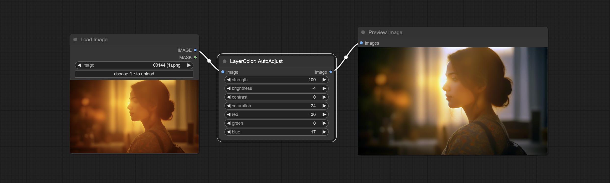    

Node Options:  
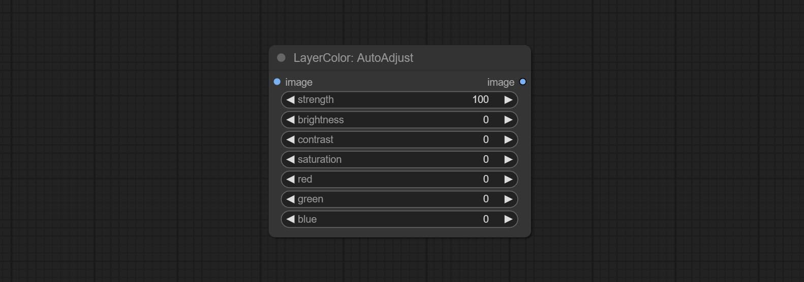    

* strength: Strength of adjust. The larger the value, the greater the difference from the original image.
* brightness: Manual adjustment of brightness.
* contrast: Manual adjustment of contrast.
* saturation: Manual adjustment of saturation.
* red: Manual adjustment of the red channel.
* green: Manual adjustment of the green channel.
* blue: Manual adjustment of the blue channel.

### <a id="table1">AutoAdjustV2</a>

On the basis of AutoAdjust, add mask input and only calculate the content inside the mask for automatic color adjustment. Add multiple automatic adjustment modes.
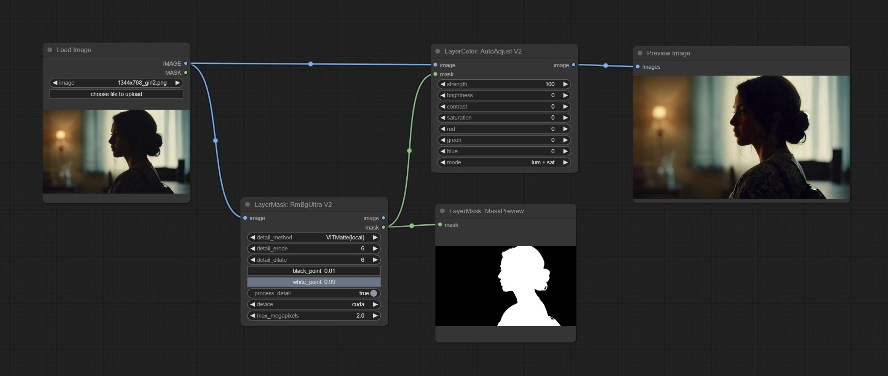    

The following changes have been made based on AutoAdjust: 
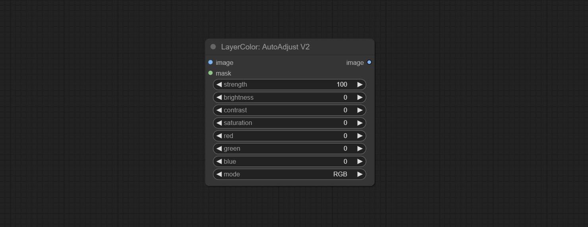    

* mask: Optional mask input.
* mode: Automatic adjustment mode. "RGB" automatically adjusts according to the three channels of RGB, "lum + sat"automatically adjusts according to luminance and saturation, "luminance" automatically adjusts according to luminance, "saturation" automatically adjusts according to saturation, and "mono" automatically adjusts according to grayscale and outputs monochrome.

### <a id="table1">AutoBrightness</a>

Automatically adjust too dark or too bright image to moderate brightness, and support mask input. When  mask input, only the content of the mask part is used as the data source of the automatic brightness. The output is still the whole adjusted image.
    

Node options:  
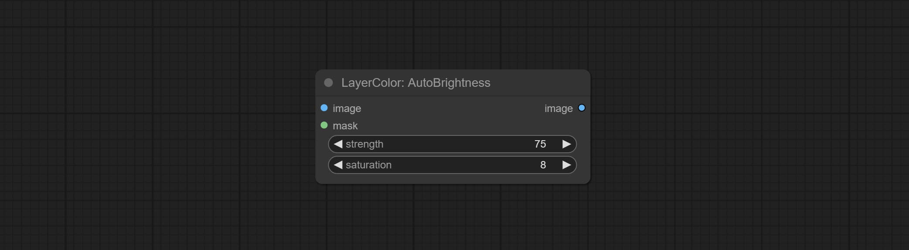    

* strength: Automatically adjust the intensity of the brightness. The larger the value, the more biased towards the middle value, the greater the difference from the original picture.
* saturation: Color saturation. Changes in brightness usually result in changes in color saturation, where appropriate compensation can be adjusted.

### <a id="table1">ColorAdapter</a>

Auto adjust the color tone of the image to resemble the reference image.
    

Node options:  
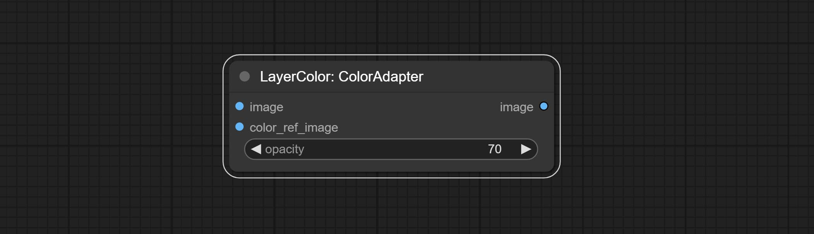    

* opacity: The opacity of an image after adjusting its color tone.

### <a id="table1">Exposure</a>

Change the exposure of the image.
    

### Color of Shadow & <a id="table1">Highlight</a>

Adjust the color of the dark and bright parts of the image.
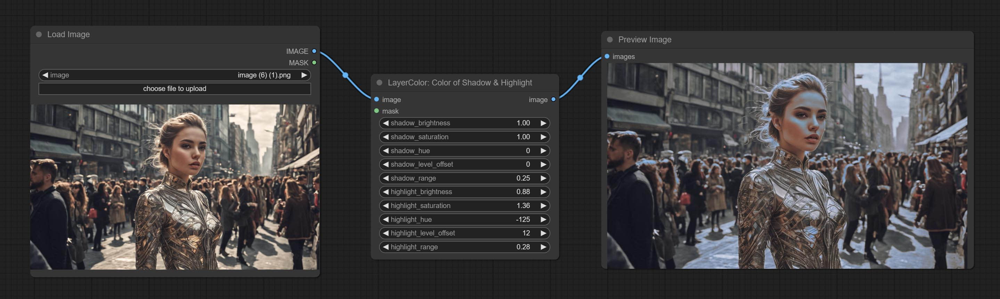    

Node options:  
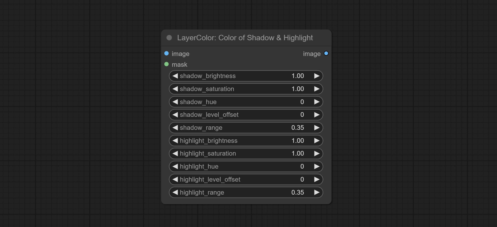    

* image: The input image.
* mask: Optional input. if there is input, only the colors within the mask range will be adjusted.
* shadow_brightness: The brightness of the dark area.
* shadow_saturation: The color saturation in the dark area.
* shadow_hue: The color hue in the dark area.
* shadow_level_offset: The offset of values in the dark area, where larger values bring more areas closer to the bright into the dark area.
* shadow_range: The transitional range of the dark area.
* highlight_brightness:  The brightness of the highlight area.
* highlight_saturation: The color saturation in the highlight area.
* highlight_hue: The color hue in the highlight area.
* highlight_level_offset: The offset of values in the highlight area, where larger values bring more areas closer to the dark into the highlight area.
* highlight_range: The transitional range of the highlight area.

Node option:  

* exposure: Exposure value. Higher values indicate brighter image.

### Color of Shadow <a id="table1">HighlightV2</a>

A replica of the ```Color of Shadow & Highlight``` node, with the "&" character removed from the node name to avoid ComfyUI workflow parsing errors.

### <a id="table1">ColorTemperature</a>

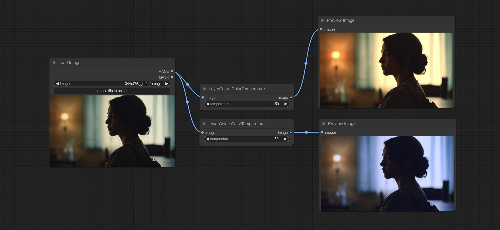    
Change the color temperature of the image.

Node Options:  
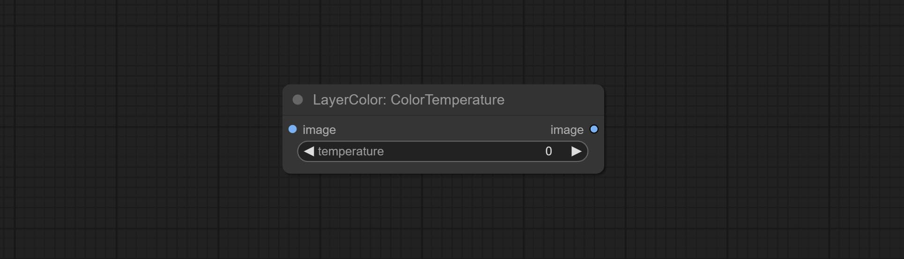    

* temperature: Color temperature value. Range between-100 and 100. The higher the value, the higher the color temperature (bluer); The lower the color temperature, the lower the color temperature (yellowish).

### <a id="table1">Levels</a>

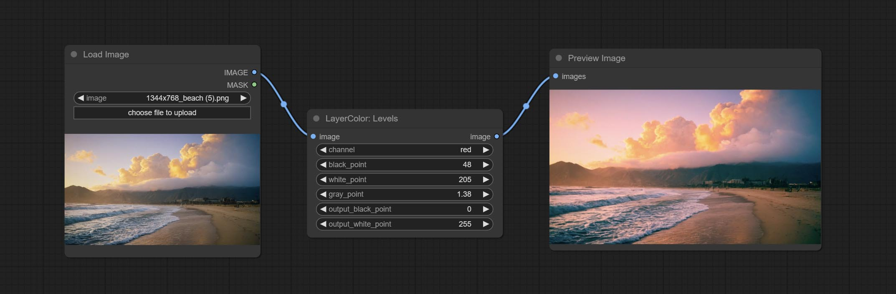    
Change the levels of image.

Node Options:  
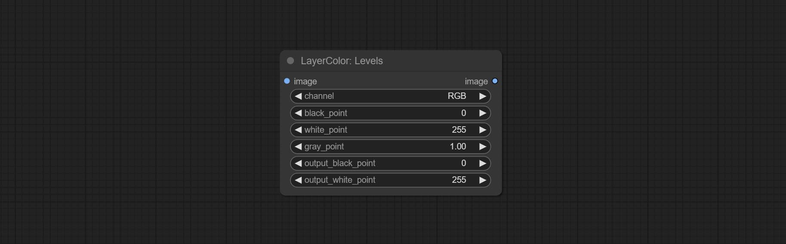    

* channel: Select the channel you want to adjust. Available in RGB, red, green, blue.
* black_point<sup>*</sup>: Input black point value. Value range 0-255, default 0.
* white_point<sup>*</sup>: Input white point value. Value range 0-255, default 255.
* gray_point: Input grey point values. Value range 0.01-9.99, default 1.
* output_black_point<sup>*</sup>: Output black point value. Value range 0-255, default 0.
* output_white_point<sup>*</sup>: Output white point value. Value range 0-255, default 255.

<sup>*</sup><font size="3">If the black_point or output_black_point value is greater than white_point or output_white_point, the two values are swapped, with the larger value used as white_point and the smaller value used as black_point.</font>

### <a id="table1">ColorBalance</a>

    
Change the color balance of an image.

Node Options:  
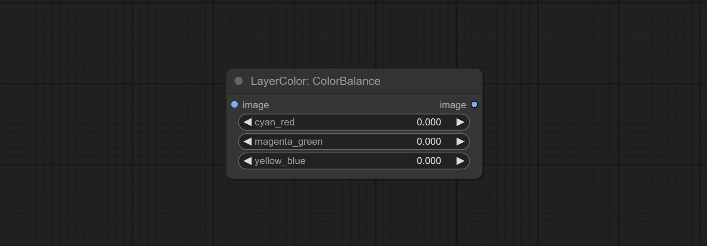    

* cyan_red: Cyan-Red balance. negative values are leaning cyan, positive values are leaning red.
* magenta_green: Megenta-Green balance. negative values are leaning megenta, positive values are leaning green.
* yellow_blue: Yellow-Blue balance. negative values are leaning yellow, positive values are leaning blue.

### <a id="table1">Gamma</a>

Change the gamma value of the image.

Node options:  
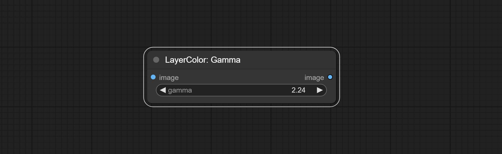    

* gamma: Value of the Gamma.

### <a id="table1">Brightness</a> & Contrast

Change the brightness, contrast, and saturation of the image.

Node options:  
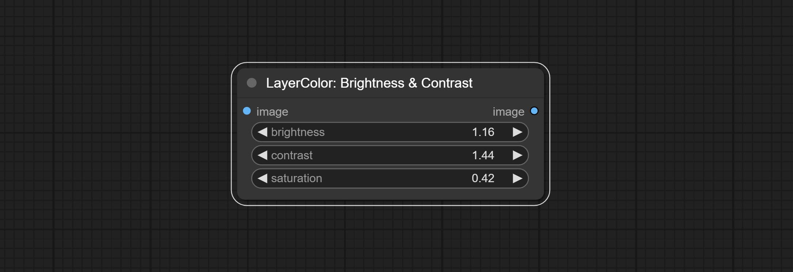    

* brightness: Value of brightness.
* contrast: Value of contrast.
* saturation: Value of saturation.

### <a id="table1">BrightnessContrastV2</a>

A replica of the ```Brightness & Contrast``` node, with the "&" character removed from the node name to avoid ComfyUI workflow parsing errors.

### <a id="table1">RGB</a>

Adjust the RGB channels of the image.

Node options:  
    

* R: R channel.
* G: G channel.
* B: B channel.

### <a id="table1">YUV</a>

Adjust the YUV channels of the image.

Node options:  
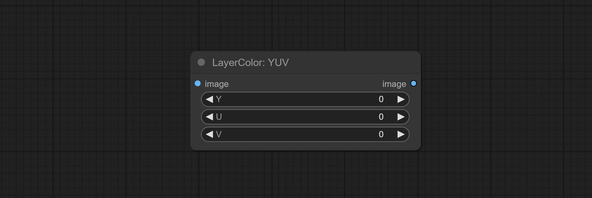    

* Y: Y channel.
* U: U channel.
* V: V channel.

### <a id="table1">LAB</a>

Adjust the LAB channels of the image.

Node options:  
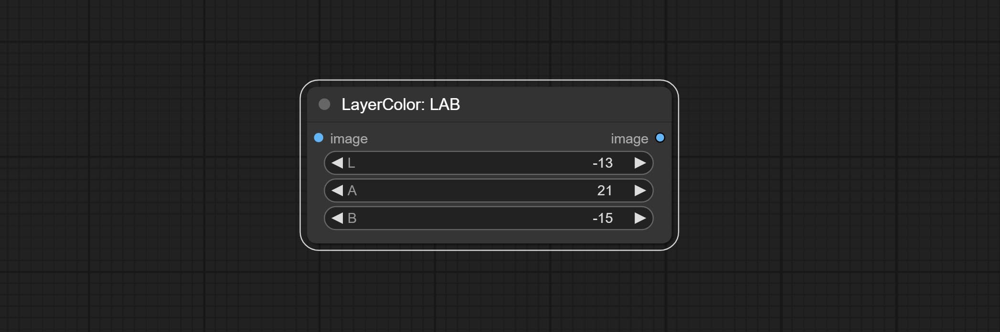    

* L: L channel.
* A: A channel.
* B: B channel.

### <a id="table1">HSV</a>

Adjust the HSV channels of the image.

Node options:  
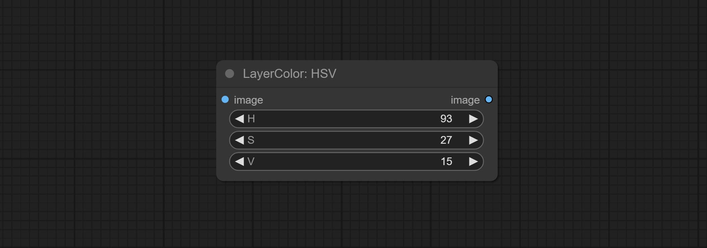    

* H: H channel.
* S: S channel.
* V: V channel.

# <a id="table1">LayerUtility</a>

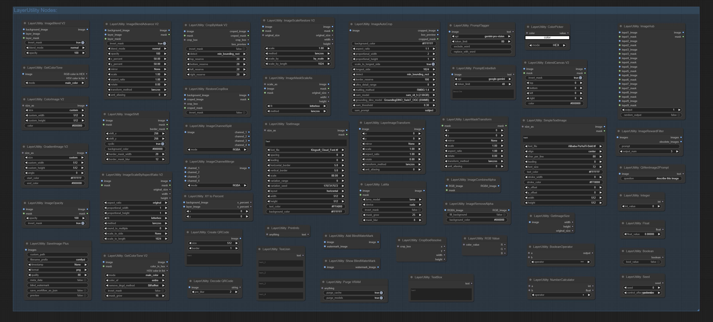    

### <a id="table1">ImageBlendAdvance</a>

Used for compositing layers, allowing for compositing layer images of different sizes on the background image, and setting positions and transformations. multiple mixing modes are available for selection, and transparency can be set.

The node provide layer transformation_methods and anti_aliasing options. helps improve the quality of synthesized images.

The node provides mask output that can be used for subsequent workflows.
    

Node options:   
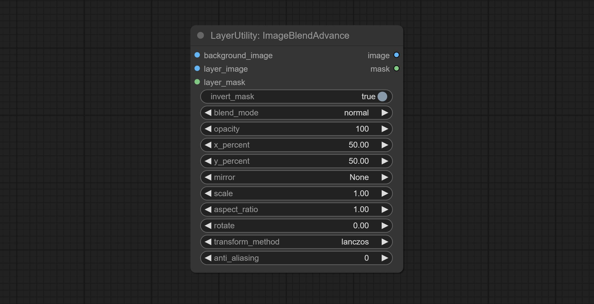    

* background_image: The background image.
* layer_image<sup>5</sup>: Layer image for composite.
* layer_mask<sup>2,5</sup>: Mask for layer_image.
* invert_mask: Whether to reverse the mask.
* blend_mode<sup>3</sup>: Blending mode.
* opacity: Opacity of blend.
* x_percent: Horizontal position of the layer on the background image, expressed as a percentage, with 0 on the far left and 100 on the far right. It can be less than 0 or more than 100, indicating that some of the layer's content is outside the screen.
* y_percent: Vertical position of the layer on the background image, expressed as a percentage, with 0 on the top and 100 on the bottom. For example, setting it to 50 indicates vertical center, 20 indicates upper center, and 80 indicates lower center.
* mirror: Mirror flipping. Provide two flipping modes, horizontal flipping and vertical flipping.
* scale: Layer magnification, 1.0 represents the original size.
* aspect_ratio: Layer aspect ratio. 1.0 is the original ratio, a value greater than this indicates elongation, and a value less than this indicates flattening.
* rotate: Layer rotation degree.
* Sampling methods for layer enlargement and rotation, including lanczos, bicubic, hamming, bilinear, box and nearest. Different sampling methods can affect the image quality and processing time of the synthesized image.
* anti_aliasing: Anti aliasing, ranging from 0 to 16, the larger the value, the less obvious the aliasing. An excessively high value will significantly reduce the processing speed of the node.
* [note](#notes)

### <a id="table1">CropByMask</a>

Crop the image according to the mask range, and set the size of the surrounding borders to be retained.
This node can be used in conjunction with the [RestoreCropBox](#RestoreCropBox) and [ImageScaleRestore](#ImageScaleRestore) nodes to crop and modify upscale parts of image, and then paste them back in place.
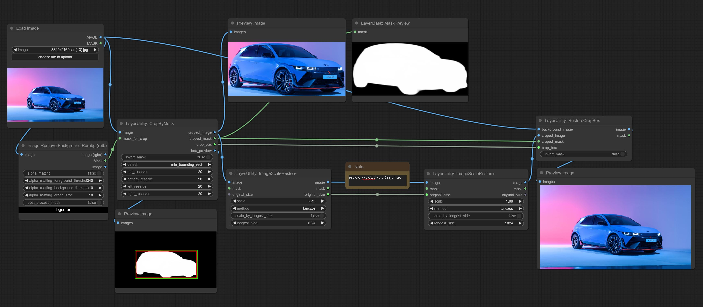    

Node options:   
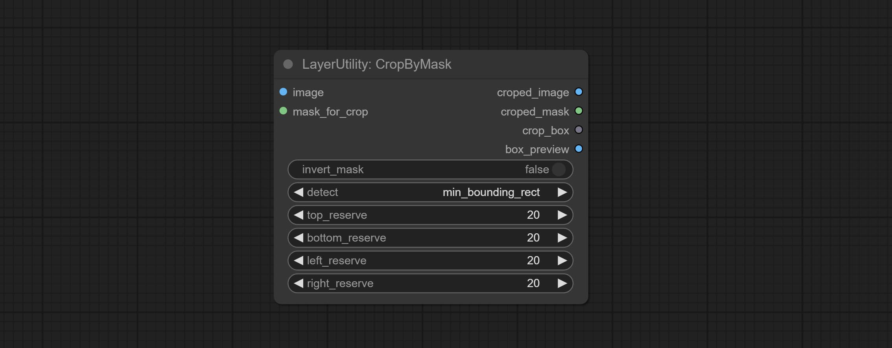    

* image<sup>5</sup>: The input image.
* mask_for_crop<sup>5</sup>: Mask of the image, it will automatically be cut according to the mask range.
* invert_mask: Whether to reverse the mask.
* detect: Detection method, ```min_bounding_rect``` is the minimum bounding rectangle of block shape, ```max_inscribed_rect``` is the maximum inscribed rectangle of block shape, and ```mask-area``` is the effective area for masking pixels.
* top_reserve: Cut the top to preserve size.
* bottom_reserve: Cut the bottom to preserve size.
* left_reserve: Cut the left to preserve size.
* right_reserve: Cut the right to preserve size.
* [note](#notes)

Output:

* croped_image: The image after crop.
* croped_mask: The mask after crop.
* crop_box: The trimmed box data is used when restoring the RestoreCropBox node.
* box_preview: Preview image of cutting position, red represents the detected range, and green represents the cutting range after adding the reserved border.

### <a id="table1">CropByMaskV2</a>

The V2 upgraded version of CropByMask. Supports crop_box input, making it easy to cut layers of the same size.

The following changes have been made based on CropByMask:
    

* The input ```mask_for_crop``` reanme to ```mask```。
* Add optional inputs to the ```crop_box```. If there are inputs here, mask detection will be ignored and this data will be directly used for cropping.
* Add the option ```round_to_multiple``` to round the trimming edge length multiple. For example, setting it to 8 will force the width and height to be multiples of 8.

### <a id="table1">RestoreCropBox</a>

Restore the cropped image to the original image by [CropByMask](#CropByMask).

Node options:   
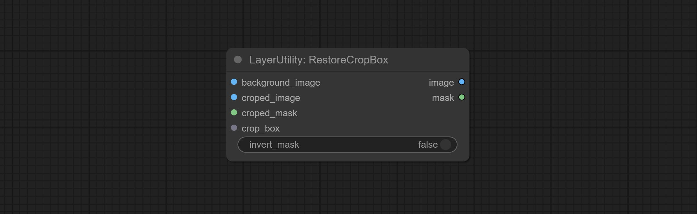    

* background_image: The original image before cutting.
* croped_image<sup>5</sup>: The cropped image. If the middle is enlarged, the size needs to be restored before restoration.
* croped_mask<sup>5</sup>: The cut mask.
* crop_box: Box data during cutting.
* invert_mask: Whether to reverse the mask.
* [note](#notes)

### <a id="table1">CropBoxResolve</a>

Parsing the ```corp_box```  to ```x``` , ```y``` , ```width``` , ```height``` .
    

### <a id="table1">ImageScaleRestore</a>

Image scaling. when this node is used in pairs, the image can be automatically restored to its original size on the second node.
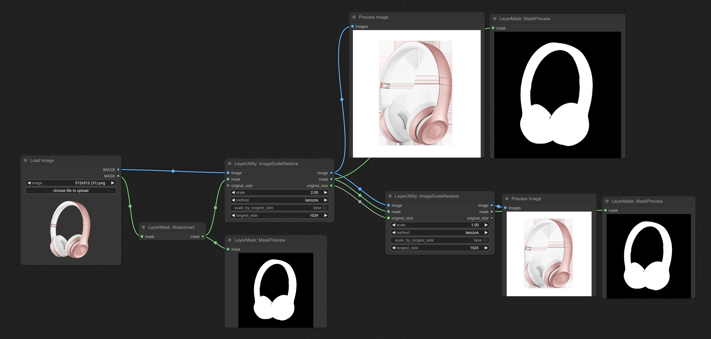    

Node options:   
    

* image<sup>5</sup>: The input image.
* mask<sup>2,5</sup>: Mask of image.
* original_size: Optional input, used to restore the image to its original size.
* scale: Scale ratio. when the original_size have input, or scale_ by_longest_side is set to True, this setting will be ignored.
* scale_by_longest_side: Allow scaling by long edge size.
* longest_side: When the scale_by_longest_side is set to True, this will be used this value to the long edge of the image. when the original_size have input, this setting will be ignored.

Outputs:

* image: The scaled image.
* mask: If have mask input, the scaled mask will be output.
* original_size: The original size data of the image is used for subsequent node recovery.
* width: The output image's width.
* height: The output image's height.

### <a id="table1">ImageScaleRestoreV2</a>

The V2 upgraded version of ImageScaleRestore.

Node options:   
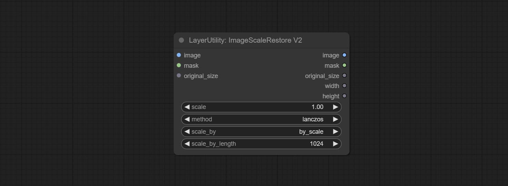    
The following changes have been made based on ImageScaleRestore:

* scale_by: Allow scaling by specified dimensions for long, short, width, height, or total pixels. When this option is set to by_scale, use the scale value, and for other options, use the scale_by_length value.
* scale_by_length: The value here is used as ```scale_by``` to specify the length of the edge.

### <a id="table1">ImageMaskScaleAs</a>

Scale the image or mask to the size of the reference image (or reference mask).
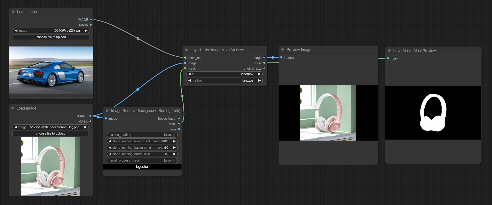    

Node options:
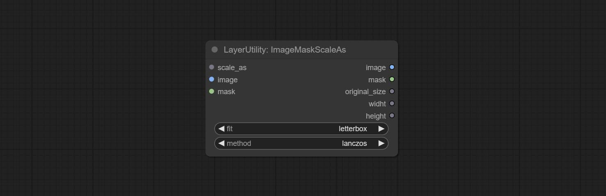    

* scale_as<sup>*</sup>: Reference size. It can be an image or a mask.
* image: Image to be scaled. this option is optional input. if there is no input, a black image will be output.
* mask: Mask to be scaled. this option is optional input. if there is no input, a black mask will be output.
* fit: Scale aspect ratio mode. when the width to height ratio of the original image does not match the scaled size, there are three modes to choose from, 
  The _letterbox_ mode retains the complete frame and fills in the blank spaces with black; 
  The _crop_ mode retains the complete short edge, and any excess of the long edge will be cut off;
  The _fill_ mode does not maintain frame ratio and fills the screen with width and height.
* method: Scaling sampling methods, including lanczos, bicubic, hamming, bilinear, box, and nearest.

<sup>*</sup>Only limited to input images and masks. forcing the integration of other types of inputs will result in node errors.

Outputs:

* image: If there is an image input, the scaled image will be output.
* mask: If there is a mask input, the scaled mask will be output.
* original_size: The original size data of the image is used for subsequent node recovery.
* width: The output image's width.
* height: The output image's height.

### <a id="table1">ImageScaleByAspectRatio</a>

Scale the image or mask by aspect ratio. the scaled size can be rounded to a multiple of 8 or 16, and can be scaled to the long side size.
    

Node options:   
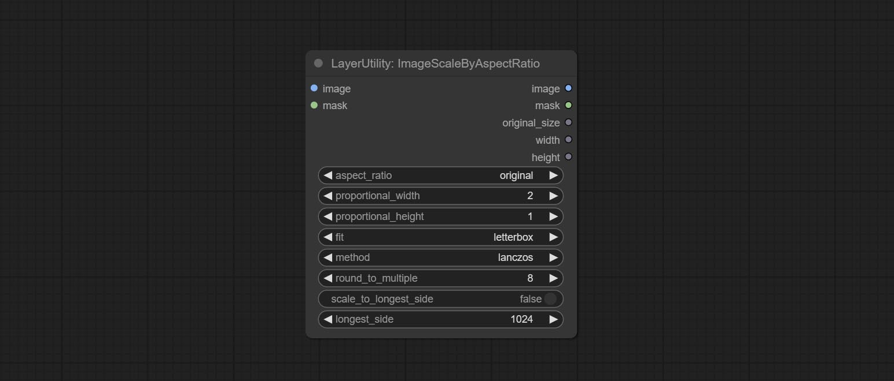    

* aspect_ratio: Here are several common frame ratios provided. alternatively, you can choose "original" to keep original ratio or customize the ratio using "custom".
* proportional_width: Proportional width. if the aspect ratio option is not "custom", this setting will be ignored.
* proportional_height: Proportional height. if the aspect ratio option is not "custom", this setting will be ignored.
* fit: Scale aspect ratio mode. when the width to height ratio of the original image does not match the scaled size, there are three modes to choose from, 
  The _letterbox_ mode retains the complete frame and fills in the blank spaces with black; 
  The _crop_ mode retains the complete short edge, and any excess of the long edge will be cut off;
  The _fill_ mode does not maintain frame ratio and fills the screen with width and height.
* method: Scaling sampling methods, including lanczos, bicubic, hamming, bilinear, box, and nearest.
* round_to_multiple: Round multiples. for example, setting it to 8 will force the width and height to be multiples of 8.
* scale_by_longest_side: Allow scaling by long edge size.
* longest_side: When the scale_by_longest_side is set to True, this will be used this value to the long edge of the image. when the original_size have input, this setting will be ignored.

Outputs:

* image: If have image input, the scaled image will be output.
* mask: If have mask input, the scaled mask will be output.
* original_size: The original size data of the image is used for subsequent node recovery.
* width: The output image's width.
* height: The output image's height.

### <a id="table1">ImageScaleByAspectRatioV2</a>

V2 Upgraded Version of ImageScaleByAspectRatio

Node options:   
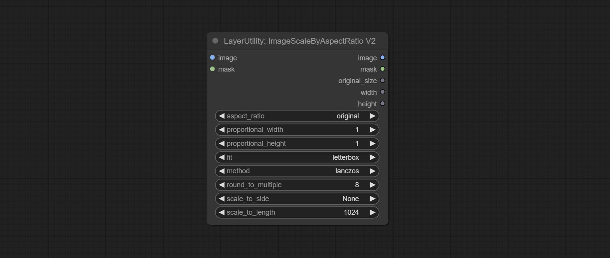    
The following changes have been made based on ImageScaleByAspectRatio:

* scale_to_side: Allow scaling by specified dimensions for long, short, width, height, or total pixels.
* scale_to_length: The numerical value here serves as the length of the specified edge or the total pixels (kilo pixels) for scale_to_side.
* background_color<sup>4</sup>: The color of the background.

### <a id="table1">QWenImage2Prompt</a>

Inference the prompts based on the image. this node is repackage of the [ComfyUI_VLM_nodes](https://github.com/gokayfem/ComfyUI_VLM_nodes)'s ```UForm-Gen2 Qwen Node```,  thanks to the original author.
Download model files from [huggingface](https://huggingface.co/unum-cloud/uform-gen2-qwen-500m) or [Baidu Netdisk](https://pan.baidu.com/s/1oRkUoOKWaxGod_XTJ8NiTA?pwd=d5d2) to ```ComfyUI/models/LLavacheckpoints/files_for_uform_gen2_qwen``` folder.

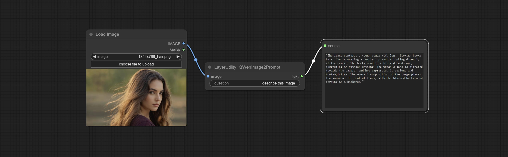    

Node Options:   

* question: Prompt of UForm-Gen-QWen model.


### <a id="table1">LlamaVision</a>
Use the Llama 3.2 vision model for local inference. Can be used to generate prompt words. part of the code for this node comes from [ComfyUI-PixtralLlamaMolmoVision](https://github.com/SeanScripts/ComfyUI-PixtralLlamaMolmoVision), thank you to the original author.
To use this node, the ```transformers``` need upgraded to 4.45.0 or higher.
Download models from [BaiduNetdisk](https://pan.baidu.com/s/18oHnTrkNMiwKLMcUVrfFjA?pwd=4g81) or [huggingface/SeanScripts](https://huggingface.co/SeanScripts/Llama-3.2-11B-Vision-Instruct-nf4/tree/main) , and copy to ```ComfyUI/models/LLM```.
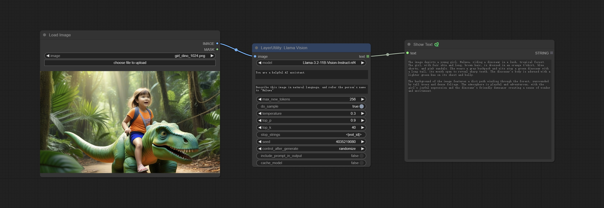    

Node Options:   
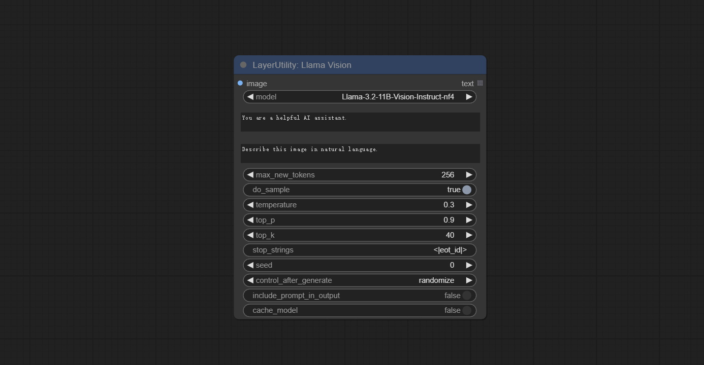    

* image: Image input.
* model: Currently, only the "Llama-3.2-11B-Vision-Instruct-nf4" is available.
* system_prompt: System prompt words for LLM model.
* user_prompt: User prompt words for LLM model.
* max_new_tokens: max_new_tokens for LLM model.
* do_sample: do_sample for LLM model.
* top-p: top_p for LLM model. 
* top_k: top_k for LLM model.
* stop_strings: The stop strings.
* seed: The seed of random number.
* control_after_generate: Seed change options. If this option is fixed, the generated random number will always be the same.
* include_prompt_in_output: Does the output contain prompt words.
* cache_model: Whether to cache the model.

### <a id="table1">JoyCaption2</a>
Use the JoyCaption-alpha-two model for local inference. Can be used to generate prompt words. this node is https://huggingface.co/John6666/joy-caption-alpha-two-cli-mod Implementation in ComfyUI, thank you to the original author.
Download models form [BaiduNetdisk](https://pan.baidu.com/s/1dOjbUEacUOhzFitAQ3uIeQ?pwd=4ypv) and [BaiduNetdisk](https://pan.baidu.com/s/1mH1SuW45Dy6Wga7aws5siQ?pwd=w6h5) , 
or [huggingface/Orenguteng](https://huggingface.co/Orenguteng/Llama-3.1-8B-Lexi-Uncensored-V2/tree/main) and [huggingface/unsloth](https://huggingface.co/unsloth/Meta-Llama-3.1-8B-Instruct/tree/main) , then copy to ```ComfyUI/models/LLM```,
Download models from [BaiduNetdisk](https://pan.baidu.com/s/1pkVymOsDcXqL7IdQJ6lMVw?pwd=v8wp) or [huggingface/google](https://huggingface.co/google/siglip-so400m-patch14-384/tree/main) , and copy to ```ComfyUI/models/clip```,
Donwload the ```cgrkzexw-599808``` folder from [BaiduNetdisk](https://pan.baidu.com/s/12TDwZAeI68hWT6MgRrrK7Q?pwd=d7dh) or [huggingface/John6666](https://huggingface.co/John6666/joy-caption-alpha-two-cli-mod/tree/main) , and copy to ```ComfyUI/models/Joy_caption```。
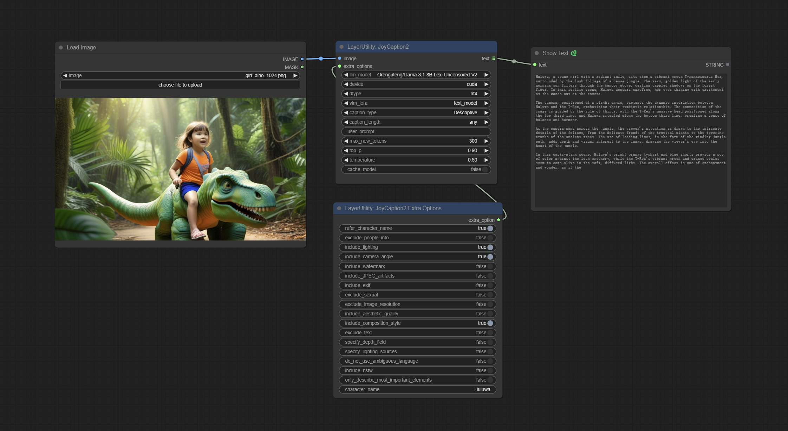    

Node Options:   
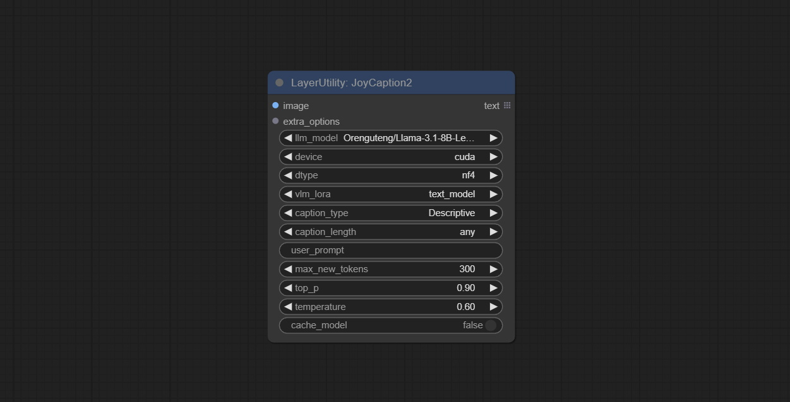    

* image: Image input.
* extra_options: Input the extra_options.
* llm_model: There are two LLM models to choose, Orenguteng/Llama-3.1-8B-Lexi-Uncensored-V2 and unsloth/Meta-Llama-3.1-8B-Instruct.
* device: Model loading device. Currently, only CUDA is supported.
* dtype: Model precision, nf4 and bf16.
* vlm_lora: Whether to load text_madel.
* caption_type: Caption type options, including: "Descriptive", "Descriptive (Informal)", "Training Prompt", "MidJourney", "Booru tag list", "Booru-like tag list", "Art Critic", "Product Listing", "Social Media Post".
* caption_length: The length of caption.
* user_prompt: User prompt words for LLM model. If there is content here, it will overwrite all the settings for caption_type and extra_options.
* max_new_tokens: The max_new_token parameter of LLM.
* do_sample: The do_sample parameter of LLM.
* top-p: The top_p parameter of LLM.
* temperature: The temperature parameter of LLM.
* cache_model: Whether to cache the model.

### <a id="table1">JoyCaption2ExtraOptions</a>
The extra_options parameter node of JoyCaption2.

Node Options:   
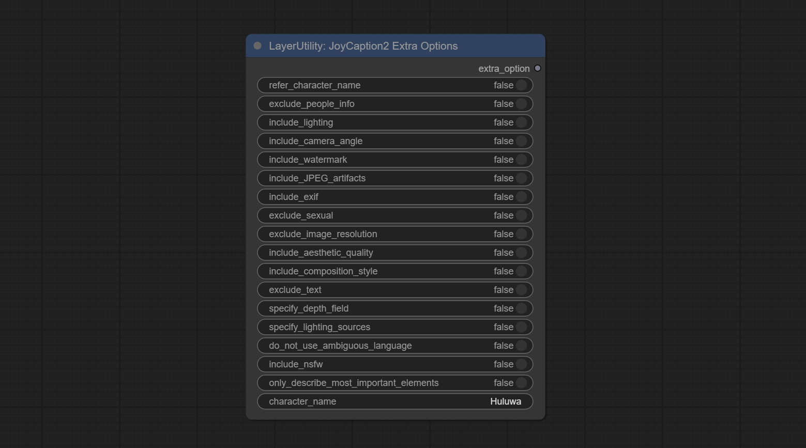    

* refer_character_name: If there is a person/character in the image you must refer to them as {name}.
* exclude_people_info: Do NOT include information about people/characters that cannot be changed (like ethnicity, gender, etc), but do still include changeable attributes (like hair style).
* include_lighting: Include information about lighting.
* include_camera_angle: Include information about camera angle.
* include_watermark: Include information about whether there is a watermark or not.
* include_JPEG_artifacts: Include information about whether there are JPEG artifacts or not.
* include_exif: If it is a photo you MUST include information about what camera was likely used and details such as aperture, shutter speed, ISO, etc.
* exclude_sexual: Do NOT include anything sexual; keep it PG.
* exclude_image_resolution: Do NOT mention the image's resolution.
* include_aesthetic_quality: You MUST include information about the subjective aesthetic quality of the image from low to very high.
* include_composition_style: Include information on the image's composition style, such as leading lines, rule of thirds, or symmetry.
* exclude_text: Do NOT mention any text that is in the image.
* specify_depth_field: Specify the depth of field and whether the background is in focus or blurred.
* specify_lighting_sources: If applicable, mention the likely use of artificial or natural lighting sources.
* do_not_use_ambiguous_language: Do NOT use any ambiguous language.
* include_nsfw: Include whether the image is sfw, suggestive, or nsfw.
* only_describe_most_important_elements: ONLY describe the most important elements of the image.
* character_name: Person/Character Name, if choice ```refer_character_name```.

### <a id="table1">PhiPrompt</a>

Use Microsoft Phi 3.5 text and visual models for local inference. Can be used to generate prompt words, process prompt words, or infer prompt words from images. Running this model requires at least 16GB of video memory.
Download model files from [BaiduNetdisk](https://pan.baidu.com/s/1BdTLdaeGC3trh1U3V-6XTA?pwd=29dh) or [huggingface.co/microsoft/Phi-3.5-vision-instruct](https://huggingface.co/microsoft/Phi-3.5-vision-instruct/tree/main) and [huggingface.co/microsoft/Phi-3.5-mini-instruct](https://huggingface.co/microsoft/Phi-3.5-mini-instruct/tree/main) and copy to ```ComfyUI\models\LLM``` folder.
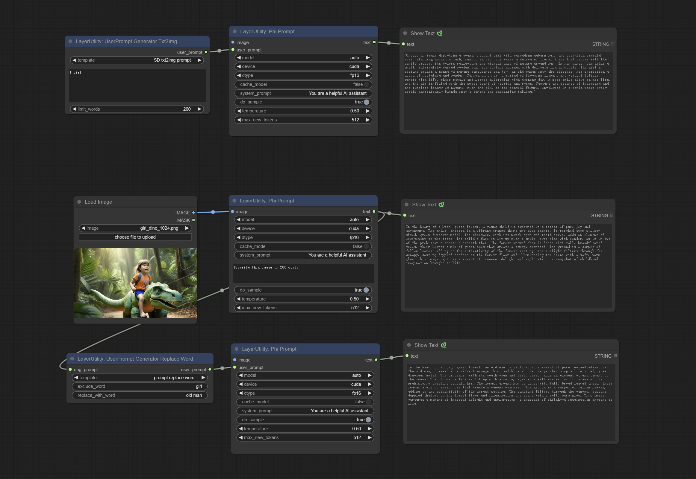    

Node Options:   
    

* image: Optional input. The input image will serve as the input for Phi-3.5-vision-instruct.
* model: Selectable to load Phi-3.5-vision-instruct or Phi-3.5-mini-instruct model. The default value of auto will automatically load the corresponding model based on whether there is image input.
* device: Model loading device. Supports CPU and CUDA.
* dtype: The model loading accuracy has three options: fp16, bf16, and fp32.
* cache_model: Whether to cache the model.
* system_prompt: The system prompt of Phi-3.5-mini-instruct.
* user_prompt: User prompt words for LLM model.
* do_sample: The do_Sample parameter of LLM defaults to True.
* temperature: The temperature parameter of LLM defaults to 0.5.
* max_new_tokens: The max_new_token parameter of LLM defaults to 512.

### <a id="table1">UserPromptGeneratorTxtImg</a>

UserPrompt preset for generating SD text to image prompt words.

Node options:   


* template: Prompt word template. Currently, only the 'SD txt2img prompt' is available.
* describe: Prompt word description. Enter a simple description here.
* limit_word: Maximum length limit for output prompt words. For example, 200 means that the output text will be limited to 200 words.

### <a id="table1">UserPromptGeneratorTxtImgWithReference</a>

UserCompt preset for generating SD text to image prompt words based on input content.

Node options:     
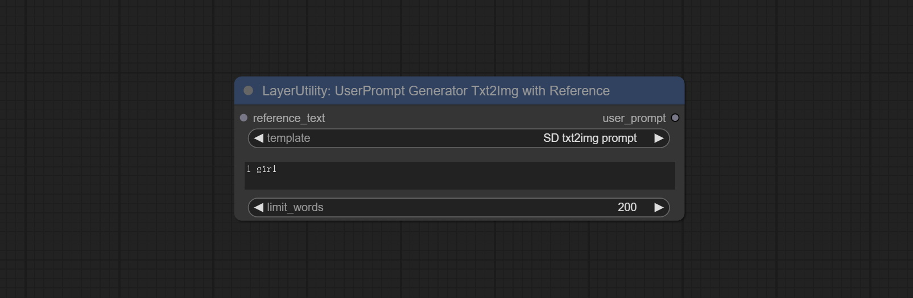

* reference_text: Reference text input. Usually it is a style description of the image.
* template: Prompt word template. Currently, only the 'SD txt2img prompt' is available.
* describe: Prompt word description. Enter a simple description here.
* limit_word: Maximum length limit for output prompt words. For example, 200 means that the output text will be limited to 200 words.

### <a id="table1">UserPromptGeneratorReplaceWord</a>

UserPrompt preset used to replace a keyword in text with different content. This is not only a simple replacement, but also a logical sorting of the text based on the context of the prompt words to achieve the rationality of the output content.

Node options:   
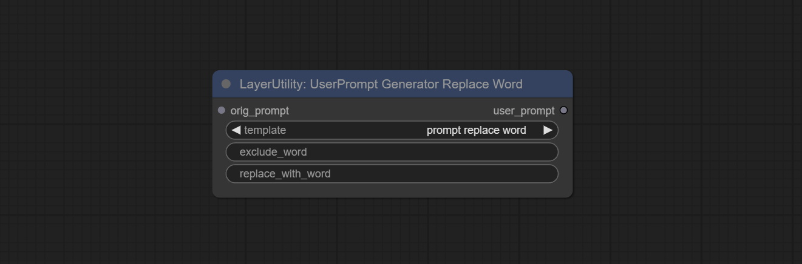

* orig_prompt: Original prompt word input.
* template: Prompt word template. Currently, only 'prompt replace word' is available.
* exclude_word: Keywords that need to be excluded.
* replace_with_word: That word will replace the exclude_word.

### <a id="table1">PromptTagger</a>

Inference the prompts based on the image. it can replace key word for the prompt. This node currently uses Google Gemini API as the backend service. Please ensure that the network environment can use Gemini normally.
Please apply for your API key on [Google AI Studio](https://makersuite.google.com/app/apikey),  And fill it in ```api_key.ini```, this file is located in the root directory of the plug-in, and the default name is ```api_key.ini.example```. to use this file for the first time, you need to change the file suffix to ```.ini```. Open it using text editing software, fill in your API key after ```google_api_key=``` and save it.
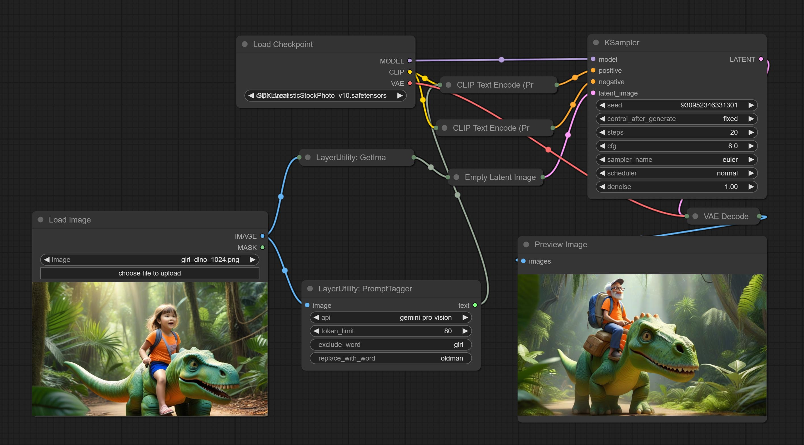    

Node options:   
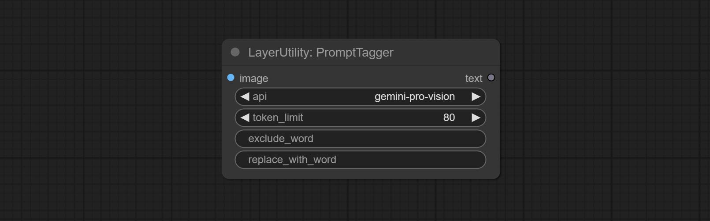    

* api: The Api used. At present, there are two options "gemini-1. 5-flash" and "google-gemini".
* token_limit: The maximum token limit for generating prompt words.
* exclude_word: Keywords that need to be excluded.
* replace_with_word: That word will replace the exclude_word.

### <a id="table1">PromptEmbellish</a>

Enter simple prompt words, output polished prompt words, and support inputting images as references, and support Chinese input. This node currently uses Google Gemini API as the backend service. Please ensure that the network environment can use Gemini normally.
Please apply for your API key on [Google AI Studio](https://makersuite.google.com/app/apikey),  And fill it in ```api_key.ini```, this file is located in the root directory of the plug-in, and the default name is ```api_key.ini.example```. to use this file for the first time, you need to change the file suffix to ```.ini```. Open it using text editing software, fill in your API key after ```google_api_key=``` and save it.
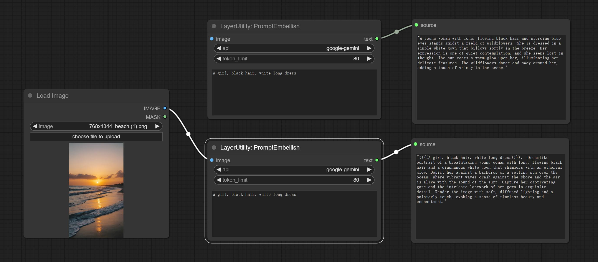    

Node options:   
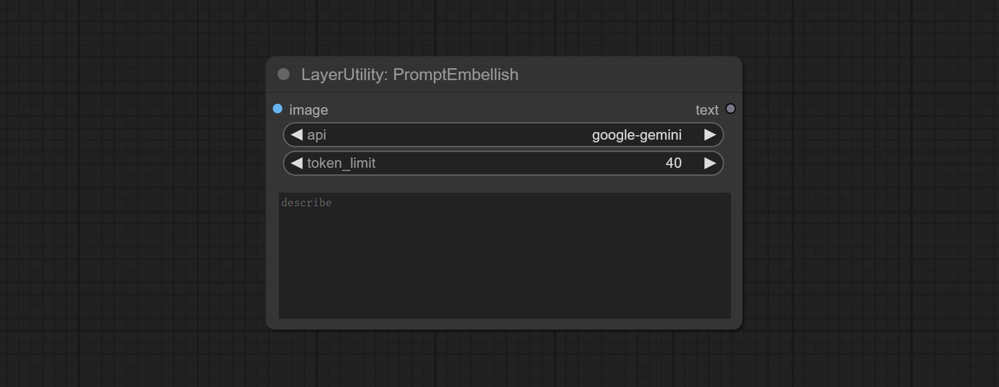    

* image: Optional, input image as a reference for prompt words.
* api: The Api used. At present, there are two options "gemini-1. 5-flash" and "google-gemini".
* token_limit: The maximum token limit for generating prompt words.
* discribe: Enter a simple description here. supports Chinese text input.

### <a id="table1">Florence2Image2Prompt</a>

Use the Florence 2 model to infer prompt words. The code for this node section is from[yiwangsimple/florence_dw](https://github.com/yiwangsimple/florence_dw), thanks to the original author.
*When using it for the first time, the model will be automatically downloaded. You can also download the model file from [BaiduNetdisk](https://pan.baidu.com/s/1hzw9-QiU1vB8pMbBgofZIA?pwd=mfl3) to ```ComfyUI/models/florence2``` folder.
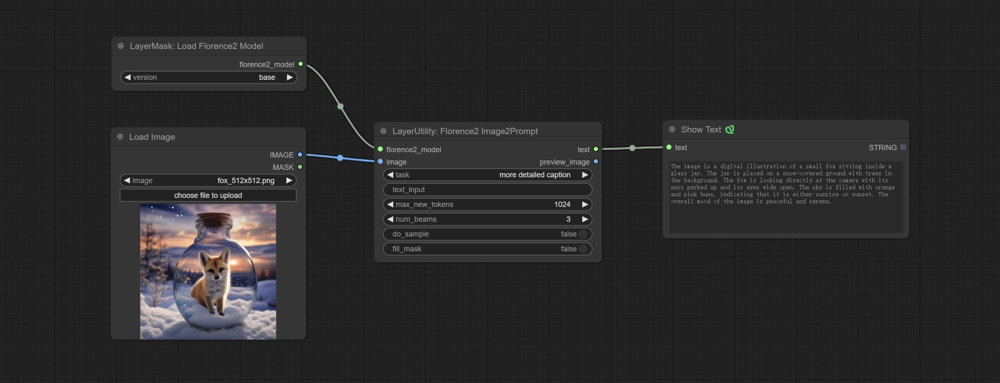 

Node Options:
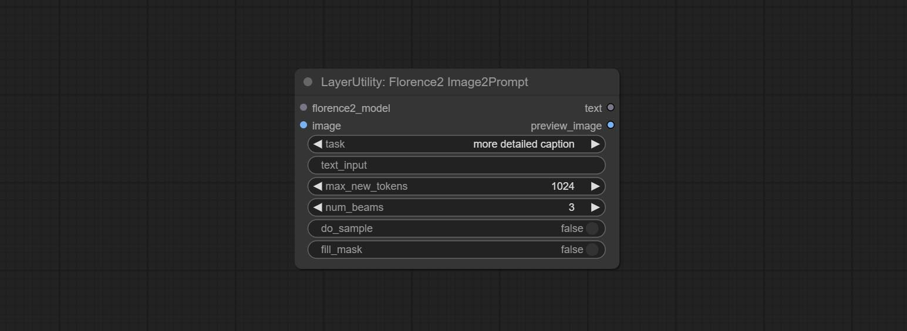

* florence2_model: Florence2 model input.
* image: Image input.
* task: Select the task for florence2.
* text_input: Text input for florence2.
* max_new_tokens: The maximum number of tokens for generating text.
* num_beams: The number of beam searches that generate text.
* do_sample: Whether to use text generated sampling.
* fill_mask: Whether to use text marker mask filling.

### <a id="table1">VQAPrompt</a>

Use the blip-vqa model for visual question answering. Part of the code for this node is referenced from [celoron/ComfyUI-VisualQueryTemplate](https://github.com/celoron/ComfyUI-VisualQueryTemplate), thanks to the original author.   
*Download model files from [BaiduNetdisk](https://pan.baidu.com/s/1ILREVgM0eFJlkWaYlKsR0g?pwd=yw75) or [huggingface.co/Salesforce/blip-vqa-capfilt-large](https://huggingface.co/Salesforce/blip-vqa-capfilt-large/tree/main) and [huggingface.co/Salesforce/blip-vqa-base](https://huggingface.co/Salesforce/blip-vqa-base/tree/main) and copy to  ```ComfyUI\models\VQA``` folder.

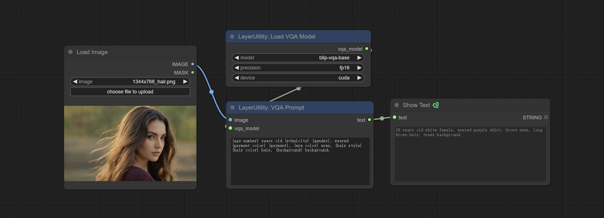 

Node Options:
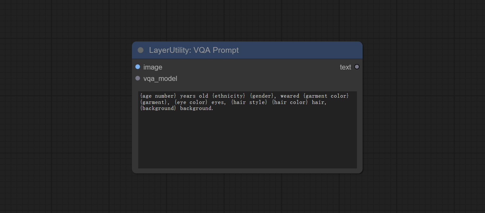

* image: The image input.
* vqa_model: The vqa model input, it from [LoadVQAModel](#LoadVQAModel) node.
* question: Task text input. A single question is enclosed in curly braces "{}", and the answer to the question will be replaced in its original position in the text output. Multiple questions can be defined using curly braces in a single Q&A.
  For example, for a picture of an item placed in a scene, the question is:"{object color} {object} on the {scene}".

### <a id="table1">LoadVQAModel</a>

Load the blip-vqa model.    

Node Options:
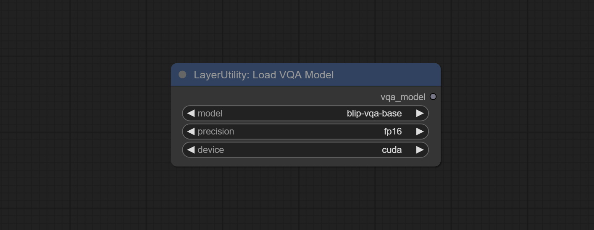

* model: There are currently two models to choose from "blip-vqa-base" and "blip-vqa-capfilt-large".
* precision: The model accuracy has two options: "fp16" and "fp32".
* device: The model running device has two options: "cuda" and "cpu".

### <a id="table1">ImageShift</a>

Shift the image. this node supports the output of displacement seam masks, making it convenient to create continuous textures.
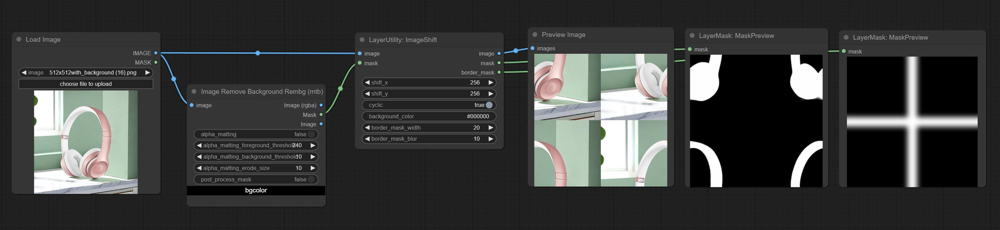    

Node options:   
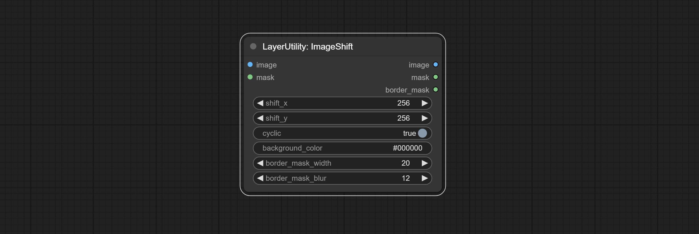    

* image<sup>5</sup>: The input image.
* mask<sup>2,5</sup>: The mask of image.
* shift_x: Horizontal distance of shift.
* shift_y: Vertical distance of shift.
* cyclic: Is the part of displacement that is out of bounds cyclic.
* background_color<sup>4</sup>: Background color. if cyclic is set to False, the setting here will be used as the background color.
* border_mask_width: Border mask width.
* border_mask_blur: Border mask blur.
* [note](#notes)

### <a id="table1">ImageBlend</a>

A simple node for composit layer image and background image, multiple blend modes are available for option, and transparency can be set.
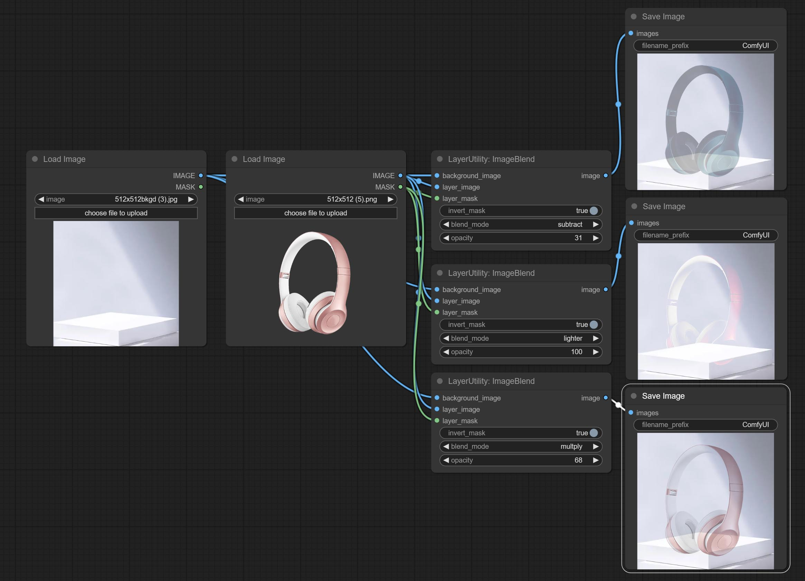    

Node options:
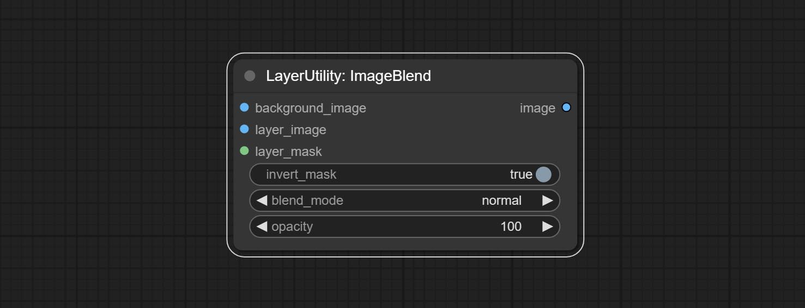    

* background_image<sup>1</sup>: The background image.
* layer_image<sup>1</sup>: Layer image for composite.
* layer_mask<sup>1,2</sup>: Mask for layer_image.
* invert_mask: Whether to reverse the mask.
* blend_mode<sup>3</sup>: Blending mode.
* opacity: Opacity of blend.
* [note](#notes)

### <a id="table1">ImageReel</a>

Display multiple images in one reel. Text annotations can be added to each image in the reel. By using the [ImageReelComposite](#ImageReelComposite) node, multiple reel can be combined into one image.
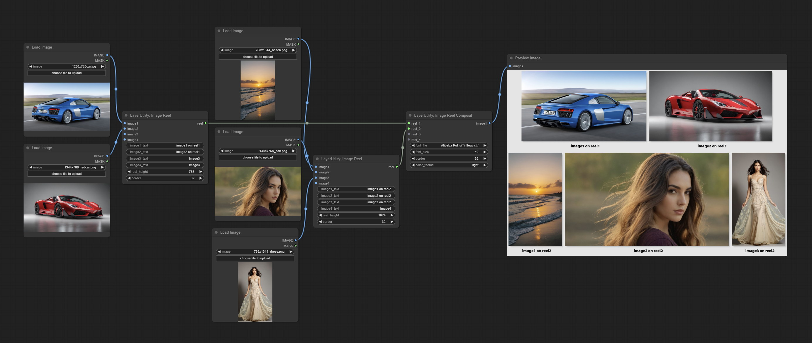    

Node Options:   
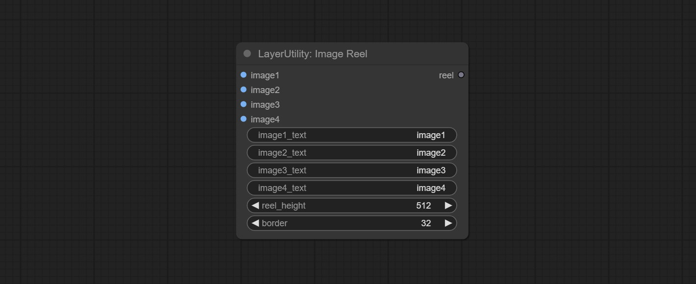    

* image1: The first image. it must be input.
* image2: The second image. optional input.
* image3: The third image. optional input.
* image4: The fourth image. optional input.
* image1_text: Text annotation for the first image.
* image2_text: Text annotation for the second image.
* image3_text: Text annotation for the third image.
* image4_text: Text annotation for the fourth image.
* reel_height: The height of reel.
* border: The border width of the image in the reel.

Output:

* reel: The reel of [ImageReelComposite](#ImageReelComposit) node input. 

### <a id="table1">ImageReelComposite</a>

Combine multiple reel into one image.

Node Options:
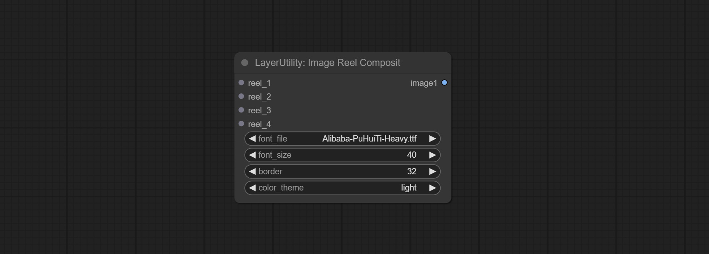    

* reel_1: The first reel. it must be input.
* reel_2: The second reel. optional input.
* reel_3: The third reel. optional input.
* reel_4: The fourth reel. optional input.
* font_file<sup>**</sup>: Here is a list of available font files in the font folder, and the selected font files will be used to generate images.
* border: The border width of the reel.
* color_theme: Theme color for the output image.            
  <sup>*</sup>The font folder is defined in ```resource_dir.ini```, this file is located in the root directory of the plug-in, and the default name is ```resource_dir.ini.example```. 
  to use this file for the first time, you need to change the file suffix to ```.ini```.
  Open the text editing software and find the line starting with "FONT_dir=", after "=", enter the custom folder path name. 
  support defining multiple folders in ```resource-dir.ini```, separated by commas, semicolons, or spaces. 
  all font files in this folder will be collected and displayed in the node list during ComfyUI initialization.
  If the folder set in ini is invalid, the font folder that comes with the plugin will be enabled.

### <a id="table1">ImageOpacity</a>

Adjust image opacity
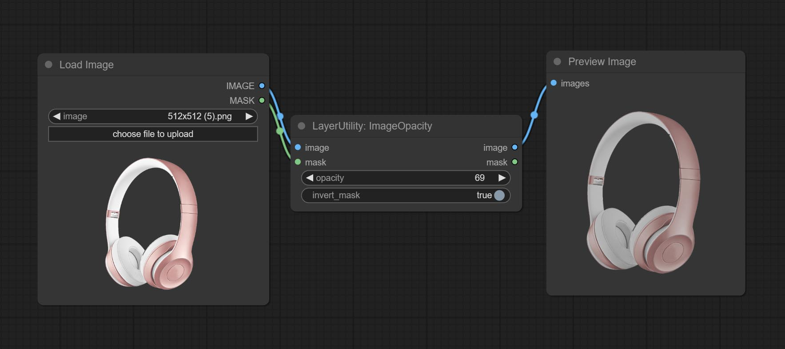    

Node option:   

* image<sup>5</sup>: Image input, supporting RGB and RGBA. if is RGB, the alpha channel of the entire image will be automatically added.
* mask<sup>2,5</sup> : Mask input.
* invert_mask: Whether to reverse the mask.
* opacity: Opacity of image.
* [note](#notes)

### <a id="table1">ColorPicker</a>

Modify web extensions from [mtb nodes](https://github.com/melMass/comfy_mtb). Select colors on the color palette and output RGB values, thanks to the original author.
    

Node options:

* mode： The output format is available in hexadecimal (HEX) and decimal (DEC).  

Output type: 

* value: String format.

### <a id="table1">RGBValue</a>

Output the color value as a single R, G, B three decimal values. Supports HEX and DEC formats for ColorPicker node output.

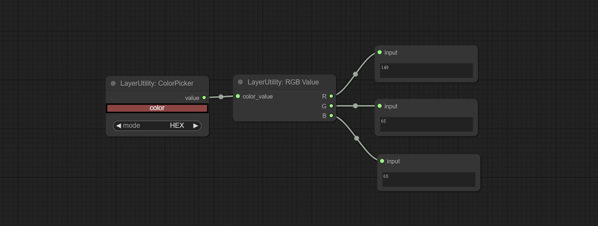    

Node Options:

* color_value: Supports hexadecimal (HEX) or decimal (DEC) color values and should be of string or tuple type. Forcing in other types will result in an error.

### <a id="table1">HSVValue</a>

Output color values as individual decimal values of H, S, and V (maximum value of 255). Supports HEX and DEC formats for ColorPicker node output.
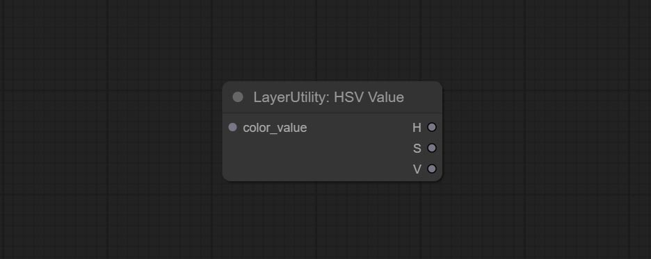    

Node Options:

* color_value: Supports hexadecimal (HEX) or decimal (DEC) color values and should be of string or tuple type. Forcing in other types will result in an error.

### <a id="table1">GrayValue</a>

Output grayscale values based on color values. Supports outputting 256 level and 100 level grayscale values.
    

Node Options:

* color_value: Supports hexadecimal (HEX) or decimal (DEC) color values and should be of string or tuple type. Forcing in other types will result in an error.

Outputs:

* gray(256_level): 256 level grayscale value. Integer type, range 0~255.
* gray(100_level): 100 level grayscale value. Integer type, range 0~100.

### <a id="table1">GetColorTone</a>

Obtain the main color or average color from the image and output RGB values.
    

Node options:
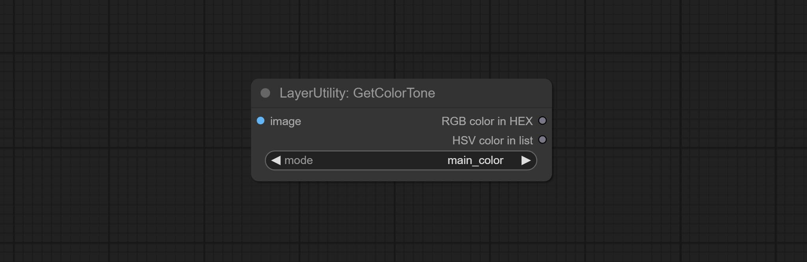    

* mode： There are two modes to choose from, with the main color and average color.

Output type:

* RGB color in HEX: The RGB color described by hexadecimal RGB format, like '#FA3D86'.
* HSV color in list: The HSV color described by python's list data format.

### <a id="table1">GetColorToneV2</a>

V2 upgrade of GetColorTone. You can specify the dominant or average color to get the body or background.
    

The following changes have been made on the basis of GetColorTong:
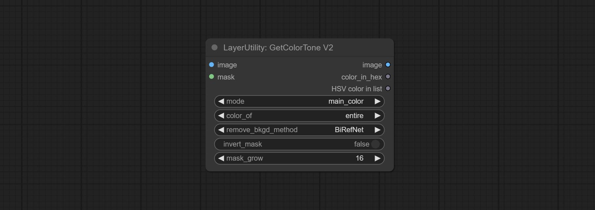    

* color_of: Provides 4 options, mask, entire, background, and subject, to select the color of the mask area, entire picture, background, or subject, respectively.
* remove_background_method: There are two methods of background recognition: BiRefNet and RMBG V1.4.
* invert_mask: Whether to reverse the mask.
* mask_grow: Mask expansion. For subject, a larger value brings the obtained color closer to the color at the center of the body.

Output:

* image: Solid color picture output, the size is the same as the input picture.
* mask: Mask output.

### <a id="table1">GetMainColors</a>

Obtain the main color of the image. You can obtain 5 colors.
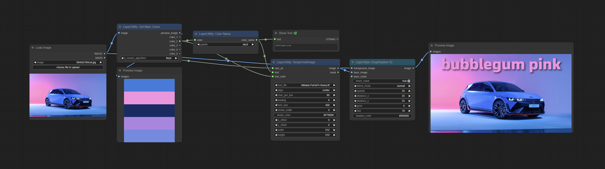
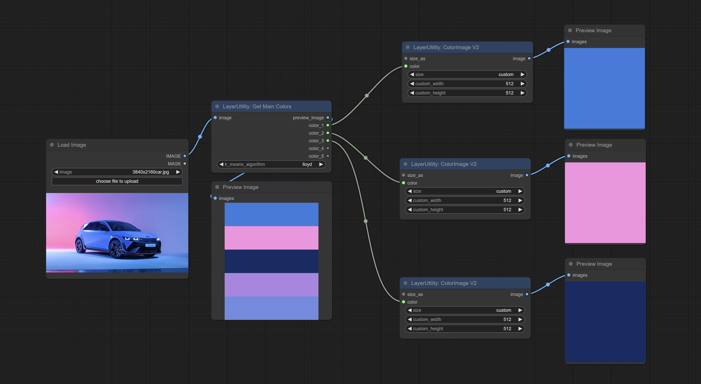

Node Options:
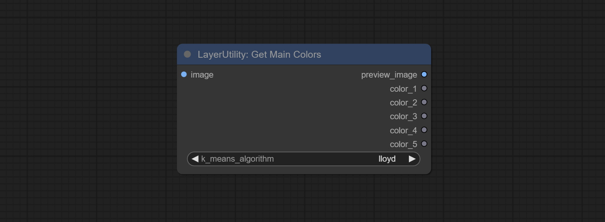    

* image: The image input.
* k_means_algorithm:K-Means algorithm options. "lloyd" is the standard K-Means algorithm, while "elkan" is the triangle inequality algorithm, suitable for larger images. 

Outputs:

* preview_image: 5 main color preview images.
* color_1~color_5: Color value output. Output an RGB string in HEX format.

### <a id="table1">ColorName</a>

Output the most similar color name in the color palette based on the color value.


Node Options:
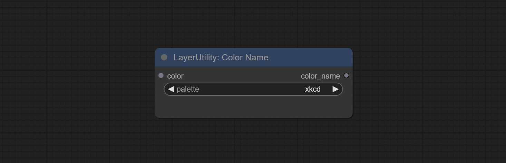    

* color: Color value input, in HEX format RGB string format.
* palette: Color palette. ```xkcd``` includes 949 colors, ```css3``` includes 147 colors, and ```html4``` includes 16 colors.

Output:

* color_name: Color name in string.

### <a id="table1">ExtendCanvas</a>

Extend the canvas
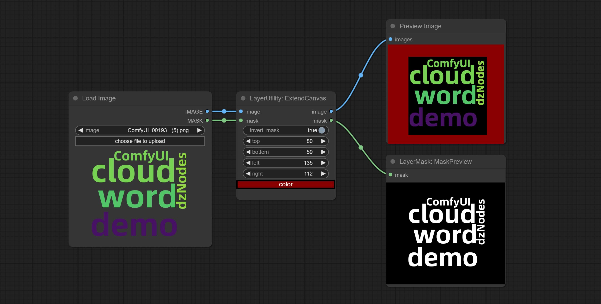    

Node options:
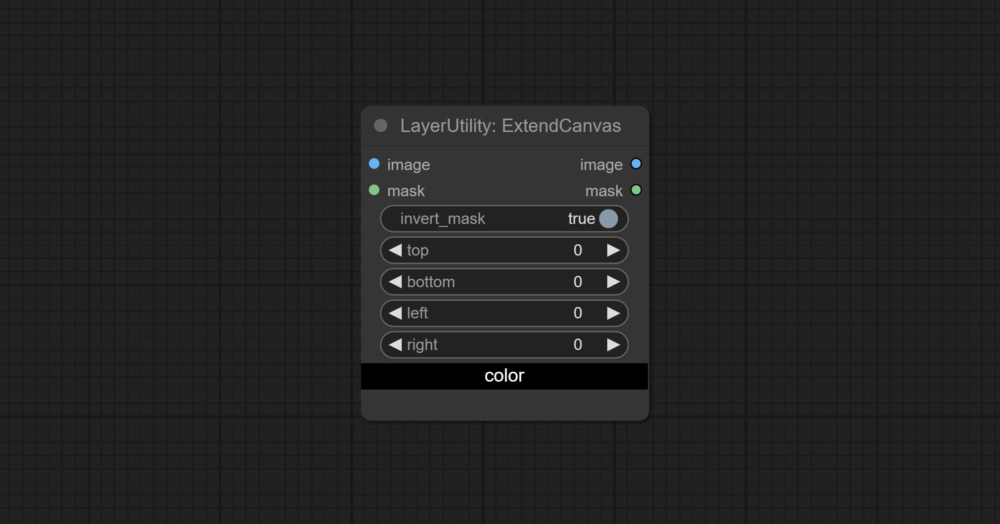    

* invert_mask: Whether to reverse the mask.
* top: Top extension value.
* bottom: Bottom extension value.
* left: Left extension value.
* right: Right extension value.
* color; Color of canvas.

### <a id="table1">ExtendCanvasV2</a>

V2 upgrade to ExtendCanvas.

Based on ExtendCanvas, color is modified to be a string type, and it supports external ```ColorPicker``` input, Support negative value input, it means image will be cropped.
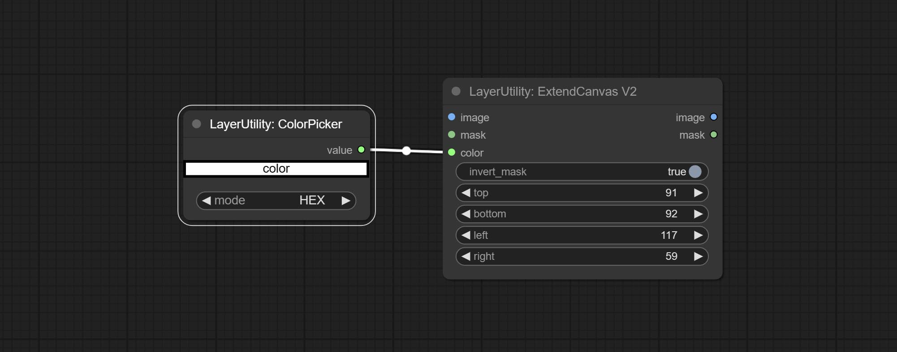    

### XY to <a id="table1">Percent</a>

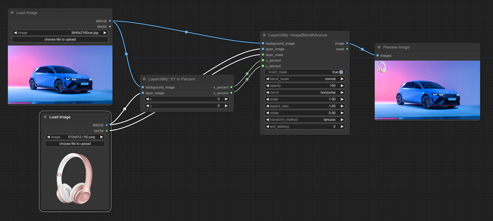    
Convert absolute coordinates to percentage coordinates.

    
Node options:

* x: Value of X.
* y: Value of Y.

### <a id="table1">LayerImageTransform</a>

    
This node is used to transform layer_image separately, which can change size, rotation, aspect ratio, and mirror flip without changing the image size.

    
Node options:

* x: Value of X.
* y: Value of Y.
* mirror: Mirror flipping. Provide two flipping modes, horizontal flipping and vertical flipping.
* scale: Layer magnification, 1.0 represents the original size.
* aspect_ratio: Layer aspect ratio. 1.0 is the original ratio, a value greater than this indicates elongation, and a value less than this indicates flattening.
* rotate: Layer rotation degree.
* Sampling methods for layer enlargement and rotation, including lanczos, bicubic, hamming, bilinear, box and nearest. Different sampling methods can affect the image quality and processing time of the synthesized image.
* anti_aliasing: Anti aliasing, ranging from 0 to 16, the larger the value, the less obvious the aliasing. An excessively high value will significantly reduce the processing speed of the node.

### <a id="table1">LayerMaskTransform</a>

Similar to LayerImageTransform node, this node is used to transform the layer_mask separately, which can scale, rotate, change aspect ratio, and mirror flip without changing the mask size.

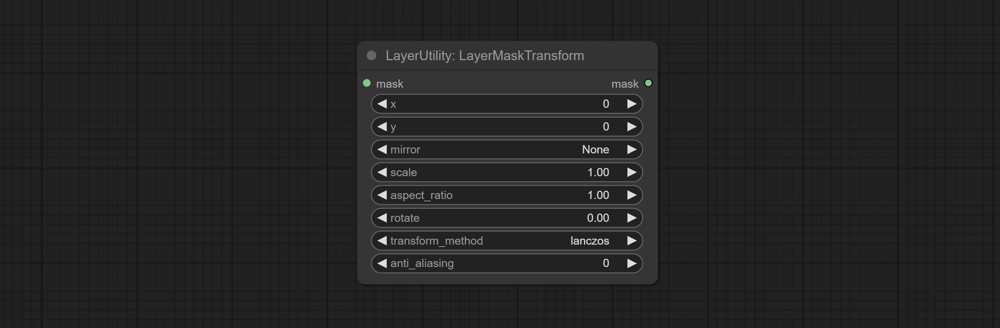    
Node options:

* x: Value of X.
* y: Value of Y.
* mirror: Mirror flipping. Provide two flipping modes, horizontal flipping and vertical flipping.
* scale: Layer magnification, 1.0 represents the original size.
* aspect_ratio: Layer aspect ratio. 1.0 is the original ratio, a value greater than this indicates elongation, and a value less than this indicates flattening.
* rotate: Layer rotation degree.
* Sampling methods for layer enlargement and rotation, including lanczos, bicubic, hamming, bilinear, box and nearest. Different sampling methods can affect the image quality and processing time of the synthesized image.
* anti_aliasing: Anti aliasing, ranging from 0 to 16, the larger the value, the less obvious the aliasing. An excessively high value will significantly reduce the processing speed of the node.

### <a id="table1">ColorImage</a>

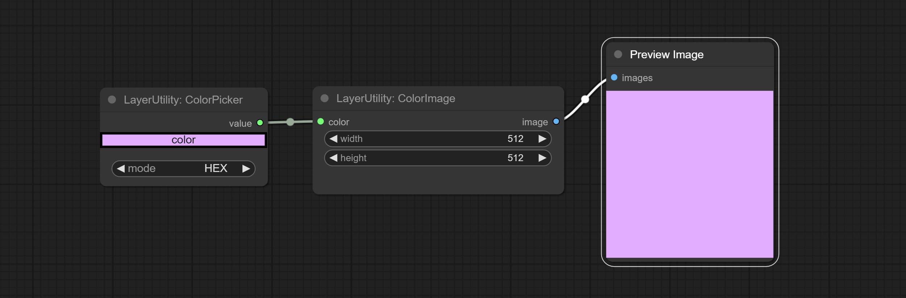    
Generate an image of a specified color and size.

    
Node options:

* width: Width of the image.
* height: Height of the image.
* color<sup>4</sup>: Color of the image.

### <a id="table1">ColorImageV2</a>

The V2 upgraded version of ColorImage.

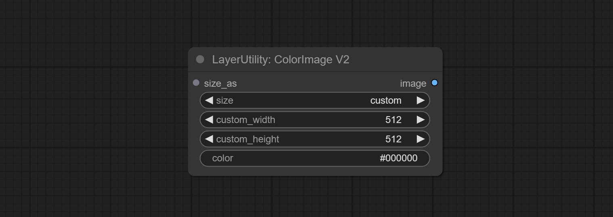    
The following changes have been made based on ColorImage:

* size_as<sup>*</sup>: Input image or mask here to generate image according to its size. Note that this input takes priority over other size settings.
* size<sup>**</sup>: Size preset. the preset can be customized by the user. if have size_as input, this option will be ignored.
* custom_width: Image width. it valid when size is set to "custom". if have size_as input, this option will be ignored.
* custom_height: Image height. it valid when size is set to "custom". if have size_as input, this option will be ignored.

<sup>*</sup>Only limited to input images and masks. forcing the integration of other types of inputs will result in node errors.
<sup>**</sup>The preset size is defined in ```custom_size.ini```, this file is located in the root directory of the plug-in, and the default name is ```custom_size.ini.example```. to use this file for the first time, you need to change the file suffix to ```.ini```. Open with text editing software. Each row represents a size, with the first value being width and the second being height, separated by a lowercase "x" in the middle. To avoid errors, please do not enter extra characters.

### <a id="table1">GradientImage</a>

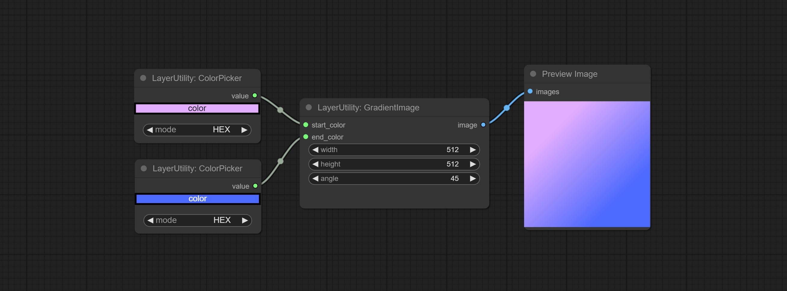    
Generate an image with a specified size and color gradient.

    
Node options:

* width: Width of the image.
* height: Height of the image.
* angle: Angle of gradient.
* start_color<sup>4</sup>: Color of the begging.
* end_color<sup>4</sup>: Color of the ending.

### <a id="table1">GradientImageV2</a>

The V2 upgraded version of GradientImage.

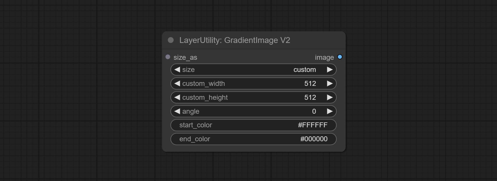    
The following changes have been made based on GradientImage:

* size_as<sup>*</sup>: Input image or mask here to generate image according to its size. Note that this input takes priority over other size settings.
* size<sup>**</sup>: Size preset. the preset can be customized by the user. if have size_as input, this option will be ignored.
* custom_width: Image width. it valid when size is set to "custom". if have size_as input, this option will be ignored.
* custom_height: Image height. it valid when size is set to "custom". if have size_as input, this option will be ignored.

<sup>*</sup>Only limited to input images and masks. forcing the integration of other types of inputs will result in node errors.
<sup>**</sup>The preset size is defined in ```custom_size.ini```, this file is located in the root directory of the plug-in, and the default name is ```custom_size.ini.example```. to use this file for the first time, you need to change the file suffix to ```.ini```. Open with text editing software. Each row represents a size, with the first value being width and the second being height, separated by a lowercase "x" in the middle. To avoid errors, please do not enter extra characters.

### <a id="table1">ImageRewardFilter</a>

    
Rating bulk pictures and outputting top-ranked pictures. it used [ImageReward] (https://github.com/THUDM/ImageReward) for image scoring, thanks to the original authors.

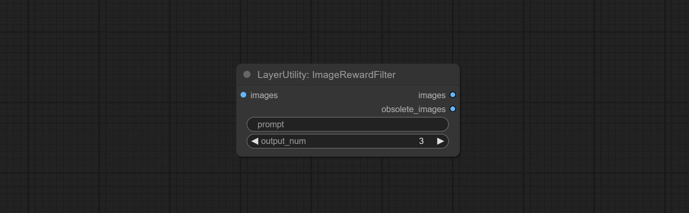    
Node options:

* prompt: Optional input. Entering prompt here will be used as a basis to determine how well it matches the picture.
* output_nun: Number of pictures outputted. This value should be less than the picture batch.

Outputs：

* images: Bulk pictures output from high to low in order of rating.
* obsolete_images: Knockout pictures. Also output in order of rating from high to low.

### <a id="table1">SimpleTextImage</a>

    
Generate simple typesetting images and masks from text. This node references some of the functionalities and code of [ZHO-ZHO-ZHO/ComfyUI-Text_Image-Composite](https://github.com/ZHO-ZHO-ZHO/ComfyUI-Text_Image-Composite), thanks to the original author.

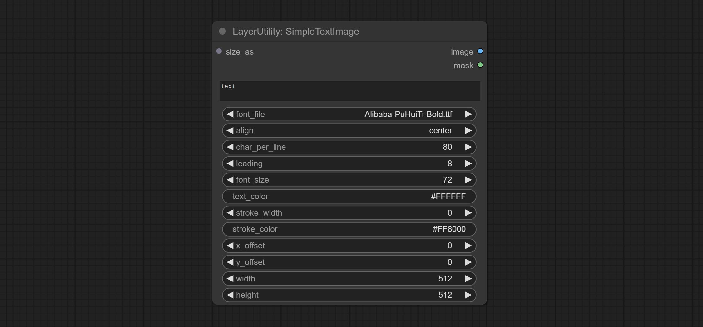    
Node options:

* size_as<sup>*</sup>: The input image or mask here will generate the output image and mask according to their size. this input takes priority over the width and height below.
* font_file<sup>**</sup>: Here is a list of available font files in the font folder, and the selected font files will be used to generate images.
* align: Alignment options. There are three options: center, left, and right.
* char_per_line: The number of characters per line, any excess will be automatically wrapped.
* leading: The leading space.
* font_size: The size of font.
* text_color: The color of text.
* stroke_width: The width of stroke.
* stroke_color: The color of stroke.
* x_offset: The horizontal offset of the text position.
* y_offset: The vertical offset of the text position.
* width: Width of the image. If there is a size_as input, this setting will be ignored.
* height: Height of the image. If there is a size_as input, this setting will be ignored.

<sup>*</sup>Only limited to input image and mask. forcing the integration of other types of inputs will result in node errors.

<sup>**</sup>The font folder is defined in ```resource_dir.ini```, this file is located in the root directory of the plug-in, and the default name is ```resource_dir.ini.example```. to use this file for the first time, you need to change the file suffix to ```.ini```.
Open the text editing software and find the line starting with "FONT_dir=", after "=", enter the custom folder path name. 
support defining multiple folders in ```resource-dir.ini```, separated by commas, semicolons, or spaces. 
all font files in this folder will be collected and displayed in the node list during ComfyUI initialization.
If the folder set in ini is invalid, the font folder that comes with the plugin will be enabled.

### <a id="table1">TextImage</a>

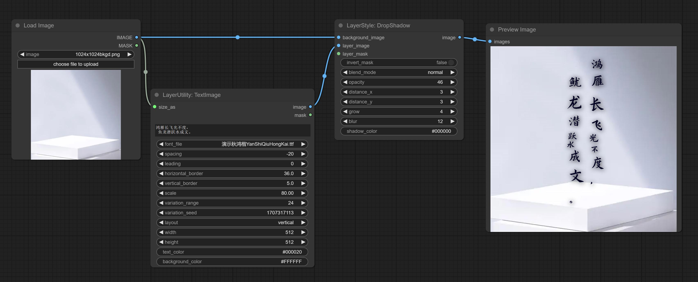    
Generate images and masks from text. support for adjusting the spacing between words and lines, horizontal and vertical adjustments, it can set random changes in each character, including size and position.

    
Node options:

* size_as<sup>*</sup>: The input image or mask here will generate the output image and mask according to their size. this input takes priority over the width and height below.
* font_file<sup>**</sup>: Here is a list of available font files in the font folder, and the selected font files will be used to generate images.
* spacing: Word spacing.this value is in pixels.
* leading: Row leading.this value is in pixels.
* horizontal_border: Side margin. If the text is horizontal, it is the left margin, and if it is vertical, it is the right margin. this value is represents a percentage, for example, 50 indicates that the starting point is located in the center on both sides.
* vertical_border: Top margin. this value is represents a percentage, for example, 10 indicates that the starting point is located 10% away from the top.
* scale: The overall size of the text. the initial size of text is automatically calculated based on the screen size and text content, with the longest row or column by default adapting to the image width or height. adjusting the value here will scale the text as a whole. this value is represents a percentage, for example, 60 represents scaling to 60%.
* variation_range: The range of random changes in characters. when this value is greater than 0, the character will undergo random changes in size and position, and the larger the value, the greater the magnitude of the change.
* variation_seed: The seed for randomly. fix this value to individual characters changes generated each time will not change.
* layout: Text layout. there are horizontal and vertical options to choose from.
* width: Width of the image. If there is a size_as input, this setting will be ignored.
* height: Height of the image. If there is a size_as input, this setting will be ignored.
* text_color: The color of text.
* background_color<sup>4</sup>: The color of background.

<sup>*</sup>Only limited to input image and mask. forcing the integration of other types of inputs will result in node errors.

<sup>**</sup>The font folder is defined in ```resource_dir.ini```, this file is located in the root directory of the plug-in, and the default name is ```resource_dir.ini.example```. to use this file for the first time, you need to change the file suffix to ```.ini```.
Open the text editing software and find the line starting with "FONT_dir=", after "=", enter the custom folder path name. 
support defining multiple folders in ```resource-dir.ini```, separated by commas, semicolons, or spaces. 
all font files in this folder will be collected and displayed in the node list during ComfyUI initialization.
If the folder set in ini is invalid, the font folder that comes with the plugin will be enabled.

### <a id="table1">TextImageV2</a>

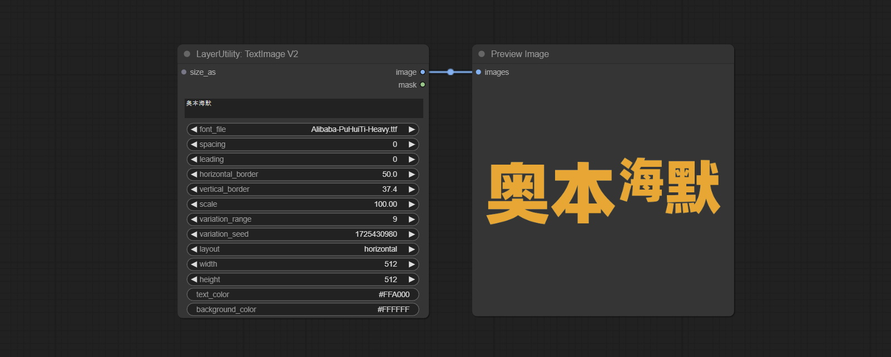    

This node is merged from [heshengtao](https://github.com/heshengtao). The PR modifies the scaling of the image text node based on the TextImage node. The font spacing follows the scaling, and the coordinates are no longer based on the top left corner of the text, but on the center point of the entire line of text. Thank you for the author's contribution.

### <a id="table1">LaMa</a>

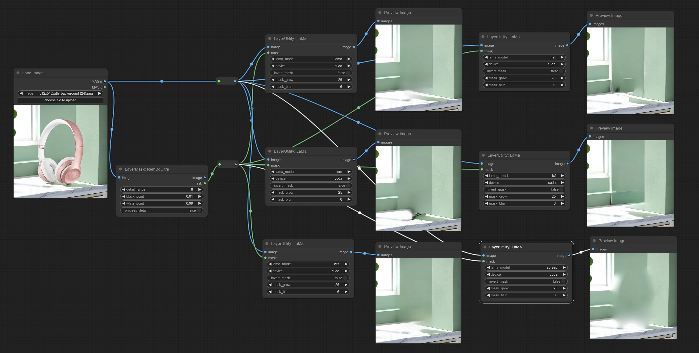    
Erase objects from the image based on the mask. this node is repackage of [IOPaint](https://www.iopaint.com), powered by state-of-the-art AI models, thanks to the original author.    
It is have [LaMa](https://github.com/advimman/lama), [LDM](https://github.com/CompVis/latent-diffusion), [ZITS](https://github.com/DQiaole/ZITS_inpainting),[MAT](https://github.com/fenglinglwb/MAT),  [FcF](https://github.com/SHI-Labs/FcF-Inpainting), [Manga](https://github.com/msxie92/MangaInpainting) models and the SPREAD method to erase. Please refer to the original link for the introduction of each model.    
Please download the model files from [lama models(BaiduNetdisk)](https://pan.baidu.com/s/1m7La2ELsSKaIFhQ57qg1XQ?pwd=jn10) or [lama models(Google Drive)](https://drive.google.com/drive/folders/1Aq0a4sybb3SRxi7j1e1_ZbBRjaWDdP9e?usp=sharing) to ```ComfyUI/models/lama``` folder.    

Node optons:
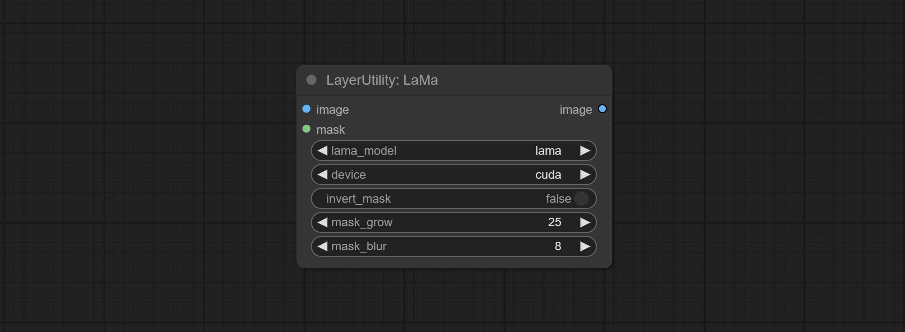    

* lama_model: Choose a model or method.
* device: After correctly installing Torch and Nvidia CUDA drivers, using cuda will significantly improve running speed.
* invert_mask: Whether to reverse the mask.
* grow: Positive values expand outward, while negative values contract inward.
* blur: Blur the edge.

### <a id="table1">ImageChannelSplit</a>

    
Split the image channel into individual images.

Node options:
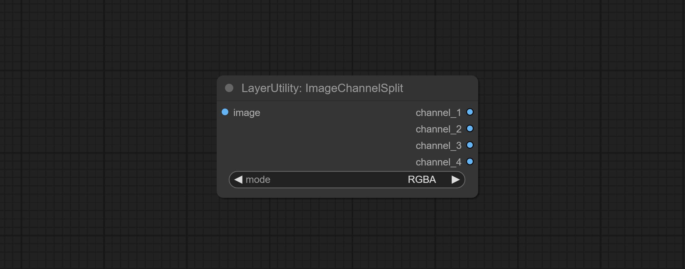    

* mode: Channel mode, include RGBA, YCbCr, LAB adn HSV.

### <a id="table1">ImageChannelMerge</a>

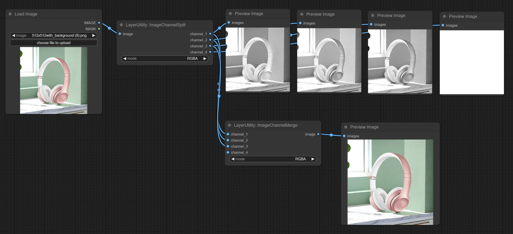    
Merge each channel image into one image.

Node options:
    

* mode: Channel mode, include RGBA, YCbCr, LAB adn HSV.

### <a id="table1">ImageRemoveAlpha</a>

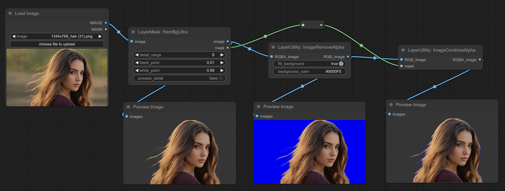    
Remove the alpha channel from the image and convert it to RGB mode. you can choose to fill the background and set the background color.

Node options:
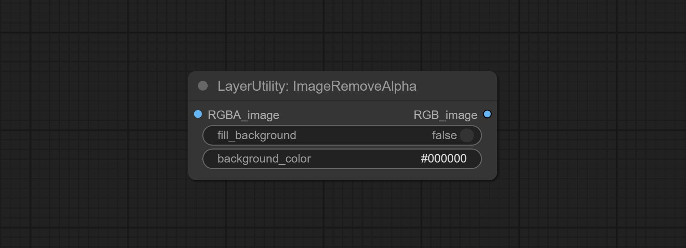    

* RGBA_image: The input image supports RGBA or RGB modes.
* mask: Optional input mask. If there is an input mask, it will be used first, ignoring the alpha that comes with RGBA_image.
* fill_background: Whether to fill the background.
* background_color<sup>4</sup>: Color of background.

### <a id="table1">ImageCombineAlpha</a>

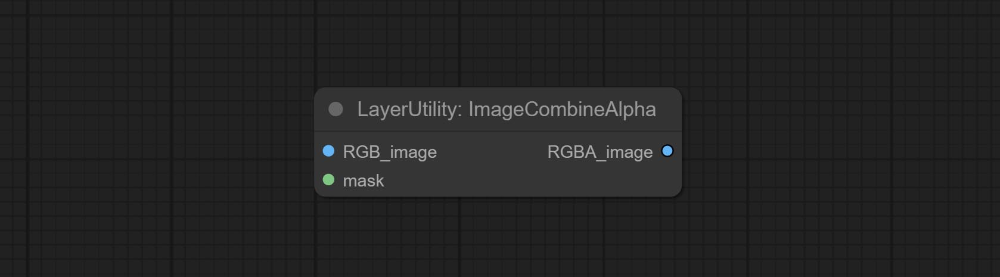    
Merge the image and mask into an RGBA mode image containing an alpha channel.

### <a id="table1">ImageAutoCrop</a>

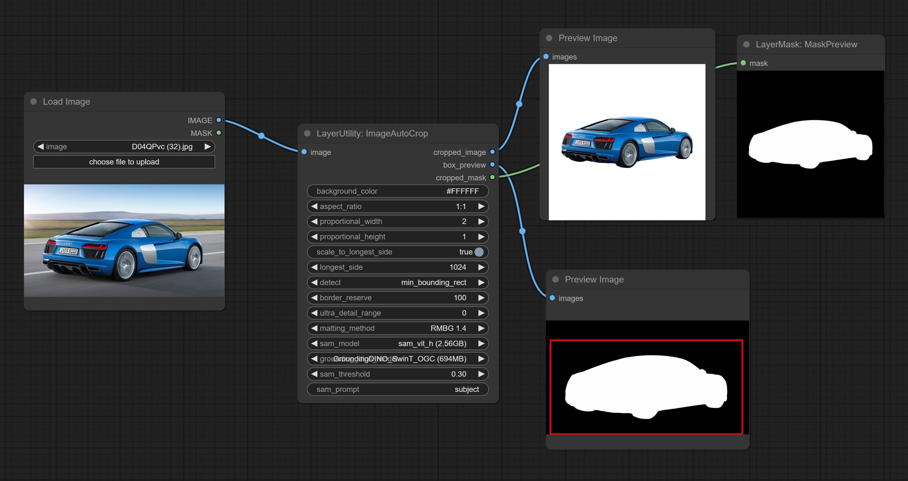    
Automatically cutout and crop the image according to the mask. it can specify the background color, aspect ratio, and size for output image. this node is designed to generate the image materials for training models.   
*Please refer to the model installation methods for [SegmentAnythingUltra](#SegmentAnythingUltra) and [RemBgUltra](#RemBgUltra).  

Node options:
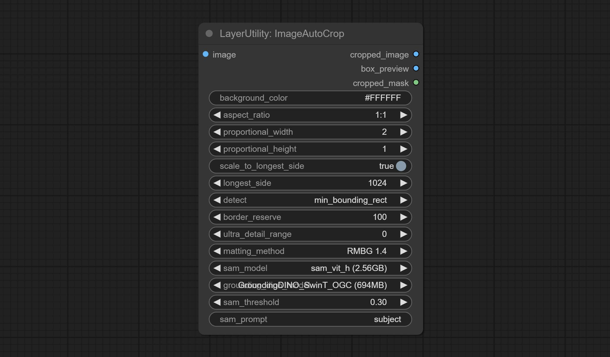    

* background_color<sup>4</sup>: The background color.
* aspect_ratio: Here are several common frame ratios provided. alternatively, you can choose "original" to keep original ratio or customize the ratio using "custom".
* proportional_width: Proportional width. if the aspect ratio option is not "custom", this setting will be ignored.
* proportional_height: Proportional height. if the aspect ratio option is not "custom", this setting will be ignored.
* scale_by_longest_side: Allow scaling by long edge size.
* longest_side: When the scale_by_longest_side is set to True, this will be used this value to the long edge of the image. when the original_size have input, this setting will be ignored.
* detect: Detection method, min_bounding_rect is the minimum bounding rectangle, max_inscribed_rect is the maximum inscribed rectangle.
* border_reserve: Keep the border. expand the cutting range beyond the detected mask body area.
* ultra_detail_range: Mask edge ultra fine processing range, 0 is not processed, which can save generation time.
* matting_method: The method of generate masks. There are two methods available: Segment Anything and RMBG 1.4. RMBG 1.4 runs faster.
* sam_model: Select the SAM model used by Segment Anything here.
* grounding_dino_model: Select the Grounding_Dino model used by Segment Anything here.
* sam_threshold: The threshold for Segment Anything.
* sam_prompt: The prompt for Segment Anything.

Output:
cropped_image: Crop and replace the background image.
box_preview: Crop position preview.
cropped_mask: Cropped mask.

### <a id="table1">ImageAutoCropV2</a>

The V2 upgrad version of ```ImageAutoCrop```, it has made the following changes based on the previous version:
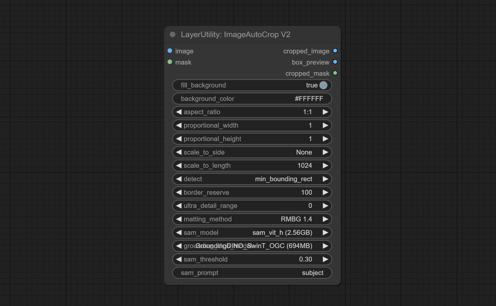    

* Add optional input for mask. when there is a mask input, use that input directly to skip the built-in mask generation.
* Add ```fill_background```. When set to False, the background will not be processed and any parts beyond the frame will not be included in the output range.
* ```aspect_ratio``` adds the ```original``` option.
* scale_by: Allow scaling by specified dimensions for longest, shortest, width, or height.
* scale_by_length: The value here is used as ```scale_by``` to specify the length of the edge.

### <a id="table1">ImageAutoCropV3</a>

Automatically crop the image to the specified size. You can input a mask to preserve the specified area of the mask. This node is designed to generate image materials for training the model.  

Node Options:
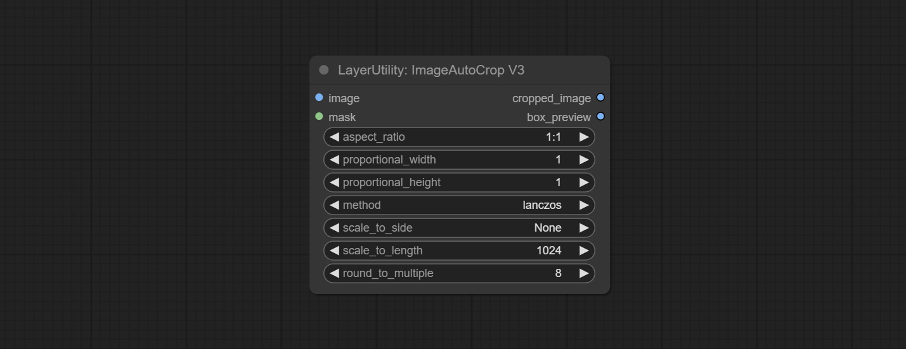   

* image: The input image.
* mask: Optional input mask. The masking part will be preserved within the range of the cutting aspect ratio.
* aspect_ratio: The aspect ratio of the output. Here are common frame ratios provided, with "custom" being the custom ratio and "original" being the original frame ratio.
* proportional_width: Proportionally wide. If the aspect_ratio option is not 'custom', this setting will be ignored.
* proportional_height: High proportion. If the aspect_ratio option is not 'custom', this setting will be ignored.
* method: Scaling sampling methods include Lanczos, Bicubic, Hamming, Bilinear, Box, and Nearest.
* scale_to_side: Allow scaling to be specified by long side, short side, width, height, or total pixels.
* scale_to_length: The value here is used as the scale_to-side to specify the length of the edge or the total number of pixels (kilo pixels).
* round_to_multiple: Multiply to the nearest whole. For example, if set to 8, the width and height will be forcibly set to multiples of 8.

Outputs:
cropped_image: The cropped image.
box_preview: Preview of cutting position.

### <a id="table1">HLFrequencyDetailRestore</a>

Using low frequency filtering and retaining high frequency to recover image details. Compared to [kijai's DetailTransfer](https://github.com/kijai/ComfyUI-IC-Light), this node is better integrated with the environment while retaining details.
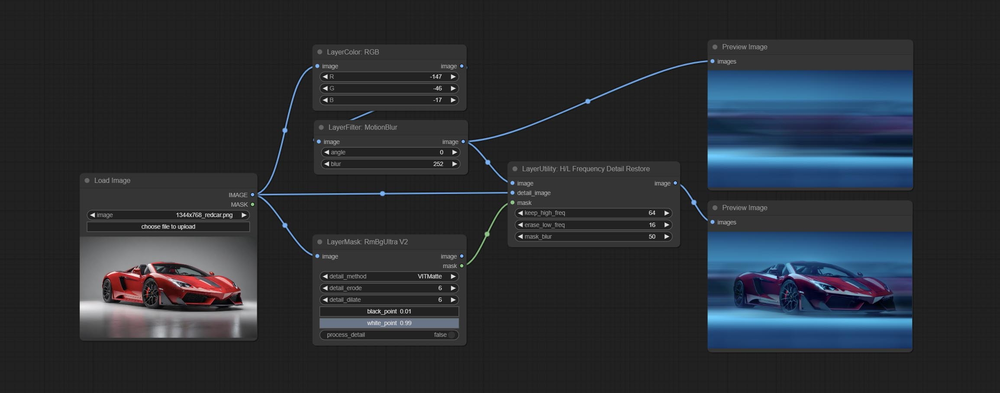    

Node Options:  
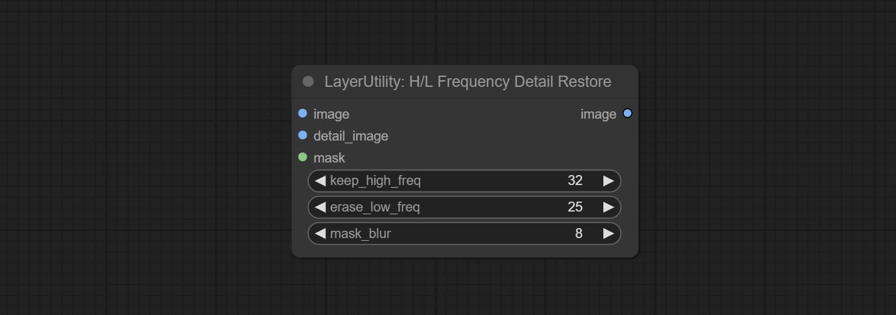    

* image: Background image input.
* detail_image: Detail image input.
* mask: Optional input, if there is a mask input, only the details of the mask part are restored.
* keep_high_freq: Reserved range of high frequency parts. The larger the value, the richer the retained high-frequency details.
* erase_low_freq: The range of low frequency parts of the erasure. The larger the value, the more the low frequency range of the erasure.
* mask_blur: Mask edge blur. Valid only if there is masked input.

### <a id="table1">GetImageSize</a>

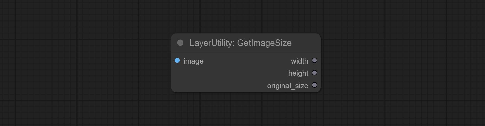    
Obtain the width and height of the image.

Output:

* width: The width of image.
* height: The height of image.
* original_size: The original size data of the image is used for subsequent node recovery.

### <a id="table1">ImageHub</a>

Switch output from multiple input images and masks, supporting 9 sets of inputs. All input items are optional. if there is only image or mask in a set of input, the missing item will be output as None.
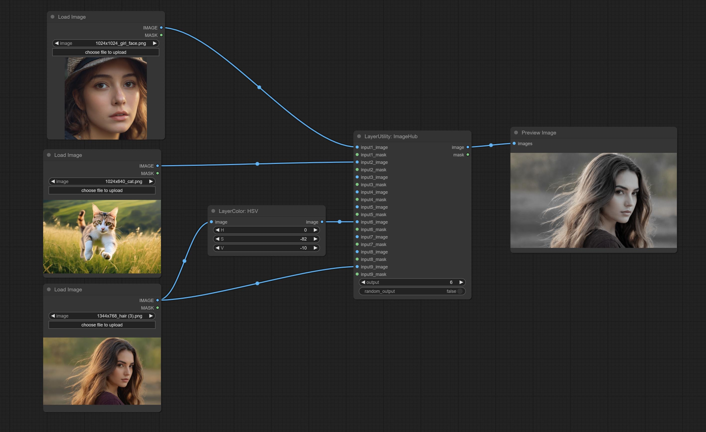    

Node options:  
    

* output: Switch output. the value is the corresponding input group. when the ```random-output``` option is True, this setting will be ignored.
* random_output: When this is true, the ```output``` setting will be ignored and a random set will be output among all valid inputs.

### <a id="table1">BatchSelector</a>

Retrieve specified images or masks from batch images or masks.
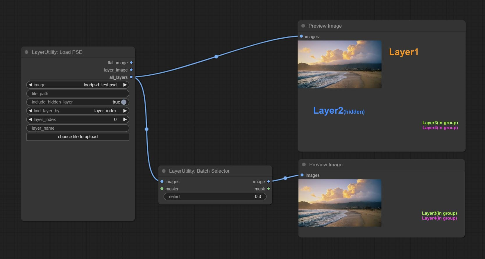    

Node Options:  
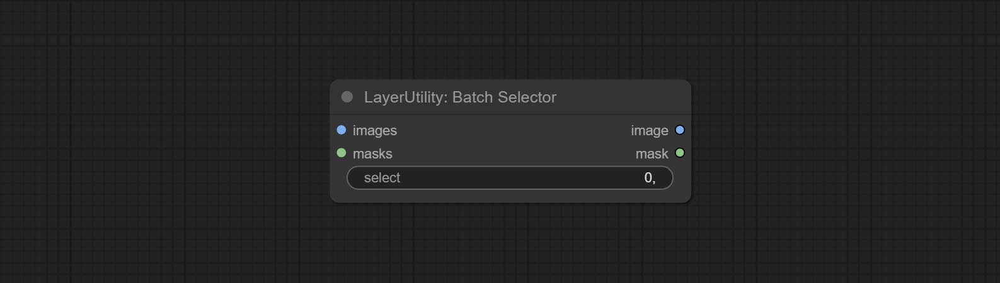    

* images: Batch images input. This input is optional.
* masks: Batch masks input. This input is optional.
* select: Select the output image or mask at the batch index value, where 0 is the first image. Multiple values can be entered, separated by any non numeric character, including but not limited to commas, periods, semicolons, spaces or letters, and even Chinese characters.
  Note: If the value exceeds the batch size, the last image will be output. If there is no corresponding input, an empty 64x64 image or a 64x64 black mask will be output.

### <a id="table1">TextJoin</a>

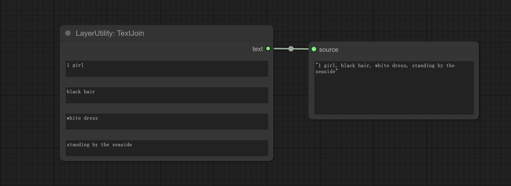    
Combine multiple paragraphs of text into one.


### <a id="table1">TextJoinV2</a>
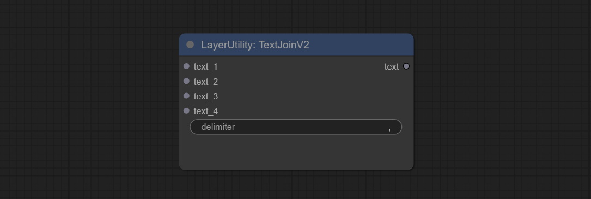    
Added delimiter options on the basis of [TextJoin](#TextJoin).

### <a id="table1">PrintInfo</a>

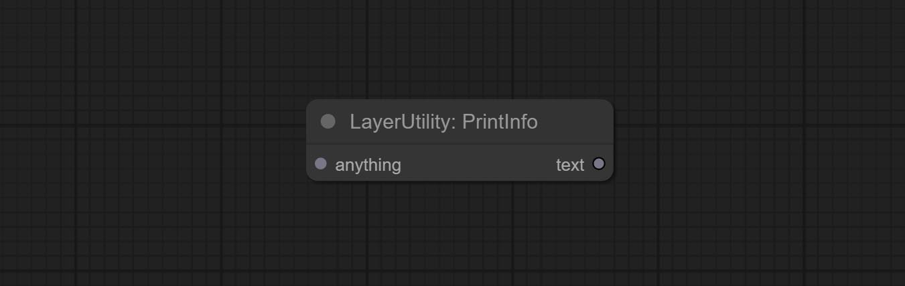    
Used to provide assistance for workflow debugging. When running, the properties of any object connected to this node will be printed to the console.

This node allows any type of input.

### <a id="table1">TextBox</a>

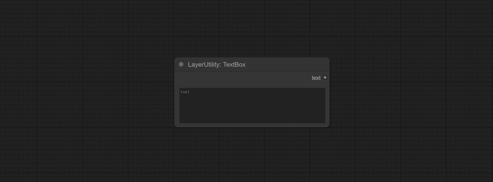    
Output a string.

### <a id="table1">String</a>

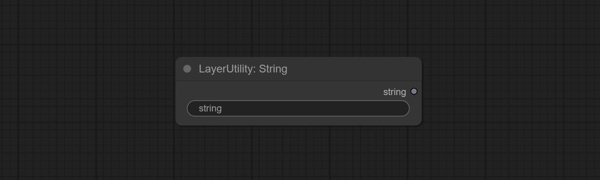    
Output a string. same as TextBox.

### <a id="table1">Integer</a>

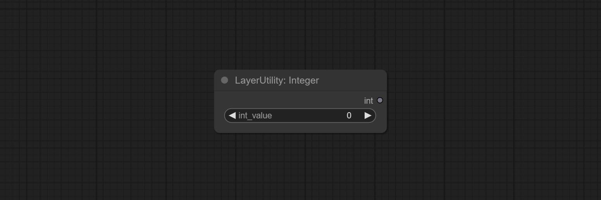    
Output a integer value.

### <a id="table1">Float</a>

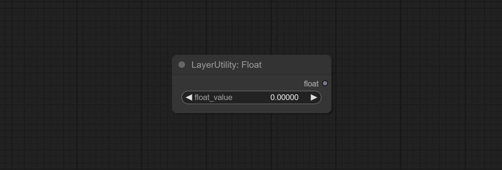    
Output a floating-point value with a precision of 5 decimal places.

### <a id="table1">Boolean</a>

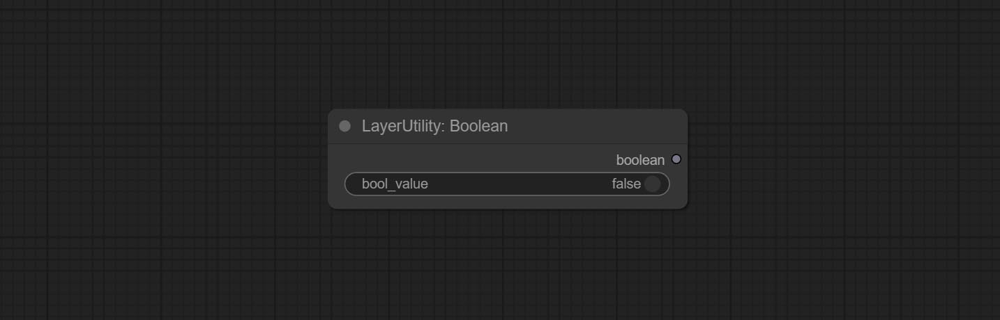    
Output a boolean value.

### <a id="table1">RandomGenerator</a>

Used to generate random value within a specified range, with outputs of int, float, and boolean. Supports batch and list generation, and supports batch generation of a set of different random number lists based on image batch.
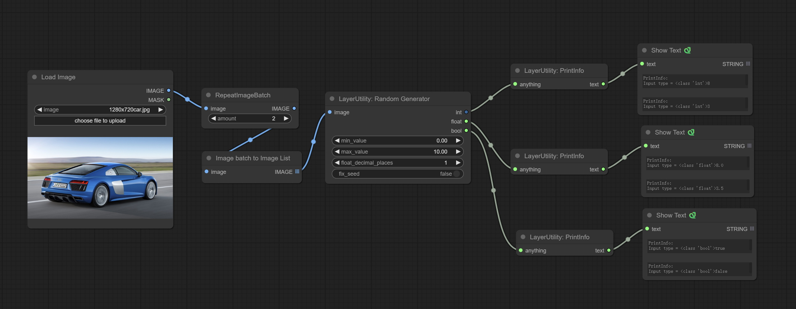    

Node Options:
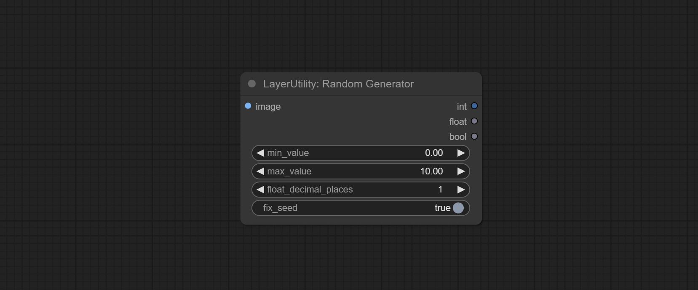  

* image: Optional input, generate a list of random numbers that match the quantity in batches according to the image.
* min_value: Minimum value. Random numbers will randomly take values from the minimum to the maximum.
* max_value: Maximum value. Random numbers will randomly take values from the minimum to the maximum.
* float_decimal_places: Precision of float value.
* fix_seed:Is the random number seed fixed. If this option is fixed, the generated random number will always be the same.

Outputs:
int: Integer random number.
float: Float random number.
bool: Boolean random number.

### <a id="table1">RandomGeneratorV2</a>
On the based of [RandomGenerator](#RandomGenerator), add  the least random range and seed options.

Node Options:
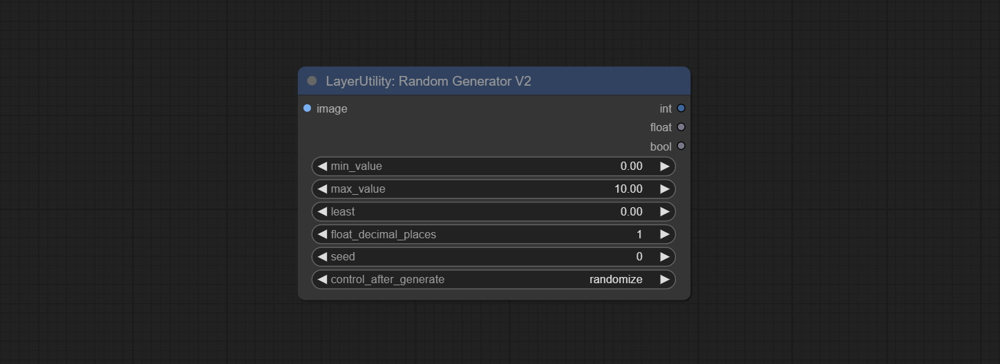  
* image: Optional input, generate a list of random numbers that match the quantity in batches according to the image.
* min_value: Minimum value. Random numbers will randomly take values from the minimum to the maximum.
* max_value: Maximum value. Random numbers will randomly take values from the minimum to the maximum.
* least: Minimum random range. Random numbers will randomly at least take this value.
* float_decimal_places: Precision of float value.
* seed: The seed of random number.
* control_after_generate: Seed change options. If this option is fixed, the generated random number will always be the same.

Outputs:
int: Integer random number.
float: Float random number.
bool: Boolean random number.


### <a id="table1">NumberCalculator</a>

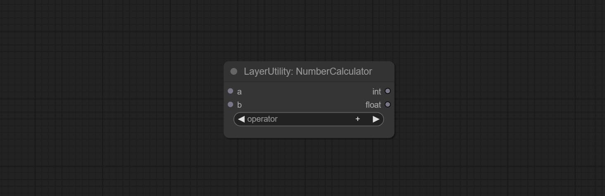    
Performs mathematical operations on two numeric values and outputs integer and floating point results<sup>*</sup>. Supported operations include```+```, ```-```, ```*```, ```/```, ```**```, ```//```, ```%```.

<sup>*</sup>  The input only supports boolean, integer, and floating point numbers, forcing in other data will result in error.

### <a id="table1">NumberCalculatorV2</a>

  
The upgraded version of NumberCalculator has added numerical inputs within nodes and square root operations. The square root operation option is ```nth_root```
Note: The input takes priority, and when there is input, the values within the node will be invalid.

### <a id="table1">BooleanOperator</a>

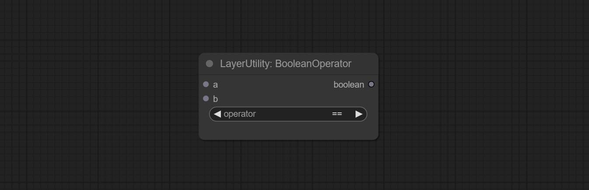    
Perform a Boolean operation on two numeric values and output the result<sup>*</sup>. Supported operations include```==```, ```!=```, ```and```, ```or```, ```xor```, ```not```, ```min```, ```max```.

<sup>*</sup>  The input only supports boolean, integer, and floating point numbers, forcing in other data will result in error. The ```and``` operation between the values outputs a larger number, and the ```or``` operation outputs a smaller number.

### <a id="table1">BooleanOperatorV2</a>

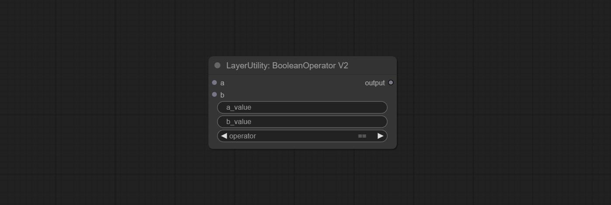  
The upgraded version of Boolean Operator has added numerical inputs within nodes and added judgments for greater than, less than, greater than or equal to, and less than or equal to.
Note: The input takes priority, and when there is input, the values within the node will be invalid.

### <a id="table1">StringCondition</a>

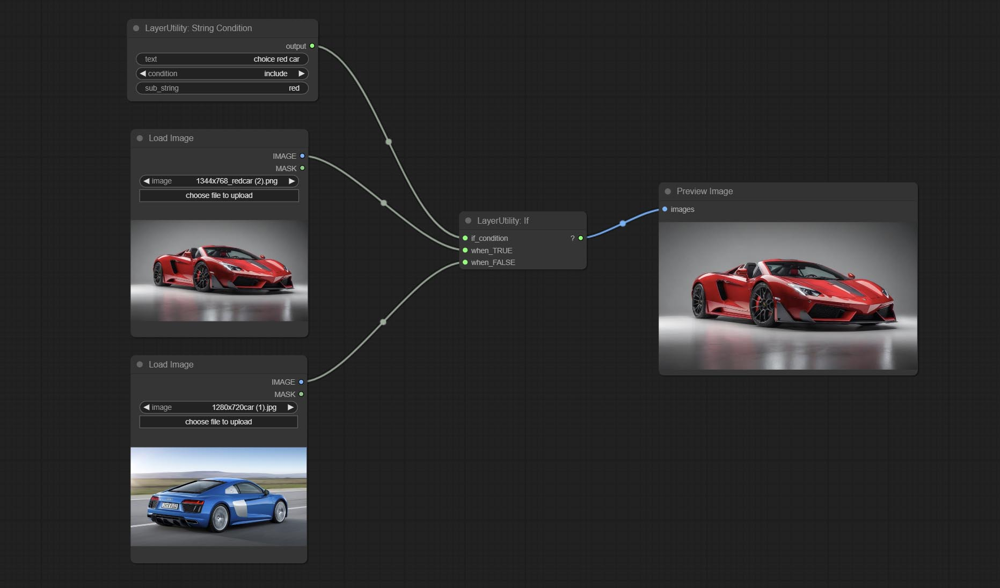    
Determine whether the text contains or does not contain substrings, and output a Boolean value.

Node Options:    
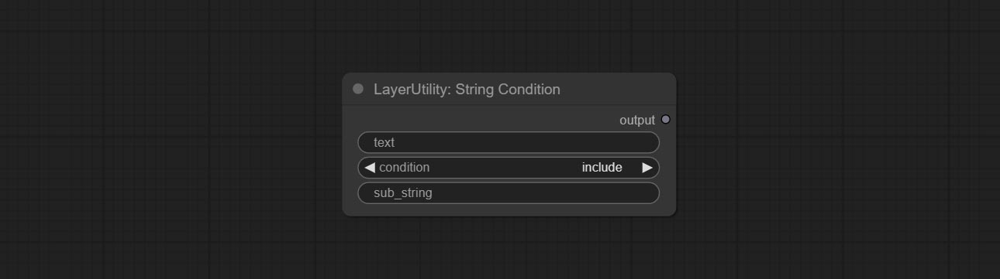  

* text: Input text.
* condition: Judgment conditions. ```include``` determines whether it contains a substring, and ```exclude``` determines whether it does not.
* sub_string: Substring.

### <a id="table1">CheckMask</a>

Check if the mask contains enough valid areas and output a Boolean value.

Node Options:    
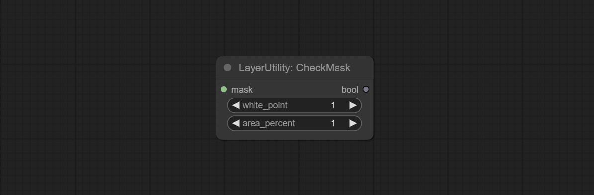    

* white_point: The white point threshold used to determine whether the mask is valid is considered valid if it exceeds this value.
* area_percent: The percentage of effective areas. If the proportion of effective areas exceeds this value, output True.

### <a id="table1">CheckMaskV2</a>

On the basis of CheckMask, the ```method``` option has been added, which allows for the selection of different detection methods. The ```area_percent``` is changed to a floating point number with an accuracy of 2 decimal places, which can detect smaller effective areas.

Node Options:    
    

* method: There are two detection methods, which are ```simple``` and ```detectability```. The simple method only detects whether the mask is completely black, while the detect_percent method detects the proportion of effective areas.

### <a id="table1">If</a>

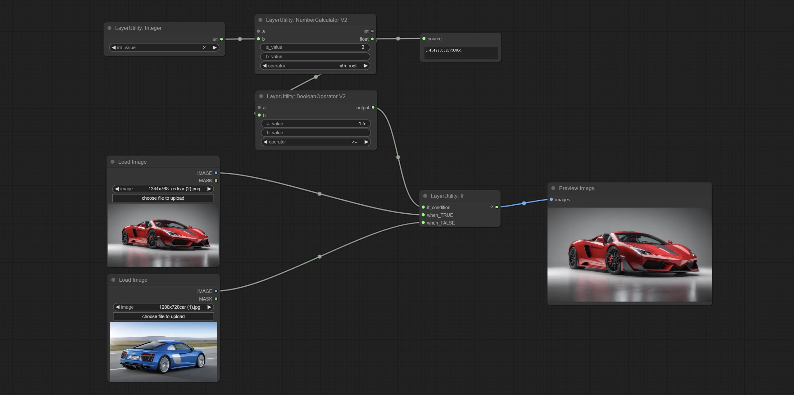    
Switches output based on Boolean conditional input. It can be used for any type of data switching, including but not limited to numeric values, strings, pictures, masks, models, latent, pipe pipelines, etc.

Node Options:    
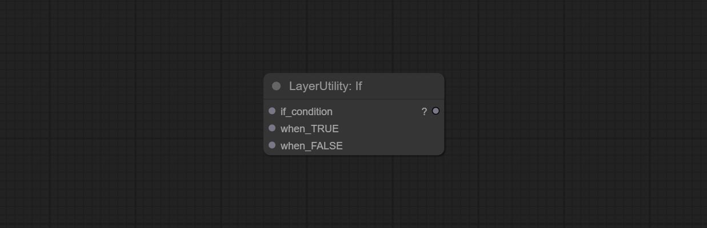    

* if_condition: Conditional input. Boolean, integer, floating point, and string inputs are supported. When entering a value, 0 is judged to be False; When a string is entered, an empty string is judged as Flase.
* when_True: This item is output when the condition is True.
* when_False: This item is output when the condition is False.

### <a id="table1">SwitchCase</a>

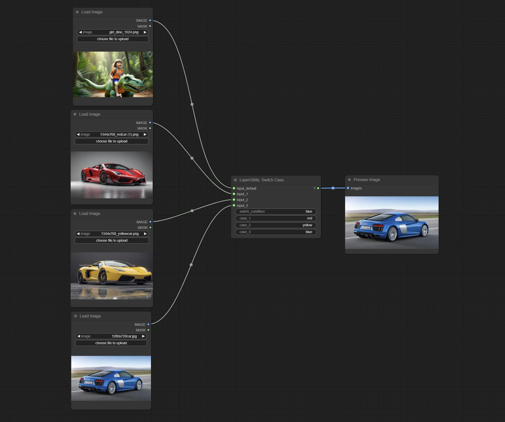    
Switches the output based on the matching string. It can be used for any type of data switching, including but not limited to numeric values, strings, pictures, masks, models, latent, pipe pipelines, etc. Supports up to 3 sets of case switches.
Compare case to ```switch_condition``` , if the same, output the corresponding input. If there are the same cases, the output is prioritized in order. If there is no matching case, the default input is output. 
Note that the string is case sensitive and Chinese and English full-width and half-width.

Node Options:    
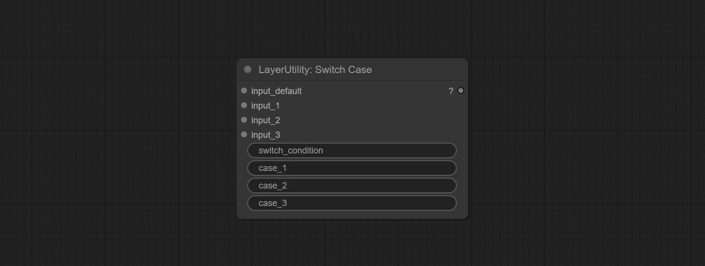    

* input_default: Input entry for default output. This input is required.
* input_1: Input entry used to match ```case_1```. This input is optional.
* input_2: Input entry used to match ```case_2```. This input is optional.
* input_3: Input entry used to match ```case_3```. This input is optional.
* switch_condition: String used to judge with case.
* case_1: case_1 string.
* case_2: case_2 string.
* case_3: case_3 string.

### <a id="table1">QueueStop</a>

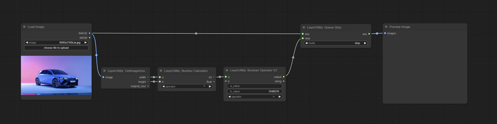    
Stop the current queue. When executed at this node, the queue will stop. The workflow diagram above illustrates that if the image is larger than 1Mega pixels, the queue will stop executing.

Node Options:    
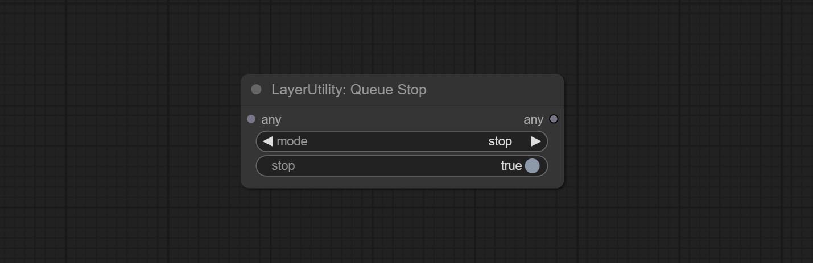    

* mode: Stop mode. If you choose ```stop```, it will be determined whether to stop based on the input conditions. If you choose ```continue```, ignore the condition to continue executing the queue.
* stop: If true, the queue will stop. If false, the queue will continue to execute.

### <a id="table1">PurgeVRAM</a>

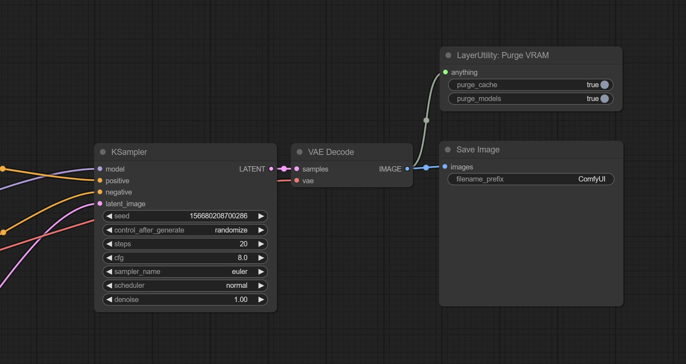    
Clean up GPU VRAM and system RAM. any type of input can be accessed, and when executed to this node, the VRAM and garbage objects in the RAM will be cleaned up. Usually placed after the node where the inference task is completed, such as the VAE Decode node.

Node Options:  

* purge_cache: Clean up cache。
* purge_models: Unload all loaded models。

### <a id="table1">SaveImagePlus</a>

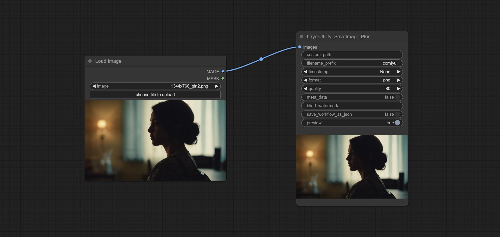  
Enhanced save image node. You can customize the directory where the picture is saved, add a timestamp to the file name, select the save format, set the image compression rate, set whether to save the workflow, and optionally add invisible watermarks to the picture. (Add information in a way that is invisible to the naked eye, and use the ```ShowBlindWaterMark``` node to decode the watermark). Optionally output the json file of the workflow.

Node Options:
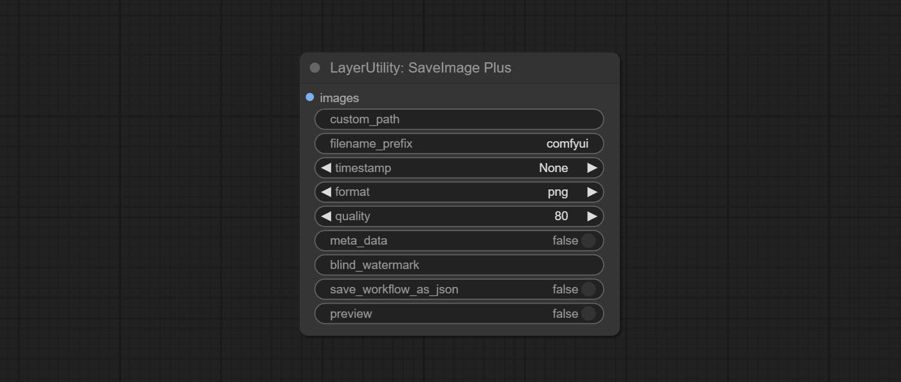    

* iamge: The input image.
* custom_path<sup>*</sup>: User-defined directory, enter the directory name in the correct format. If empty, it is saved in the default output directory of ComfyUI.
* filename_prefix<sup>*</sup>: The prefix of file name.
* timestamp: Timestamp the file name, opting for date, time to seconds, and time to milliseconds.
* format: The format of image save. Currently available in ```png``` and ```jpg```. Note that only png format is supported for RGBA mode pictures.
* quality: Image quality, the value range 10-100, the higher the value, the better the picture quality, the volume of the file also correspondingly increases.
* meta_data: Whether to save metadata to png file, that is workflow information. Set this to false if you do not want the workflow to be leaked.
* blind_watermark: The text entered here (does not support multilingualism) will be converted into a QR code and saved as an invisible watermark. Use ```ShowBlindWaterMark``` node can decode watermarks. Note that pictures with watermarks are recommended to be saved in png format, and lower-quality jpg format will cause watermark information to be lost.
* save_workflow_as_json: Whether the output workflow is a json file at the same time (the output json is in the same directory as the picture).
* preview: Preview switch.

<sup>*</sup> Enter```%date``` for the current date (YY-mm-dd) and ```%time``` for the current time (HH-MM-SS). You can enter ```/``` for subdirectories. For example, ```%date/name_%tiem``` will output the image to the ```YY-mm-dd``` folder, with ```name_HH-MM-SS``` as the file name prefix.

### <a id="table1">ImageTaggerSave</a>

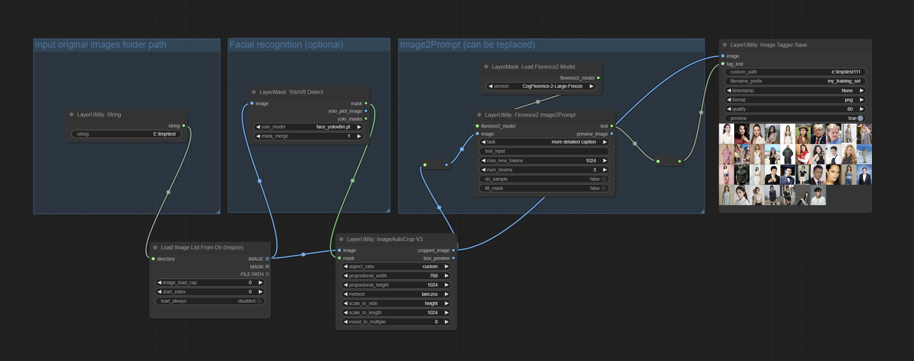  
The node used to save the training set images and their text labels, where the image files and text label files have the same file name. Customizable directory for saving images, adding timestamps to file names, selecting save formats, and setting image compression rates.
*The workflow image_tagger_stave.exe is located in the workflow directory.

Node Options:
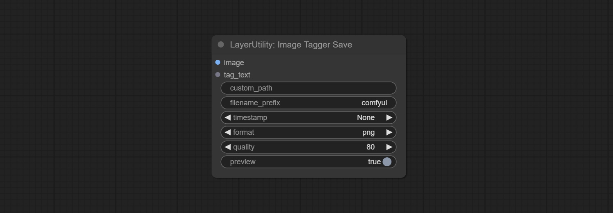      

* iamge: The input image.
* tag_text: Text label of image.
* custom_path<sup>*</sup>: User-defined directory, enter the directory name in the correct format. If empty, it is saved in the default output directory of ComfyUI.
* filename_prefix<sup>*</sup>: The prefix of file name.
* timestamp: Timestamp the file name, opting for date, time to seconds, and time to milliseconds.
* format: The format of image save. Currently available in ```png``` and ```jpg```. Note that only png format is supported for RGBA mode pictures.
* quality: Image quality, the value range 10-100, the higher the value, the better the picture quality, the volume of the file also correspondingly increases.
* preview: Preview switch.

<sup>*</sup> Enter```%date``` for the current date (YY-mm-dd) and ```%time``` for the current time (HH-MM-SS). You can enter ```/``` for subdirectories. For example, ```%date/name_%tiem``` will output the image to the ```YY-mm-dd``` folder, with ```name_HH-MM-SS``` as the file name prefix.

### <a id="table1">AddBlindWaterMark</a>

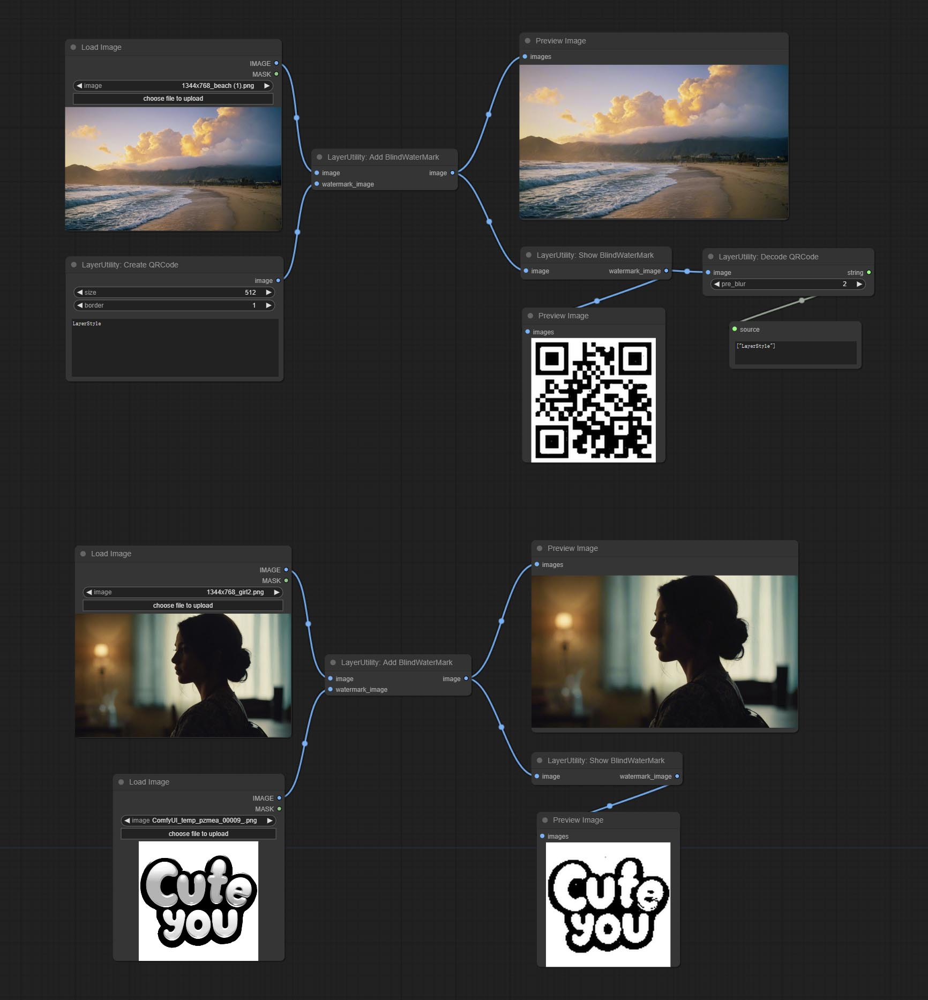    
Add an invisible watermark to a picture. Add the watermark image in a way that is invisible to the naked eye, and use the ```ShowBlindWaterMark``` node to decode the watermark.

Node Options:
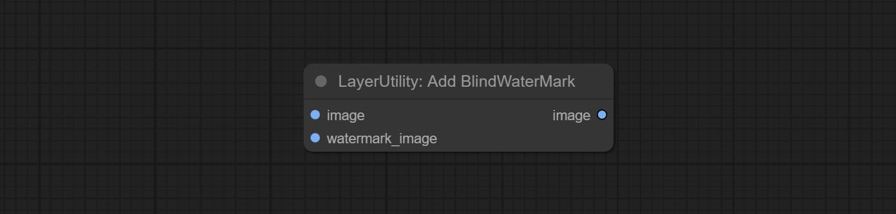    

* iamge: The input image.
* watermark_image: Watermark image. The image entered here will automatically be converted to a square black and white image as a watermark. It is recommended to use a QR code as a watermark.

### <a id="table1">ShowBlindWaterMark</a>

Decoding the invisible watermark added to the ```AddBlindWaterMark``` and ```SaveImagePlus``` nodes.
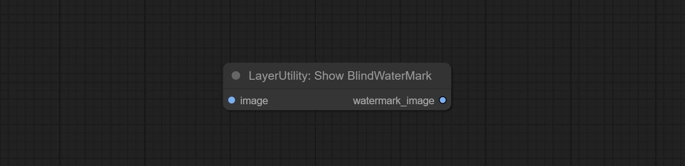    

### <a id="table1">CreateQRCode</a>

Generate a square QR code picture.

Node Options:  
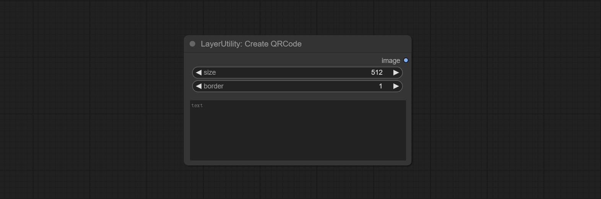    

* size: The side length of image.
* border: The size of the border around the QR code, the larger the value, the wider the border.
* text: Enter the text content of the QR code here, and multi-language is not supported.

### <a id="table1">DecodeQRCode</a>

Decoding the QR code.

Node Options:  
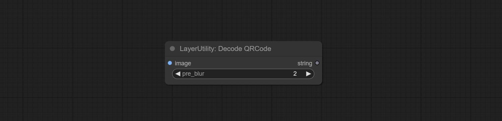    

* image: The input QR code image.
* pre_blur: Pre-blurring, you can try to adjust this value for QR codes that are difficult to identify. 

### <a id="table1">LoadPSD</a>

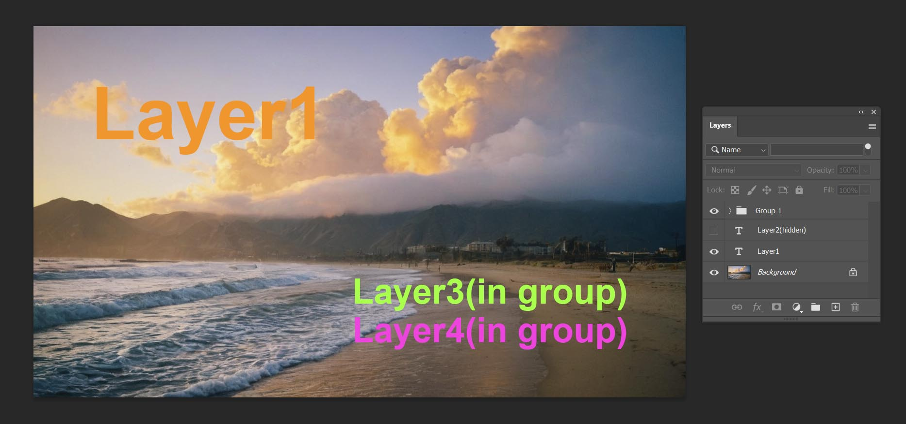    
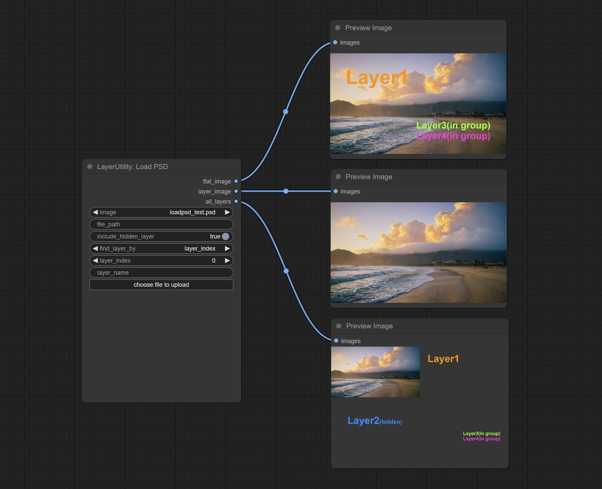    
Load the PSD format file and export the layers.
Note that this node requires the installation of the ```psd_tools``` dependency package, If error occurs during the installation of psd_tool, such as ```ModuleNotFoundError: No module named 'docopt'``` , please download [docopt's whl](https://www.piwheels.org/project/docopt/) and manual install it. 

Node Options:  
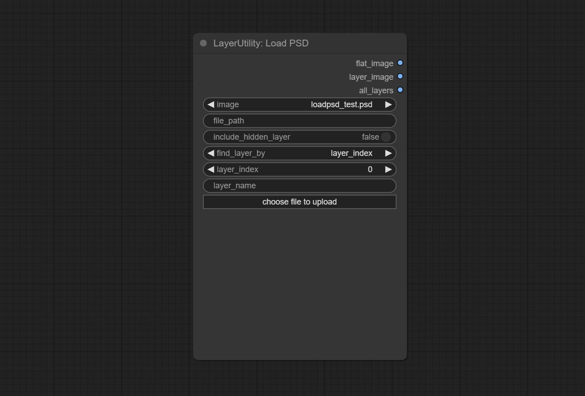    

* image: Here is a list of *.psd files under ```ComfyUI/input```, where previously loaded psd images can be selected.
* file_path: The complete path and file name of the psd file.
* include_hidden_layer: whether include hidden layers.
* find_layer_by: The method for finding layers can be selected by layer key number or layer name. Layer groups are treated as one layer.
* layer_index: The layer key number, where 0 is the bottom layer, is incremented sequentially. If include_hiddenlayer is set to false, hidden layers are not counted. Set to -1 to output the top layer.
* layer_name: Layer name. Note that capitalization and punctuation must match exactly.

Outputs:
flat_image: PSD preview image.
layer_iamge: Find the layer output.
all_layers: Batch images containing all layers.

### <a id="table1">SD3NegativeConditioning</a>

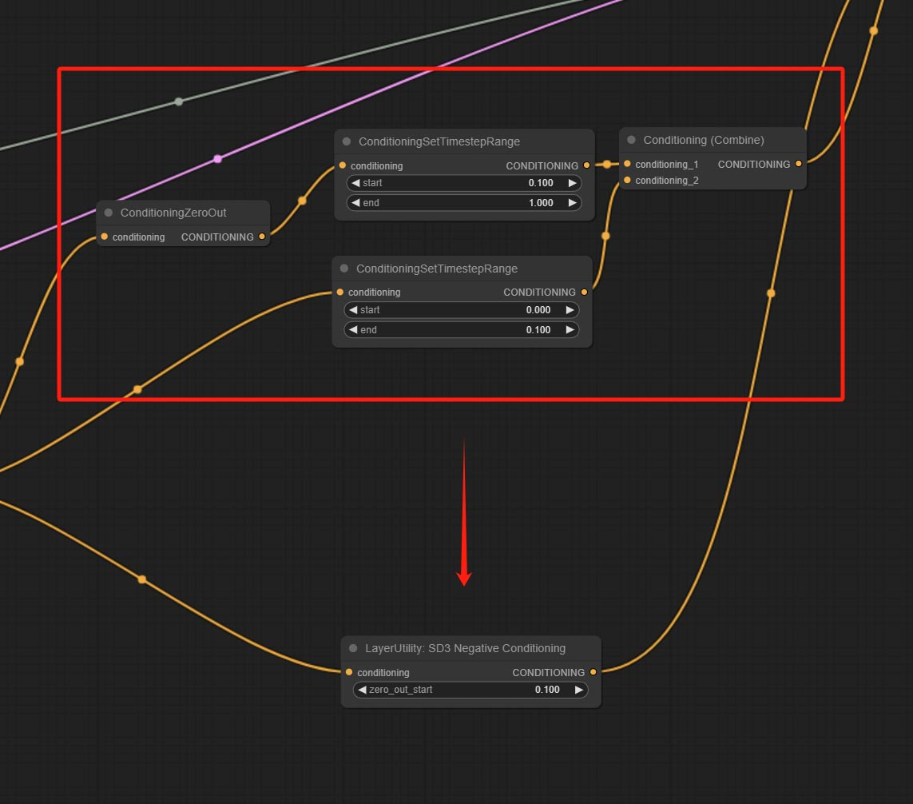  
Encapsulate the four nodes of Negative Condition in SD3 into a separate node.

Node Options:  
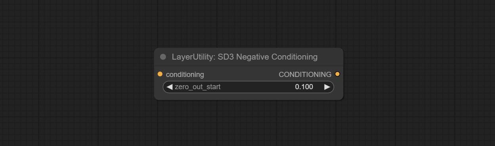    

* zero_out_start: Set the ConditioningSetTimestepRange start value for Negative ConditioningZeroOut, which is the same as the ConditioningSetTimestepRange end value for Negative.

# <a id="table1">LayerMask</a>

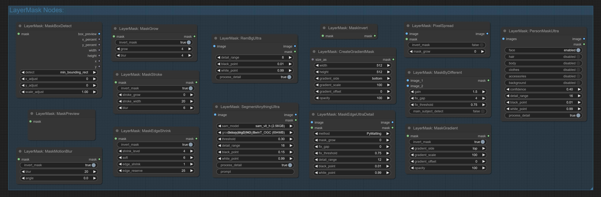    

### <a id="table1">BlendIfMask</a>

Reproduction of Photoshop's layer Style - Blend If function. This node outputs a mask for layer composition on the ImageBlend or ImageBlendAdvance nodes.
```mask``` is an optional input, and if you enter a mask here, it will act on the output.
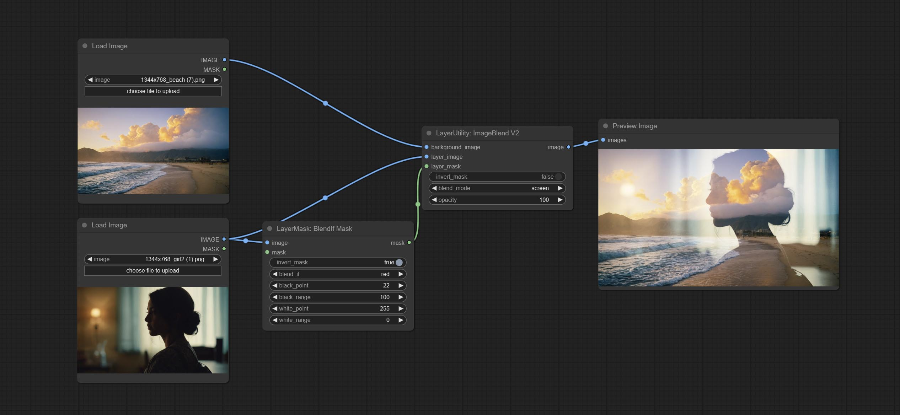    

Node Options:  
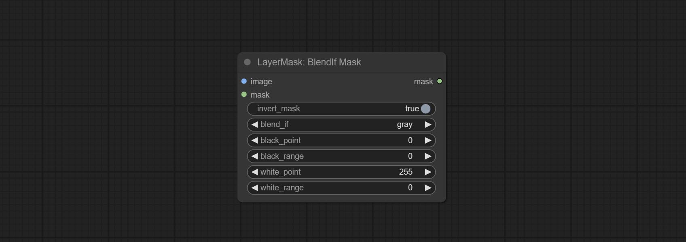    

* invert_mask: Whether to reverse the mask.
* blend_if: Channel selection for Blend If. There are four options: ```gray``` , ```red```, ```green```, and ```blue```.
* black_point: Black point values, ranging from 0-255.
* black_range: Dark part transition range. The larger the value, the richer the transition level of the dark part mask.
* white_point: White point values, ranging from 0-255.
* white_range: Brightness transition range. The larger the value is, the richer the transition level of the bright part mask is.

### <a id="table1">MaskBoxDetect</a>

Detect the area where the mask is located and output its position and size.
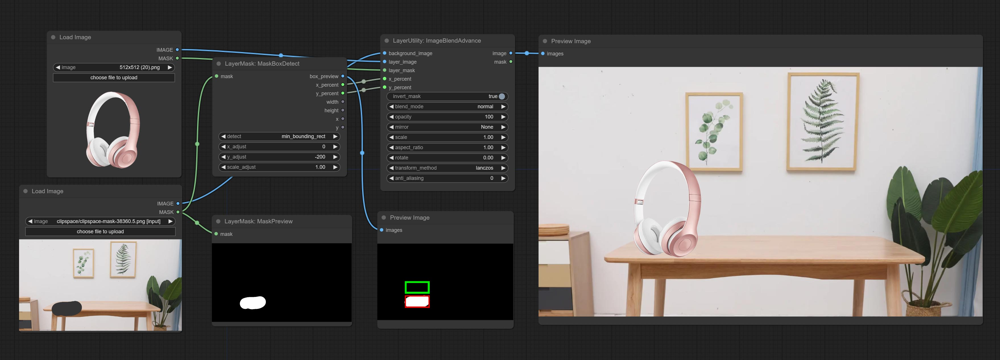    

Node options:  
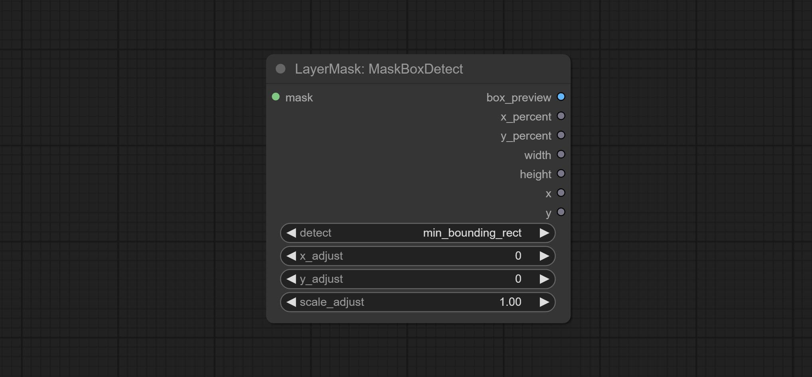    

* detect: Detection method, ```min_bounding_rect``` is the minimum bounding rectangle of block shape, ```max_inscribed_rect``` is the maximum inscribed rectangle of block shape, and ```mask-area``` is the effective area for masking pixels.
* x_adjust: Adjust of horizontal deviation after detection.
* y_adjust: Adjust of vertical offset after detection.
* scale_adjust: Adjust the scaling offset after detection.

Output:

* box_preview: Preview image of detection results. Red represents the detected result, and green represents the adjust output result.
* x_percent: Horizontal position output in percentage.
* y_percent: Vertical position output in percentage.
* width: Width.
* height: Height.
* x: The x-coordinate of the top left corner position.
* y: The y-coordinate of the top left corner position.

## <a id="table1">Ultra</a> Nodes

   
Nodes that use ultra fine edge masking processing methods, the latest version of nodes includes: SegmentAnythingUltraV2, RmBgUltraV2, BiRefNetUltra, PersonMaskUltraV2, SegformerB2ClothesUltra and MaskEdgeUltraDetailV2.
There are three edge processing methods for these nodes:

* ```PyMatting``` optimizes the edges of the mask by using a closed form matching to mask trimap.
* ```GuideFilter``` uses opencv guidedfilter to feather edges based on color similarity, and performs best when edges have strong color separation.    
  The code for the above two methods is from the [ComfyUI-Image-Filters](https://github.com/spacepxl/ComfyUI-Image-Filters) in spacepxl's Alpha Matte, thanks to the original author.
* ```VitMatte``` uses the transformer vit model for high-quality edge processing, preserving edge details and even generating semi transparent masks.
  Note: When running for the first time, you need to download the vitmate model file and wait for the automatic download to complete. If the download cannot be completed, you can run the command ```huggingface-cli download hustvl/vitmatte-small-composition-1k``` to manually download.
  After successfully downloading the model, you can use ```VITMatte(local)``` without accessing the network.
* VitMatte's options: ```device``` set whether to use CUDA for vitimate operations, which is about 5 times faster than CPU. ```max_megapixels``` set the maximum image size for vitmate operation, and oversized images will be reduced in size. For 16G VRAM, it is recommended to set it to 3.

*Download all model files from [BaiduNetdisk](https://pan.baidu.com/s/1xYF-V6QRwcFalEqLS7giWg?pwd=jiyz) or [Huggingface](https://huggingface.co/hustvl/vitmatte-small-composition-1k/tree/main) to ```ComfyUI/models/vitmatte``` folder.

The following figure is an example of the difference in output between three methods.
   

### <a id="table1">SegmentAnythingUltra</a>

Improvements to [ComfyUI Segment Anything](https://github.com/storyicon/comfyui_segment_anything),  thanks to the original author.

*Please refer to the installation of ComfyUI Segment Anything to install the model. If ComfyUI Segment Anything has been correctly installed, you can skip this step.

* From [here](https://huggingface.co/bert-base-uncased/tree/main) download the config.json，model.safetensors，tokenizer_config.json，tokenizer.json and vocab.txt 5 files to ```ComfyUI/models/bert-base-uncased``` folder.
* Download [GroundingDINO_SwinT_OGC config file](https://huggingface.co/ShilongLiu/GroundingDINO/resolve/main/GroundingDINO_SwinT_OGC.cfg.py), [GroundingDINO_SwinT_OGC model](https://huggingface.co/ShilongLiu/GroundingDINO/resolve/main/groundingdino_swint_ogc.pth), 
  [GroundingDINO_SwinB config file](https://huggingface.co/ShilongLiu/GroundingDINO/resolve/main/GroundingDINO_SwinB.cfg.py), [GroundingDINO_SwinB model](https://huggingface.co/ShilongLiu/GroundingDINO/resolve/main/groundingdino_swinb_cogcoor.pth) to ```ComfyUI/models/grounding-dino``` folder.
* Download [sam_vit_h](https://dl.fbaipublicfiles.com/segment_anything/sam_vit_h_4b8939.pth)，[sam_vit_l](https://dl.fbaipublicfiles.com/segment_anything/sam_vit_l_0b3195.pth), 
  [sam_vit_b](https://dl.fbaipublicfiles.com/segment_anything/sam_vit_b_01ec64.pth), [sam_hq_vit_h](https://huggingface.co/lkeab/hq-sam/resolve/main/sam_hq_vit_h.pth),
  [sam_hq_vit_l](https://huggingface.co/lkeab/hq-sam/resolve/main/sam_hq_vit_l.pth), [sam_hq_vit_b](https://huggingface.co/lkeab/hq-sam/resolve/main/sam_hq_vit_b.pth), 
  [mobile_sam](https://github.com/ChaoningZhang/MobileSAM/blob/master/weights/mobile_sam.pt) to ```ComfyUI/models/sams``` folder.
  *Or download them from [GroundingDino models on BaiduNetdisk](https://pan.baidu.com/s/1P7WQDuaqSYazlSQX8SJjxw?pwd=24ki) and  [SAM models on BaiduNetdisk](https://pan.baidu.com/s/1n7JrHb2vzV2K2z3ktqpNxg?pwd=yoqh) .
  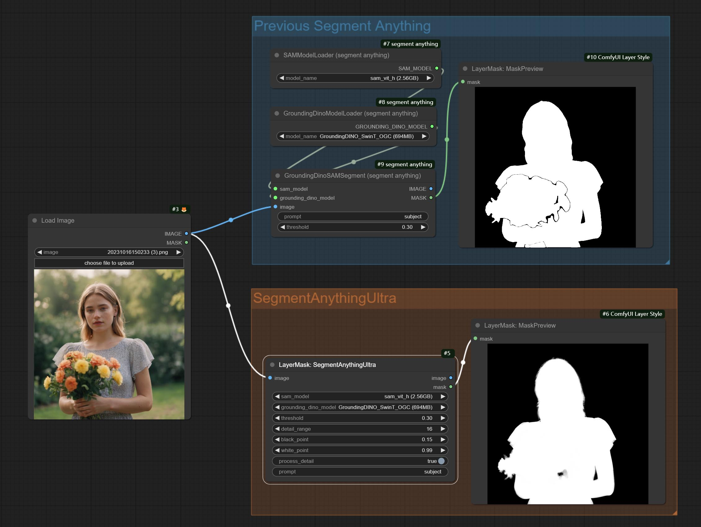    
  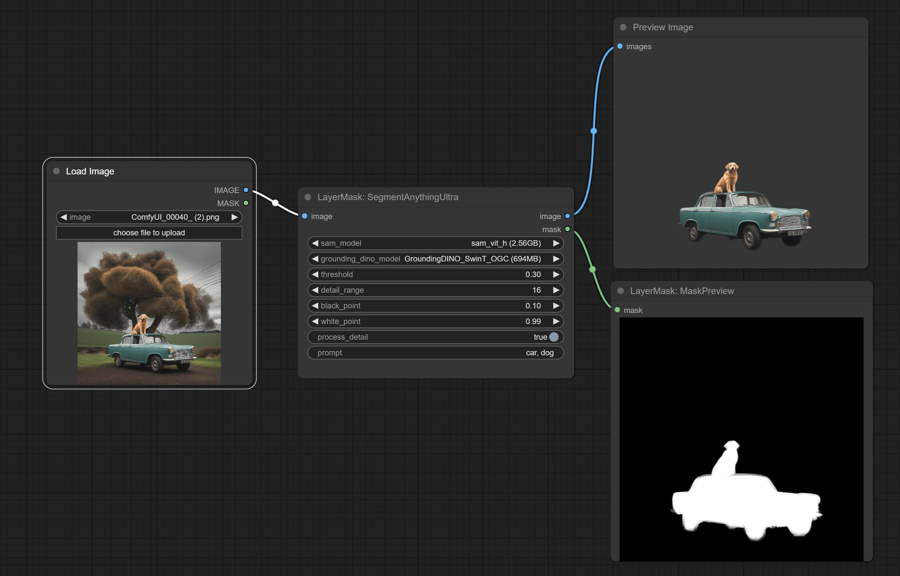    

Node options:  
    

* sam_model: Select the SAM model.
* ground_dino_model: Select the Grounding DINO model.
* threshold: The threshold of SAM.
* detail_range: Edge detail range.
* black_point: Edge black sampling threshold.
* white_point: Edge white sampling threshold.
* process_detail: Set to false here will skip edge processing to save runtime.
* prompt: Input for SAM's prompt.

### <a id="table1">SegmentAnythingUltraV2</a>

The V2 upgraded version of SegmentAnythingUltra has added the VITMatte edge processing method.(Note: Images larger than 2K in size using this method will consume huge memory) 
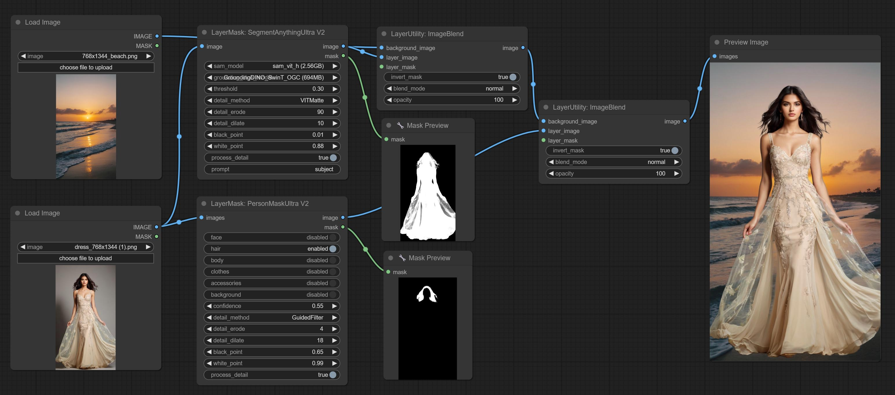    

On the basis of SegmentAnythingUltra, the following changes have been made: 
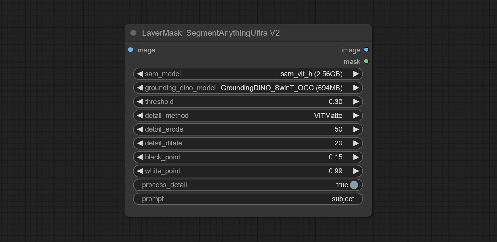    

* detail_method: Edge processing methods. provides VITMatte, VITMatte(local), PyMatting, GuidedFilter. If the model has been downloaded after the first use of VITMatte, you can use VITMatte (local) afterwards.
* detail_erode: Mask the erosion range inward from the edge. the larger the value, the larger the range of inward repair.
* detail_dilate: The edge of the mask expands outward. the larger the value, the wider the range of outward repair.
* device: Set whether the VitMatte to use cuda.
* max_megapixels: Set the maximum size for VitMate operations.

### <a id="table1">SAM2Ultra</a>

This node is modified from [kijai/ComfyUI-segment-anything-2](https://github.com/kijai/ComfyUI-segment-anything-2). Thank to [kijai](https://github.com/kijai) for making significant contributions to the Comfyui community.    
SAM2 Ultra node only support single image. If you need to process multiple images, please first convert the image batch to image list.    
*Download models from [BaiduNetdisk](https://pan.baidu.com/s/1xaQYBA6ktxvAxm310HXweQ?pwd=auki) or [huggingface.co/Kijai/sam2-safetensors](https://huggingface.co/Kijai/sam2-safetensors/tree/main) and copy to ```ComfyUI/models/sam2``` folder.

    

Node Options:  
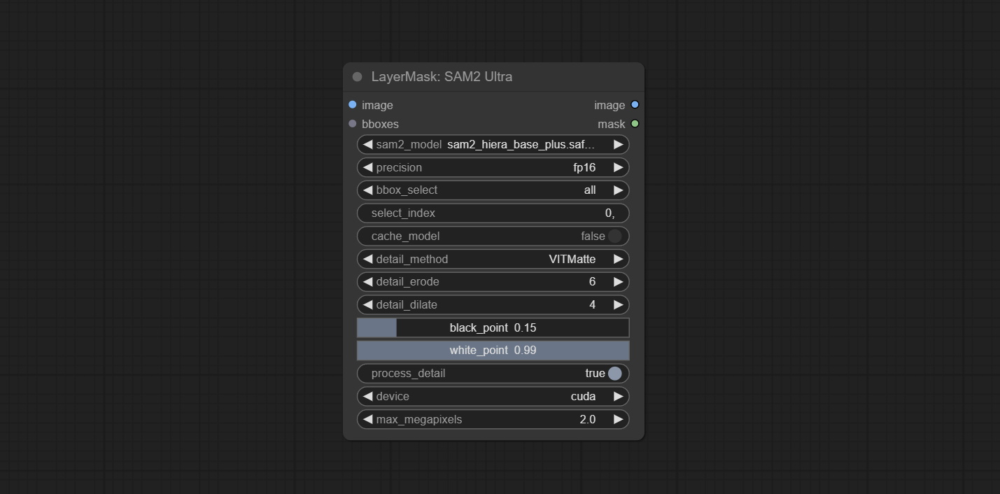    

* image: The image to segment.
* bboxes: Input recognition box data.
* sam2_model: Select the SAM2 model.
* presicion: Model's persicion. can be selected from fp16, bf16, and fp32.
* bbox_select: Select the input box data. There are three options: "all" to select all, "first" to select the box with the highest confidence, and "by_index" to specify the index of the box.
* select_index: This option is valid when bbox_delect is 'by_index'. 0 is the first one. Multiple values can be entered, separated by any non numeric character, including but not limited to commas, periods, semicolons, spaces or letters, and even Chinese.
* cache_model: Whether to cache the model. After caching the model, it will save time for model loading.
* detail_method: Edge processing methods. provides VITMatte, VITMatte(local), PyMatting, GuidedFilter. If the model has been downloaded after the first use of VITMatte, you can use VITMatte (local) afterwards.
* detail_erode: Mask the erosion range inward from the edge. the larger the value, the larger the range of inward repair.
* detail_dilate: The edge of the mask expands outward. the larger the value, the wider the range of outward repair.
* black_point: Edge black sampling threshold.
* white_point: Edge white sampling threshold.
* process_detail: Set to false here will skip edge processing to save runtime.
* device: Set whether the VitMatte to use cuda.
* max_megapixels: Set the maximum size for VitMate operations.

### <a id="table1">SAM2VideoUltra</a>

SAM2 Video Ultra node support processing multiple frames of images or video sequences. Please define the recognition box data in the first frame of the sequence to ensure correct recognition.

https://github.com/user-attachments/assets/4726b8bf-9b98-4630-8f54-cb7ed7a3d2c5

https://github.com/user-attachments/assets/b2a45c96-4be1-4470-8ceb-addaf301b0cb

Node Options:  
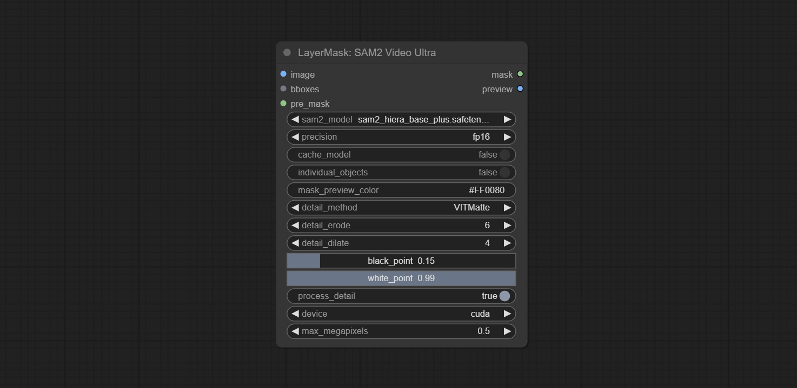    

* image: The image to segment.
* bboxes: Optional input of recognition bbox data. ```bboxes``` and ```first_frame_mask``` must have least one input. If first_frame_mask inputed, bbboxes will be ignored.
* first_frame_mask: Optional input of the first frame mask. The mask will be used as the first frame recognition object. ```bboxes``` and ```first_frame_mask``` must have least one input. If first_frame_mask inputed, bbboxes will be ignored.
* pre_mask: Optional input mask, which will serve as a propagation focus range limitation and help improve recognition accuracy.
* sam2_model: Select the SAM2 model.
* presicion: Model's persicion. can be selected from fp16 and bf16.
* cache_model: Whether to cache the model. After caching the model, it will save time for model loading.
* individual_object: When set to True, it will focus on identifying a single object. When set to False, attempts will be made to generate recognition boxes for multiple objects.
* mask_preview_color: Display the color of non masked areas in the preview output. 
* detail_method: Edge processing methods. Only VITMatte method can be used.
* detail_erode: Mask the erosion range inward from the edge. the larger the value, the larger the range of inward repair.
* detail_dilate: The edge of the mask expands outward. the larger the value, the wider the range of outward repair.
* black_point: Edge black sampling threshold.
* white_point: Edge white sampling threshold.
* process_detail: Set to false here will skip edge processing to save runtime.
* device: Only cuda can be used.
* max_megapixels: Set the maximum size for VitMate operations.A larger size will result in finer mask edges, but it will lead to a significant decrease in computation speed.

### <a id="table1">ObjectDetectorFL2</a>

Use the Florence2 model to identify objects in images and output recognition box data.    
*Download models from [BaiduNetdisk](https://pan.baidu.com/s/1hzw9-QiU1vB8pMbBgofZIA?pwd=mfl3) and copy to ```ComfyUI/models/florence2``` folder.

Node Options:  
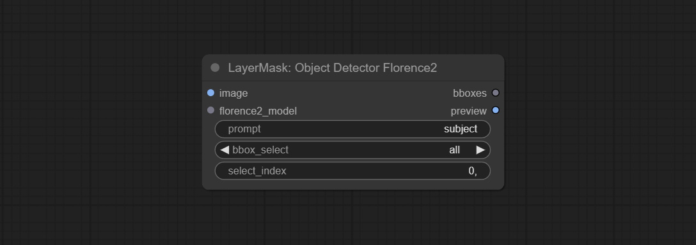    

* image: The image to segment.
* florence2_model: Florence2 model, it from [LoadFlorence2Model](#LoadFlorence2Model) node.
* prompt: Describe the object that needs to be identified. 
* sort_method: The selection box sorting method has 4 options: "left_to_right", "top_to_bottom", "big_to_small" and "confidence".
* bbox_select: Select the input box data. There are three options: "all" to select all, "first" to select the box with the highest confidence, and "by_index" to specify the index of the box.
* select_index: This option is valid when bbox_delect is 'by_index'. 0 is the first one. Multiple values can be entered, separated by any non numeric character, including but not limited to commas, periods, semicolons, spaces or letters, and even Chinese.

### <a id="table1">ObjectDetectorYOLOWorld</a>

Use the YOLO-World model to identify objects in images and output recognition box data.     
*Download models from [BaiduNetdisk](https://pan.baidu.com/s/1QpjajeTA37vEAU2OQnbDcQ?pwd=nqsk) or [GoogleDrive](https://drive.google.com/drive/folders/1nrsfq4S-yk9ewJgwrhXAoNVqIFLZ1at7?usp=sharing) and copy to ```ComfyUI/models/yolo-world``` folder.

Node Options:  
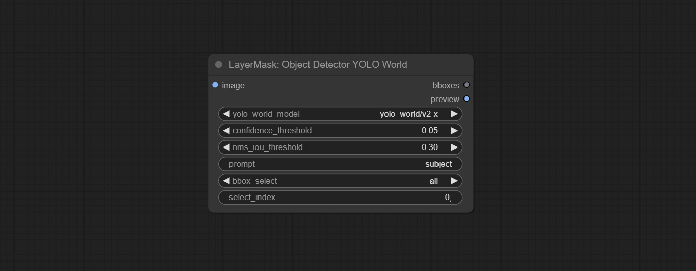    

* image: The image to segment.
* confidence_threshold: The threshold of confidence.
* nms_iou_threshold: The threshold of Non-Maximum Suppression.
* prompt: Describe the object that needs to be identified.
* sort_method: The selection box sorting method has 4 options: "left_to_right", "top_to_bottom", "big_to_small" and "confidence".
* bbox_select: Select the input box data. There are three options: "all" to select all, "first" to select the box with the highest confidence, and "by_index" to specify the index of the box.
* select_index: This option is valid when bbox_delect is 'by_index'. 0 is the first one. Multiple values can be entered, separated by any non numeric character, including but not limited to commas, periods, semicolons, spaces or letters, and even Chinese.

### <a id="table1">ObjectDetectorYOLO8</a>

Use the YOLO-8 model to identify objects in images and output recognition box data.    
*Download models from [GoogleDrive](https://drive.google.com/drive/folders/1I5TISO2G1ArSkKJu1O9b4Uvj3DVgn5d2) or [BaiduNetdisk](https://pan.baidu.com/s/1pEY6sjABQaPs6QtpK0q6XA?pwd=grqe)  and copy to ```ComfyUI/models/yolo``` folder.

Node Options:  
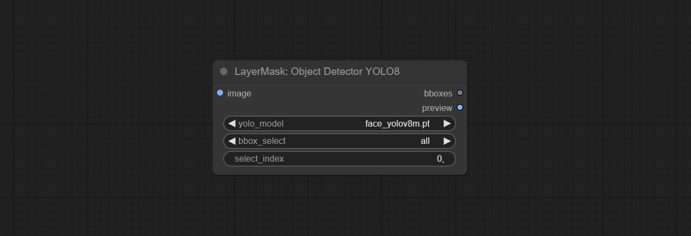

* image: The image to segment.
* yolo_model: Choose the yolo model.
* sort_method: The selection box sorting method has 4 options: "left_to_right", "top_to_bottom", "big_to_small" and "confidence".
* bbox_select: Select the input box data. There are three options: "all" to select all, "first" to select the box with the highest confidence, and "by_index" to specify the index of the box.
* select_index: This option is valid when bbox_delect is 'by_index'. 0 is the first one. Multiple values can be entered, separated by any non numeric character, including but not limited to commas, periods, semicolons, spaces or letters, and even Chinese.

### <a id="table1">ObjectDetectorMask</a>

Use mask as recognition box data. All areas surrounded by white areas on the mask will be recognized as an object. Multiple enclosed areas will be identified separately.   

Node Options:  
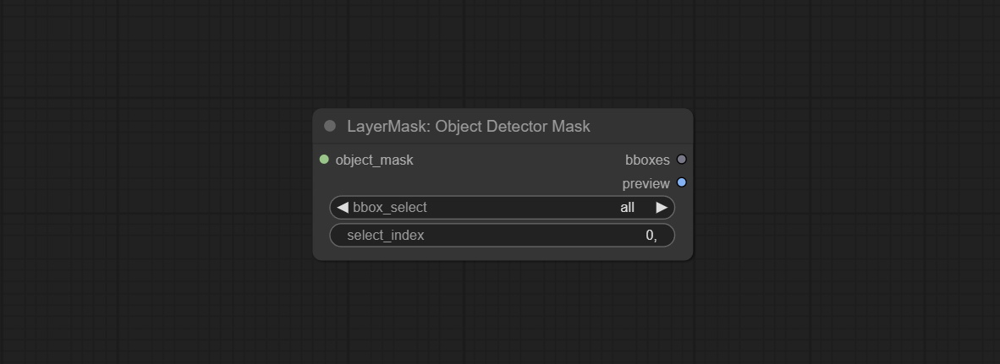

* object_mask: The mask input.
* sort_method: The selection box sorting method has 4 options: "left_to_right", "top_to_bottom", "big_to_small" and "confidence".
* bbox_select: Select the input box data. There are three options: "all" to select all, "first" to select the box with the highest confidence, and "by_index" to specify the index of the box.
* select_index: This option is valid when bbox_delect is 'by_index'. 0 is the first one. Multiple values can be entered, separated by any non numeric character, including but not limited to commas, periods, semicolons, spaces or letters, and even Chinese.

### <a id="table1">BBoxJoin</a>

Merge recognition box data.   

Node Options:  
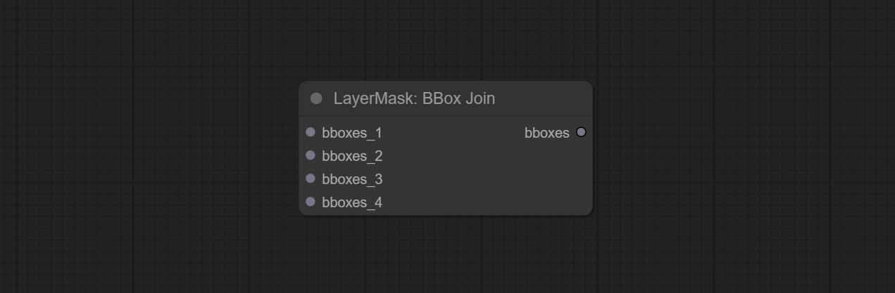

* bboxes_1: Required input. The first set of identification boxes.
* bboxes_2: Optional input. The second set of identification boxes.
* bboxes_3: Optional input. The third set of identification boxes.
* bboxes_4: Optional input. The fourth set of identification boxes.

### <a id="table1">DrawBBoxMask</a>

Draw the recognition BBoxes data output by the Object Detector node as a mask.     
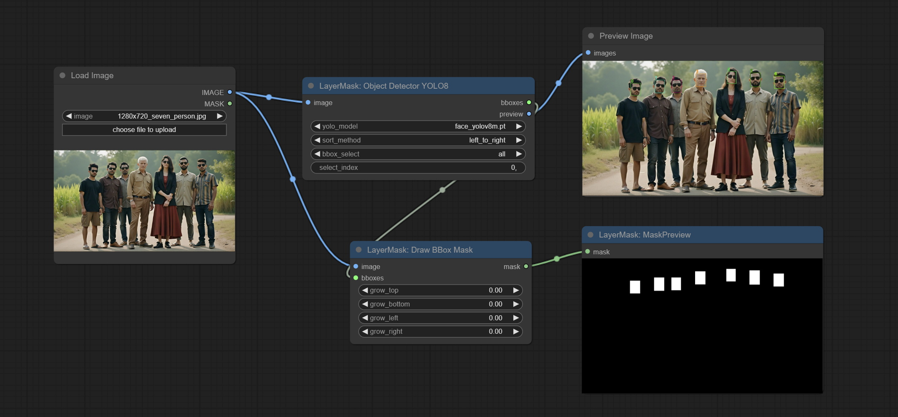

Node Options:  
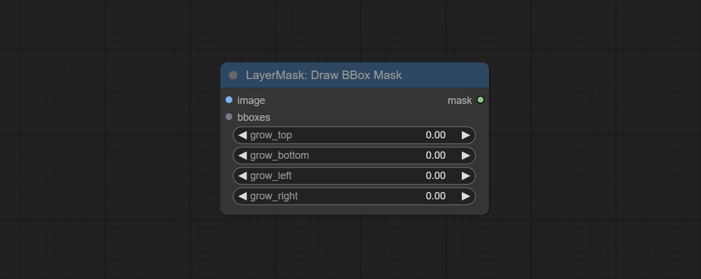

* image: Image input. It must be consistent with the image recognized by the Object Detector node.  
* bboxes: Input recognition BBoxes data.
* grow_top: Each BBox expands upwards as a percentage of its height, positive values indicate upward expansion and negative values indicate downward expansion.
* grow_bottom: Each BBox expands downwards as a percentage of its height, positive values indicating downward expansion and negative values indicating upward expansion.
* grow_left: Each BBox expands to the left as a percentage of its width, positive values expand to the left and negative values expand to the right.
* grow_right: Each BBox expands to the right as a percentage of its width, positive values indicate expansion to the right and negative values indicate expansion to the left.

### <a id="table1">EVF-SAMUltra</a>

This node is implementation of [EVF-SAM](https://github.com/hustvl/EVF-SAM) in ComfyUI.     
*Please download model files from [BaiduNetdisk](https://pan.baidu.com/s/1EvaxgKcCxUpMbYKzLnEx9w?pwd=69bn) or [huggingface/EVF-SAM2](https://huggingface.co/YxZhang/evf-sam2/tree/main), [huggingface/EVF-SAM](https://huggingface.co/YxZhang/evf-sam/tree/main) to ```ComfyUI/models/EVF-SAM``` folder(save the models in their respective subdirectories).
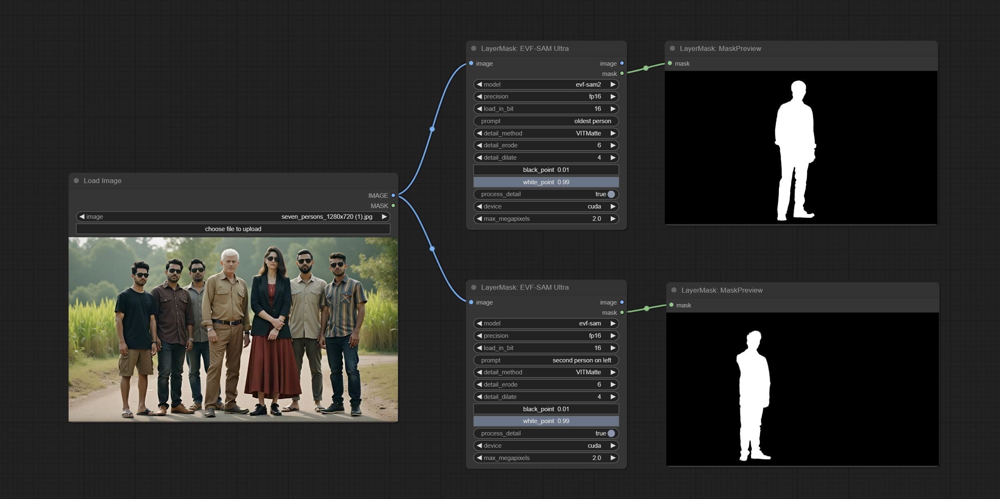    

Node Options:  
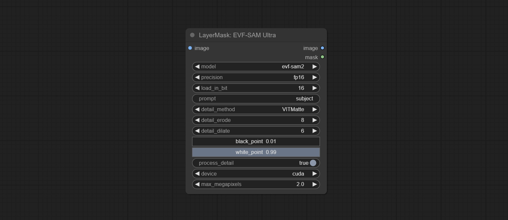    

* image: The input image.
* model: Select the model. Currently, there are options for evf-sam2 and evf sam.
* presicion: Model accuracy can be selected from fp16, bf16, and fp32.
* load_in_bit: Load the model with positional accuracy. You can choose from full, 8, and 4.
* pormpt: Prompt words used for segmentation.
* detail_method: Edge processing methods. provides VITMatte, VITMatte(local), PyMatting, GuidedFilter. If the model has been downloaded after the first use of VITMatte, you can use VITMatte (local) afterwards.
* detail_erode: Mask the erosion range inward from the edge. the larger the value, the larger the range of inward repair.
* detail_dilate: The edge of the mask expands outward. the larger the value, the wider the range of outward repair.
* black_point: Edge black sampling threshold.
* white_point: Edge white sampling threshold.
* process_detail: Set to false here will skip edge processing to save runtime.
* device: Set whether the VitMatte to use cuda.
* max_megapixels: Set the maximum size for VitMate operations.

### <a id="table1">Florence2Ultra</a>

Using the segmentation function of the Florence2 model, while also having ultra-high edge details.
The code for this node section is from [spacepxl/ComfyUI-Florence-2](https://github.com/spacepxl/ComfyUI-Florence-2), thanks to the original author.
*Download the model files from [BaiduNetdisk](https://pan.baidu.com/s/1hzw9-QiU1vB8pMbBgofZIA?pwd=mfl3) to ```ComfyUI/models/florence2``` folder.

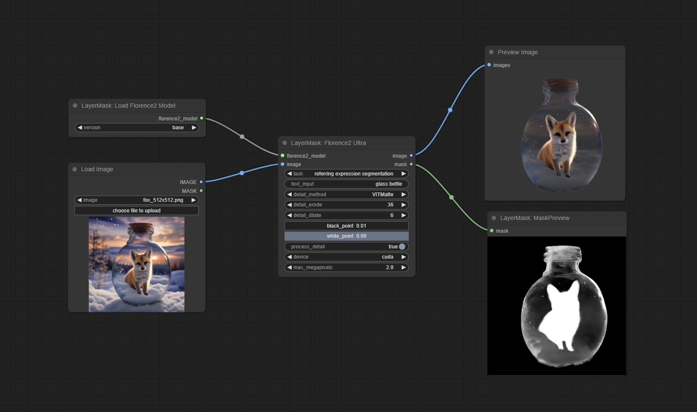    

Node Options:  
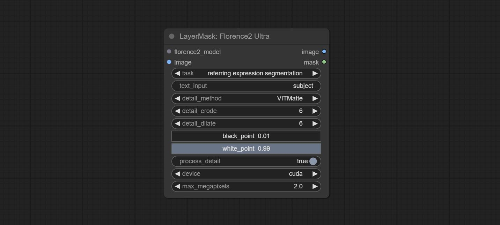    

* florence2_model: Florence2 model input.
* image: Image input.
* task: Select the task for florence2.
* text_input: Text input for florence2.
* detail_method: Edge processing methods. provides VITMatte, VITMatte(local), PyMatting, GuidedFilter. If the model has been downloaded after the first use of VITMatte, you can use VITMatte (local) afterwards.
* detail_erode: Mask the erosion range inward from the edge. the larger the value, the larger the range of inward repair.
* detail_dilate: The edge of the mask expands outward. the larger the value, the wider the range of outward repair.
* black_point: Edge black sampling threshold.
* white_point: Edge white sampling threshold.
* process_detail: Set to false here will skip edge processing to save runtime.
* device: Set whether the VitMatte to use cuda.
* max_megapixels: Set the maximum size for VitMate operations.

### <a id="table1">LoadFlorence2Model</a>

Florence2 model loader.
*When using it for the first time, the model will be automatically downloaded.

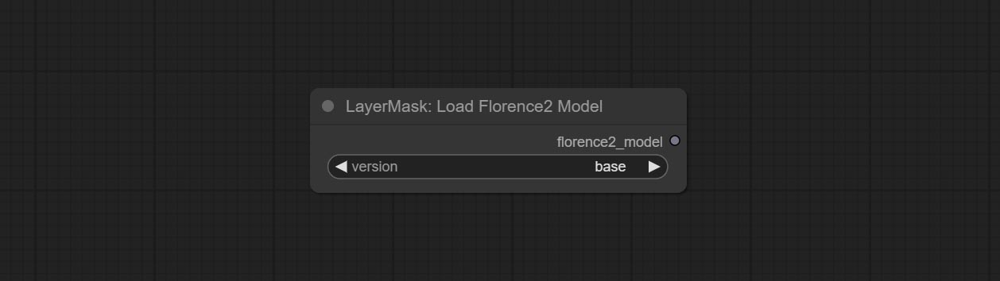   
At present, there are base, base-ft, large, large-ft, DocVQA, SD3-Captioner and base-PromptGen models to choose from.

### <a id="table1">RemBgUltra</a>

Remove background. compared to the similar background removal nodes, this node has ultra-high edge details.

This node combines the Alpha Matte node of Spacepxl's [ComfyUI-Image-Filters](https://github.com/spacepxl/ComfyUI-Image-Filters) and the functionality of ZHO-ZHO-ZHO's [ComfyUI-BRIA_AI-RMBG](https://github.com/ZHO-ZHO-ZHO/ComfyUI-BRIA_AI-RMBG), thanks to the original author.

*Download model files from [BRIA Background Removal v1.4](https://huggingface.co/briaai/RMBG-1.4) or [BaiduNetdisk](https://pan.baidu.com/s/16PMfjpkXn_35T-cVYEPTZA?pwd=qi6o) to ```ComfyUI/models/rmbg/RMBG-1.4``` folder. This model can be used for non-commercial purposes.    

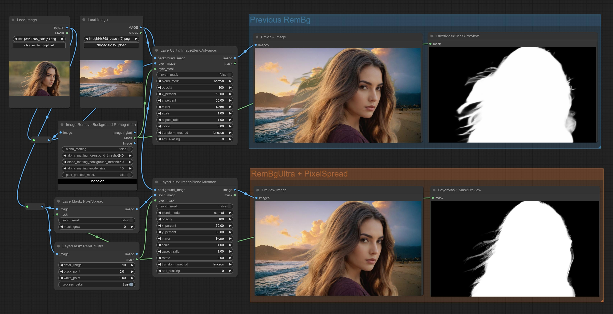    

Node options:  
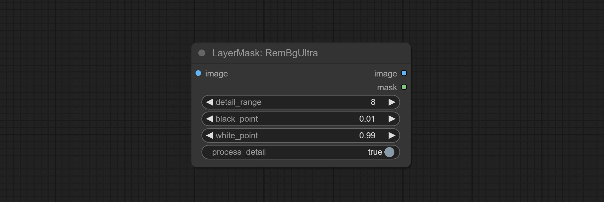    

* detail_range: Edge detail range.
* black_point: Edge black sampling threshold.
* white_point: Edge white sampling threshold.
* process_detail: Set to false here will skip edge processing to save runtime.

### <a id="table1">RmBgUltraV2</a>

The V2 upgraded version of RemBgUltra has added the VITMatte edge processing method.(Note: Images larger than 2K in size using this method will consume huge memory) 

On the basis of RemBgUltra, the following changes have been made: 
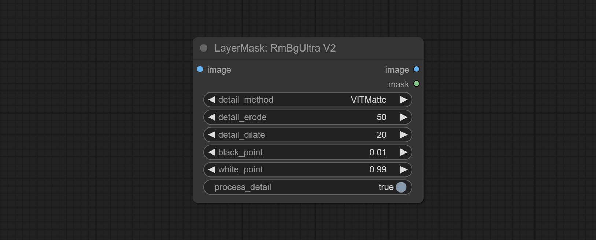    

* detail_method: Edge processing methods. provides VITMatte, VITMatte(local), PyMatting, GuidedFilter. If the model has been downloaded after the first use of VITMatte, you can use VITMatte (local) afterwards.
* detail_erode: Mask the erosion range inward from the edge. the larger the value, the larger the range of inward repair.
* detail_dilate: The edge of the mask expands outward. the larger the value, the wider the range of outward repair.
* device: Set whether the VitMatte to use cuda.
* max_megapixels: Set the maximum size for VitMate operations.

### <a id="table1">BiRefNetUltra</a>

Using the BiRefNet model to remove background has better recognition ability and ultra-high edge details.
The code for the model part of this node comes from Viper's [ComfyUI-BiRefNet](https://github.com/viperyl/ComfyUI-BiRefNet)，thanks to the original author.

*From [https://huggingface.co/ViperYX/BiRefNet](https://huggingface.co/ViperYX/BiRefNet/tree/main) or [BaiduNetdisk](https://pan.baidu.com/s/1GxtuNDTIHkuu4FR4uGAT-g?pwd=t2cf) download the ```BiRefNet-ep480.pth```,```pvt_v2_b2.pth```,```pvt_v2_b5.pth```,```swin_base_patch4_window12_384_22kto1k.pth```, ```swin_large_patch4_window12_384_22kto1k.pth``` 5 files to ```ComfyUI/models/BiRefNet``` folder.

    

Node options:  
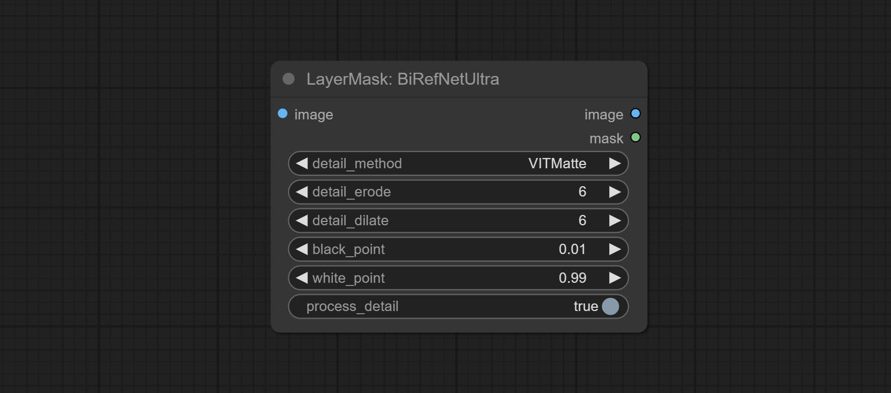    

* detail_method: Edge processing methods. provides VITMatte, VITMatte(local), PyMatting, GuidedFilter. If the model has been downloaded after the first use of VITMatte, you can use VITMatte (local) afterwards.
* detail_erode: Mask the erosion range inward from the edge. the larger the value, the larger the range of inward repair.
* detail_dilate: The edge of the mask expands outward. the larger the value, the wider the range of outward repair.
* black_point: Edge black sampling threshold.
* white_point: Edge white sampling threshold.
* process_detail: Set to false here will skip edge processing to save runtime.
* device: Set whether the VitMatte to use cuda.
* max_megapixels: Set the maximum size for VitMate operations.

### <a id="table1">BiRefNetUltraV2</a>

This node supports the use of the latest BiRefNet model. 
*Download model file from [BaiduNetdisk](https://pan.baidu.com/s/12z3qUuqag3nqpN2NJ5pSzg?pwd=ek65) or [GoogleDrive](https://drive.google.com/drive/folders/1s2Xe0cjq-2ctnJBR24563yMSCOu4CcxM) named ```BiRefNet-general-epoch_244.pth``` to ```ComfyUI/Models/BiRefNet/pth``` folder. You can also download more BiRefNet models and put them here.

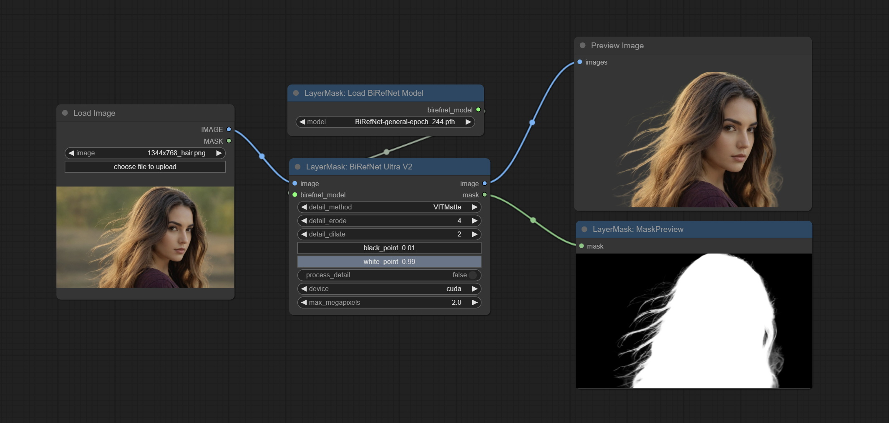    

Node Options:  
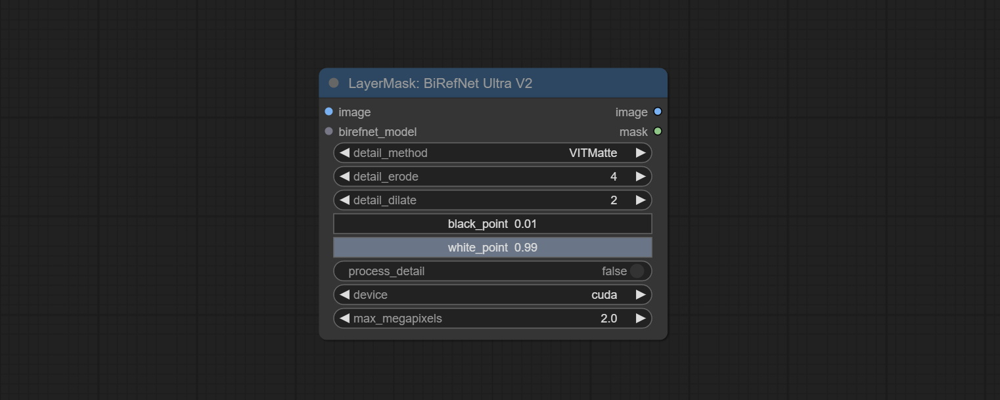  

* image: The input image.
* birefnet_model: The BiRefNet model is input and it is output from the LoadBiRefNetModel node.
* detail_method: Edge processing methods. provides VITMatte, VITMatte(local), PyMatting, GuidedFilter. If the model has been downloaded after the first use of VITMatte, you can use VITMatte (local) afterwards.
* detail_erode: Mask the erosion range inward from the edge. the larger the value, the larger the range of inward repair.
* detail_dilate: The edge of the mask expands outward. the larger the value, the wider the range of outward repair.
* black_point: Edge black sampling threshold.
* white_point: Edge white sampling threshold.
* process_detail: Due to the excellent edge processing of BiRefNet, it is set to False by default here.
* device: Set whether the VitMatte to use cuda.
* max_megapixels: Set the maximum size for VitMate operations.

### <a id="table1">LoadBiRefNetModel</a>

Load the BiRefNet model.

Node Options:  
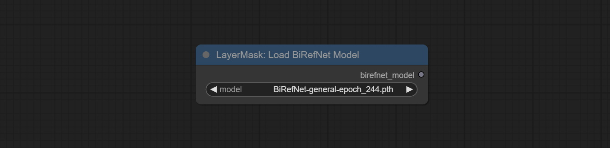  

* model: Select the model. List the files in the  ```CoomfyUI/models/BiRefNet/pth```  folder for selection.

### <a id="table1">TransparentBackgroundUltra</a>

Using the transparent-background model to remove background has better recognition ability and speed, while also having ultra-high edge details.

*From [googledrive](https://drive.google.com/drive/folders/10KBDY19egb8qEQBv34cqIVSwd38bUAa9?usp=sharing) or  [BaiduNetdisk](https://pan.baidu.com/s/10JO0uKzTxJaIkhN_J7RSyw?pwd=v0b0)  download all files to ```ComfyUI/models/transparent-background``` folder.

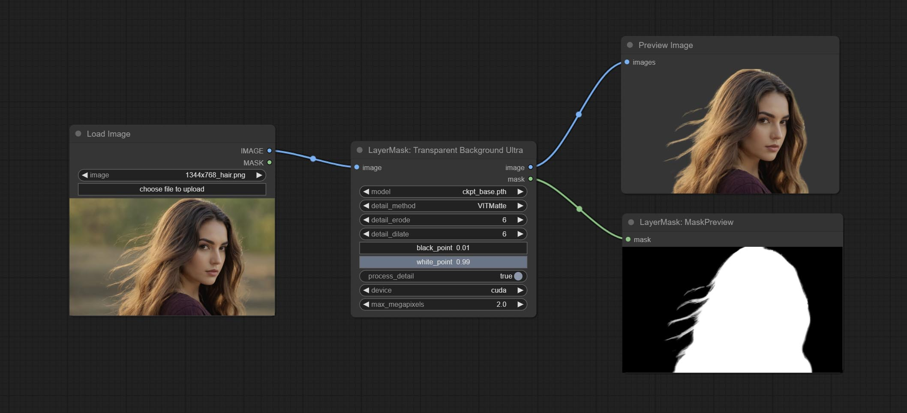    

Node Options:  
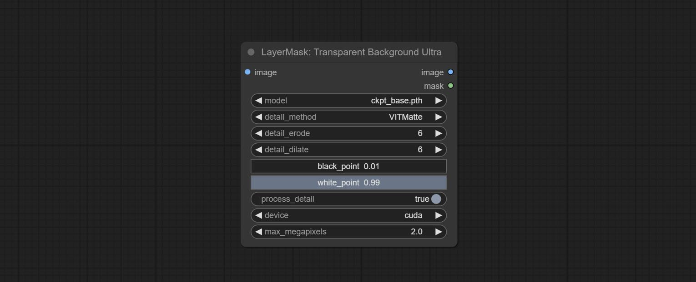    

* model: Select the model.
* detail_method: Edge processing methods. provides VITMatte, VITMatte(local), PyMatting, GuidedFilter. If the model has been downloaded after the first use of VITMatte, you can use VITMatte (local) afterwards.
* detail_erode: Mask the erosion range inward from the edge. the larger the value, the larger the range of inward repair.
* detail_dilate: The edge of the mask expands outward. the larger the value, the wider the range of outward repair.
* black_point: Edge black sampling threshold.
* white_point: Edge white sampling threshold.
* process_detail: Set to false here will skip edge processing to save runtime.
* device: Set whether the VitMatte to use cuda.
* max_megapixels: Set the maximum size for VitMate operations.

### <a id="table1">PersonMaskUltra</a>

Generate masks for portrait's face, hair, body skin, clothing, or accessories. Compared to the previous A Person Mask Generator node, this node has ultra-high edge details.
The model code for this node comes from [a-person-mask-generator](https://github.com/djbielejeski/a-person-mask-generator)， edge processing code from [ComfyUI-Image-Filters](https://github.com/spacepxl/ComfyUI-Image-Filters)，thanks to the original author.
*Download model files from [BaiduNetdisk](https://pan.baidu.com/s/13zqZtBt89ueCyFufzUlcDg?pwd=jh5g) to ```ComfyUI/models/mediapipe``` folder.

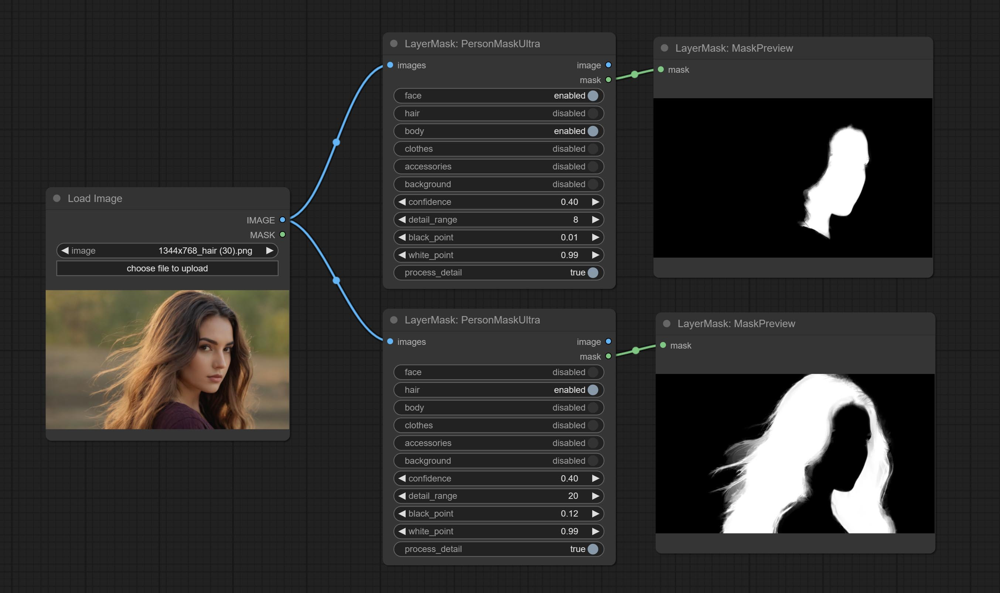    

Node options:  
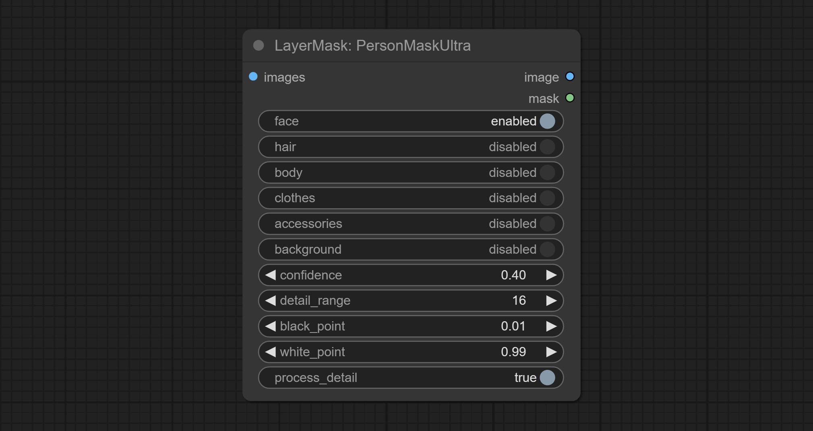    

* face: Face recognition.
* hair: Hair recognition.
* body: Body skin recognition.
* clothes: Clothing recognition.
* accessories: Identification of accessories (such as backpacks).
* background: Background recognition.
* confidence: Recognition threshold, lower values will output more mask ranges.
* detail_range: Edge detail range.
* black_point: Edge black sampling threshold.
* white_point: Edge white sampling threshold.
* process_detail: Set to false here will skip edge processing to save runtime.

### <a id="table1">PersonMaskUltraV2</a>

The V2 upgraded version of PersonMaskUltra has added the VITMatte edge processing method.(Note: Images larger than 2K in size using this method will consume huge memory) 

On the basis of PersonMaskUltra, the following changes have been made: 
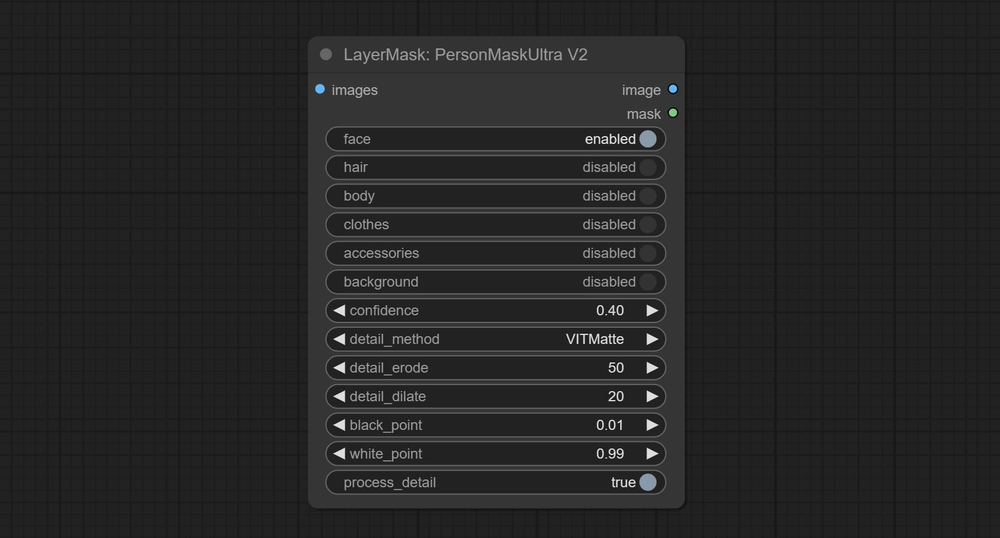    

* detail_method: Edge processing methods. provides VITMatte, VITMatte(local), PyMatting, GuidedFilter. If the model has been downloaded after the first use of VITMatte, you can use VITMatte (local) afterwards.
* detail_erode: Mask the erosion range inward from the edge. the larger the value, the larger the range of inward repair.
* detail_dilate: The edge of the mask expands outward. the larger the value, the wider the range of outward repair.
* device: Set whether the VitMatte to use cuda.
* max_megapixels: Set the maximum size for VitMate operations.
* ### <a id="table1">SegformerB2ClothesUltra</a>
  
  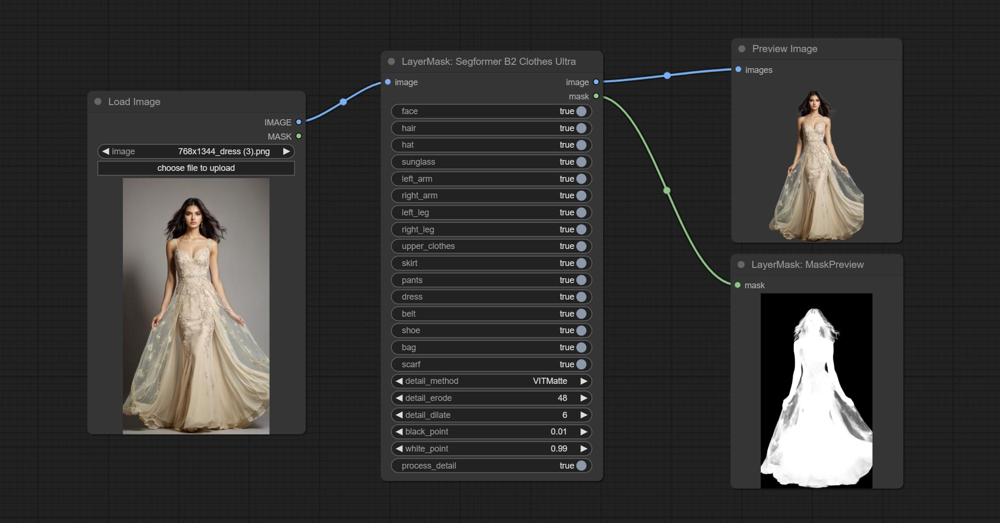   
  Generate masks for characters' faces, hair, arms, legs, and clothing, mainly used for segmenting clothing.
  The model segmentation code is from[StartHua](https://github.com/StartHua/Comfyui_segformer_b2_clothes)，thanks to the original author.
  Compared to the comfyui_segformer_b2_clothes, this node has ultra-high edge details. (Note: Generating images with edges exceeding 2K in size using the VITMatte method will consume a lot of memory)    

*Download all model files from [huggingface](https://huggingface.co/mattmdjaga/segformer_b2_clothes/tree/main) or [BaiduNetdisk](https://pan.baidu.com/s/1OK-HfCNyZWux5iQFANq9Rw?pwd=haxg)  to  ```ComfyUI/models/segformer_b2_clothes``` folder.

Node Options:  
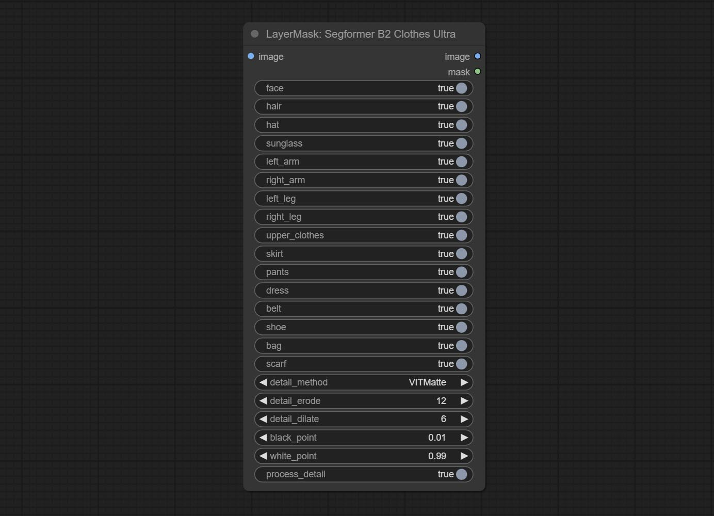    

* face: Facial recognition switch.
* hair: Hair recognition switch.
* hat: Hat recognition switch.
* sunglass: Sunglass recognition switch.
* left_arm: Left arm recognition switch.
* right_arm: Right arm recognition switch.
* left_leg: Left leg recognition switch.
* right_leg: Right leg recognition switch.
* skirt: Skirt recognition switch.
* pants: Pants recognition switch.
* dress: Dress recognition switch.
* belt: Belt recognition switch.
* shoe: Shoes recognition switch.
* bag: Bag recognition switch.
* scarf: Scarf recognition switch.
* detail_method: Edge processing methods. provides VITMatte, VITMatte(local), PyMatting, GuidedFilter. If the model has been downloaded after the first use of VITMatte, you can use VITMatte (local) afterwards.
* detail_erode: Mask the erosion range inward from the edge. the larger the value, the larger the range of inward repair.
* detail_dilate: The edge of the mask expands outward. the larger the value, the wider the range of outward repair.
* black_point: Edge black sampling threshold.
* white_point: Edge white sampling threshold.
* process_detail: Set to false here will skip edge processing to save runtime.
* device: Set whether the VitMatte to use cuda.
* max_megapixels: Set the maximum size for VitMate operations.

### <a id="table1">SegformerUltraV2</a>

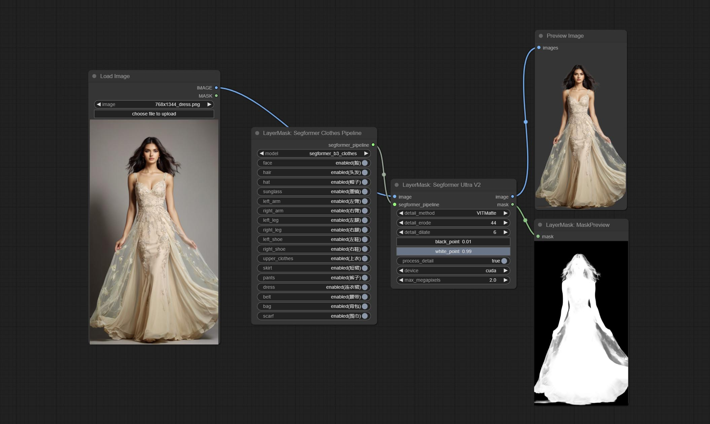   
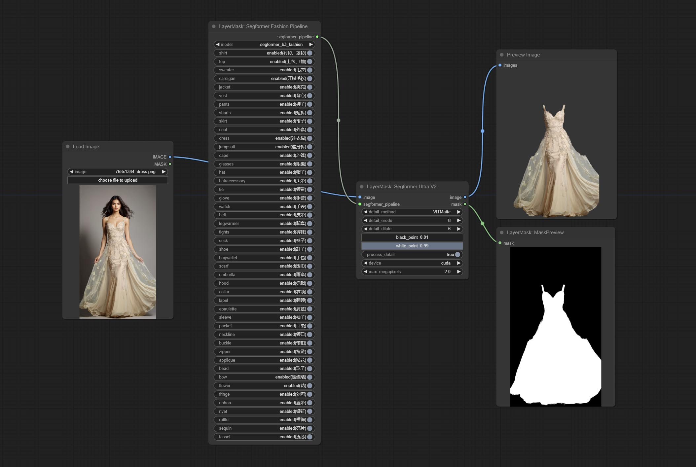   
Using the segformer model to segment clothing with ultra-high edge details. Currently supports segformer b2 clothes, segformer b3 clothes and segformer b3 fashion。

*Download modelfiles from [huggingface](https://huggingface.co/mattmdjaga/segformer_b2_clothes/tree/main) or [百度网盘](https://pan.baidu.com/s/1OK-HfCNyZWux5iQFANq9Rw?pwd=haxg) to ```ComfyUI/models/segformer_b2_clothes``` folder.         
*Download modelfiles from [huggingface](https://huggingface.co/sayeed99/segformer_b3_clothes/tree/main) or [百度网盘](https://pan.baidu.com/s/18KrCqNqUwmoJlqgAGDTw9g?pwd=ap4z) to ```ComfyUI/models/segformer_b3_clothes``` folder.    
*Download modelfiles from [huggingface](https://huggingface.co/sayeed99/segformer-b3-fashion/tree/main) or [百度网盘](https://pan.baidu.com/s/10vd5PmJLFNWXaRVGW6tSvA?pwd=xzqi) to ```ComfyUI/models/segformer_b3_fashion``` folder. 

Node Options:  
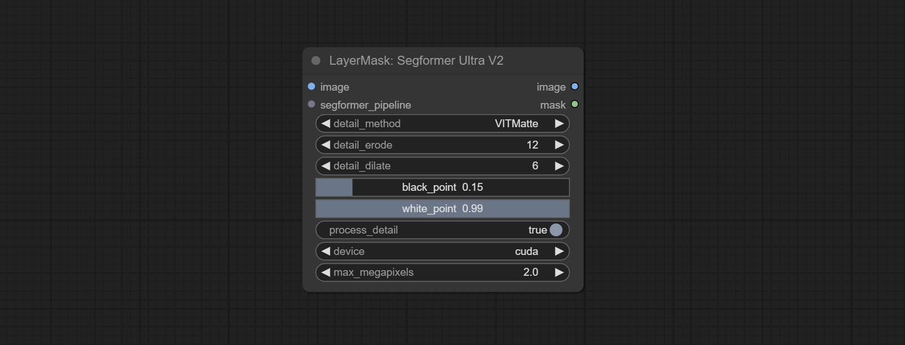    

* image: The input image.
* segformer_pipeline: Segformer pipeline input. The pipeline is output by SegformerClottesPipeline and SegformerFashionPipeline node.
* detail_method: Edge processing methods. provides VITMatte, VITMatte(local), PyMatting, GuidedFilter. If the model has been downloaded after the first use of VITMatte, you can use VITMatte (local) afterwards.
* detail_erode: Mask the erosion range inward from the edge. the larger the value, the larger the range of inward repair.
* detail_dilate: The edge of the mask expands outward. the larger the value, the wider the range of outward repair.
* black_point: Edge black sampling threshold.
* white_point: Edge white sampling threshold.
* process_detail: Set to false here will skip edge processing to save runtime.
* device: Set whether the VitMatte to use cuda.
* max_megapixels: Set the maximum size for VitMate operations.

### <a id="table1">SegformerClothesPipiline</a>

Select the segformer clothes model and choose the segmentation content.  

Node Options:  
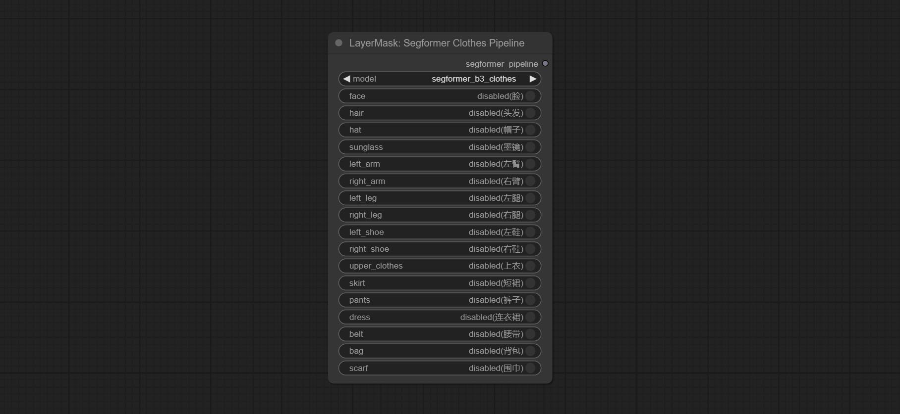    

* model: Model selection. There are currently two models available to choose from for segformer b2 clothes and segformer b3 clothes.
* face: Facial recognition switch.
* hair: Hair recognition switch.
* hat: Hat recognition switch.
* sunglass: Sunglass recognition switch.
* left_arm: Left arm recognition switch.
* right_arm: Right arm recognition switch.
* left_leg: Left leg recognition switch.
* right_leg: Right leg recognition switch.
* left_shoe: Left shoe recognition switch.
* right_shoe: Right shoe recognition switch.
* skirt: Skirt recognition switch.
* pants: Pants recognition switch.
* dress: Dress recognition switch.
* belt: Belt recognition switch.
* bag: Bag recognition switch.
* scarf: Scarf recognition switch.

### <a id="table1">SegformerFashionPipiline</a>

Select the segformer fashion model and choose the segmentation content.

Node Options:  
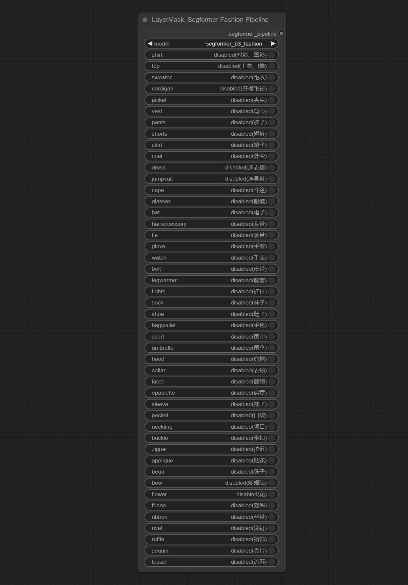    

* model: Model selection. Currently, there is only one model available for selection: segformer b3 fashion。
* shirt: shirt and blouse switch.
* top: top, t-shirt, sweatshirt switch.
* sweater: sweater switch.
* cardigan: cardigan switch.
* jacket: jacket switch.
* vest: vest switch.
* pants: pants switch.
* shorts: shorts switch.
* skirt: skirt switch.
* coat: coat switch.
* dress: dress switch.
* jumpsuit: jumpsuit switch.
* cape: cape switch.
* glasses: glasses switch.
* hat: hat switch.
* hairaccessory: headband, head covering, hair accessory switch.
* tie: tie switch.
* glove: glove switch.
* watch: watch switch.
* belt: belt switch.
* legwarmer: leg warmer switch.
* tights: tights and stockings switch.
* sock: sock switch.
* shoe: shoes switch.
* bagwallet: bag and wallet switch.
* scarf: scarf switch.
* umbrella: umbrella switch.
* hood: hood switch.
* collar: collar switch.
* lapel: lapel switch.
* epaulette: epaulette switch.
* sleeve: sleeve switch.
* pocket: pocket switch.
* neckline: neckline switch.
* buckle: buckle switch.
* zipper: zipper switch.
* applique: applique switch.
* bead: bead switch.
* bow: bow switch.
* flower: flower switch.
* fringe: fringe switch.
* ribbon: ribbon switch.
* rivet: rivet switch.
* ruffle: ruffle switch.
* sequin: sequin switch.
* tassel: tassel switch.

### <a id="table1">HumanPartsUltra</a>

Used for generate human body parts masks, it is based on the warrper of [metal3d/ComfyUI_Human_Parts](https://github.com/metal3d/ComfyUI_Human_Parts), thank the original author.
This node has added ultra-fine edge processing based on the original work. Download model file from [BaiduNetdisk](https://pan.baidu.com/s/1-6uwH6RB0FhIVfa3qO7hhQ?pwd=d862) or [huggingface](https://huggingface.co/Metal3d/deeplabv3p-resnet50-human/tree/main) and copy to ```ComfyUI\models\onnx\human-parts``` folder.
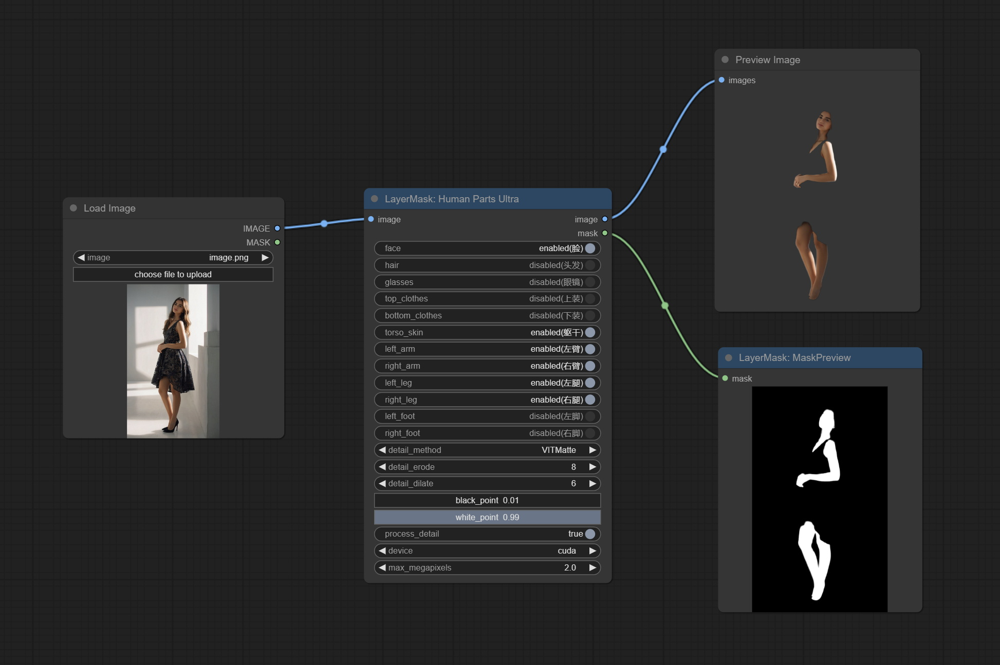    

Node Options:  
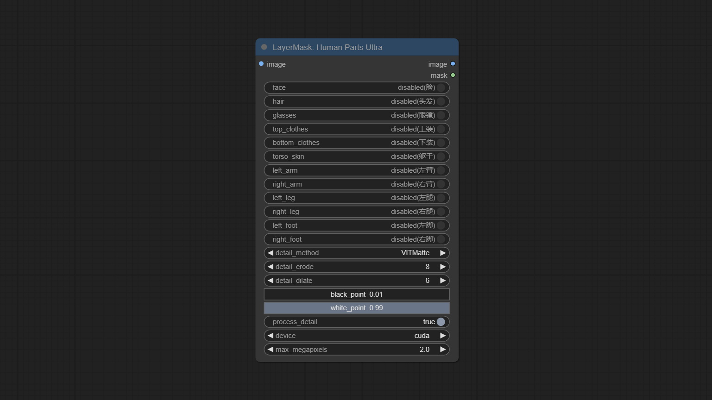    

* image: The input image.
* face: Recognize face switch.
* hair: Recognize hair switch.
* galsses: Recognize glasses switch.
* top_clothes: Recognize top clothes switch.
* bottom_clothes: Recognize bottom clothes switch.
* torso_skin: Recognize torso skin switch.
* left_arm: Recognize left arm switch.
* right_arm: Recognize right arm switch.
* left_leg: Recognize left leg switch.
* right_leg: Recognize right leg switch.
* left_foot: Recognize left foot switch.
* right_foot: Recognize right foot switch.
* detail_method: Edge processing methods. provides VITMatte, VITMatte(local), PyMatting, GuidedFilter. If the model has been downloaded after the first use of VITMatte, you can use VITMatte (local) afterwards.
* detail_erode: Mask the erosion range inward from the edge. the larger the value, the larger the range of inward repair.
* detail_dilate: The edge of the mask expands outward. the larger the value, the wider the range of outward repair.
* black_point: Edge black sampling threshold.
* white_point: Edge white sampling threshold.
* process_detail: Set to false here will skip edge processing to save runtime.
* device: Set whether the VitMatte to use cuda.
* max_megapixels: Set the maximum size for VitMate operations.

### <a id="table1">MaskEdgeUltraDetail</a>

Process rough masks to ultra fine edges.
This node combines the Alpha Matte and the Guided Filter Alpha nodes functions of Spacepxl's [ComfyUI-Image-Filters](https://github.com/spacepxl/ComfyUI-Image-Filters), thanks to the original author.
    

Node options:  
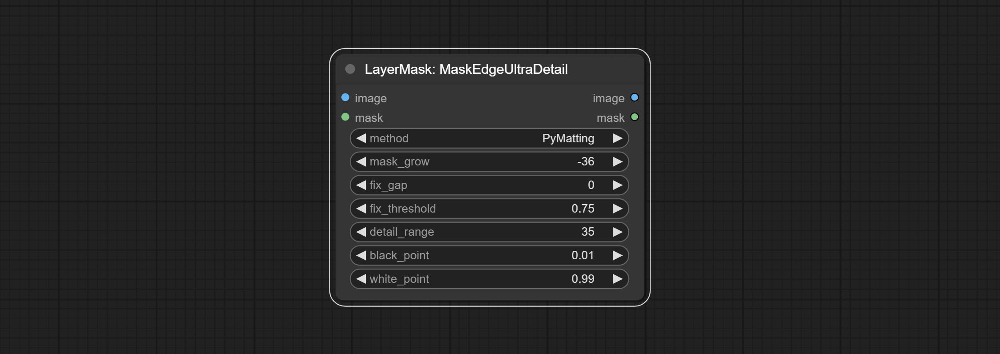    

* method: Provide two methods for edge processing: PyMatting and OpenCV-GuidedFilter. PyMatching has a slower processing speed, but for video, it is recommended to use this method to obtain smoother mask sequences.
* mask_grow: Mask expansion amplitude. positive values expand outward, while negative values contract inward. For rougher masks, negative values are usually used to shrink their edges for better results.
* fix_gap: Repair the gaps in the mask. if obvious gaps in the mask, increase this value appropriately.
* fix_threshold: The threshold of fix_gap.
* detail_range: Edge detail range.
* black_point: Edge black sampling threshold.
* white_point: Edge white sampling threshold.

### <a id="table1">MaskEdgeUltraDetailV2</a>

The V2 upgraded version of MaskEdgeUltraDetail has added the VITMatte edge processing method.(Note: Images larger than 2K in size using this method will consume huge memory)    
This method is suitable for handling semi transparent areas. 

On the basis of MaskEdgeUltraDetail, the following changes have been made: 
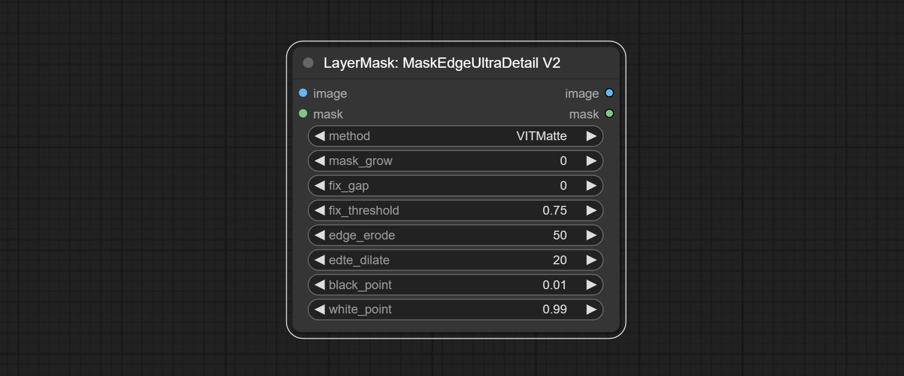    

* method: Edge processing methods. provides VITMatte, VITMatte(local), PyMatting, GuidedFilter. If the model has been downloaded after the first use of VITMatte, you can use VITMatte (local) afterwards.
* edge_erode: Mask the erosion range inward from the edge. the larger the value, the larger the range of inward repair.
* edge_dilate: The edge of the mask expands outward. the larger the value, the wider the range of outward repair.
* device: Set whether the VitMatte to use cuda.
* max_megapixels: Set the maximum size for VitMate operations.

### <a id="table1">YoloV8Detect</a>

Use the YoloV8 model to detect faces, hand box areas, or character segmentation. Supports the output of the selected number of channels.
Download the model files from [GoogleDrive](https://drive.google.com/drive/folders/1I5TISO2G1ArSkKJu1O9b4Uvj3DVgn5d2) or [BaiduNetdisk](https://pan.baidu.com/s/1pEY6sjABQaPs6QtpK0q6XA?pwd=grqe) to ```ComfyUI/models/yolo``` folder.

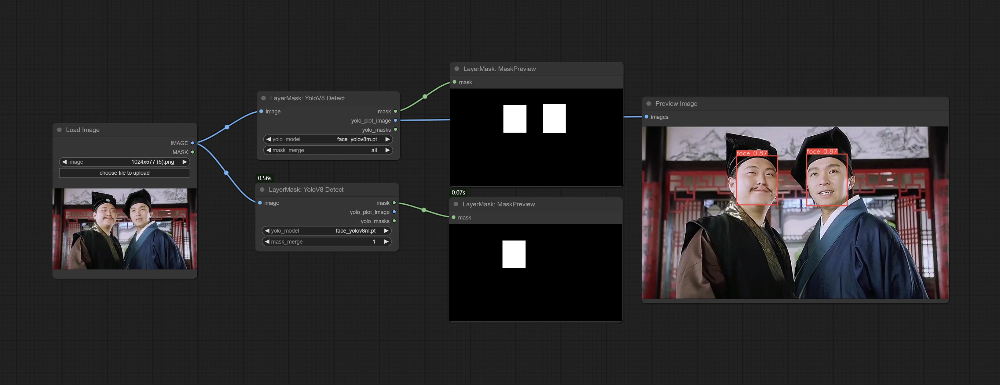    

Node Options:  
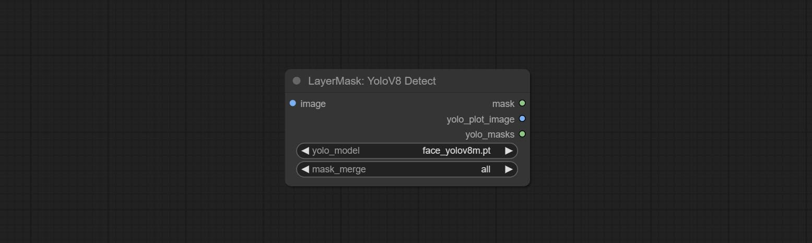    

* yolo_model: Yolo model selection. the model with ```seg``` name can output segmented masks, otherwise they can only output box masks.
* mask_merge: Select the merged mask. ```all``` is to merge all mask outputs. The selected number is how many masks to output, sorted by recognition confidence to merge the output.

Outputs:

* mask: The output mask.
* yolo_plot_image: Preview of yolo recognition results.
* yolo_masks: For all masks identified by yolo, each individual mask is output as a mask.

### <a id="table1">MediapipeFacialSegment</a>

Use the Mediapipe model to detect facial features, segment left and right eyebrows, eyes, lips, and tooth.
*Download the model files from [BaiduNetdisk](https://pan.baidu.com/s/13zqZtBt89ueCyFufzUlcDg?pwd=jh5g) to ```ComfyUI/models/mediapipe``` folder.

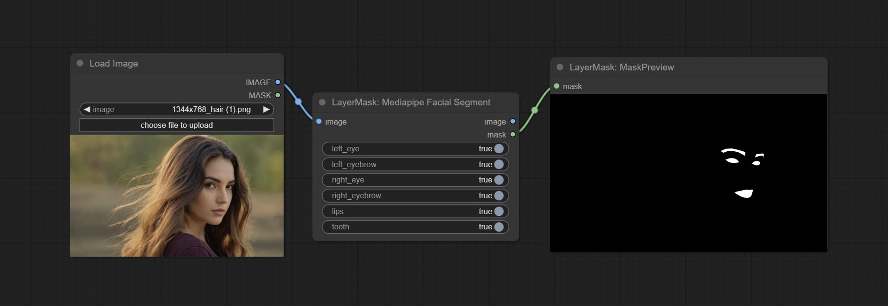    

Node Options:  
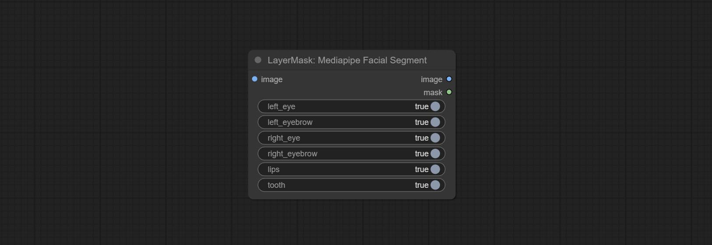    

* left_eye: Recognition switch of left eye.
* left_eyebrow: Recognition switch of left eyebrow.
* right_eye: Recognition switch of right eye.
* right_eyebrow: Recognition switch of right eyebrow.
* lips: Recognition switch of lips.
* tooth: Recognition switch of tooth.

### <a id="table1">MaskByColor</a>

Generate a mask based on the selected color.
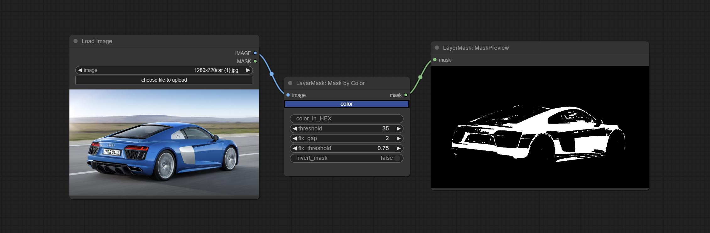    

Node Options:  
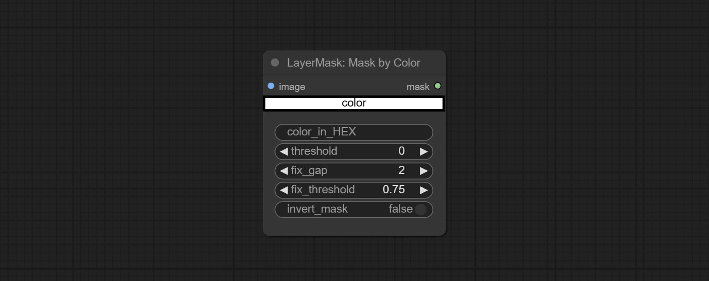    

* image: Input image.
* mask: This input is optional, if there is a mask, only the colors inside the mask are included in the range.
* color: Color selector. Click on the color block to select a color, and you can use the straws on the color picker panel to pick up the screen color. Note: When using straws, maximize the browser window.
* color_in_HEX<sup>4</sup>: Enter color values. If this item has input, it will be used first, ignoring the color selected by the ```color``` .
* threshold: Mask range threshold, the larger the value, the larger the mask range.
* fix_gap: Repair the gaps in the mask. If there are obvious gaps in the mask, increase this value appropriately.
* fix_threshold: The threshold for repairing masks. 
* invert_mask: Whether to reverse the mask.

### <a id="table1">ImageToMask</a>

Convert the image to a mask. Supports converting any channel in LAB, RGBA, YUV, and HSV modes into masks, while providing color scale adjustment. Support mask optional input to obtain masks that only include valid parts.
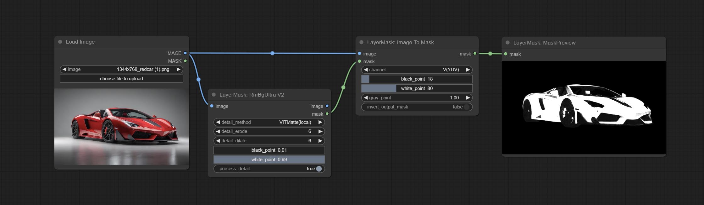    

Node Options:  
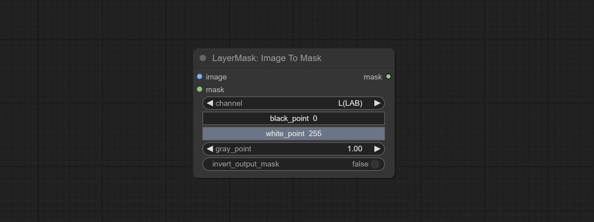    

* image: Input image.
* mask: This input is optional, if there is a mask, only the colors inside the mask are included in the range.
* channel: Channel selection. You can choose any channel of LAB, RGBA, YUV, or HSV modes.
* black_point<sup>*</sup>: Black dot value for the mask. The value range is 0-255, with a default value of 0.
* white_point<sup>*</sup>: White dot value for the mask. The value range is 0-255, with a default value of 255.
* gray_point: Gray dot values for the mask. The value range is 0.01-9.99, with a default of 1.
* invert_output_mask: Whether to reverse the mask.

<sup>*</sup><font size="3">If the black_point or output_black_point value is greater than white_point or output_white_point, the two values are swapped, with the larger value used as white_point and the smaller value used as black_point.</font>      

### <a id="table1">Shadow</a> & Highlight Mask

Generate masks for the dark and bright parts of the image.
    

Node options:  
    

* image: The input image.
* mask: Optional input. if there is input, only the colors within the mask range will be adjusted.
* shadow_level_offset: The offset of values in the dark area, where larger values bring more areas closer to the bright into the dark area.
* shadow_range: The transitional range of the dark area.
* highlight_level_offset: The offset of values in the highlight area, where larger values bring more areas closer to the dark into the highlight area.
* highlight_range: The transitional range of the highlight area. 

### <a id="table1">Shadow</a> Highlight Mask V2

A replica of the ```Shadow & Highlight Mask``` node, with the "&" character removed from the node name to avoid ComfyUI workflow parsing errors.

### <a id="table1">PixelSpread</a>

Pixel expansion preprocessing on the masked edge of an image can effectively improve the edges of image composit.
    

Node options:  
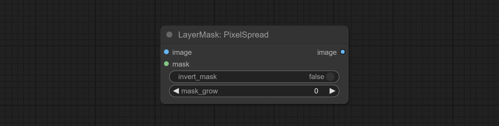    

* invert_mask: Whether to reverse the mask.
* mask_grow: Mask expansion amplitude.

### <a id="table1">MaskByDifferent</a>

Calculate the differences between two images and output them as mask.
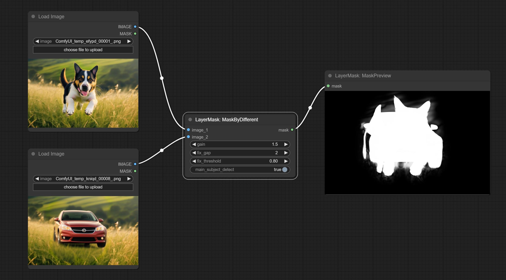    

Node options:  
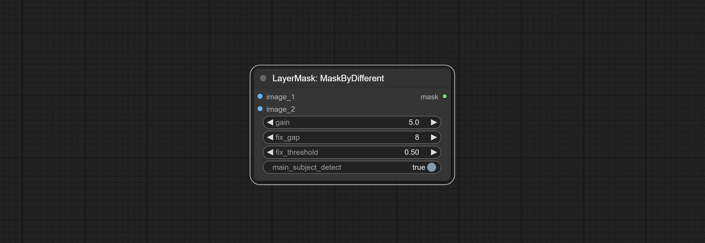    

* gain: The gain of difference calculate. higher value will result in a more significant slight difference.
* fix_gap: Fix the internal gaps of the mask. higher value will repair larger gaps.
* fix_threshold: The threshold for fix_gap.
* main_subject_detect: Setting this to True will enable subject detection, ignoring differences outside of the subject.

### <a id="table1">MaskGrow</a>

Grow and shrink edges and blur the mask
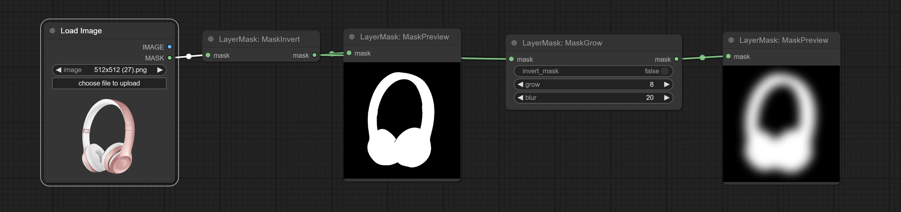    

Node options:
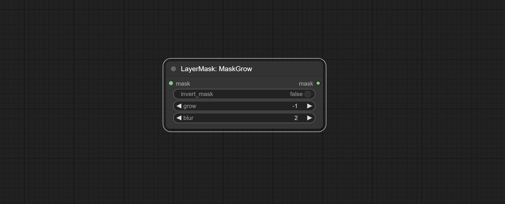    

* invert_mask: Whether to reverse the mask.
* grow: Positive values expand outward, while negative values contract inward.
* blur: Blur the edge.

### <a id="table1">MaskEdgeShrink</a>

Smooth transition and shrink the mask edges while preserving edge details.
    

Node options:
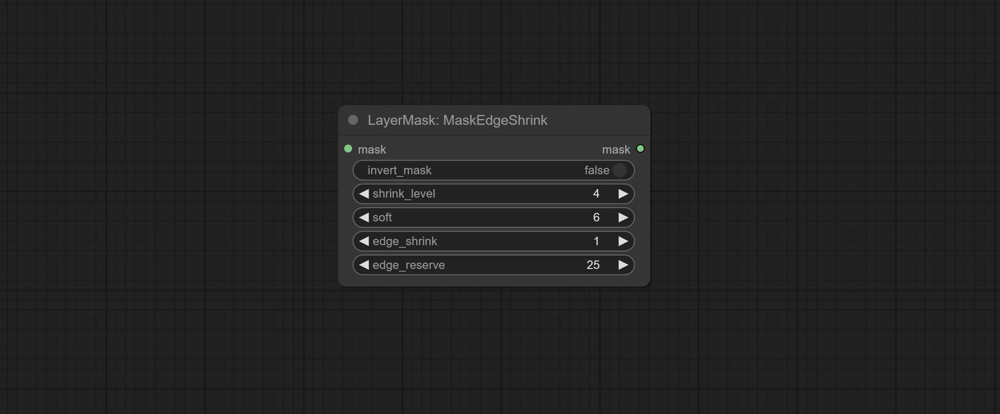    

* invert_mask: Whether to reverse the mask.
* shrink_level: Shrink the smoothness level.
* soft: Smooth amplitude.
* edge_shrink: Edge shrinkage amplitude.
* edge_reserve: Preserve the amplitude of edge details, 100 represents complete preservation, and 0 represents no preservation at all.

Comparison of MaskGrow and MaskEdgeShrink
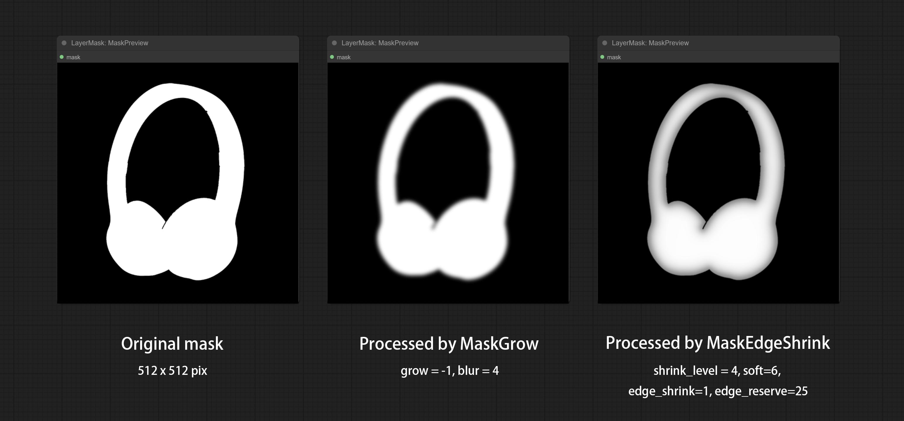    

### <a id="table1">MaskMotionBlur</a>

Create motion blur on the mask.
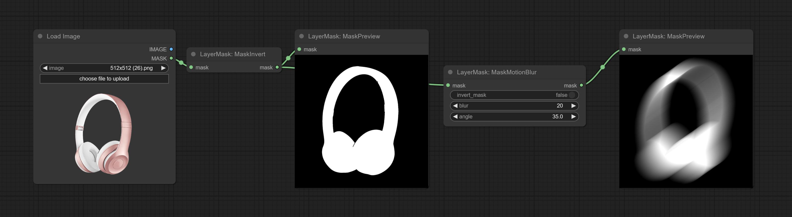    

Node options:  
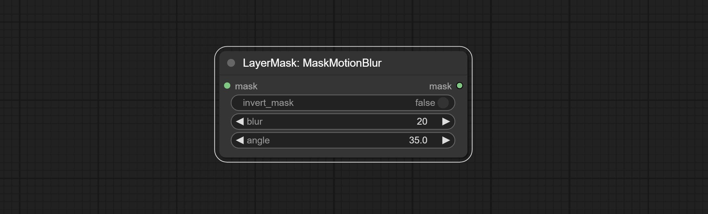    

* invert_mask: Whether to reverse the mask.
* blur: The size of blur.
* angle: The angle of blur.

### <a id="table1">MaskGradient</a>

Create a gradient for the mask from one side. please note the difference between this node and the CreateGradientMask node.
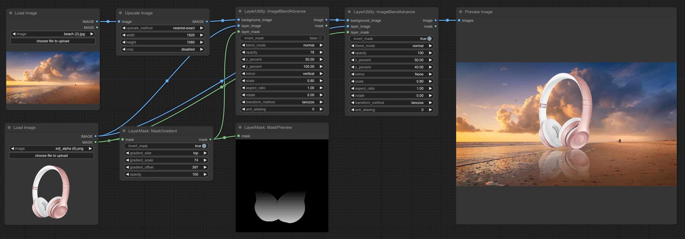    

Node options:
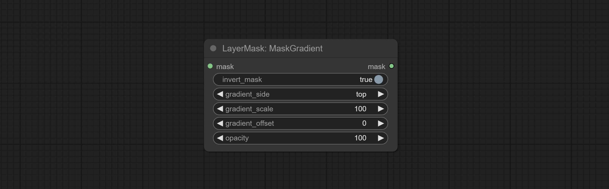    

* invert_mask: Whether to reverse the mask.
* gradient_side: Generate gradient from which edge. There are four directions: top, bottom, left and right.
* gradient_scale: Gradient distance. The default value of 100 indicates that one side of the gradient is completely transparent and the other side is completely opaque. The smaller the value, the shorter the distance from transparent to opaque.
* gradient_offset: Gradient position offset.
* opacity: The opacity of the gradient.

### <a id="table1">CreateGradientMask</a>

Create a gradient mask. please note the difference between this node and the MaskGradient node.
    
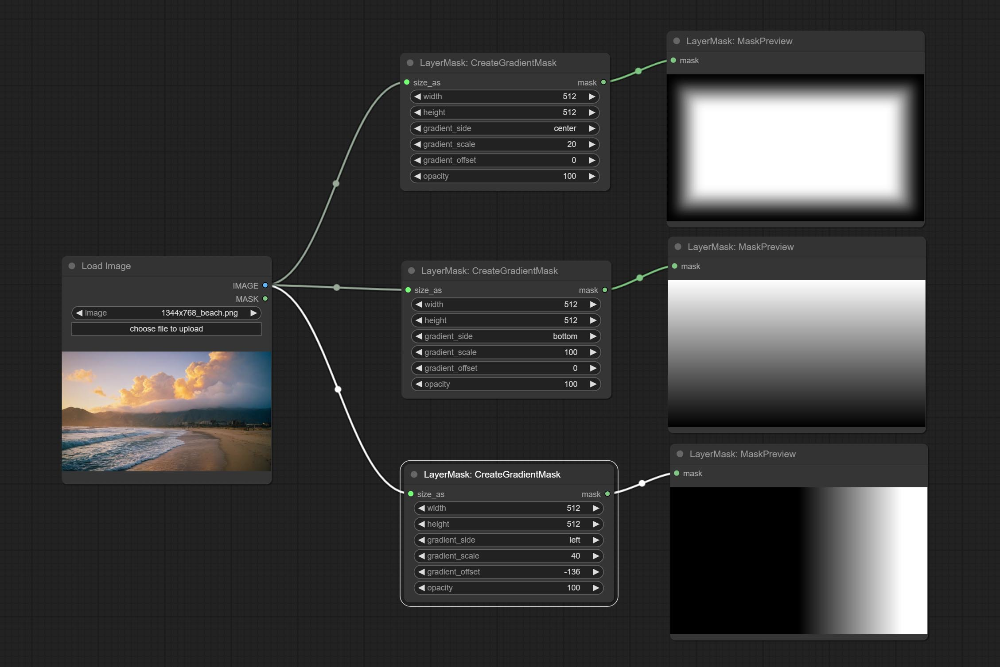    

Node options:  
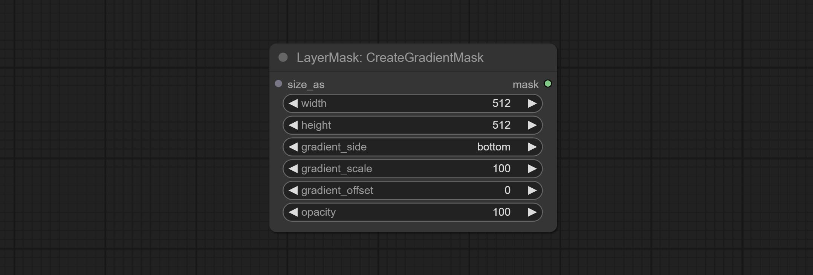    

* size_as<sup>*</sup>: The input image or mask here will generate the output image and mask according to their size. this input takes priority over the width and height below.
* width: Width of the image. If there is a size_as input, this setting will be ignored.
* height: Height of the image. If there is a size_as input, this setting will be ignored.
* gradient_side: Generate gradient from which edge. There are five directions: top, bottom, left, right and center.
* gradient_scale: Gradient distance. The default value of 100 indicates that one side of the gradient is completely transparent and the other side is completely opaque. The smaller the value, the shorter the distance from transparent to opaque.
* gradient_offset: Gradient position offset. When ```gradient_side``` is center, the size of the gradient area is adjusted here, positive values are smaller, and negative values are enlarged.
* opacity: The opacity of the gradient.

<sup>*</sup>Only limited to input image and mask. forcing the integration of other types of inputs will result in node errors.  

### <a id="table1">MaskStroke</a>

Generate mask contour strokes.
    

Node options:  
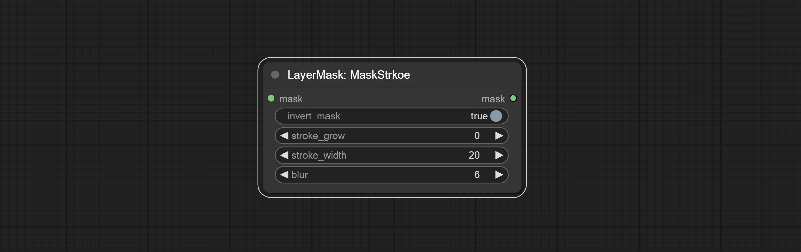    

* invert_mask: Whether to reverse the mask.
* stroke_grow: Stroke expansion/contraction amplitude, positive values indicate expansion and negative values indicate contraction.
* stroke_width: Stroke width.
* blur: Blur of stroke.

### <a id="table1">MaskGrain</a>

Generates noise for the mask.
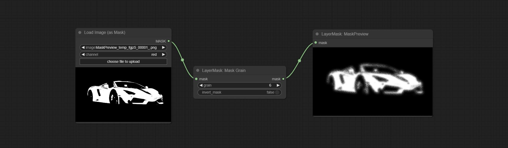    

Node Options:  
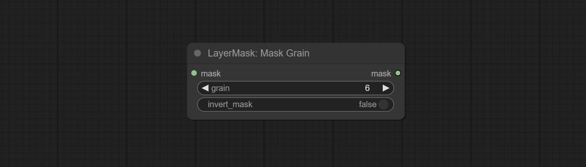    

* grain: Noise intensity.
* invert_mask: Whether to reverse the mask.

### <a id="table1">MaskPreview</a>

Preview the input mask
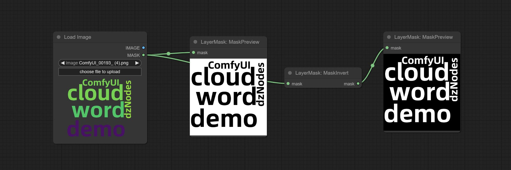    

### <a id="table1">MaskInvert</a>

Invert the mask
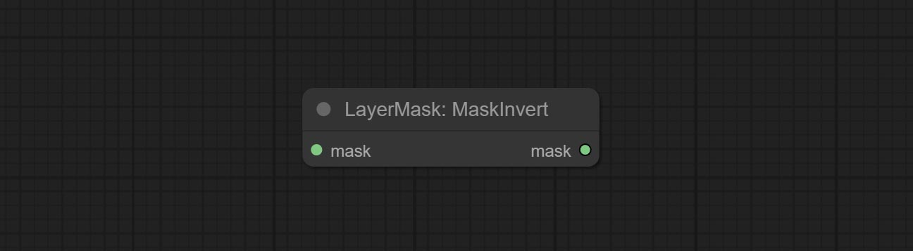    

# <a id="table1">LayerFilter</a>

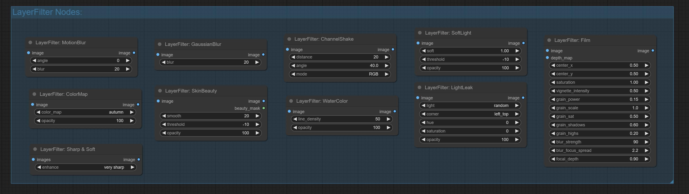    

### <a id="table1">Sharp</a> & Soft

Enhance or smooth out details for image.
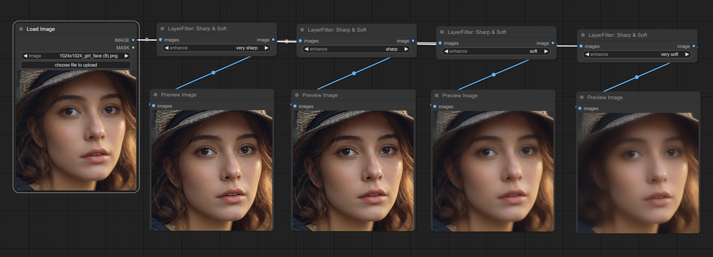    

Node options:
    

* enhance: Provide 4 presets, which are very sharp, sharp, soft and very soft. If you choose None, you will not do any processing.

### <a id="table1">SkinBeauty</a>

Make the skin look smoother.
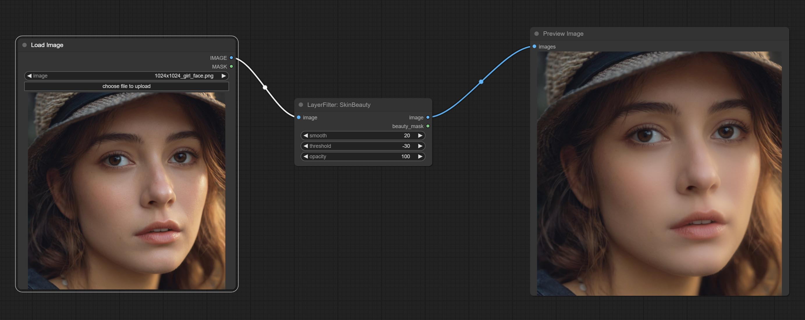    

Node options:
    

* smooth: Skin smoothness.
* threshold: Smooth range. the larger the range with the smaller value.
* opacity: The opacity of the smoothness.

### <a id="table1">WaterColor</a>

Watercolor painting effect
    

Node option:
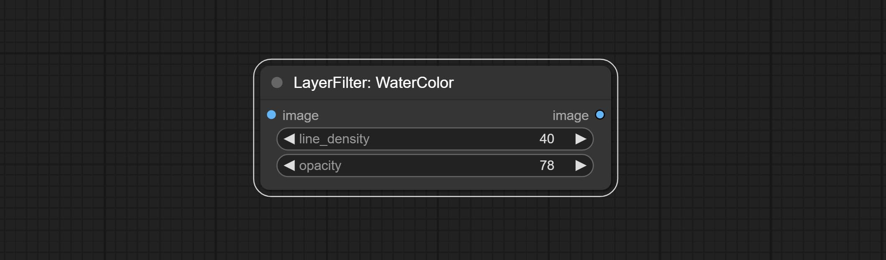    

* line_density: The black line density.
* opacity: The opacity of watercolor effects.

### <a id="table1">SoftLight</a>

Soft light effect, the bright highlights on the screen appear blurry.
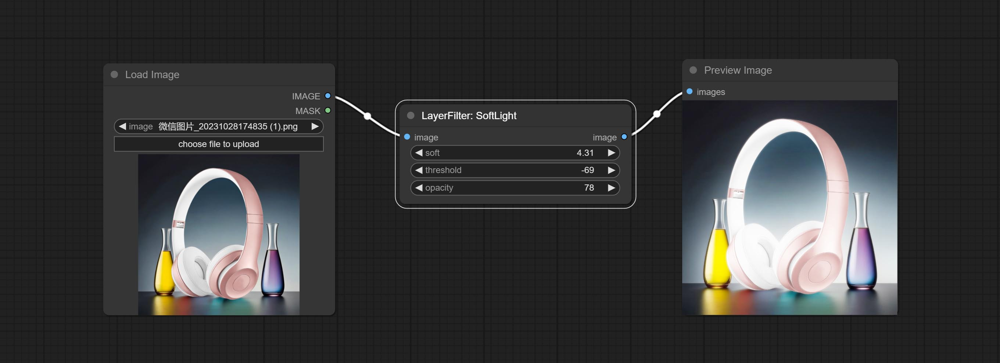    

Node options:
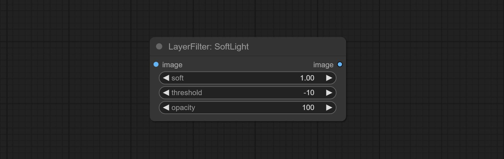    

* soft: Size of soft light.
* threshold: Soft light range. the light appears from the brightest part of the picture. in lower value, the range will be larger, and in higher value, the range will be smaller.
* opacity: Opacity of the soft light.

### <a id="table1">ChannelShake</a>

Channel misalignment. similar to the effect of Tiktok logo.
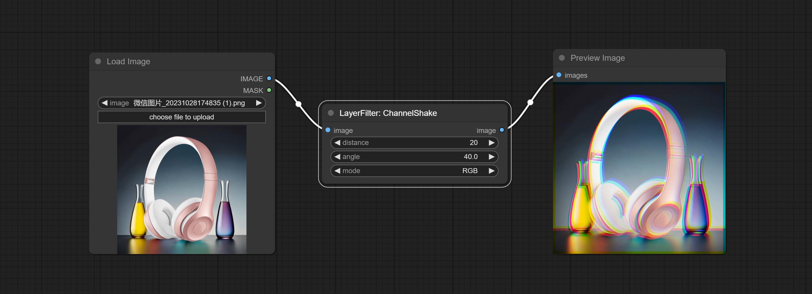    

Node options:
    

* distance: Distance of channel separation.
* angle: Angle of channel separation.
* mode: Channel shift arrangement order.

### <a id="table1">HDR</a> Effects

enhances the dynamic range and visual appeal of input images.
This node is reorganize and encapsulate of  [HDR Effects (SuperBeasts.AI)](https://github.com/SuperBeastsAI/ComfyUI-SuperBeasts), thanks to the original author.
    

Node options:
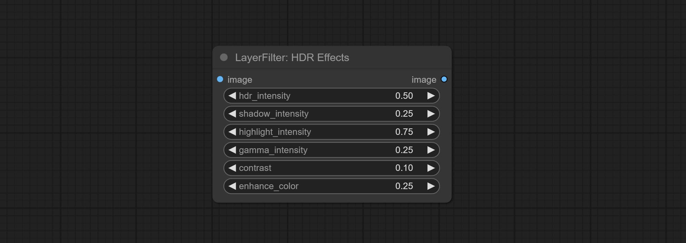    

* hdr_intensity: Range: 0.0 to 5.0, Controls the overall intensity of the HDR effect, Higher values result in a more pronounced HDR effect.
* shadow_intensity: Range: 0.0 to 1.0，Adjusts the intensity of shadows in the image，Higher values darken the shadows and increase contrast.
* highlight_intensity: Range: 0.0 to 1.0，Adjusts the intensity of highlights in the image，Higher values brighten the highlights and increase contrast.
* gamma_intensity: Range: 0.0 to 1.0，Controls the gamma correction applied to the image，Higher values increase the overall brightness and contrast.
* contrast: Range: 0.0 to 1.0，Enhances the contrast of the image, Higher values result in more pronounced contrast.
* enhance_color: Range: 0.0 to 1.0，Enhances the color saturation of the image, Higher values result in more vibrant colors.

### <a id="table1">Film</a>

Simulate the grain, dark edge, and blurred edge of the film, support input depth map to simulate defocus.    
This node is reorganize and encapsulate of [digitaljohn/comfyui-propost](https://github.com/digitaljohn/comfyui-propost), thanks to the original author.
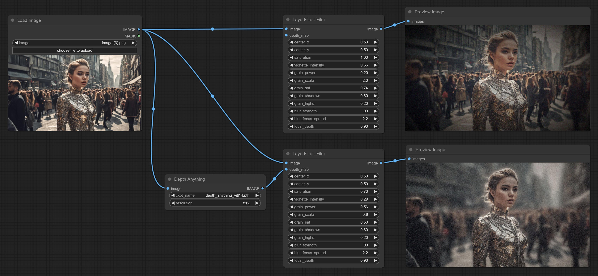    

Node options:
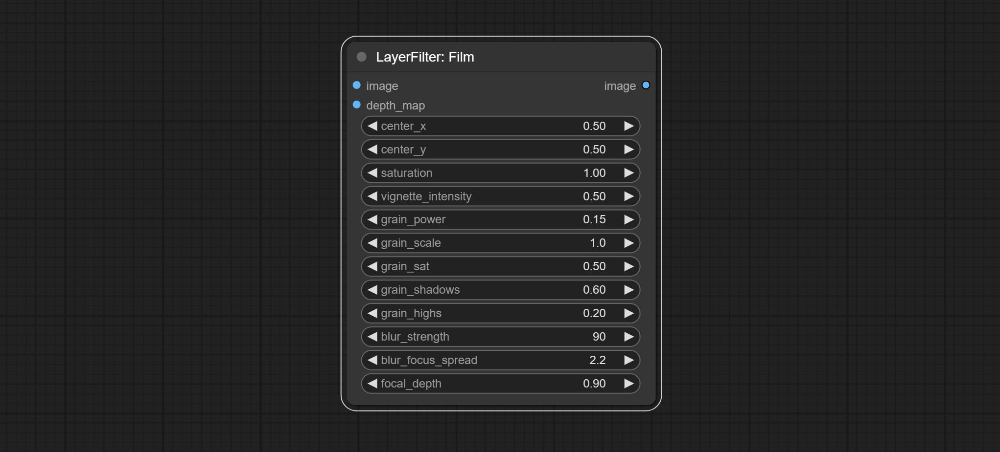    

* image: The input image.
* depth_map: Input depth map to simulate defocus effect. it is an optional input. if there is no input, will simulates radial blur at the edges of the image.
* center_x: The horizontal axis of the center point position of the dark edge and radial blur, where 0 represents the leftmost side, 1 represents the rightmost side, and 0.5 represents at the center.
* center_y: The vertical axis of the center point position of the dark edge and radial blur, where 0 represents the leftmost side, 1 represents the rightmost side, and 0.5 represents at the center.
* saturation: Color saturation, 1 is the original value.
* grain_power: Grain intensity. larger value means more pronounced the noise.
* grain_scale: Grain size.
* grain_sat: The color saturation of grain. 0 represents mono noise, and the larger the value, the more prominent the color.
* grain_shadows: Grain intensity of dark part.
* grain_highs: Grain intensity of light part.
* blur_strength: The strength of blur. larger value means more blurry it becomes.
* blur_focus_spread: Focus diffusion range. larger value means larger clear range.
* focal_depth: Simulate the focal distance of defucus. 0 indicates that focus is farthest, and 1 indicates that is closest. this setting only valid when input the depth_map.

### <a id="table1">FilmV2</a>

The upgraded version of the Film node adds the fastgrain method on the basis of the previous one, and the speed of generating noise is accelerated by 10 times. The code for fastgrain is from [github.com/spacepxl/ComfyUI-Image-Filters](https://github.com/spacepxl/ComfyUI-Image-Filters) BetterFilmGrain node, thanks to the original authors.
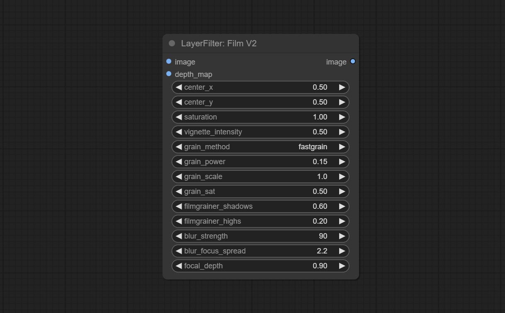    

### <a id="table1">LightLeak</a>

Simulate the light leakage effect of the film. please download model file from [Baidu Netdisk](https://pan.baidu.com/s/18Z0lhsDAejbwlOrCZFMuNg?pwd=o8sz) or [Google Drive]([light_leak.pkl(Google Drive)(https://drive.google.com/file/d/1DcH2Zkyj7W3OiAeeGpJk1eaZpdJwdCL-/view?usp=sharing)) and copy to ```ComfyUI/models/layerstyle``` folder.
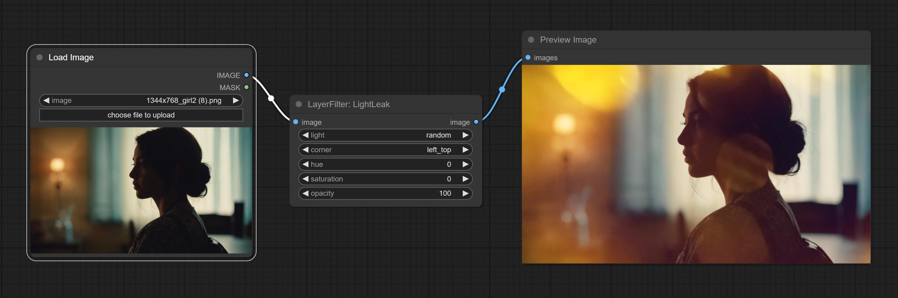    

Node options:
    

* light: 32 types of light spots are provided. random is a random selection.
* corner: There are four options for the corner where the light appears: top left, top right, bottom left, and bottom right.
* hue: The hue of the light.
* saturation: The color saturation of the light.
* opacity: The opacity of the light.

### <a id="table1">ColorMap</a>

Pseudo color heat map effect.
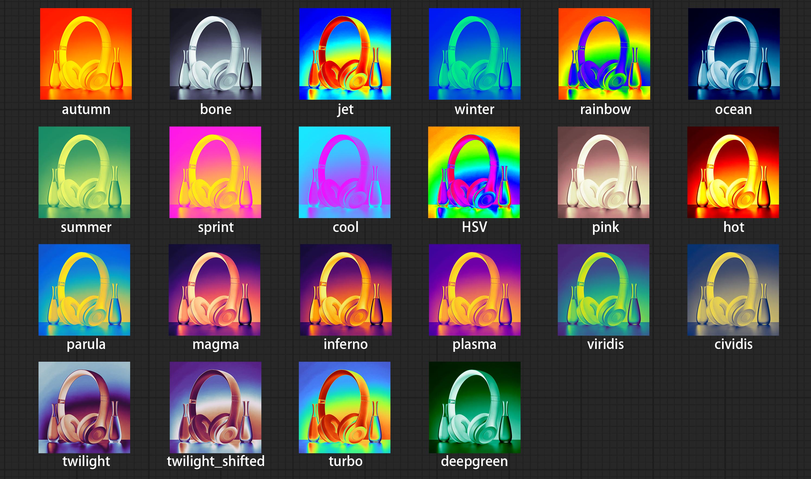    

Node options:
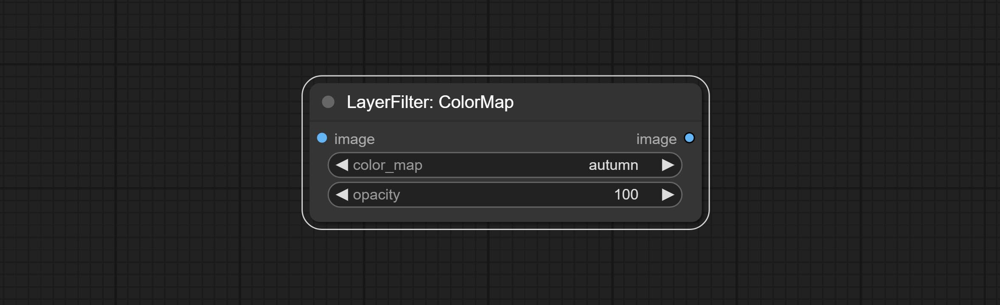    

* color_map: Effect type. there are a total of 22 types of effects, as shown in the above figure.
* opacity: The opacity of the color map effect.

### <a id="table1">MotionBlur</a>

Make the image motion blur
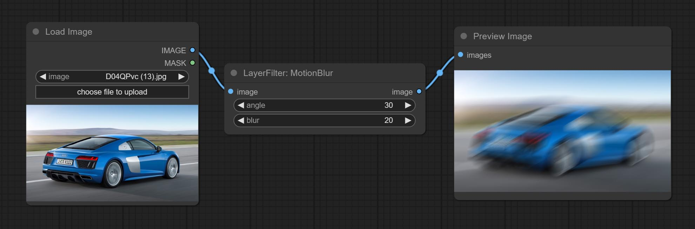    

Node options:

* angle: The angle of blur.
* blur: The size of blur.

### <a id="table1">GaussianBlur</a>

Make the image gaussian blur
    

Node options:

* blur: The size of blur, integer, range 1-999.

### <a id="table1">GaussianBlurV2</a>

Gaussian blur. Change the parameter precision to floating-point number, with a precision of 0.01

Node options:
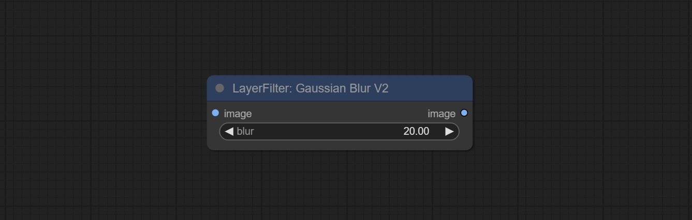    

* blur: The size of blur, float, range 0 - 1000.

### <a id="table1">AddGrain</a>

Add noise to the picture.
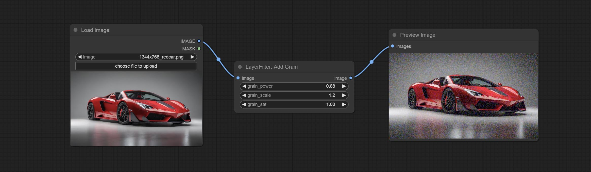    

Node Options:
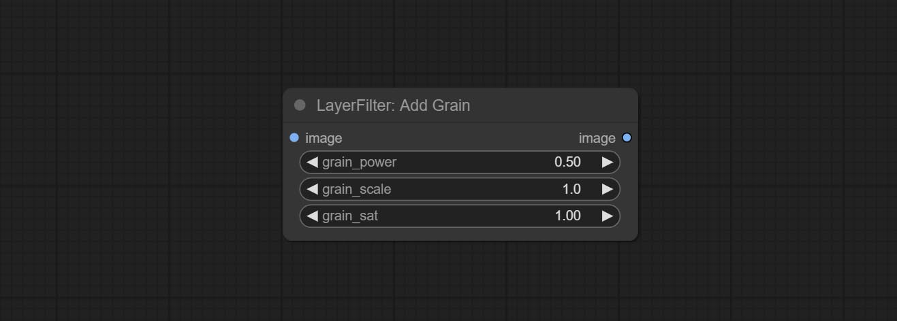    

* grain_power: Noise intensity.
* grain_scale: Noise size.
* grain_sat: Color saturation of noise.

## Annotation for <a id="table1">notes</a>

<sup>1</sup>  The layer_image, layer_mask and the background_image(if have input), These three items must be of the same size.    

<sup>2</sup>  The mask not a mandatory input item. the alpha channel of the image is used by default. If the image input does not include an alpha channel, the entire image's alpha channel will be automatically created. if have masks input simultaneously, the alpha channel will be overwrite by the mask.    

<sup>3</sup>  The <a id="table1">Blend</a> Mode include **normal, multply, screen, add, subtract, difference, darker, color_burn, color_dodge, linear_burn, linear_dodge, overlay, soft_light, hard_light, vivid_light, pin_light, linear_light, and hard_mix.** all of 19 blend modes in total.    
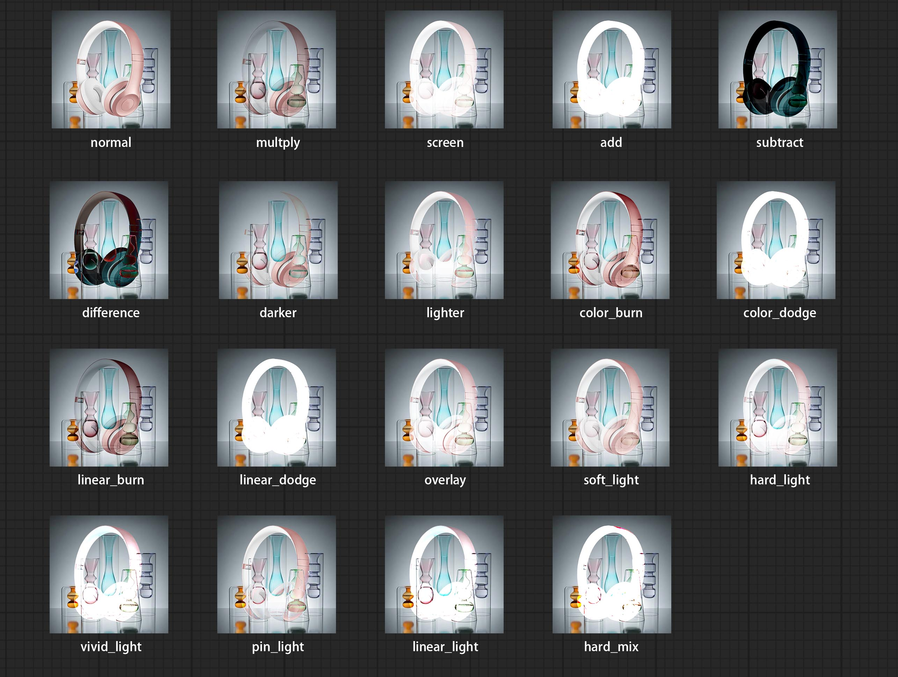    
<font size="1">*Preview of the blend mode  </font><br />     

<sup>3</sup>   The <a id="table1">BlendModeV2</a> include **normal, dissolve, darken, multiply, color burn, linear burn, darker color, lighten, screen, color dodge, linear dodge(add), lighter color, dodge, overlay, soft light, hard light, vivid light, linear light, pin light, hard mix, difference, exclusion, subtract, divide, hue, saturation, color, luminosity, grain extract, grain merge** all of 30 blend modes in total.      
Part of the code for BlendMode V2 is from [Virtuoso Nodes for ComfyUI](https://github.com/chrisfreilich/virtuoso-nodes). Thanks to the original authors.
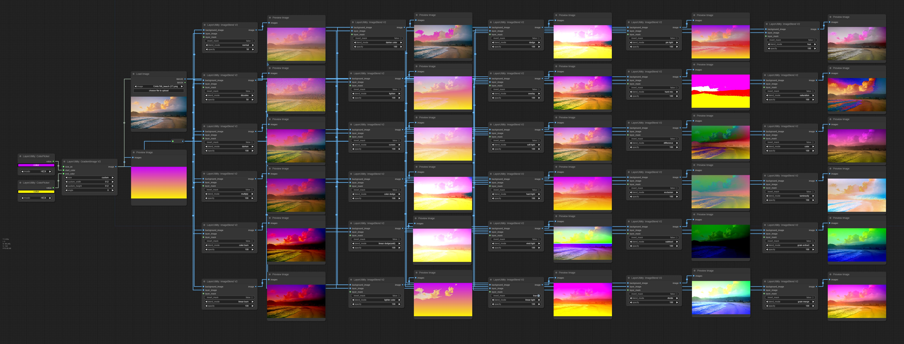    
<font size="1">*Preview of the Blend Mode V2</font><br />     

<sup>4</sup>  The RGB color described by hexadecimal RGB format, like '#FA3D86'.    

<sup>5</sup>  The layer_image and layer_mask must be of the same size.    

## Stars

[](https://star-history.com/#chflame163/ComfyUI_LayerStyle&Date)

# statement

LayerStyle nodes follows the MIT license, Some of its functional code comes from other open-source projects. Thanks to the original author. If used for commercial purposes, please refer to the original project license to authorization agreement.
