# ComfyUI Layer Style

[中文说明点这里](./README_CN.MD)    

如果您有定制节点、定制工作流业务，请联系email [chflame@163.com](mailto:chflame@163.com).

For business cooperation, please contact email [chflame@163.com](mailto:chflame@163.com).

A set of nodes for ComfyUI that can composite layer and mask to achieve Photoshop like functionality.  

It migrate some basic functions of PhotoShop to ComfyUI, aiming to centralize the workflow and reduce the frequency of software switching.  

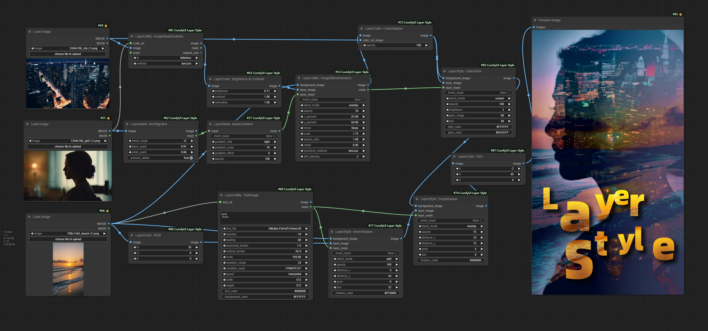  
<font size="1">*this workflow (title_example_workflow.json) is in the workflow directory.  </font><br /> 


## Example workflow
Some JSON workflow files in the	```workflow``` directory, That's examples of how these nodes can be used in ComfyUI.


## How to install 

* Recommended use ComfyUI Manager for installation.

* Or open the cmd window in the plugin directory of ComfyUI, like ```ComfyUI\custom_nodes```，type    
```
git clone https://github.com/chflame163/ComfyUI_LayerStyle.git
```
* Or download the zip file and extracted, copy the resulting folder to ```ComfyUI\custom_ Nodes```    

* Install dependency packages, open the cmd window in the ComfyUI_LayerStyle plugin directory like    
```ComfyUI\custom_ Nodes\ComfyUI_LayerStyle``` and enter the following command:    

```
..\..\..\python_embeded\python.exe -m pip install -r requirements.txt
```

* Restart ComfyUI.

## Common Issues
If the node cannot load properly or there are errors during use, please check the error message in the ComfyUI terminal window. The following are common errors and their solutions.

### Cannot import name 'guidedFilter' from 'cv2.ximgproc'
This error is caused by incorrect version of the ```opencv-contrib-python``` package，or this package is overwriteen by other opencv packages. 


### NameError: name 'guidedFilter' is not defined
The reason for the problem is the same as above.

### Cannot import name 'VitMatteImageProcessor' from 'transformers' 
This error is caused by the low version of ```transformers``` package. 


### insightface Loading very slow
This error is caused by the low version of ```protobuf``` package. 

## For the issues with the above three dependency packages, please double click ```repair_dependency.bat``` (for Official ComfyUI Protable) or  ```repair_dependency_aki.bat``` (for ComfyUI-aki-v1.x) in the plugin folder to automatically fix them.

### ValueError: Trimap did not contain foreground values (xxxx...)
This error is caused by the mask area being too large or too small when using the ```PyMatting``` method to handle the mask edges.    

Solution：
* Please adjust the parameters to change the effective area of the mask. Or use other methods to handle the edges.

### Requests.exceptions.ProxyError: HTTPSConnectionPool(xxxx...)
When this error has occurred, please check the network environment.


## Update
<font size="4">**If the dependency package error after updating, please reinstall the relevant dependency packages. </font><br />    

* Commit [AutoBrightness](#AutoBrightness) node，it can automatically adjust the brightness of image.
* [CreateGradientMask](#CreateGradientMask) node add ```center``` option.
* Commit [GetColorToneV2](#GetColorToneV2) node, can select the main and average colors for the background or body. 
* Commit [ImageRewardFilter](#ImageRewardFilter) node, can filter out poor quality pictures.
* Ultra nodes add ```VITMatte(local)``` method, You can choose this method to avoid accessing huggingface.co if you have already downloaded the model before.
* Commit [HDR Effect](#HDR) node，it enhances the dynamic range and visual appeal of input images.  this node is repackage of [HDR Effects (SuperBeasts.AI)](https://github.com/SuperBeastsAI/ComfyUI-SuperBeasts).
* Commit [CropBoxResolve](#CropBoxResolve) node.
* Commit [BiRefNetUltra](#BiRefNetUltra) node, it using the BiRefNet model to remove background has better recognition ability and ultra-high edge details.
* Commit [ImageAutoCropV2](#ImageAutoCropV2) node, it can choose not to remove the background, support mask input, and scale by long or short side size.
* Commit [ImageHub](#ImageHub) node, supports up to 9 sets of Image and Mask switching output, and supports random output.
* Commit [TextJoin](#TextJoin) node.
* Commit [PromptEmbellish](#PromptEmbellish) node. it output polished prompt words, and support inputting images as references.
* Ultra nodes have been fully upgraded to V2 version, with the addition of VITMatte edge processing method, which is suitable for handling semi transparent areas. Include [MaskEdgeUltraDetailV2](#MaskEdgeUltraDetailV2), [SegmentAnythingUltraV2](#SegmentAnythingUltraV2), [RmBgUltraV2](#RmBgUltraV2) and [PersonMaskUltraV2](#PersonMaskUltraV2) nodes.
* Commit [Color of Shadow & Highlight](#Highlight) node, it can adjust the color of the dark and bright parts separately. Commit [Shadow & Highlight Mask](#Shadow) node, it can output mask for dark and bright areas.
* Commit [CropByMaskV2](#CropByMaskV2) node, On the basis of the original node, it supports ```crop_box``` input, making it convenient to cut layers of the same size.
* Commit [SimpleTextImage](#SimpleTextImage) node, it generate simple typesetting images and masks from text. This node references some of the functionalities and code of [ZHO-ZHO-ZHO/ComfyUI-Text_Image-Composite](https://github.com/ZHO-ZHO-ZHO/ComfyUI-Text_Image-Composite).
* Commit [PromptTagger](#PromptTagger) node，Inference the prompts based on the image. and it can replace key word for the prompt(need apply for Google Studio API key). Upgrade [ColorImageV2](#ColorImageV2) and [GradientImageV2](#GradientImageV2)，support user customize preset sizes and size_as input.
* Commit [LaMa](#LaMa) node, it can erase objects from the image based on the mask. this node is repackage of [IOPaint](https://www.iopaint.com).
* Commit [ImageRemoveAlpha](#ImageRemoveAlpha) and [ImageCombineAlpha](#ImageCombineAlpha) nodes, alpha channel of the image can be removed or merged.
* Commit [ImageScaleRestoreV2](#ImageScaleRestoreV2) and [ImageScaleByAspectRatioV2](#ImageScaleByAspectRatioV2) nodes, supports scaling images to specified long or short edge sizes.
* Commit [PersonMaskUltra](#PersonMaskUltra) node, Generate masks for portrait's face, hair, body skin, clothing, or accessories. the model code for this node comes from [a-person-mask-generator](https://github.com/djbielejeski/a-person-mask-generator).
* Commit [LightLeak](#LightLeak) node, this filter simulate the light leakage effect of the film.
* Commit [Film](#Film) node, this filter simulate the grain, dark edge, and blurred edge of the film, support input depth map to simulate defocus. it is reorganize and encapsulate of [digitaljohn/comfyui-propost](https://github.com/digitaljohn/comfyui-propost).
* Commit [ImageAutoCrop](#ImageAutoCrop) node, which is designed to generate image materials for training models.
* Commit [ImageScaleByAspectRatio](#ImageScaleByAspectRatio) node, it can be scaled image or mask according to frame ratio.
* Fix the bug of color gradation in [LUT Apply](#LUT) node rendering, and this node now support for log color space. *Please load the dedicated log lut file for the log color space image.
* Commit [CreateGradientMask](#CreateGradientMask) node. Commit [LayerImageTransform](#LayerImageTransform) and [LayerMaskTransform](#LayerMaskTransform) nodes.
* Commit [MaskEdgeUltraDetail](#MaskEdgeUltraDetail) node, it process rough masks to ultra fine edges.Commit [Exposure](#Exposure) node.
* Commit [Sharp & Soft](#Sharp) node, it can enhance or smooth out image details. Commit [MaskByDifferent](#MaskByDifferent) node, it compare two images and output a Mask. Commit [SegmentAnythingUltra](#SegmentAnythingUltra) node, Improve the quality of mask edges. *If SegmentAnything is not installed, you will need to manually download the model.
* All nodes have fully supported batch images, providing convenience for video creation.
(The CropByMask node only supports cuts of the same size. if a batch mask_for_crop inputted, the data from the first sheet will be used.)
* Commit [RemBgUltra](#RemBgUltra) and [PixelSpread](#PixelSpread) nodes significantly improved mask quality. *RemBgUltra requires manual model download.
* Commit [TextImage](#TextImage) node, it generate text images and masks.
* Add new types of [blend mode](#blend) between images. now supports up to 19 blend modes. add **color_burn, color_dodge, linear_burn, linear_dodge, overlay, soft_light, hard_light, vivid_light, pin_light, linear_light** and **hard_mix**. 
The newly added blend mode is applicable to all nodes that support blend mode.
* Commit [ColorMap](#ColorMap) filter node to create a pseudo color heatmap effect.
* Commit [WaterColor](#WaterColor) and [SkinBeauty](#SkinBeauty) nodes。These are image filters that generate watercolor and skin smoothness effects.
* Commit [ImageShift](#ImageShift)  node to shift the image and output a displacement seam mask, making it convenient to create continuous textures.
* Commit [ImageMaskScaleAs](#ImageMaskScaleAs) node to adjust the image or mask size based on the reference image.
* Commit [ImageScaleRestore](#ImageScaleRestore) node to work with CropByMask for local upscale and repair works.
* Commit [CropByMask](#CropByMask) and [RestoreCropBox](#RestoreCropBox) nodes. The combination of these two can partially crop and redraw the image before restoring it.
* Commit [ColorAdapter](#ColorAdapter) node, that can automatically adjust the color tone of the image.
* Commit [MaskStroke](#MaskStroke) node, it can generate mask contour strokes.
* Add [LayerColor](#LayerColor) node group, used to adjust image color. it include [LUT Apply](#LUT), [Gamma](#Gamma), [Brightness & Contrast](#Brightness), [RGB](#RGB), [YUV](#YUV), [LAB](#LAB) adn [HSV](#HSV).
* Commit [ImageChannelSplit](#ImageChannelSplit) and [ImageChannelMerge](#ImageChannelMerge) nodes.
* Commit [MaskMotionBlur](#MaskMotionBlur) node.
* Commit [SoftLight](#SoftLight) node.
* Commit [ChannelShake](#ChannelShake) node, that is filter, can produce channel dislocation effect similar like Tiktok logo.
* Commit [MaskGradient](#MaskGradient) node, can create a gradient in the mask.
* Commit [GetColorTone](#GetColorTone) node, can obtain the main color or average color of the image. 
Commit [MaskGrow](#MaskGrow) and [MaskEdgeShrink](#MaskEdgeShrink) nodes.
* Commit [MaskBoxDetect](#MaskBoxDetect) node, which can automatically detect the position through the mask and output it to the composite node.
Commit [XY to Percent](#Percent) node to convert absolute coordinates to percent coordinates.
Commit [GaussianBlur](#GaussianBlur) node.
Commit [GetImageSize](#GetImageSize) node.
* Commit [ExtendCanvas](#ExtendCanvas) node.
* Commit [ImageBlendAdvance](#ImageBlendAdvance) node. This node allows for the synthesis of background images and layers of different sizes, providing a more free synthesis experience. 
Commit [PrintInfo](#PrintInfo) node as a workflow debugging aid.
* Commit [ColorImage](#ColorImage) and [GradientImage](#GradientImage) nodes, Used to generate solid and gradient color images.
* Commit [GradientOverlay](#GradientOverlay) and [ColorOverlay](#ColorOverlay) nodes. 
Add invalid mask input judgment and ignore it when invalid mask is input.
* Commit [InnerGlow](#InnerGlow), [InnerShadow](#InnerShadow) and [MotionBlur](#MotionBlur) nodes.
* Renaming all completed nodes, the nodes are divided into 4 groups：LayerStyle, LayerMask, LayerUtility, LayerFilter. workflows containing old version nodes need to be manually replaced with new version nodes.
* [OuterGlow](#OuterGlow) node has undergone significant modifications by adding options for **_brightness_**, **_light_color_**, and **_glow_color_**.
* Commit [MaskInvert](#MaskInvert) node.
* Commit [ColorPick](#ColorPick) node.
* Commit [Stroke](#Stroke) node.
* Commit [MaskPreview](#MaskPreview) node.
* Commit [ImageOpacity](#ImageOpacity) node.
* The layer_mask is not a mandatory input now. it is allowed to use layers and masks with different shapes, but the size must be consistent.
* Commit [ImageBlend](#ImageBlend) node.
* Commit [OuterGlow](#OuterGlow) node.
* Commit [DropShadow](#DropShadow) node.


## Description
Nodes are divided into 5 groups according to their functions: LayerStyle, LayerColor, LayerMask, LayerUtility and LayerFilter.
* [LayerStyle](#LayerStyle) nodes provides layer styles that mimic Adobe Photoshop.
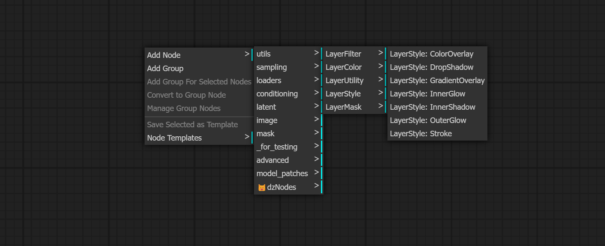
* [LayerColor](#LayerColor) node group provides color adjustment functionality.

* [LayerMask](#LayerMask) nodes provides mask assistance tools.
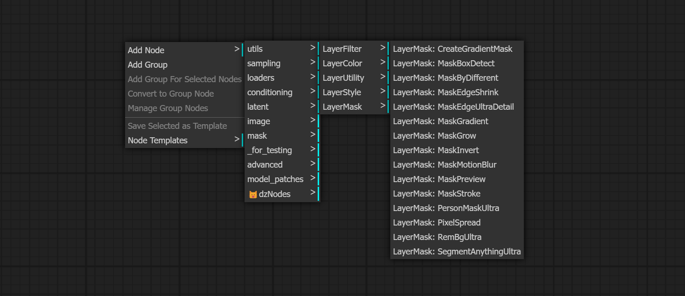
* [LayerUtility](#LayerUtility) nodes provides auxiliary nodes related to layer composit tools and workflows.
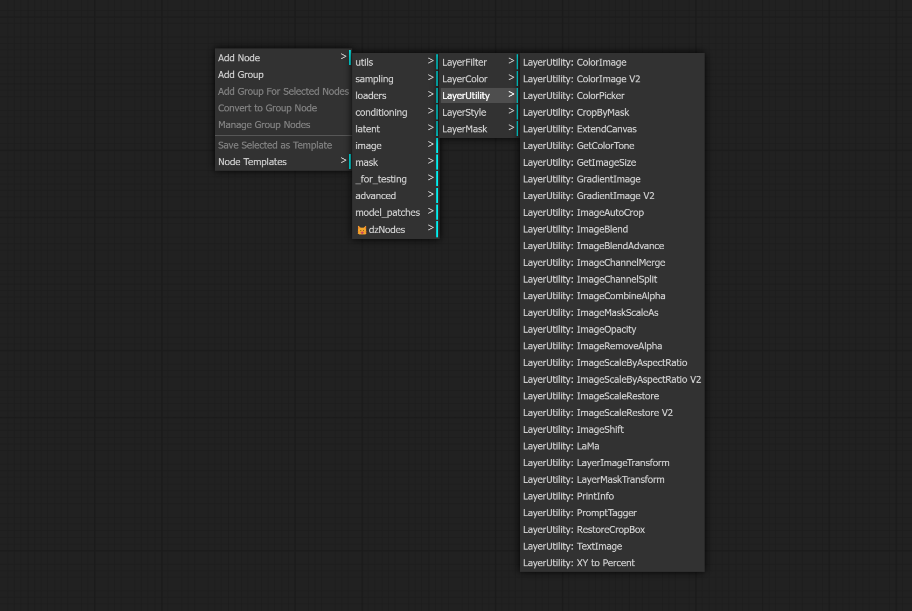
* [LayerFilter](#LayerFilter) nodes provides image effect filters.
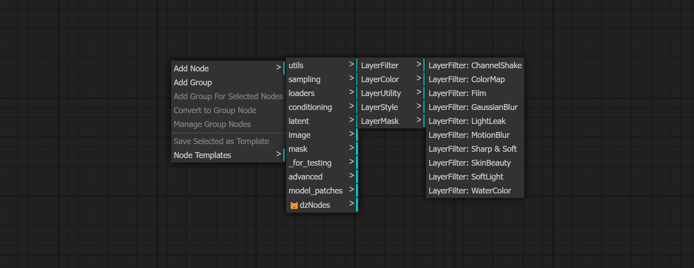

# <a id="table1">LayerStyle</a>

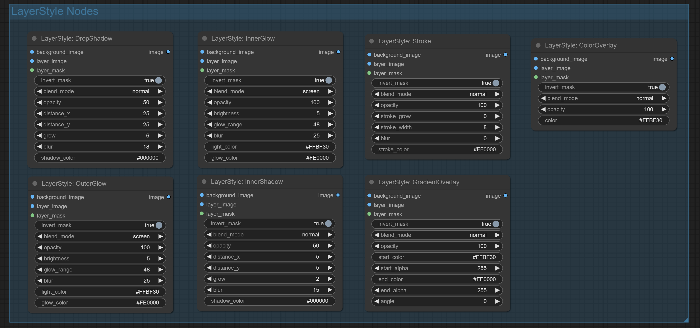


### <a id="table1">DropShadow</a>
Generate shadow
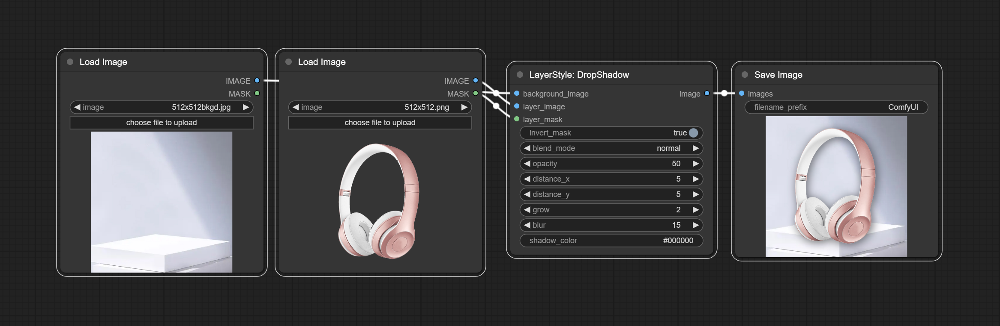

Node options:

* background_image<sup>1</sup>: The background image.
* layer_image<sup>1</sup>: Layer image for composite.
* layer_mask<sup>1,2</sup>: Mask for layer_image, shadows are generated according to their shape.
* invert_mask: Whether to reverse the mask.
* blend_mode<sup>3</sup>: Blending mode of shadows.
* opacity: Opacity of shadow.
* distance_x: Horizontal offset of shadow.
* distance_y: Vertical offset of shadow.
* grow: Shadow expansion amplitude.
* blur: Shadow blur level.
* shadow_color<sup>4</sup>: Shadow color.
* [note](#notes)


### <a id="table1">OuterGlow</a>
Generate outer glow
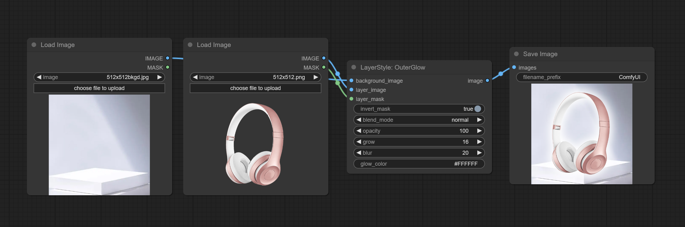

Node options:
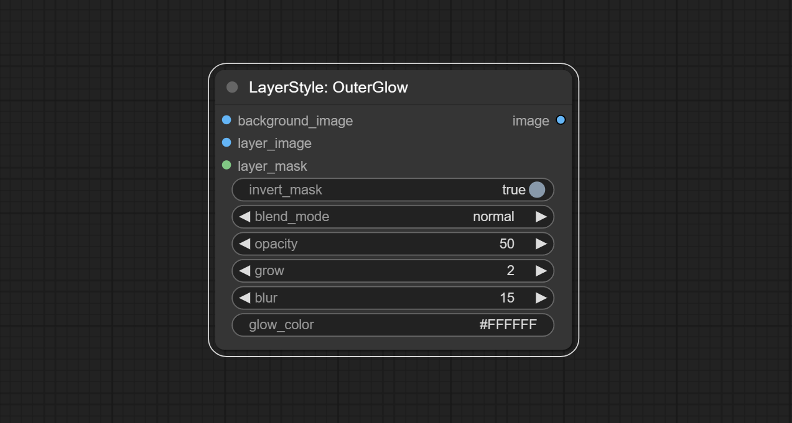
* background_image<sup>1</sup>: The background image.
* layer_image<sup>1</sup>: Layer image for composite.
* layer_mask<sup>1,2</sup>: Mask for layer_image, grow are generated according to their shape.
* invert_mask: Whether to reverse the mask.
* blend_mode<sup>3</sup>: Blending mode of glow.
* opacity: Opacity of glow.
* brightness: Luminance of light.
* glow_range: range of glow.
* blur：blur of glow.
* light_color<sup>4</sup>: Center part color of glow.
* glow_color<sup>4</sup>: Edge part color of glow.
* [note](#notes)


### <a id="table1">InnerShadow</a>
Generate inner shadow
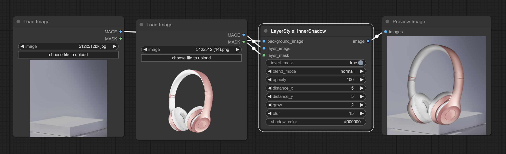

Node options:
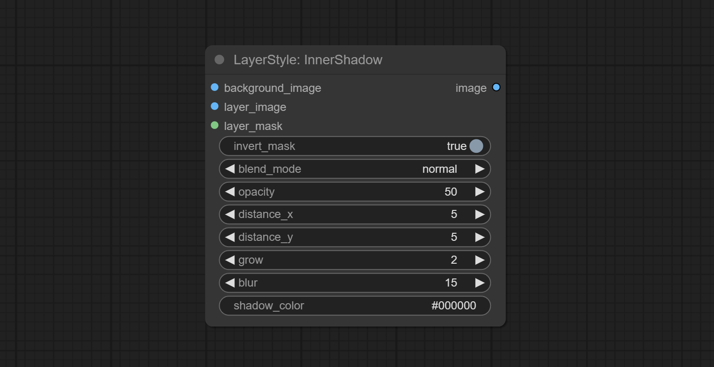
* background_image<sup>1</sup>: The background image.
* layer_image<sup>1</sup>: Layer image for composite.
* layer_mask<sup>1,2</sup>: Mask for layer_image, shadows are generated according to their shape.
* invert_mask: Whether to reverse the mask.
* blend_mode<sup>3</sup>: Blending mode of shadows.
* opacity: Opacity of shadow.
* distance_x: Horizontal offset of shadow.
* distance_y: Vertical offset of shadow.
* grow: Shadow expansion amplitude.
* blur: Shadow blur level.
* shadow_color<sup>4</sup>: Shadow color.
* [note](#notes)


### <a id="table1">InnerGlow</a>
Generate inner glow
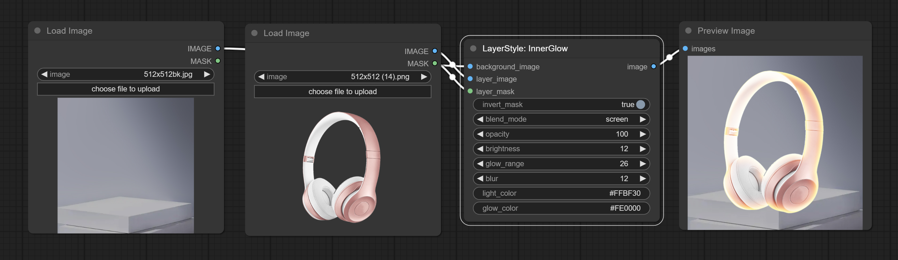

Node options:  
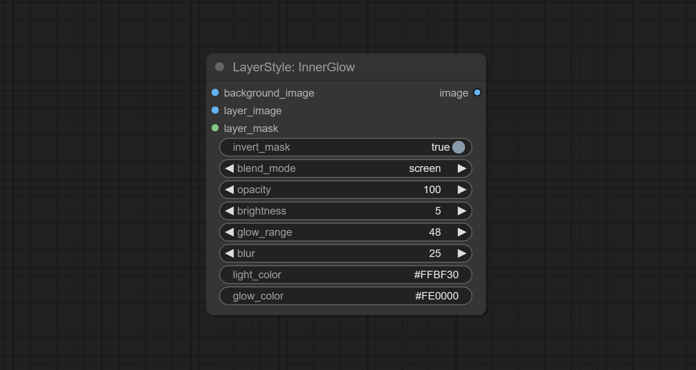
* background_image<sup>1</sup>: The background image.
* layer_image<sup>1</sup>: Layer image for composite.
* layer_mask<sup>1,2</sup>: Mask for layer_image, grow are generated according to their shape.
* invert_mask: Whether to reverse the mask.
* blend_mode<sup>3</sup>: Blending mode of glow.
* opacity: Opacity of glow.
* brightness: Luminance of light.
* glow_range: range of glow.
* blur：blur of glow.
* light_color<sup>4</sup>: Center part color of glow.
* glow_color<sup>4</sup>: Edge part color of glow.
* [note](#notes)


### <a id="table1">Stroke</a>
Generate a stroke of layer。
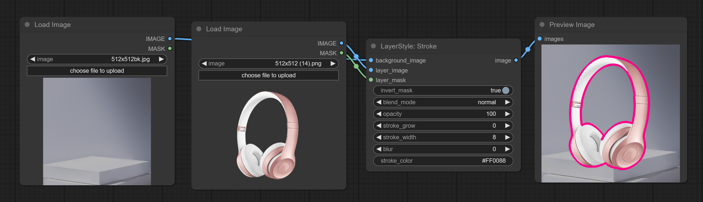

Node options:   
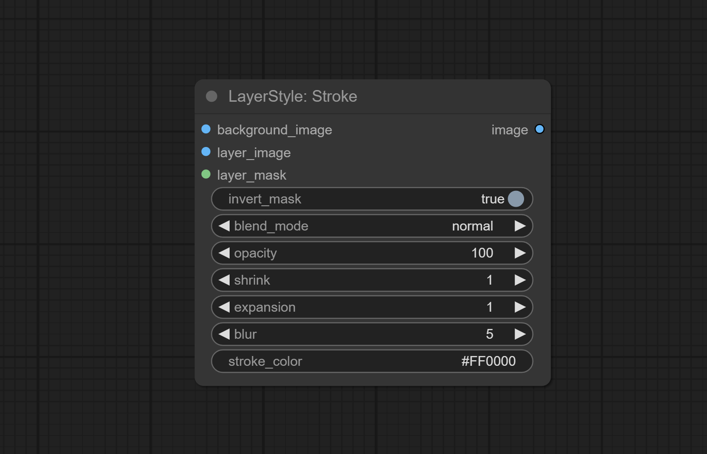
* background_image<sup>1</sup>: The background image.
* layer_image<sup>1</sup>: Layer image for composite.
* layer_mask<sup>1,2</sup>: Mask for layer_image, stroke are generated according to their shape.
* invert_mask: Whether to reverse the mask.
* blend_mode<sup>3</sup>: Blending mode of stroke.
* opacity: Opacity of stroke.
* stroke_grow: Stroke expansion/contraction amplitude, positive values indicate expansion and negative values indicate contraction.
* stroke_width: Stroke width.
* blur: Blur of stroke.
* stroke_color<sup>4</sup>: Stroke color, described in hexadecimal RGB format.
* [note](#notes)


### <a id="table1">GradientOverlay</a>
Generate gradient overlay
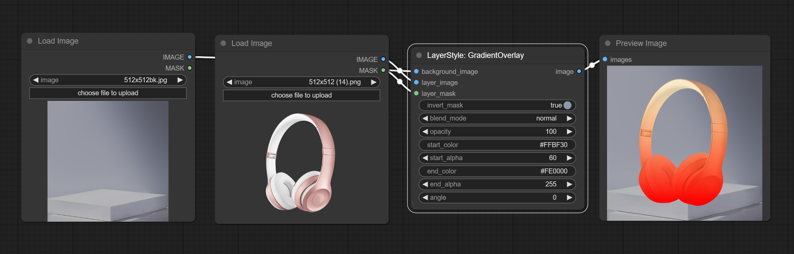

Node options:   
* background_image<sup>1</sup>: The background image.
* layer_image<sup>1</sup>: Layer image for composite.
* layer_mask<sup>1,2</sup>: Mask for layer_image.
* invert_mask: Whether to reverse the mask.
* blend_mode<sup>3</sup>: Blending mode of gradient.
* opacity: Opacity of stroke.
* start_color: Color at the beginning of the gradient.
* start_alpha: Transparency at the beginning of the gradient.
* end_color: Color at the end of the gradient.
* end_alpha: Transparency at the end of the gradient.
* angle: Gradient rotation angle.
* [note](#notes)


### <a id="table1">ColorOverlay</a>
Generate color overlay


Node options:
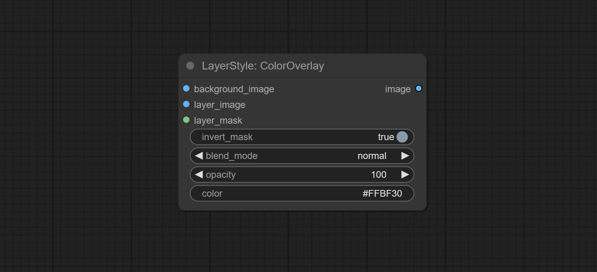
* background_image<sup>1</sup>: The background image.
* layer_image<sup>1</sup>: Layer image for composite.
* layer_mask<sup>1,2</sup>: Mask for layer_image.
* invert_mask: Whether to reverse the mask.
* blend_mode<sup>3</sup>: Blending mode of color.
* opacity: Opacity of stroke.
* color: Color of overlay.
* [note](#notes)

# <a id="table1">LayerColor</a>

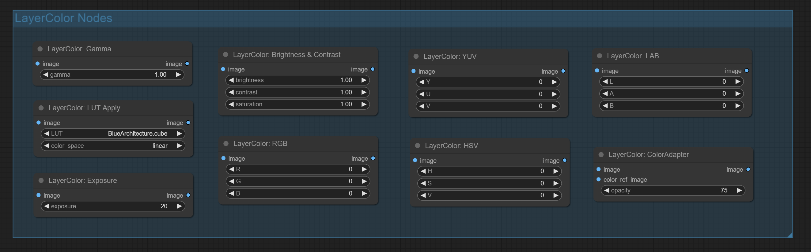

### <a id="table1">LUT</a> Apply
Apply LUT to the image. only supports .cube format.

Node options:  
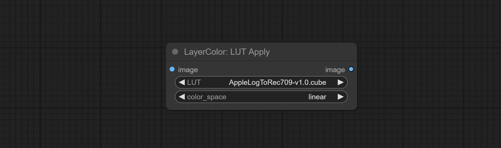
* LUT<sup>*</sup>: Here is a list of available. cube files in the LUT folder, and the selected LUT files will be applied to the image.
* color_space: For regular image, please select linear, for image in the log color space, please select log.

<sup>*</sup>LUT folder is defined in resource_dir.ini, this file is located in the root directory of the plugin. 
Open the text editing software and find the line starting with "LUT_dir=", after "=", enter the custom folder path name. all .cube files in this folder will be collected and displayed in the node list during ComfyUI initialization.
If the folder set in ini is invalid, the LUT folder that comes with the plugin will be enabled.

### <a id="table1">AutoBrightness</a>
Automatically adjust too dark or too bright image to moderate brightness, and support mask input. When  mask input, only the content of the mask part is used as the data source of the automatic brightness. The output is still the whole adjusted image.
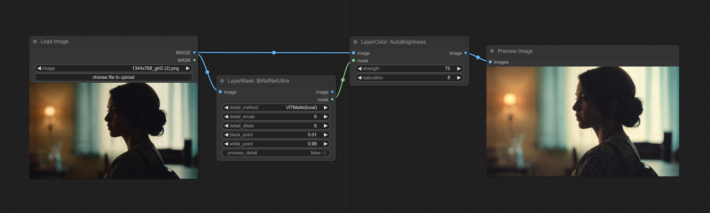

Node options:  
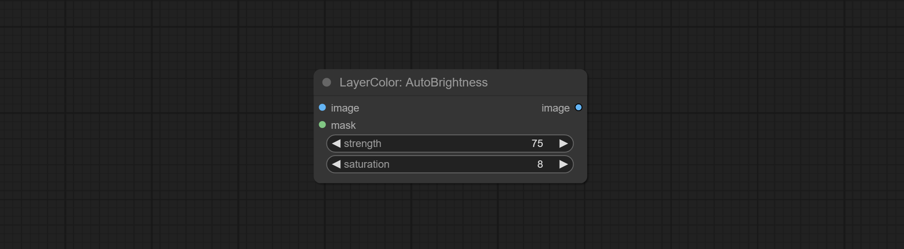
* strength: Automatically adjust the intensity of the brightness. The larger the value, the more biased towards the middle value, the greater the difference from the original picture.
* saturation: Color saturation. Changes in brightness usually result in changes in color saturation, where appropriate compensation can be adjusted.

### <a id="table1">ColorAdapter</a>
Auto adjust the color tone of the image to resemble the reference image.
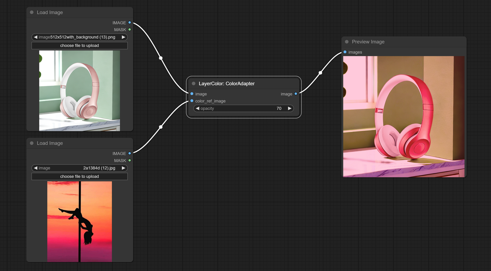

Node options:  
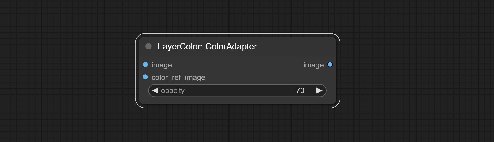
* opacity: The opacity of an image after adjusting its color tone.

### <a id="table1">Exposure</a>
Change the exposure of the image.
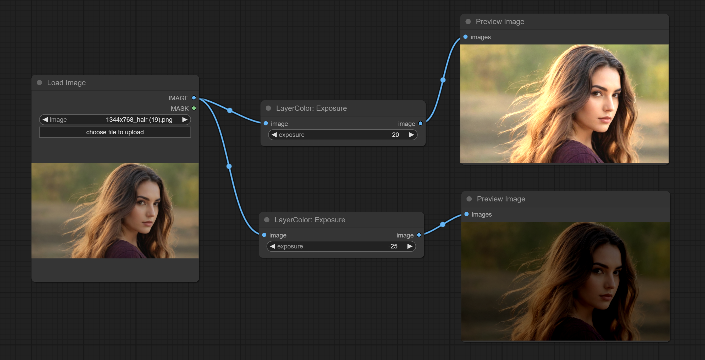

### Color of Shadow & <a id="table1">Highlight</a>
Adjust the color of the dark and bright parts of the image.
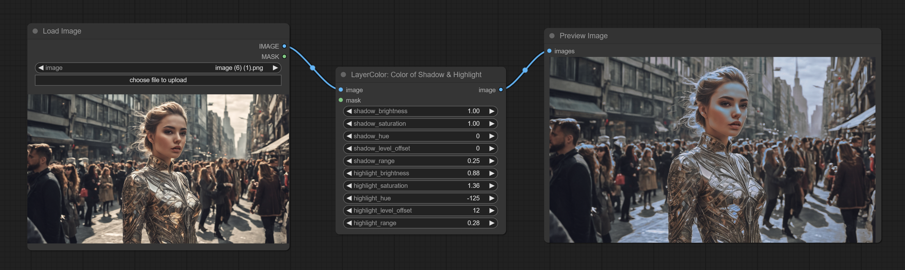

Node options:  
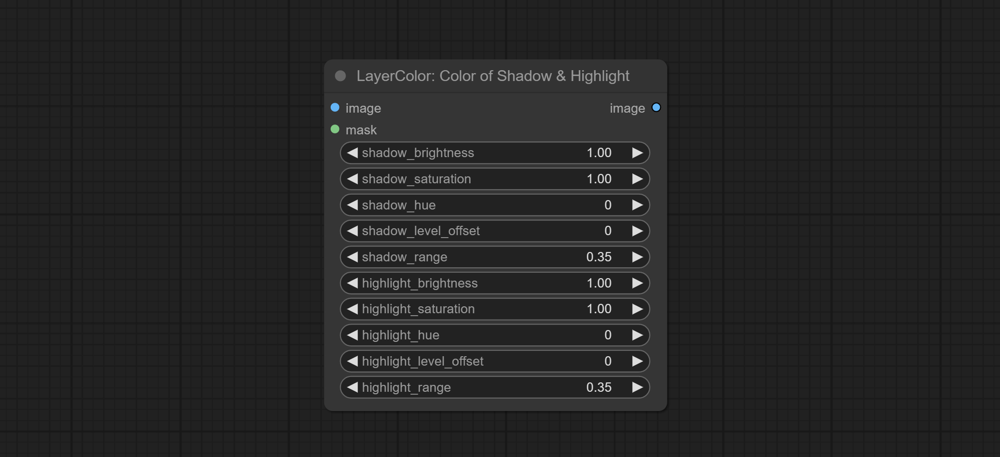
* image: The input image.
* mask: Optional input. if there is input, only the colors within the mask range will be adjusted.
* shadow_brightness: The brightness of the dark area.
* shadow_saturation: The color saturation in the dark area.
* shadow_hue: The color hue in the dark area.
* shadow_level_offset: The offset of values in the dark area, where larger values bring more areas closer to the bright into the dark area.
* shadow_range: The transitional range of the dark area.
* highlight_brightness:  The brightness of the highlight area.
* highlight_saturation: The color saturation in the highlight area.
* highlight_hue: The color hue in the highlight area.
* highlight_level_offset: The offset of values in the highlight area, where larger values bring more areas closer to the dark into the highlight area.
* highlight_range: The transitional range of the highlight area.

Node option:  
* exposure: Exposure value. Higher values indicate brighter image.

### <a id="table1">Gamma</a>
Change the gamma value of the image.

Node options:  
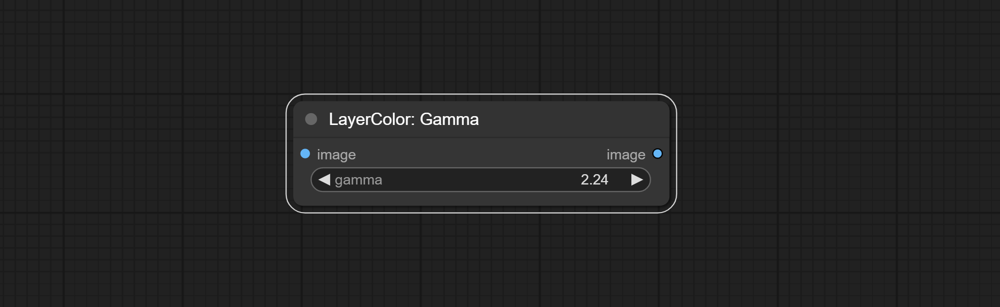
* gamma: Value of the Gamma.

### <a id="table1">Brightness</a> & Contrast
Change the brightness, contrast, and saturation of the image.

Node options:  
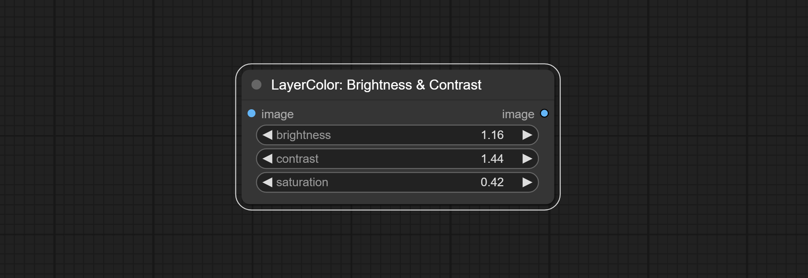
* brightness: Value of brightness.
* contrast: Value of contrast.
* saturation: Value of saturation.

### <a id="table1">RGB</a>
Adjust the RGB channels of the image.

Node options:  
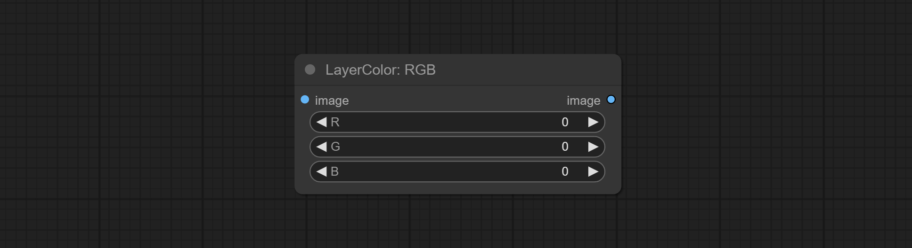
* R: R channel.
* G: G channel.
* B: B channel.

### <a id="table1">YUV</a>
Adjust the YUV channels of the image.

Node options:  
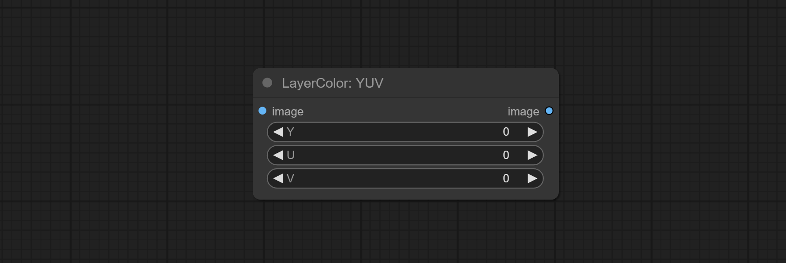
* Y: Y channel.
* U: U channel.
* V: V channel.

### <a id="table1">LAB</a>
Adjust the LAB channels of the image.

Node options:  
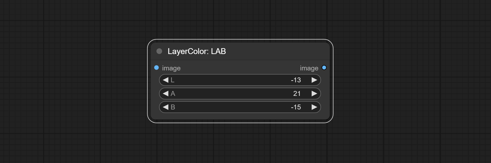
* L: L channel.
* A: A channel.
* B: B channel.

### <a id="table1">HSV</a>
Adjust the HSV channels of the image.

Node options:  

* H: H channel.
* S: S channel.
* V: V channel.


# <a id="table1">LayerUtility</a>
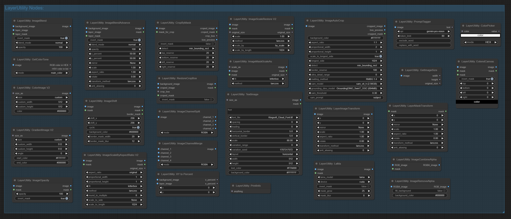


### <a id="table1">ImageBlendAdvance</a>
Used for compositing layers, allowing for compositing layer images of different sizes on the background image, and setting positions and transformations. multiple mixing modes are available for selection, and transparency can be set.

The node provide layer transformation_methods and anti_aliasing options. helps improve the quality of synthesized images.

The node provides mask output that can be used for subsequent workflows.
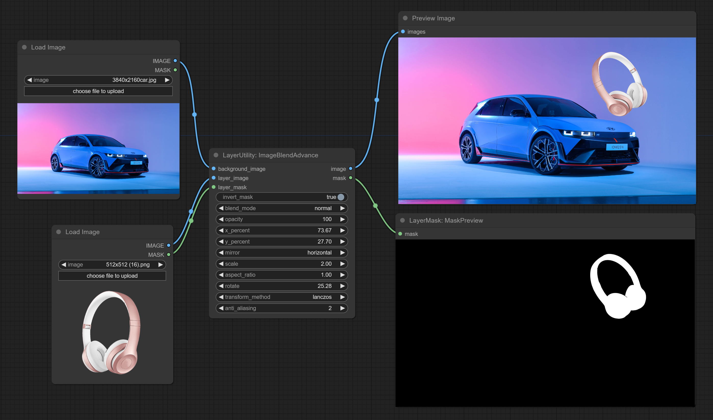

Node options:   
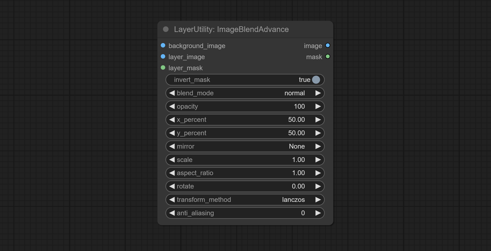
* background_image: The background image.
* layer_image<sup>5</sup>: Layer image for composite.
* layer_mask<sup>2,5</sup>: Mask for layer_image.
* invert_mask: Whether to reverse the mask.
* blend_mode<sup>3</sup>: Blending mode.
* opacity: Opacity of blend.
* x_percent: Horizontal position of the layer on the background image, expressed as a percentage, with 0 on the far left and 100 on the far right. It can be less than 0 or more than 100, indicating that some of the layer's content is outside the screen.
* y_percent: Vertical position of the layer on the background image, expressed as a percentage, with 0 on the top and 100 on the bottom. For example, setting it to 50 indicates vertical center, 20 indicates upper center, and 80 indicates lower center.
* mirror: Mirror flipping. Provide two flipping modes, horizontal flipping and vertical flipping.
* scale: Layer magnification, 1.0 represents the original size.
* aspect_ratio: Layer aspect ratio. 1.0 is the original ratio, a value greater than this indicates elongation, and a value less than this indicates flattening.
* rotate: Layer rotation degree.
* Sampling methods for layer enlargement and rotation, including lanczos, bicubic, hamming, bilinear, box and nearest. Different sampling methods can affect the image quality and processing time of the synthesized image.
* anti_aliasing: Anti aliasing, ranging from 0 to 16, the larger the value, the less obvious the aliasing. An excessively high value will significantly reduce the processing speed of the node.
* [note](#notes)

### <a id="table1">CropByMask</a>
Crop the image according to the mask range, and set the size of the surrounding borders to be retained.
This node can be used in conjunction with the [RestoreCropBox](#RestoreCropBox) and [ImageScaleRestore](#ImageScaleRestore) nodes to crop and modify upscale parts of image, and then paste them back in place.
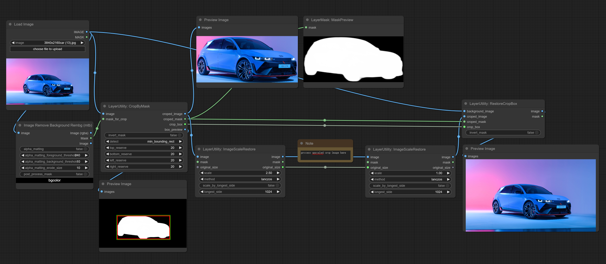

Node options:   
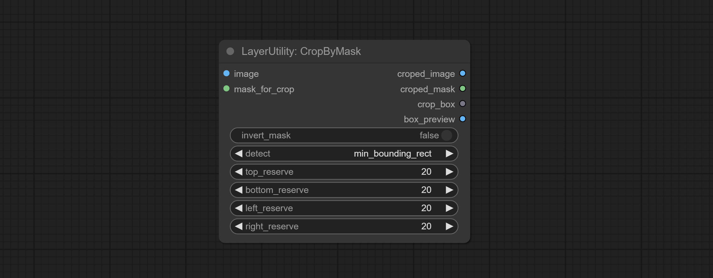
* image<sup>5</sup>: The input image.
* mask_for_crop<sup>5</sup>: Mask of the image, it will automatically be cut according to the mask range.
* invert_mask: Whether to reverse the mask.
* detect: Detection method, ```min_bounding_rect``` is the minimum bounding rectangle of block shape, ```max_inscribed_rect``` is the maximum inscribed rectangle of block shape, and ```mask-area``` is the effective area for masking pixels.
* top_reserve: Cut the top to preserve size.
* bottom_reserve: Cut the bottom to preserve size.
* left_reserve: Cut the left to preserve size.
* right_reserve: Cut the right to preserve size.
* [note](#notes)

Output:
* croped_image: The image after crop.
* croped_mask: The mask after crop.
* crop_box: The trimmed box data is used when restoring the RestoreCropBox node.
* box_preview: Preview image of cutting position, red represents the detected range, and green represents the cutting range after adding the reserved border.

### <a id="table1">CropByMaskV2</a>
The V2 upgraded version of CropByMask. Supports crop_box input, making it easy to cut layers of the same size.

The following changes have been made based on CropByMask:
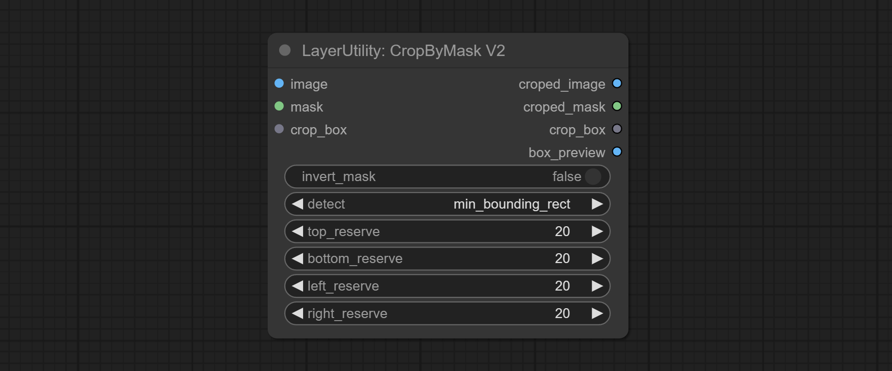
* The input ```mask_for_crop``` reanme to ```mask```。
* Add optional inputs to the ```crop_box```. If there are inputs here, mask detection will be ignored and this data will be directly used for cropping.

### <a id="table1">RestoreCropBox</a>
Restore the cropped image to the original image by [CropByMask](#CropByMask).

Node options:   
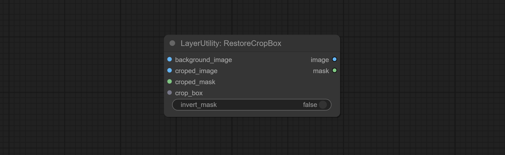
* background_image: The original image before cutting.
* croped_image<sup>5</sup>: The cropped image. If the middle is enlarged, the size needs to be restored before restoration.
* croped_mask<sup>5</sup>: The cut mask.
* crop_box: Box data during cutting.
* invert_mask: Whether to reverse the mask.
* [note](#notes)

### <a id="table1">CropBoxResolve</a>
Parsing the ```corp_box```  to ```x``` , ```y``` , ```width``` , ```height``` .
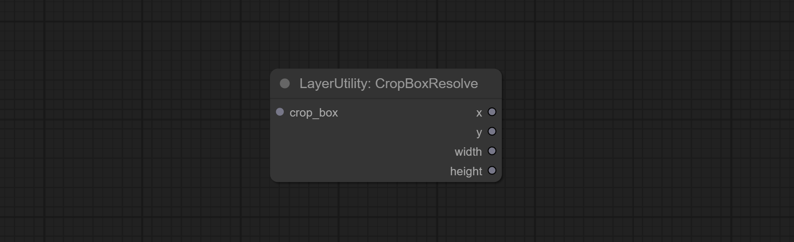

### <a id="table1">ImageScaleRestore</a>
Image scaling. when this node is used in pairs, the image can be automatically restored to its original size on the second node.
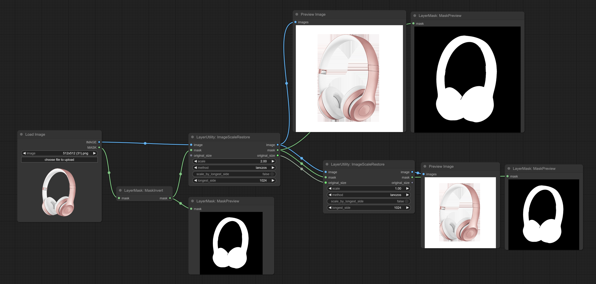

Node options:   
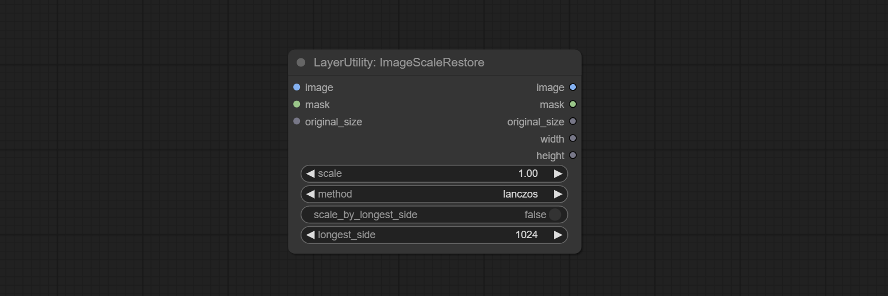
* image<sup>5</sup>: The input image.
* mask<sup>2,5</sup>: Mask of image.
* original_size: Optional input, used to restore the image to its original size.
* scale: Scale ratio. when the original_size have input, or scale_ by_longest_side is set to True, this setting will be ignored.
* scale_by_longest_side: Allow scaling by long edge size.
* longest_side: When the scale_by_longest_side is set to True, this will be used this value to the long edge of the image. when the original_size have input, this setting will be ignored.

Outputs:
* image: The scaled image.
* mask: If have mask input, the scaled mask will be output.
* original_size: The original size data of the image is used for subsequent node recovery.

### <a id="table1">ImageScaleRestoreV2</a>
The V2 upgraded version of ImageScaleRestore.

Node options:   
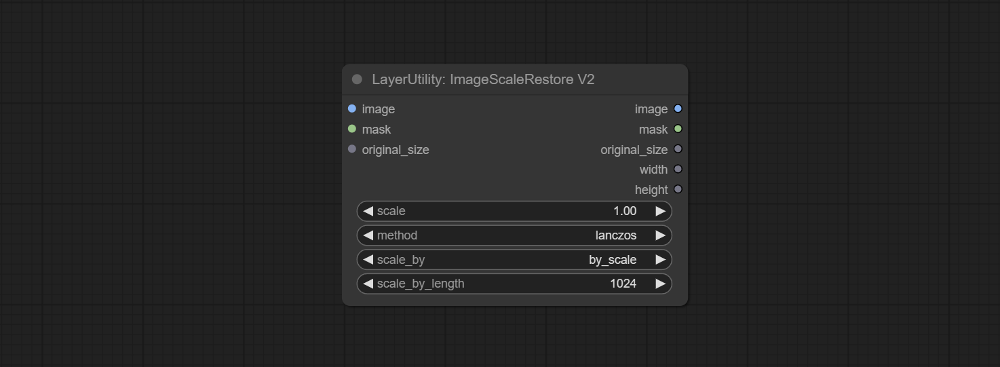
The following changes have been made based on ImageScaleRestore:
* scale_by: Allow scaling by specified size on long or short sides.
* scale_by_length: When scale_by is set to "longest", this will be used as the length of the long edge of the image; When set to "shortest", it serves as the length of the short edge.

### <a id="table1">ImageMaskScaleAs</a>
Scale the image or mask to the size of the reference image (or reference mask).


Node options:
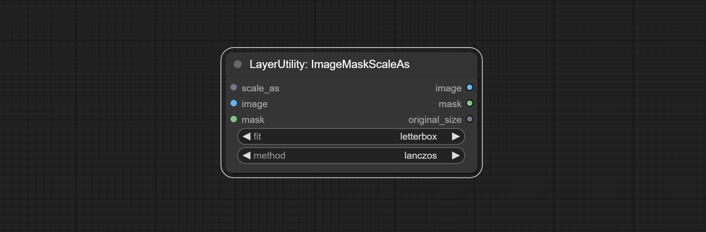
* scale_as<sup>*</sup>: Reference size. It can be an image or a mask.
* image: Image to be scaled. this option is optional input. if there is no input, a black image will be output.
* mask: Mask to be scaled. this option is optional input. if there is no input, a black mask will be output.
* fit: Scale aspect ratio mode. when the width to height ratio of the original image does not match the scaled size, there are three modes to choose from, 
The _letterbox_ mode retains the complete frame and fills in the blank spaces with black; 
The _crop_ mode retains the complete short edge, and any excess of the long edge will be cut off;
The _fill_ mode does not maintain frame ratio and fills the screen with width and height.
* method: Scaling sampling methods, including lanczos, bicubic, hamming, bilinear, box, and nearest.

<sup>*</sup>Only limited to input images and masks. forcing the integration of other types of inputs will result in node errors.

Outputs:
* image: If there is an image input, the scaled image will be output.
* mask: If there is a mask input, the scaled mask will be output.
* original_size: The original size data of the image is used for subsequent node recovery.

### <a id="table1">ImageScaleByAspectRatio</a>
Scale the image or mask by aspect ratio. the scaled size can be rounded to a multiple of 8 or 16, and can be scaled to the long side size.
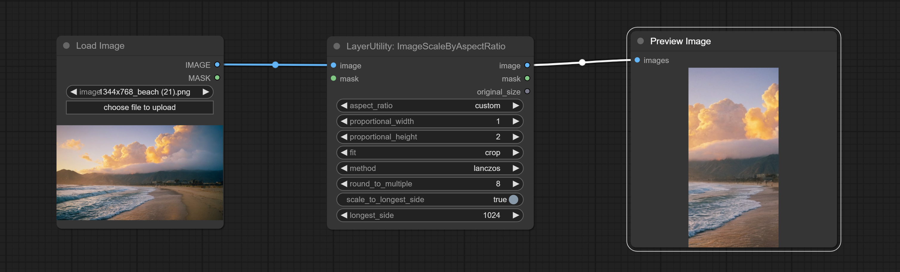

Node options:   
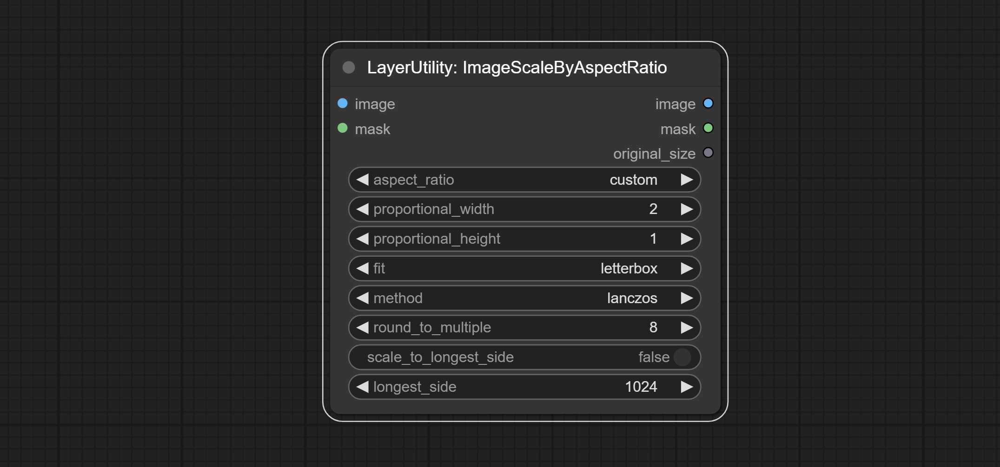
* aspect_ratio: Here are several common frame ratios provided. alternatively, you can choose "original" to keep original ratio or customize the ratio using "custom".
* proportional_width: Proportional width. if the aspect ratio option is not "custom", this setting will be ignored.
* proportional_height: Proportional height. if the aspect ratio option is not "custom", this setting will be ignored.
* fit: Scale aspect ratio mode. when the width to height ratio of the original image does not match the scaled size, there are three modes to choose from, 
The _letterbox_ mode retains the complete frame and fills in the blank spaces with black; 
The _crop_ mode retains the complete short edge, and any excess of the long edge will be cut off;
The _fill_ mode does not maintain frame ratio and fills the screen with width and height.
* method: Scaling sampling methods, including lanczos, bicubic, hamming, bilinear, box, and nearest.
* round_to_multiple: Round multiples. for example, setting it to 8 will force the width and height to be multiples of 8.
* scale_by_longest_side: Allow scaling by long edge size.
* longest_side: When the scale_by_longest_side is set to True, this will be used this value to the long edge of the image. when the original_size have input, this setting will be ignored.


### <a id="table1">ImageScaleByAspectRatioV2</a>
V2 Upgraded Version of ImageScaleByAspectRatio

Node options:   
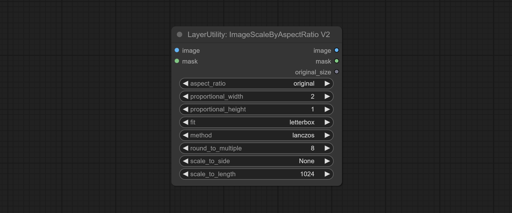
The following changes have been made based on ImageScaleByAspectRatio:
* scale_to_side: Allow scaling by specified size on long or short sides.
* scale_to_length: When scale_by_side is set to "longest", this will be used as the length of the long edge of the image; When set to "shortest", it serves as the length of the short edge.

### <a id="table1">PromptTagger</a>
Inference the prompts based on the image. it can replace key word for the prompt. This node currently uses Google Gemini API as the backend service. Please ensure that the network environment can use Gemini normally.
Please apply for your API key on [Google AI Studio](https://makersuite.google.com/app/apikey),  And fill it in ```api_key.ini```, This file is located in the root directory of the plugin. Open it using text editing software, fill in your API key after ```google_api_key=``` and save it.


Node options:   


* api: The Api used. At present, there is only one option, "gemini-pro-vision".
* token_limit: The maximum token limit for generating prompt words.
* exclude_word: Keywords that need to be excluded.
* replace_with_word: That word will replace the exclude_word.


### <a id="table1">PromptEmbellish</a>
Enter simple prompt words, output polished prompt words, and support inputting images as references. This node currently uses Google Gemini API as the backend service. Please ensure that the network environment can use Gemini normally.
Please apply for your API key on [Google AI Studio](https://makersuite.google.com/app/apikey),  And fill it in ```api_key.ini```, This file is located in the root directory of the plugin. Open it using text editing software, fill in your API key after ```google_api_key=``` and save it.


Node options:   
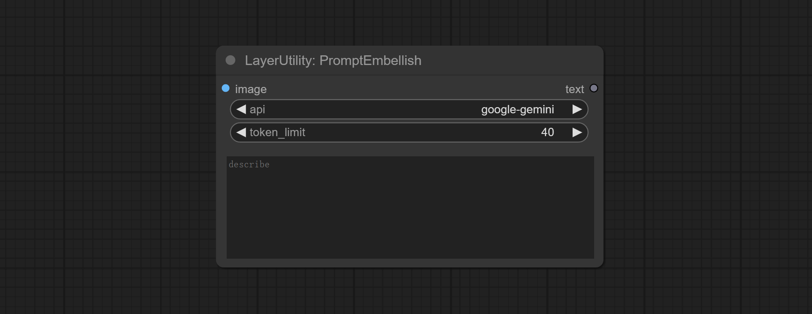

* image: Optional, input image as a reference for prompt words.
* api: The Api used. At present, there is only one option, "google-gemini".
* token_limit: The maximum token limit for generating prompt words.
* discribe: Enter a simple description here. supports Chinese text input.

### <a id="table1">ImageShift</a>
Shift the image. this node supports the output of displacement seam masks, making it convenient to create continuous textures.
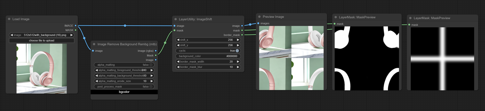

Node options:   
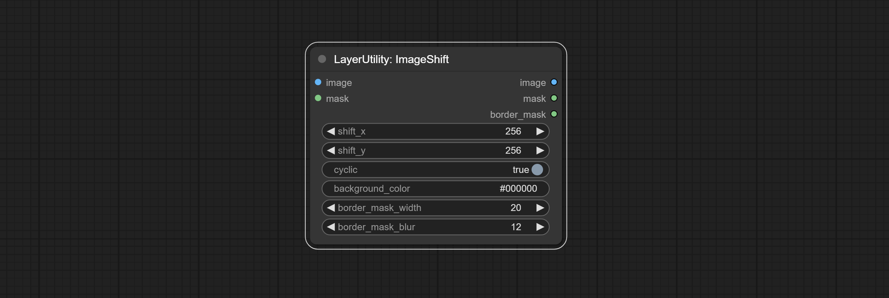
* image<sup>5</sup>: The input image.
* mask<sup>2,5</sup>: The mask of image.
* shift_x: Horizontal distance of shift.
* shift_y: Vertical distance of shift.
* cyclic: Is the part of displacement that is out of bounds cyclic.
* background_color: Background color. if cyclic is set to False, the setting here will be used as the background color.
* border_mask_width: Border mask width.
* border_mask_blur: Border mask blur.
* [note](#notes)

### <a id="table1">ImageBlend</a>
A simple node for composit layer image and background image, multiple blend modes are available for option, and transparency can be set.
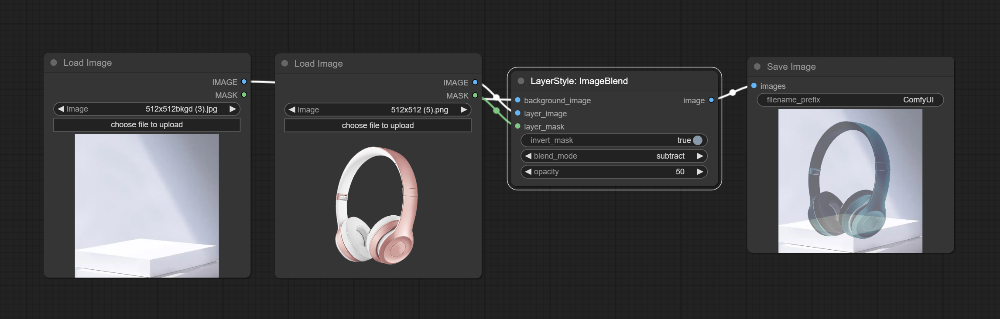

Node options:
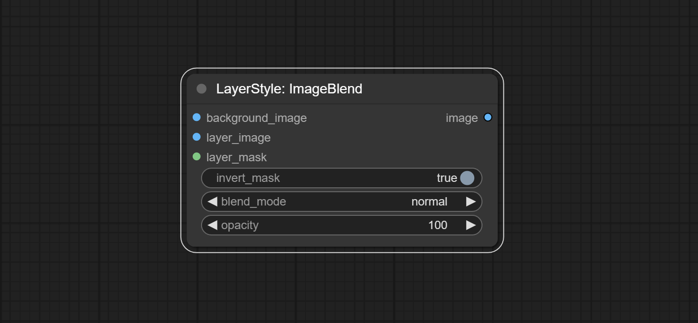
* background_image<sup>1</sup>: The background image.
* layer_image<sup>1</sup>: Layer image for composite.
* layer_mask<sup>1,2</sup>: Mask for layer_image.
* invert_mask: Whether to reverse the mask.
* blend_mode<sup>3</sup>: Blending mode.
* opacity: Opacity of blend.
* [note](#notes)

### <a id="table1">ImageOpacity</a>
Adjust image opacity
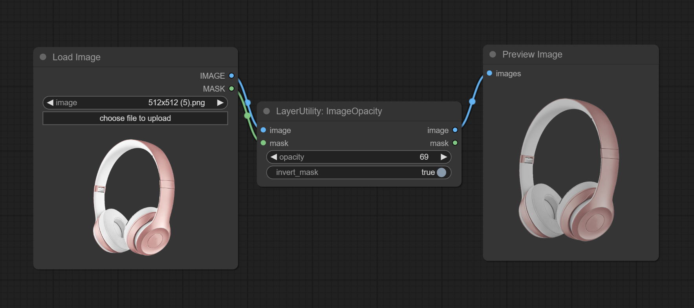

Node option:   
* image<sup>5</sup>: Image input, supporting RGB and RGBA. if is RGB, the alpha channel of the entire image will be automatically added.
* mask<sup>2,5</sup> : Mask input.
* invert_mask: Whether to reverse the mask.
* opacity: Opacity of image.
* [note](#notes)

### <a id="table1">ColorPicker</a>
Modify web extensions from [mtb nodes](https://github.com/melMass/comfy_mtb). Select colors on the color palette and output RGB values, thanks to the original author.
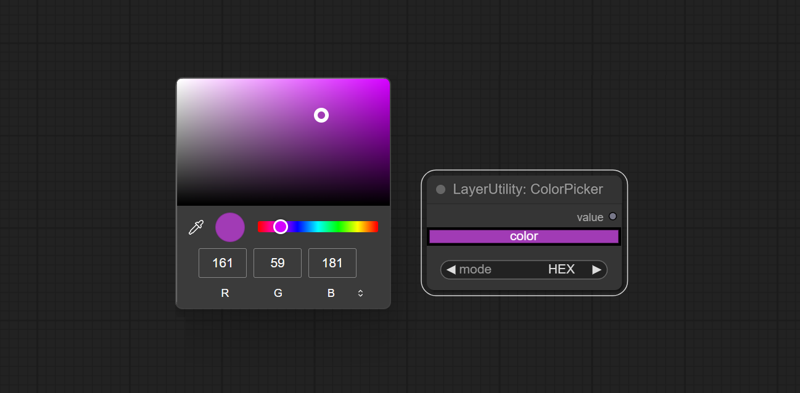

Node options:
* mode： The output format is available in hexadecimal (HEX) and decimal (DEC).  

Output type: 
* value: String format.

### <a id="table1">GetColorTone</a>
Obtain the main color or average color from the image and output RGB values.
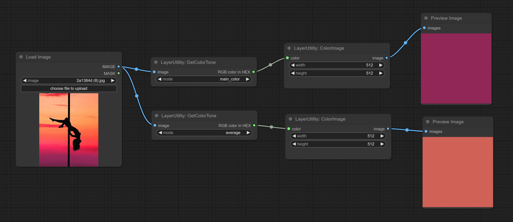

Node options:
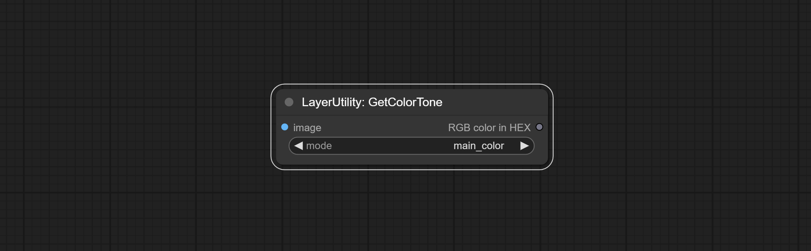
* mode： There are two modes to choose from, with the main color and average color.

Output type:
* RGB color in HEX: The RGB color described by hexadecimal RGB format, like '#FA3D86'.
* HSV color in list: The HSV color described by python's list data format.

### <a id="table1">GetColorToneV2</a>
V2 upgrade of GetColorTone. You can specify the dominant or average color to get the body or background.
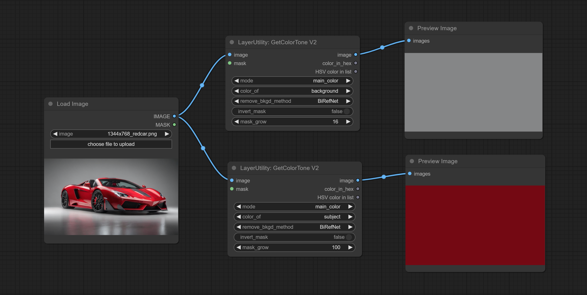

The following changes have been made on the basis of GetColorTong:
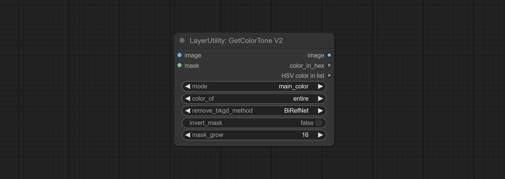
* color_of: Provides three options, entire, background, and subject, to select the color of the entire picture, background, or body, respectively.
* remove_background_method: There are two methods of background recognition: BiRefNet and RMBG V1.4.
* invert_mask: Whether to reverse the mask.
* mask_grow: Mask expansion. For subject, a larger value brings the obtained color closer to the color at the center of the body.

Output:
* image: Solid color picture output, the size is the same as the input picture.

### <a id="table1">ExtendCanvas</a>
Extend the canvas


Node options:
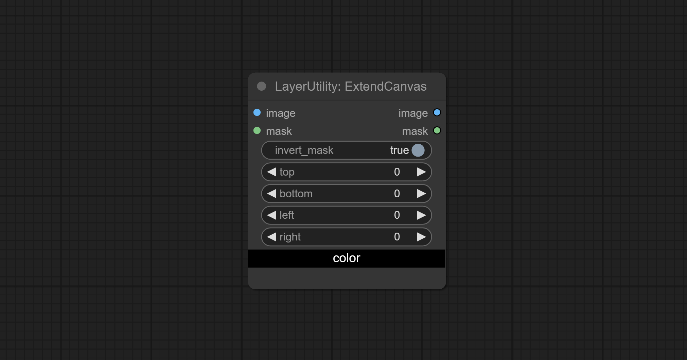
* invert_mask: Whether to reverse the mask.
* top: Top extension value.
* bottom: Bottom extension value.
* left: Left extension value.
* right: Right extension value.
* color; Color of canvas.

### XY to <a id="table1">Percent</a>
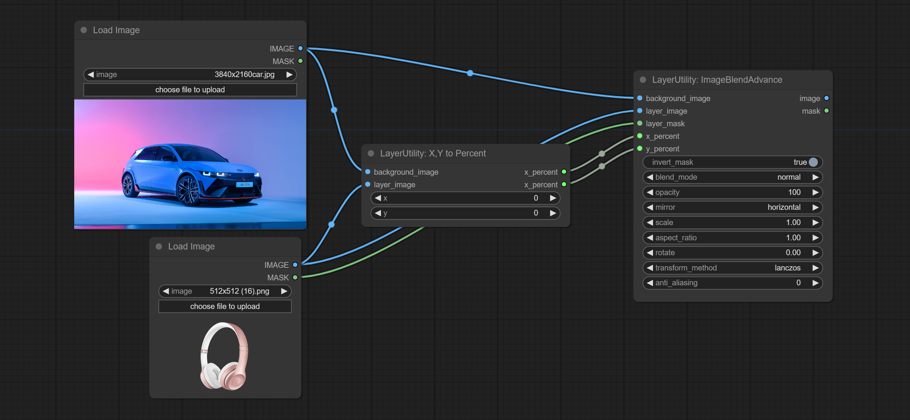
Convert absolute coordinates to percentage coordinates.

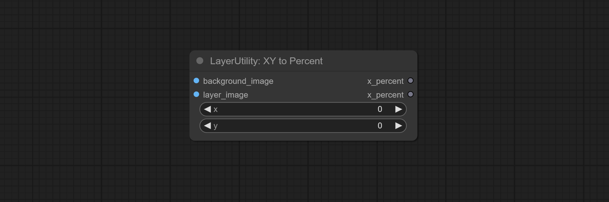
Node options:
* x: Value of X.
* y: Value of Y.

### <a id="table1">LayerImageTransform</a>
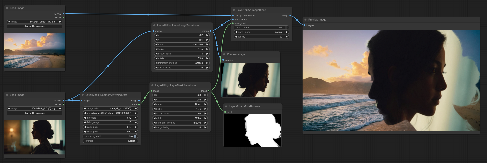
This node is used to transform layer_image separately, which can change size, rotation, aspect ratio, and mirror flip without changing the image size.

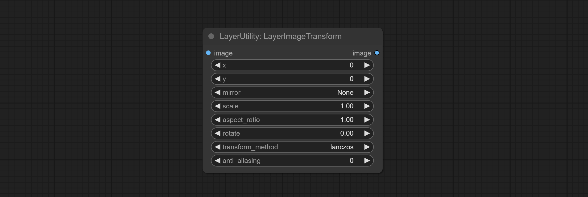
Node options:
* x: Value of X.
* y: Value of Y.
* mirror: Mirror flipping. Provide two flipping modes, horizontal flipping and vertical flipping.
* scale: Layer magnification, 1.0 represents the original size.
* aspect_ratio: Layer aspect ratio. 1.0 is the original ratio, a value greater than this indicates elongation, and a value less than this indicates flattening.
* rotate: Layer rotation degree.
* Sampling methods for layer enlargement and rotation, including lanczos, bicubic, hamming, bilinear, box and nearest. Different sampling methods can affect the image quality and processing time of the synthesized image.
* anti_aliasing: Anti aliasing, ranging from 0 to 16, the larger the value, the less obvious the aliasing. An excessively high value will significantly reduce the processing speed of the node.


### <a id="table1">LayerMaskTransform</a>
Similar to LayerImageTransform node, this node is used to transform the layer_mask separately, which can scale, rotate, change aspect ratio, and mirror flip without changing the mask size.

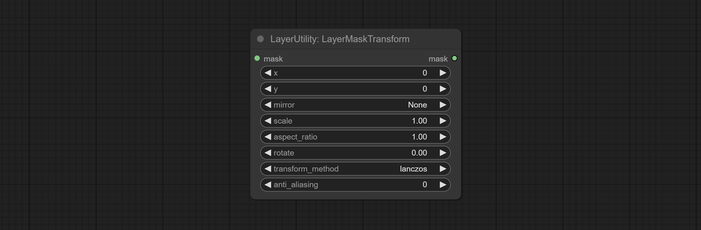
Node options:
* x: Value of X.
* y: Value of Y.
* mirror: Mirror flipping. Provide two flipping modes, horizontal flipping and vertical flipping.
* scale: Layer magnification, 1.0 represents the original size.
* aspect_ratio: Layer aspect ratio. 1.0 is the original ratio, a value greater than this indicates elongation, and a value less than this indicates flattening.
* rotate: Layer rotation degree.
* Sampling methods for layer enlargement and rotation, including lanczos, bicubic, hamming, bilinear, box and nearest. Different sampling methods can affect the image quality and processing time of the synthesized image.
* anti_aliasing: Anti aliasing, ranging from 0 to 16, the larger the value, the less obvious the aliasing. An excessively high value will significantly reduce the processing speed of the node.


### <a id="table1">ColorImage</a>

Generate an image of a specified color and size.

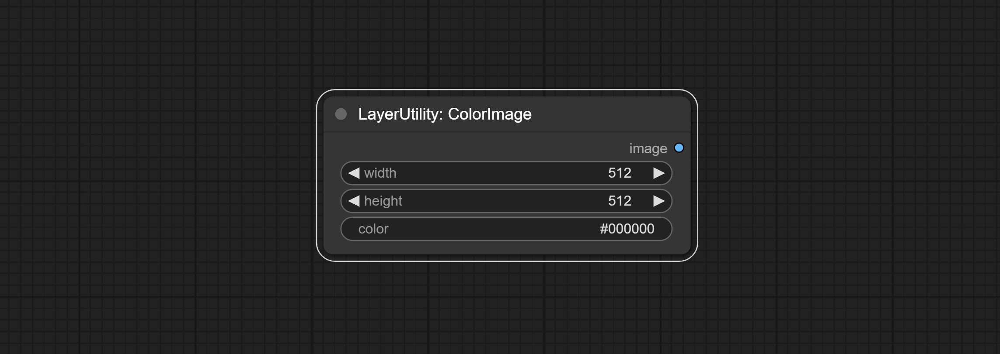
Node options:
* width: Width of the image.
* height: Height of the image.
* color<sup>4</sup>: Color of the image.

### <a id="table1">ColorImageV2</a>
The V2 upgraded version of ColorImage.


The following changes have been made based on ColorImage:
* size_as<sup>*</sup>: Input image or mask here to generate image according to its size. Note that this input takes priority over other size settings.
* size<sup>**</sup>: Size preset. the preset can be customized by the user. if have size_as input, this option will be ignored.
* custom_width: Image width. it valid when size is set to "custom". if have size_as input, this option will be ignored.
* custom_height: Image height. it valid when size is set to "custom". if have size_as input, this option will be ignored.

<sup>*</sup>Only limited to input images and masks. forcing the integration of other types of inputs will result in node errors.
<sup>**</sup>The preset size is defined in ```custom_size.ini```, which is located in the root directory of the plugin. Open with text editing software. Each row represents a size, with the first value being width and the second being height, separated by a lowercase "x" in the middle. To avoid errors, please do not enter extra characters.


### <a id="table1">GradientImage</a>

Generate an image with a specified size and color gradient.

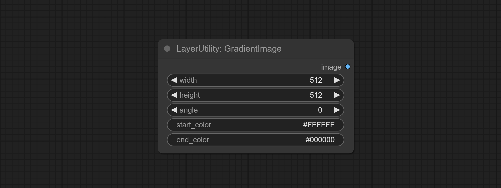
Node options:
* width: Width of the image.
* height: Height of the image.
* angle: Angle of gradient.
* start_color<sup>4</sup>: Color of the begging.
* end_color<sup>4</sup>: Color of the ending.

### <a id="table1">GradientImageV2</a>
The V2 upgraded version of GradientImage.

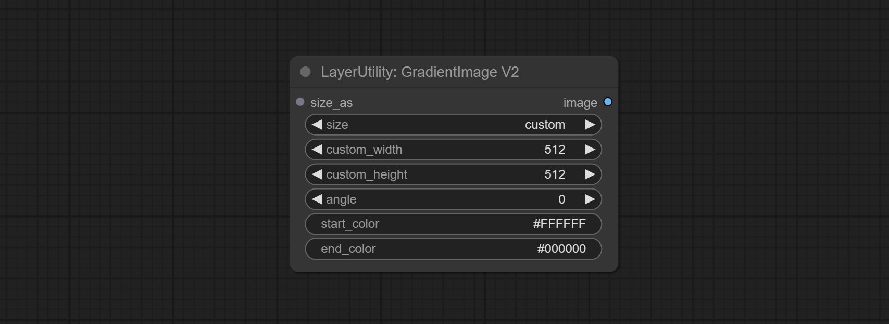
The following changes have been made based on GradientImage:
* size_as<sup>*</sup>: Input image or mask here to generate image according to its size. Note that this input takes priority over other size settings.
* size<sup>**</sup>: Size preset. the preset can be customized by the user. if have size_as input, this option will be ignored.
* custom_width: Image width. it valid when size is set to "custom". if have size_as input, this option will be ignored.
* custom_height: Image height. it valid when size is set to "custom". if have size_as input, this option will be ignored.

<sup>*</sup>Only limited to input images and masks. forcing the integration of other types of inputs will result in node errors.
<sup>**</sup>The preset size is defined in ```custom_size.ini```, which is located in the root directory of the plugin. Open with text editing software. Each row represents a size, with the first value being width and the second being height, separated by a lowercase "x" in the middle. To avoid errors, please do not enter extra characters.

### <a id="table1">ImageRewardFilter</a>
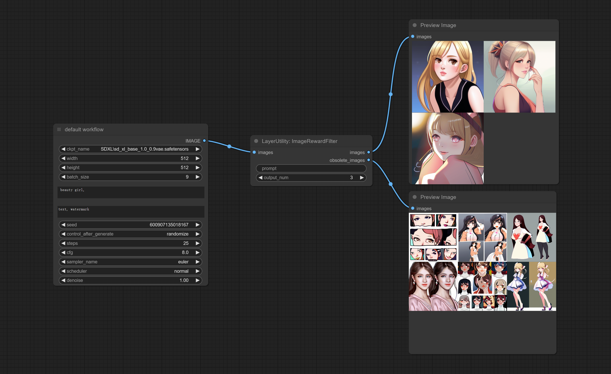
Rating bulk pictures and outputting top-ranked pictures. it used [ImageReward] (https://github.com/THUDM/ImageReward) for image scoring, thanks to the original authors.

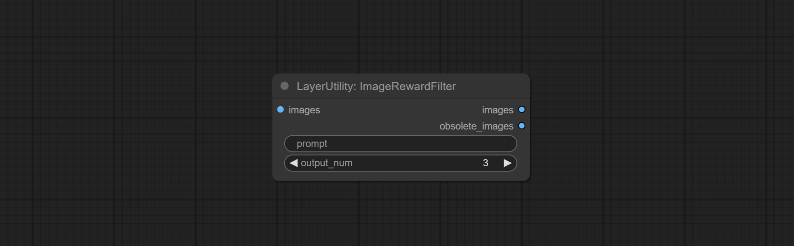
Node options:
* prompt: Optional input. Entering prompt here will be used as a basis to determine how well it matches the picture.
* output_nun: Number of pictures outputted. This value should be less than the picture batch.

Outputs：
* images: Bulk pictures output from high to low in order of rating.
* obsolete_images: Knockout pictures. Also output in order of rating from high to low.

### <a id="table1">SimpleTextImage</a>
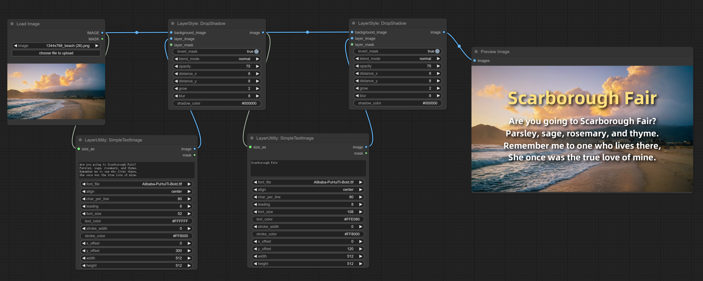
Generate simple typesetting images and masks from text. This node references some of the functionalities and code of [ZHO-ZHO-ZHO/ComfyUI-Text_Image-Composite](https://github.com/ZHO-ZHO-ZHO/ComfyUI-Text_Image-Composite), thanks to the original author.

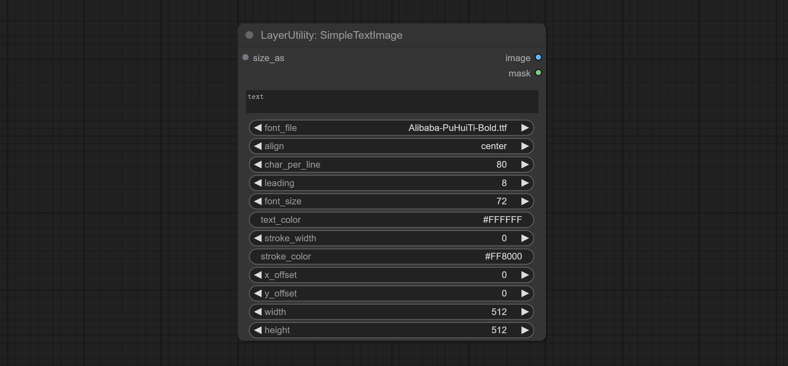
Node options:
* size_as<sup>*</sup>: The input image or mask here will generate the output image and mask according to their size. this input takes priority over the width and height below.
* font_file<sup>**</sup>: Here is a list of available font files in the font folder, and the selected font files will be used to generate images.
* align: Alignment options. There are three options: center, left, and right.
* char_per_line: The number of characters per line, any excess will be automatically wrapped.
* leading: The leading space.
* font_size: The size of font.
* text_color: The color of text.
* stroke_width: The width of stroke.
* stroke_color: The color of stroke.
* x_offset: The horizontal offset of the text position.
* y_offset: The vertical offset of the text position.
* width: Width of the image. If there is a size_as input, this setting will be ignored.
* height: Height of the image. If there is a size_as input, this setting will be ignored.


<sup>*</sup>Only limited to input image and mask. forcing the integration of other types of inputs will result in node errors.

<sup>**</sup>The font folder is defined in ```resource_dir.ini```, this file is located in the root directory of the plugin. 
Open the text editing software and find the line starting with "FONT_dir=", after "=", enter the custom folder path name. all font files in this folder will be collected and displayed in the node list during ComfyUI initialization.
If the folder set in ini is invalid, the font folder that comes with the plugin will be enabled.


### <a id="table1">TextImage</a>
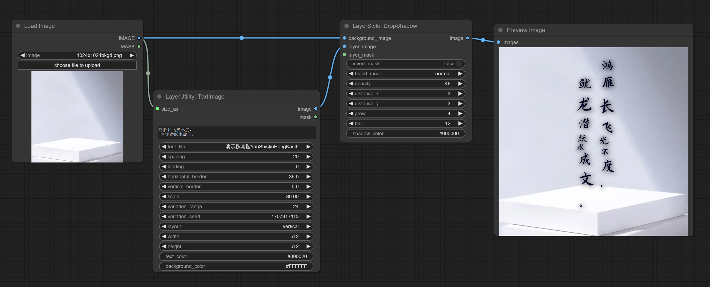
Generate images and masks from text. support for adjusting the spacing between words and lines, horizontal and vertical adjustments, it can set random changes in each character, including size and position.

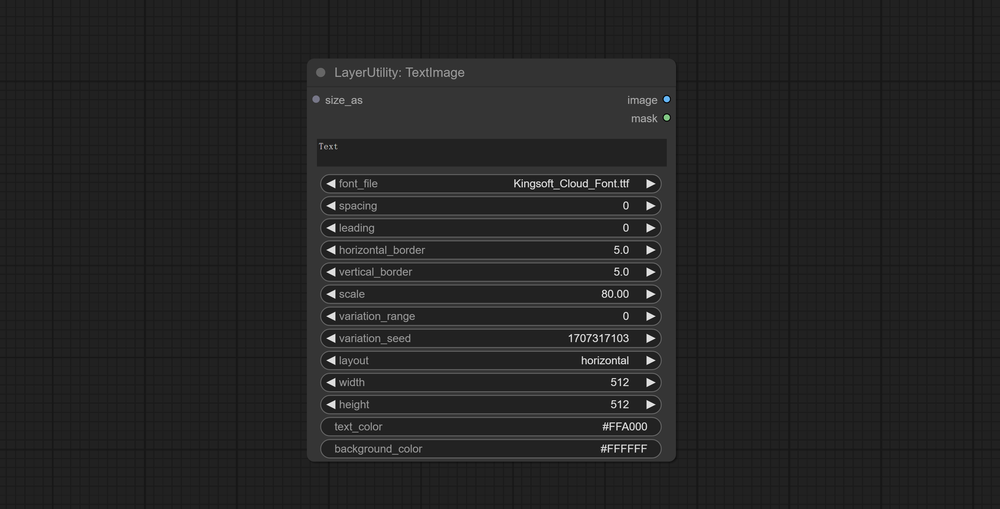
Node options:
* size_as<sup>*</sup>: The input image or mask here will generate the output image and mask according to their size. this input takes priority over the width and height below.
* font_file<sup>**</sup>: Here is a list of available font files in the font folder, and the selected font files will be used to generate images.
* spacing: Word spacing.this value is in pixels.
* leading: Row leading.this value is in pixels.
* horizontal_border: Side margin. If the text is horizontal, it is the left margin, and if it is vertical, it is the right margin. this value is represents a percentage, for example, 50 indicates that the starting point is located in the center on both sides.
* vertical_border: Top margin. this value is represents a percentage, for example, 10 indicates that the starting point is located 10% away from the top.
* scale: The overall size of the text. the initial size of text is automatically calculated based on the screen size and text content, with the longest row or column by default adapting to the image width or height. adjusting the value here will scale the text as a whole. this value is represents a percentage, for example, 60 represents scaling to 60%.
* variation_range: The range of random changes in characters. when this value is greater than 0, the character will undergo random changes in size and position, and the larger the value, the greater the magnitude of the change.
* variation_seed: The seed for randomly. fix this value to individual characters changes generated each time will not change.
* layout: Text layout. there are horizontal and vertical options to choose from.
* width: Width of the image. If there is a size_as input, this setting will be ignored.
* height: Height of the image. If there is a size_as input, this setting will be ignored.
* text_color: The color of text.
* background_color: The color of background.

<sup>*</sup>Only limited to input image and mask. forcing the integration of other types of inputs will result in node errors.

<sup>**</sup>The font folder is defined in ```resource_dir.ini```, this file is located in the root directory of the plugin. 
Open the text editing software and find the line starting with "FONT_dir=", after "=", enter the custom folder path name. all font files in this folder will be collected and displayed in the node list during ComfyUI initialization.
If the folder set in ini is invalid, the font folder that comes with the plugin will be enabled.


### <a id="table1">LaMa</a>

Erase objects from the image based on the mask. this node is repackage of [IOPaint](https://www.iopaint.com), powered by state-of-the-art AI models, thanks to the original author.    
It is have [LaMa](https://github.com/advimman/lama), [LDM](https://github.com/CompVis/latent-diffusion), [ZITS](https://github.com/DQiaole/ZITS_inpainting),[MAT](https://github.com/fenglinglwb/MAT),  [FcF](https://github.com/SHI-Labs/FcF-Inpainting), [Manga](https://github.com/msxie92/MangaInpainting) models and the SPREAD method to erase. Please refer to the original link for the introduction of each model.    
Please download the model files from [lama models(Baidu Netdisk)](https://pan.baidu.com/s/1LllR9TJHP1G9uEwWT3Mvkg?pwd=tvzv) or [lama models(Google Drive)](https://drive.google.com/drive/folders/1Aq0a4sybb3SRxi7j1e1_ZbBRjaWDdP9e?usp=sharing) to ```ComfyUI/models/lama``` folder.    

Node optons:
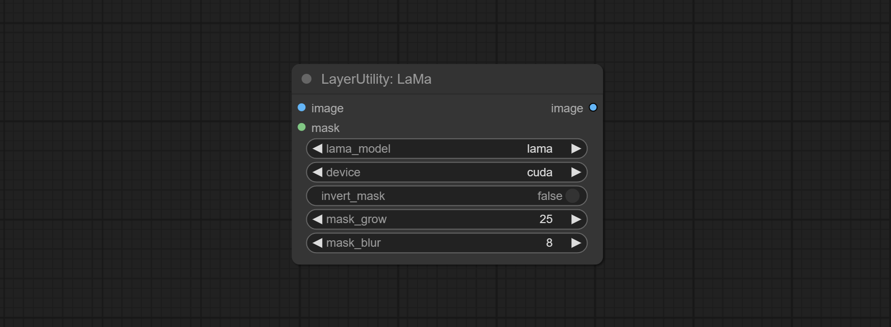
* lama_model: Choose a model or method.
* device: After correctly installing Torch and Nvidia CUDA drivers, using cuda will significantly improve running speed.
* invert_mask: Whether to reverse the mask.
* grow: Positive values expand outward, while negative values contract inward.
* blur: Blur the edge.


### <a id="table1">ImageChannelSplit</a>
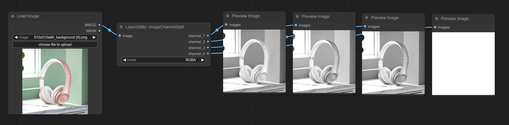
Split the image channel into individual images.

Node options:

* mode: Channel mode, include RGBA, YCbCr, LAB adn HSV.

### <a id="table1">ImageChannelMerge</a>
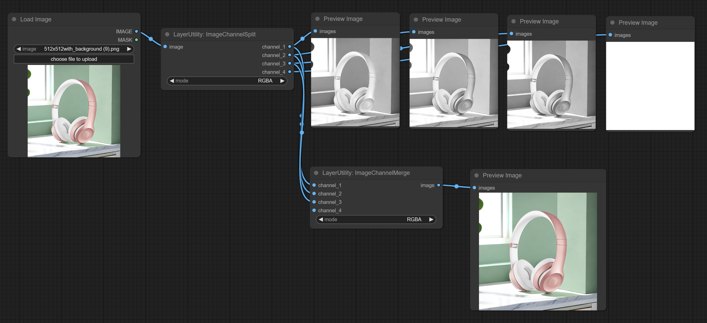
Merge each channel image into one image.

Node options:
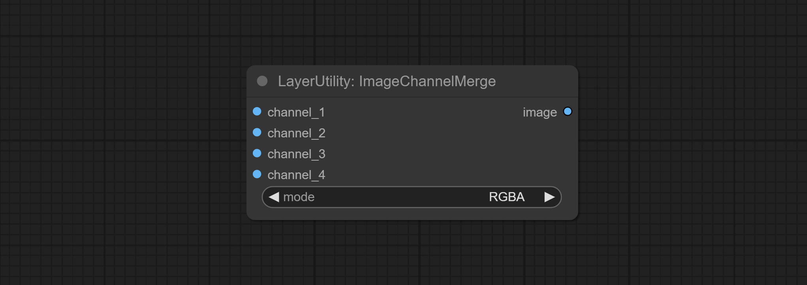
* mode: Channel mode, include RGBA, YCbCr, LAB adn HSV.

### <a id="table1">ImageRemoveAlpha</a>

Remove the alpha channel from the image and convert it to RGB mode. you can choose to fill the background and set the background color.

Node options:

* fill_background: Whether to fill the background.
* background_color<sup>4</sup>: Color of background.


### <a id="table1">ImageCombineAlpha</a>
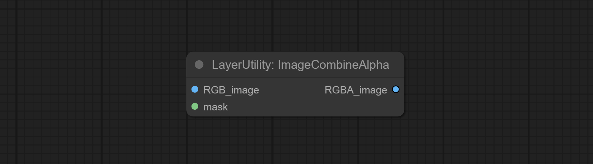
Merge the image and mask into an RGBA mode image containing an alpha channel.

### <a id="table1">ImageAutoCrop</a>
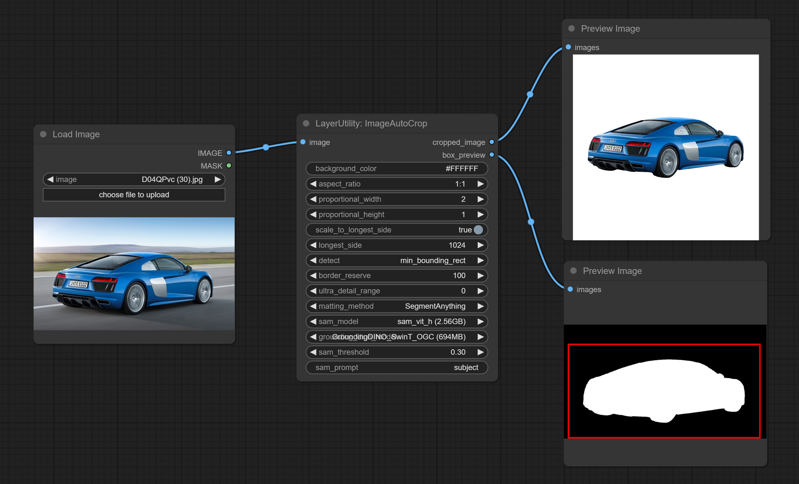
Automatically cutout and crop the image according to the mask. it can specify the background color, aspect ratio, and size for output image. this node is designed to generate the image materials for training models.   
*Please refer to the model installation methods for [SegmentAnythingUltra](#SegmentAnythingUltra) and [RemBgUltra](#RemBgUltra).  


Node options:
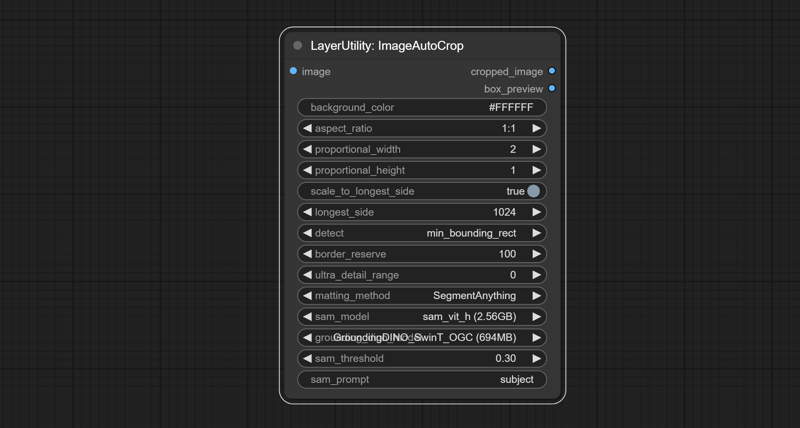
* background_color<sup>4</sup>: The background color.
* aspect_ratio: Here are several common frame ratios provided. alternatively, you can choose "original" to keep original ratio or customize the ratio using "custom".
* proportional_width: Proportional width. if the aspect ratio option is not "custom", this setting will be ignored.
* proportional_height: Proportional height. if the aspect ratio option is not "custom", this setting will be ignored.
* scale_by_longest_side: Allow scaling by long edge size.
* longest_side: When the scale_by_longest_side is set to True, this will be used this value to the long edge of the image. when the original_size have input, this setting will be ignored.
* detect: Detection method, min_bounding_rect is the minimum bounding rectangle, max_inscribed_rect is the maximum inscribed rectangle.
* border_reserve: Keep the border. expand the cutting range beyond the detected mask body area.
* ultra_detail_range: Mask edge ultra fine processing range, 0 is not processed, which can save generation time.
* matting_method: The method of generate masks. There are two methods available: Segment Anything and RMBG 1.4. RMBG 1.4 runs faster.
* sam_model: Select the SAM model used by Segment Anything here.
* grounding_dino_model: Select the Grounding_Dino model used by Segment Anything here.
* sam_threshold: The threshold for Segment Anything.
* sam_prompt: The prompt for Segment Anything.

Output:
cropped_image: Crop and replace the background image.
box_preview: Crop position preview.
cropped_mask: Cropped mask.


### <a id="table1">ImageAutoCropV2</a>

The V2 upgrad version of ```ImageAutoCrop```, it has made the following changes based on the previous version:
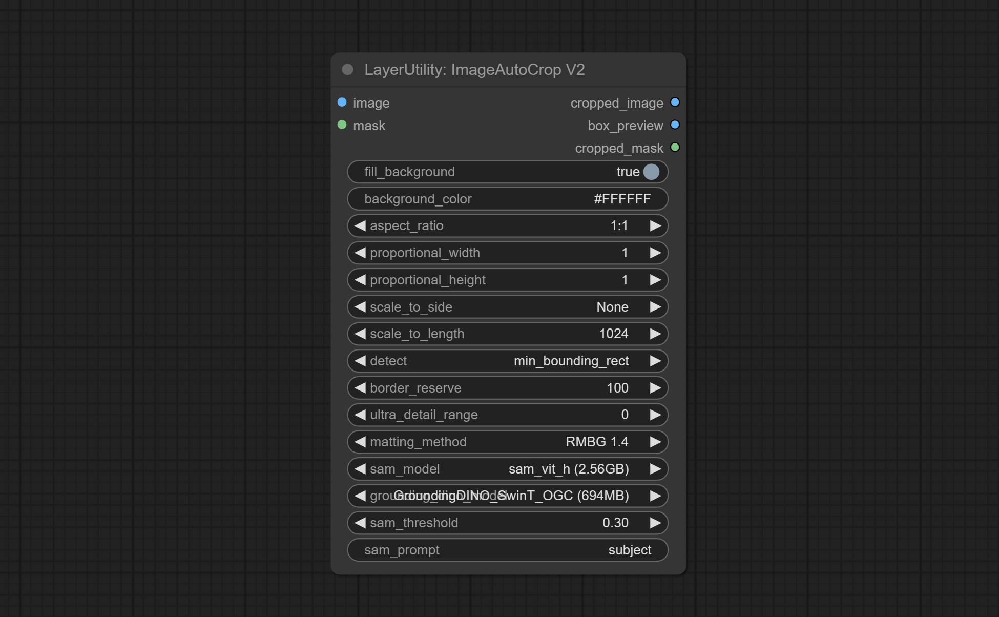

* Add optional input for mask. when there is a mask input, use that input directly to skip the built-in mask generation.
* Add ```fill_background```. When set to False, the background will not be processed and any parts beyond the frame will not be included in the output range.
* ```aspect_ratio``` adds the ```original``` option.
* ```scale_by_longest_side``` changed to support scaling by long or short edge, set in ```scale_to_side```. The side length is set in ```scale_to__length```.


### <a id="table1">GetImageSize</a>
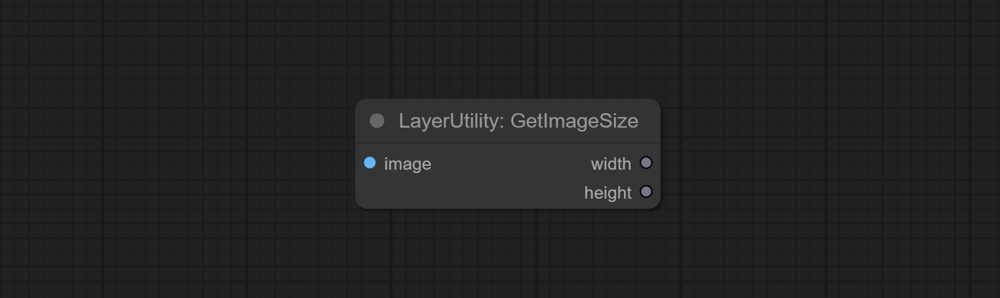
Obtain the width and height of the image.

Output:
* width: The width of image.
* height: The height of image.
* original_size: The original size data of the image is used for subsequent node recovery.

### <a id="table1">ImageHub</a>
Switch output from multiple input images and masks, supporting 9 sets of inputs. All input items are optional. if there is only image or mask in a set of input, the missing item will be output as None.


Node options:  
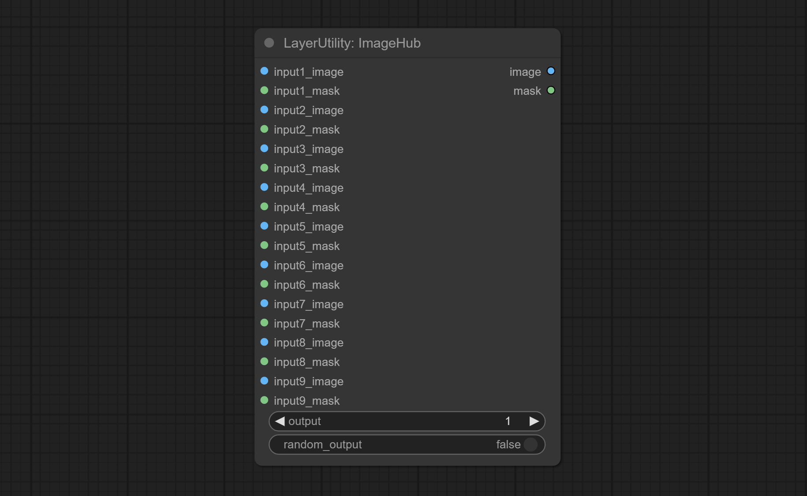
* output: Switch output. the value is the corresponding input group. when the ```random-output``` option is True, this setting will be ignored.
* random_output: When this is true, the ```output``` setting will be ignored and a random set will be output among all valid inputs.

### <a id="table1">TextJoin</a>

Combine multiple paragraphs of text into one.

### <a id="table1">PrintInfo</a>
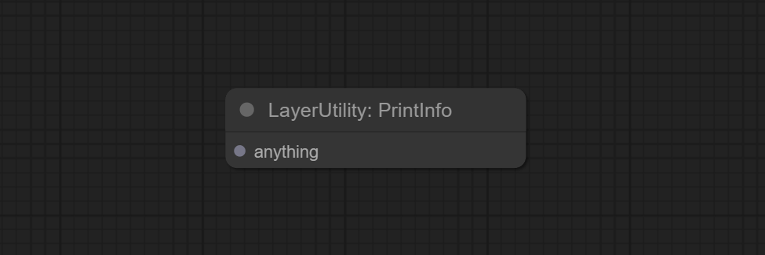
Used to provide assistance for workflow debugging. When running, the properties of any object connected to this node will be printed to the console.

This node allows any type of input.


# <a id="table1">LayerMask</a>
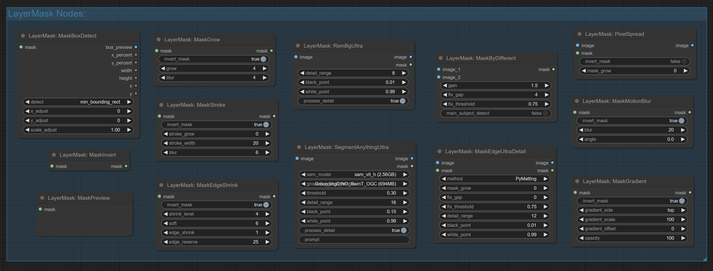

### <a id="table1">MaskBoxDetect</a>
Detect the area where the mask is located and output its position and size.


Node options:  
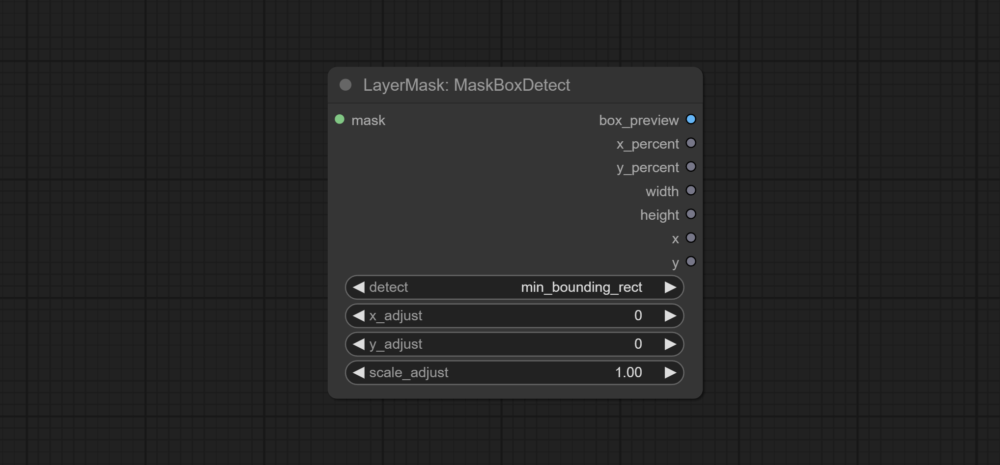
* detect: Detection method, ```min_bounding_rect``` is the minimum bounding rectangle of block shape, ```max_inscribed_rect``` is the maximum inscribed rectangle of block shape, and ```mask-area``` is the effective area for masking pixels.
* x_adjust: Adjust of horizontal deviation after detection.
* y_adjust: Adjust of vertical offset after detection.
* scale_adjust: Adjust the scaling offset after detection.

Output:
* box_preview: Preview image of detection results. Red represents the detected result, and green represents the adjust output result.
* x_percent: Horizontal position output in percentage.
* y_percent: Vertical position output in percentage.
* width: Width.
* height: Height.
* x: The x-coordinate of the top left corner position.
* y: The y-coordinate of the top left corner position.

### <a id="table1">SegmentAnythingUltra</a>
Improvements to [ComfyUI Segment Anything](https://github.com/storyicon/comfyui_segment_anything), combined with the Alpha Matte node of [ComfyUI-Image-Filters](https://github.com/spacepxl/ComfyUI-Image-Filters) in spacepxl, result in more detailed edges for masks, thanks to the original author.

*Please refer to the installation of ComfyUI Segment Anything to install the model. If ComfyUI Segment Anything has been correctly installed, you can skip this step.
* From [here](https://huggingface.co/bert-base-uncased/tree/main) download the config.json，model.safetensors，tokenizer_config.json，tokenizer.json and vocab.txt 5 files to ```ComfyUI/models/bert-base-uncased``` folder.
* Download [GroundingDINO_SwinT_OGC config file](https://huggingface.co/ShilongLiu/GroundingDINO/resolve/main/GroundingDINO_SwinT_OGC.cfg.py), [GroundingDINO_SwinT_OGC model](https://huggingface.co/ShilongLiu/GroundingDINO/resolve/main/groundingdino_swint_ogc.pth), 
[GroundingDINO_SwinB config file](https://huggingface.co/ShilongLiu/GroundingDINO/resolve/main/GroundingDINO_SwinB.cfg.py), [GroundingDINO_SwinB model](https://huggingface.co/ShilongLiu/GroundingDINO/resolve/main/groundingdino_swinb_cogcoor.pth) to ```ComfyUI/models/grounding-dino``` folder.
* Download [sam_vit_h](https://dl.fbaipublicfiles.com/segment_anything/sam_vit_h_4b8939.pth)，[sam_vit_l](https://dl.fbaipublicfiles.com/segment_anything/sam_vit_l_0b3195.pth), 
[sam_vit_b](https://dl.fbaipublicfiles.com/segment_anything/sam_vit_b_01ec64.pth), [sam_hq_vit_h](https://huggingface.co/lkeab/hq-sam/resolve/main/sam_hq_vit_h.pth),
[sam_hq_vit_l](https://huggingface.co/lkeab/hq-sam/resolve/main/sam_hq_vit_l.pth), [sam_hq_vit_b](https://huggingface.co/lkeab/hq-sam/resolve/main/sam_hq_vit_b.pth), 
[mobile_sam](https://github.com/ChaoningZhang/MobileSAM/blob/master/weights/mobile_sam.pt) to ```ComfyUI/models/sams``` folder.

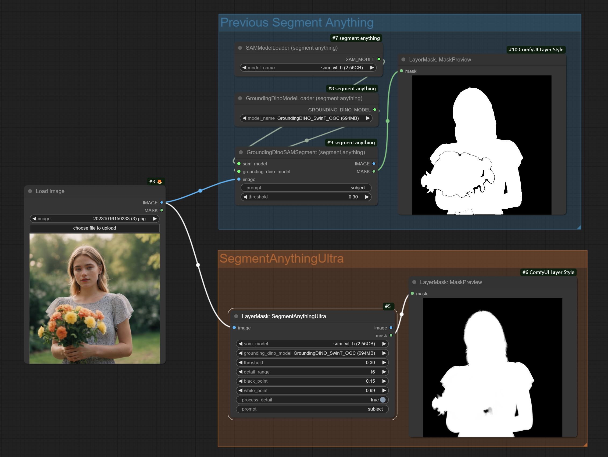


Node options:  
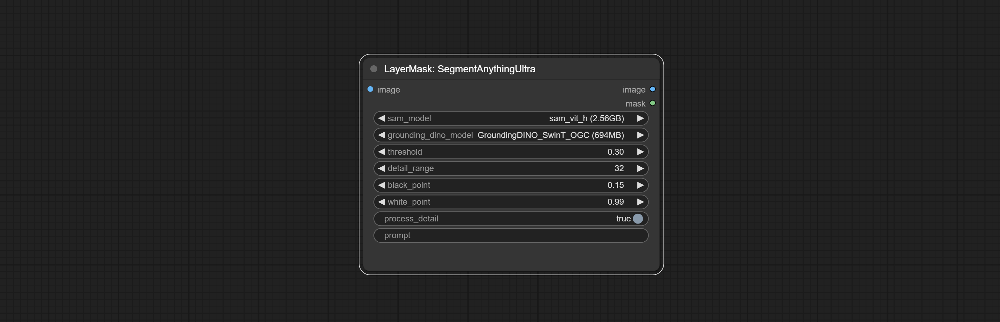
* sam_model: Select the SAM model.
* ground_dino_model: Select the Grounding DINO model.
* threshold: The threshold of SAM.
* detail_range: Edge detail range.
* black_point: Edge black sampling threshold.
* white_point: Edge white sampling threshold.
* process_detail: Set to false here will skip edge processing to save runtime.
* prompt: Input for SAM's prompt.

### <a id="table1">SegmentAnythingUltraV2</a>
The V2 upgraded version of SegmentAnythingUltra has added the VITMatte edge processing method.(Note: Images larger than 2K in size using this method will consume huge memory) 
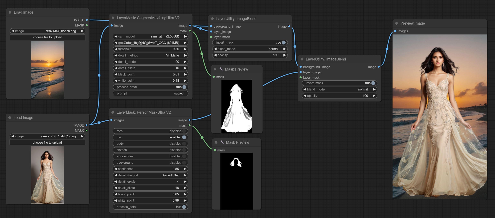

On the basis of SegmentAnythingUltra, the following changes have been made: 
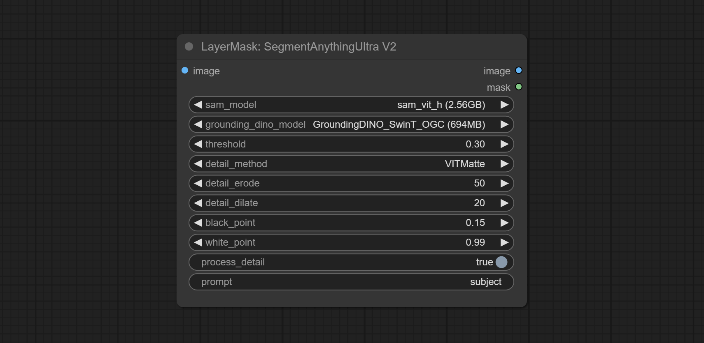
* detail_method: Edge processing methods. provides VITMatte, VITMatte(local), PyMatting, GuidedFilter. If the model has been downloaded after the first use of VITMatte, you can use VITMatte (local) afterwards.
* detail_erode: Mask the erosion range inward from the edge. the larger the value, the larger the range of inward repair.
* detail_dilate: The edge of the mask expands outward. the larger the value, the wider the range of outward repair.


### <a id="table1">RemBgUltra</a>
Remove background. compared to the similar background removal nodes, this node has ultra-high edge details.

This node combines the Alpha Matte node of Spacepxl's [ComfyUI-Image-Filters](https://github.com/spacepxl/ComfyUI-Image-Filters) and the functionality of ZHO-ZHO-ZHO's [ComfyUI-BRIA_AI-RMBG](https://github.com/ZHO-ZHO-ZHO/ComfyUI-BRIA_AI-RMBG), thanks to the original author.

*Download the [BRIA Background Removal v1.4](https://huggingface.co/briaai/RMBG-1.4) model file (```model.pth```) to the ```/ComfyUI/models/rmbg/RMBG-1.4``` folder. This model was developed by BRIA AI and can be used as an open-source model for non-commercial purposes.    
**After downloading the model, recommended to add a line 'rmbg: models/rmbg/RMBG-1.4' in ComfyUI/extra_model_paths.yaml. (This step is not mandatory)    


Node options:  
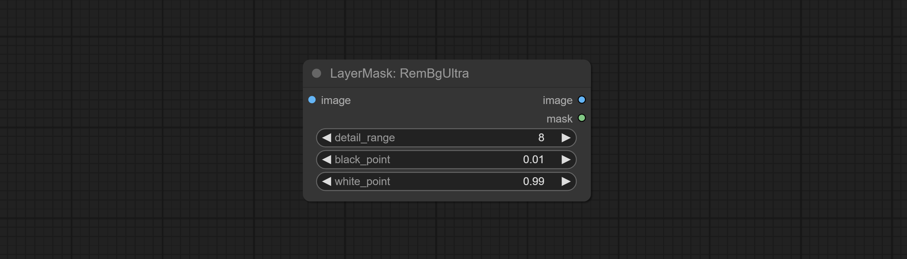
* detail_range: Edge detail range.
* black_point: Edge black sampling threshold.
* white_point: Edge white sampling threshold.
* process_detail: Set to false here will skip edge processing to save runtime.

### <a id="table1">RmBgUltraV2</a>
The V2 upgraded version of RemBgUltra has added the VITMatte edge processing method.(Note: Images larger than 2K in size using this method will consume huge memory) 

On the basis of RemBgUltra, the following changes have been made: 
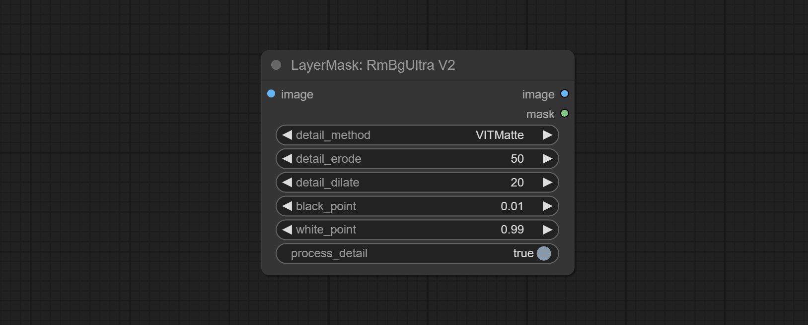
* detail_method: Edge processing methods. provides VITMatte, VITMatte(local), PyMatting, GuidedFilter. If the model has been downloaded after the first use of VITMatte, you can use VITMatte (local) afterwards.
* detail_erode: Mask the erosion range inward from the edge. the larger the value, the larger the range of inward repair.
* detail_dilate: The edge of the mask expands outward. the larger the value, the wider the range of outward repair.


### <a id="table1">BiRefNetUltra</a>
Using the BiRefNet model to remove background has better recognition ability and ultra-high edge details.
The code for the model part of this node comes from Viper's [ComfyUI-BiRefNet](https://github.com/viperyl/ComfyUI-BiRefNet)，thanks to the original author.

*From [https://huggingface.co/ViperYX/BiRefNet](https://huggingface.co/ViperYX/BiRefNet/tree/main) download the ```BiRefNet-ep480.pth```,```pvt_v2_b2.pth```,```pvt_v2_b5.pth```,```swin_base_patch4_window12_384_22kto1k.pth```, ```swin_large_patch4_window12_384_22kto1k.pth``` 5 files to ```ComfyUI/models/BiRefNet``` folder.

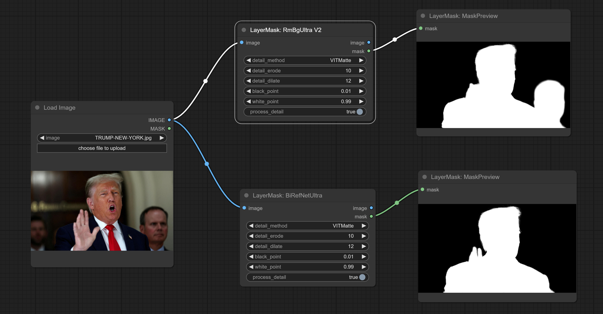

Node options:  

* detail_method: Edge processing methods. provides VITMatte, VITMatte(local), PyMatting, GuidedFilter. If the model has been downloaded after the first use of VITMatte, you can use VITMatte (local) afterwards.
* detail_erode: Mask the erosion range inward from the edge. the larger the value, the larger the range of inward repair.
* detail_dilate: The edge of the mask expands outward. the larger the value, the wider the range of outward repair.
* black_point: Edge black sampling threshold.
* white_point: Edge white sampling threshold.
* process_detail: Set to false here will skip edge processing to save runtime.


### <a id="table1">PersonMaskUltra</a>
Generate masks for portrait's face, hair, body skin, clothing, or accessories. Compared to the previous A Person Mask Generator node, this node has ultra-high edge details.
The model code for this node comes from [a-person-mask-generator](https://github.com/djbielejeski/a-person-mask-generator)， edge processing code from [ComfyUI-Image-Filters](https://github.com/spacepxl/ComfyUI-Image-Filters)，thanks to the original author.


Node options:  

* face: Face recognition.
* hair: Hair recognition.
* body: Body skin recognition.
* clothes: Clothing recognition.
* accessories: Identification of accessories (such as backpacks).
* background: Background recognition.
* confidence: Recognition threshold, lower values will output more mask ranges.
* detail_range: Edge detail range.
* black_point: Edge black sampling threshold.
* white_point: Edge white sampling threshold.
* process_detail: Set to false here will skip edge processing to save runtime.

### <a id="table1">PersonMaskUltraV2</a>
The V2 upgraded version of PersonMaskUltra has added the VITMatte edge processing method.(Note: Images larger than 2K in size using this method will consume huge memory) 

On the basis of PersonMaskUltra, the following changes have been made: 

* detail_method: Edge processing methods. provides VITMatte, VITMatte(local), PyMatting, GuidedFilter. If the model has been downloaded after the first use of VITMatte, you can use VITMatte (local) afterwards.
* detail_erode: Mask the erosion range inward from the edge. the larger the value, the larger the range of inward repair.
* detail_dilate: The edge of the mask expands outward. the larger the value, the wider the range of outward repair.


### <a id="table1">Shadow</a> & Highlight Mask
Generate masks for the dark and bright parts of the image.
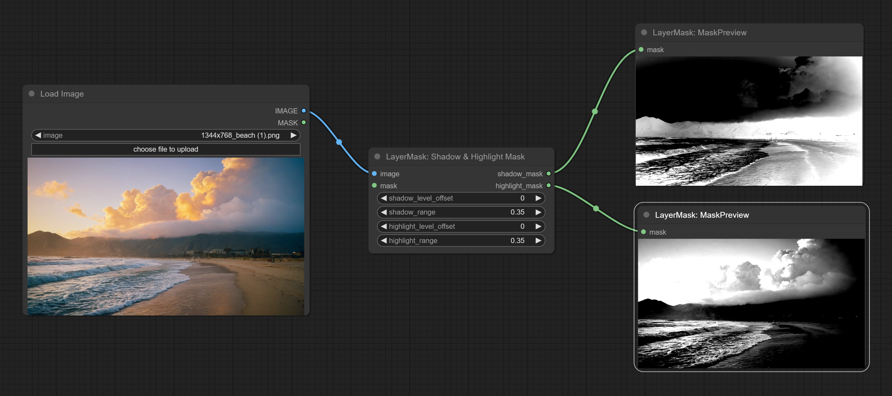

Node options:  
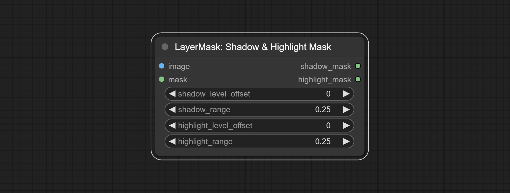
* image: The input image.
* mask: Optional input. if there is input, only the colors within the mask range will be adjusted.
* shadow_level_offset: The offset of values in the dark area, where larger values bring more areas closer to the bright into the dark area.
* shadow_range: The transitional range of the dark area.
* highlight_level_offset: The offset of values in the highlight area, where larger values bring more areas closer to the dark into the highlight area.
* highlight_range: The transitional range of the highlight area. 


### <a id="table1">PixelSpread</a>
Pixel expansion preprocessing on the masked edge of an image can effectively improve the edges of image composit.
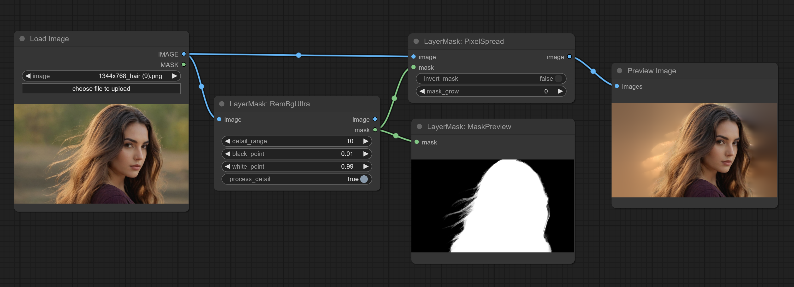

Node options:  
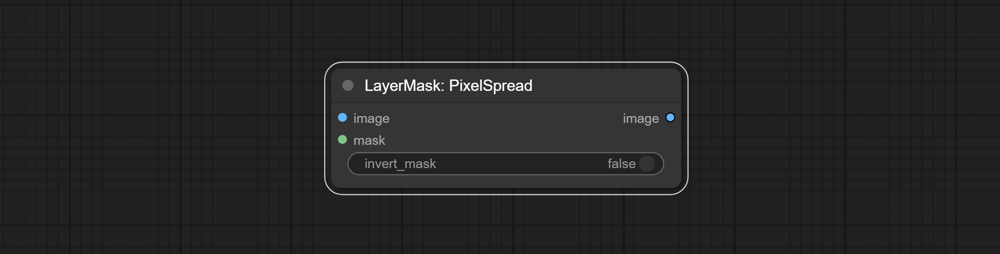
* invert_mask: Whether to reverse the mask.
* mask_grow: Mask expansion amplitude.

### <a id="table1">MaskByDifferent</a>
Calculate the differences between two images and output them as mask.
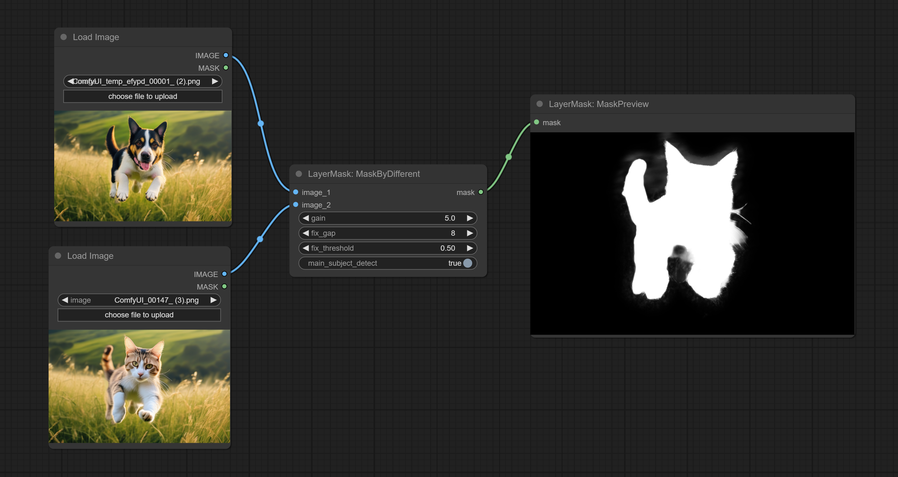

Node options:  
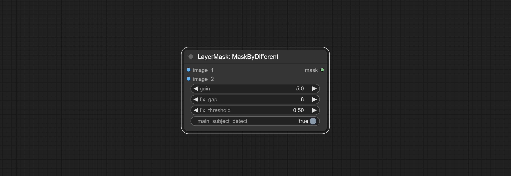
* gain: The gain of difference calculate. higher value will result in a more significant slight difference.
* fix_gap: Fix the internal gaps of the mask. higher value will repair larger gaps.
* fix_threshold: The threshold for fix_gap.
* main_subject_detect: Setting this to True will enable subject detection, ignoring differences outside of the subject.


### <a id="table1">MaskEdgeUltraDetail</a>
Process rough masks to ultra fine edges.
This node combines the Alpha Matte and the Guided Filter Alpha nodes functions of Spacepxl's [ComfyUI-Image-Filters](https://github.com/spacepxl/ComfyUI-Image-Filters), thanks to the original author.
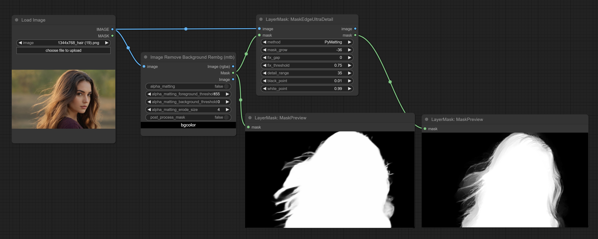

Node options:  
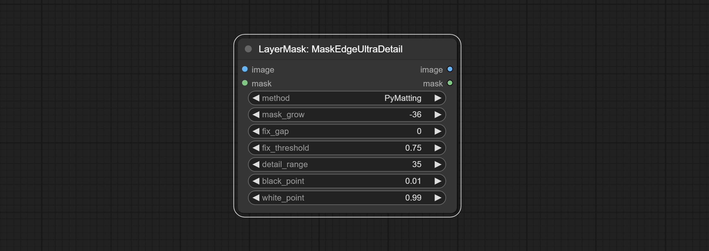
* method: Provide two methods for edge processing: PyMatting and OpenCV-GuidedFilter. PyMatching has a slower processing speed, but for video, it is recommended to use this method to obtain smoother mask sequences.
* mask_grow: Mask expansion amplitude. positive values expand outward, while negative values contract inward. For rougher masks, negative values are usually used to shrink their edges for better results.
* fix_gap: Repair the gaps in the mask. if obvious gaps in the mask, increase this value appropriately.
* fix_threshold: The threshold of fix_gap.
* detail_range: Edge detail range.
* black_point: Edge black sampling threshold.
* white_point: Edge white sampling threshold.

### <a id="table1">MaskEdgeUltraDetailV2</a>
The V2 upgraded version of MaskEdgeUltraDetail has added the VITMatte edge processing method.(Note: Images larger than 2K in size using this method will consume huge memory)    
This method is suitable for handling semi transparent areas. The following figure is an example of the difference in output between three methods.
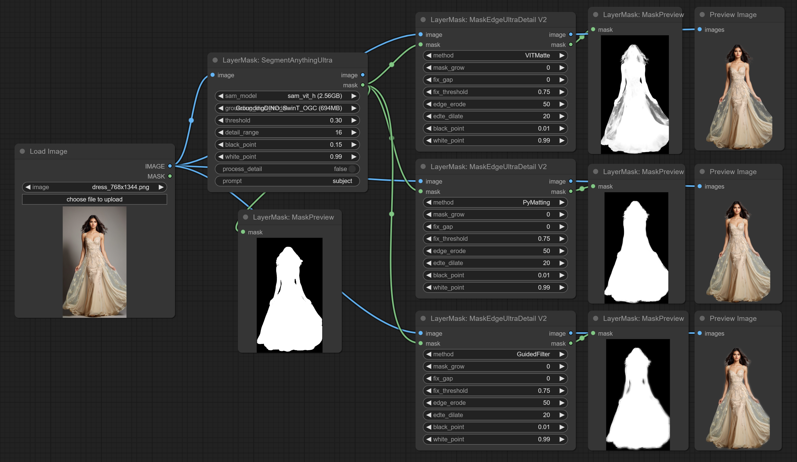

On the basis of MaskEdgeUltraDetail, the following changes have been made: 
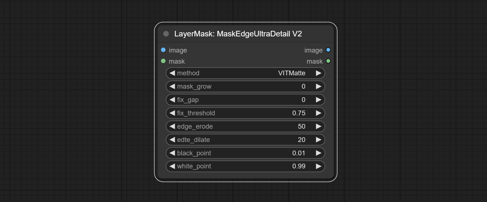
* method: Edge processing methods. provides VITMatte, VITMatte(local), PyMatting, GuidedFilter. If the model has been downloaded after the first use of VITMatte, you can use VITMatte (local) afterwards.
* edge_erode: Mask the erosion range inward from the edge. the larger the value, the larger the range of inward repair.
* edge_dilate: The edge of the mask expands outward. the larger the value, the wider the range of outward repair.


### <a id="table1">MaskGrow</a>
Grow and shrink edges and blur the mask


Node options:
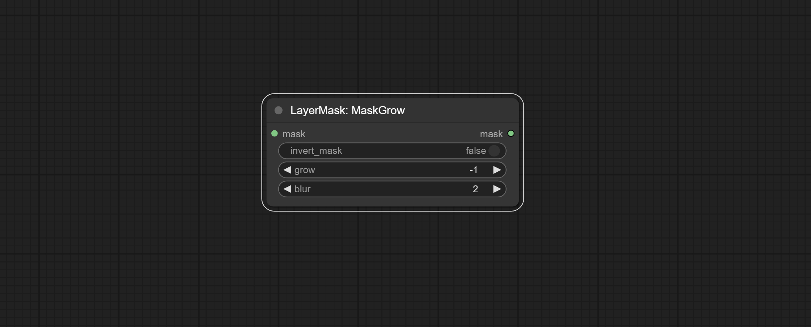
* invert_mask: Whether to reverse the mask.
* grow: Positive values expand outward, while negative values contract inward.
* blur: Blur the edge.

### <a id="table1">MaskEdgeShrink</a>
Smooth transition and shrink the mask edges while preserving edge details.
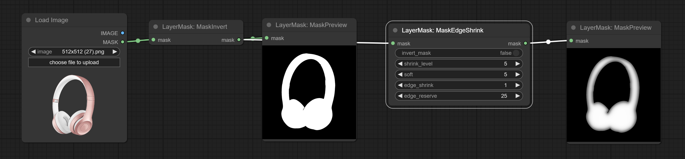

Node options:
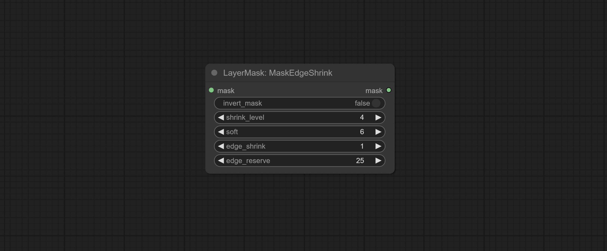
* invert_mask: Whether to reverse the mask.
* shrink_level: Shrink the smoothness level.
* soft: Smooth amplitude.
* edge_shrink: Edge shrinkage amplitude.
* edge_reserve: Preserve the amplitude of edge details, 100 represents complete preservation, and 0 represents no preservation at all.

Comparison of MaskGrow and MaskEdgeShrink


### <a id="table1">MaskMotionBlur</a>
Create motion blur on the mask.
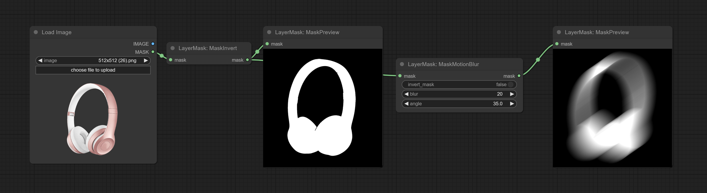

Node options:  
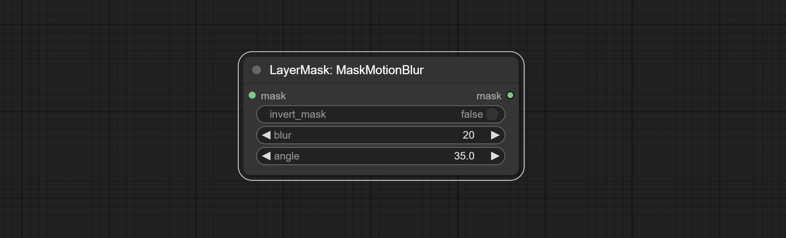
* invert_mask: Whether to reverse the mask.
* blur: The size of blur.
* angle: The angle of blur.

### <a id="table1">MaskGradient</a>
Create a gradient for the mask from one side. please note the difference between this node and the CreateGradientMask node.


Node options:
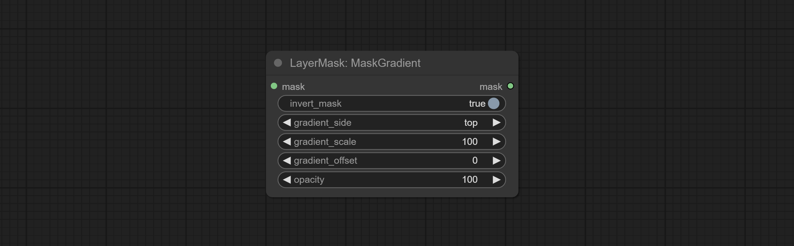
* invert_mask: Whether to reverse the mask.
* gradient_side: Generate gradient from which edge. There are four directions: top, bottom, left and right.
* gradient_scale: Gradient distance. The default value of 100 indicates that one side of the gradient is completely transparent and the other side is completely opaque. The smaller the value, the shorter the distance from transparent to opaque.
* gradient_offset: Gradient position offset.
* opacity: The opacity of the gradient.

### <a id="table1">CreateGradientMask</a>
Create a gradient mask. please note the difference between this node and the MaskGradient node.
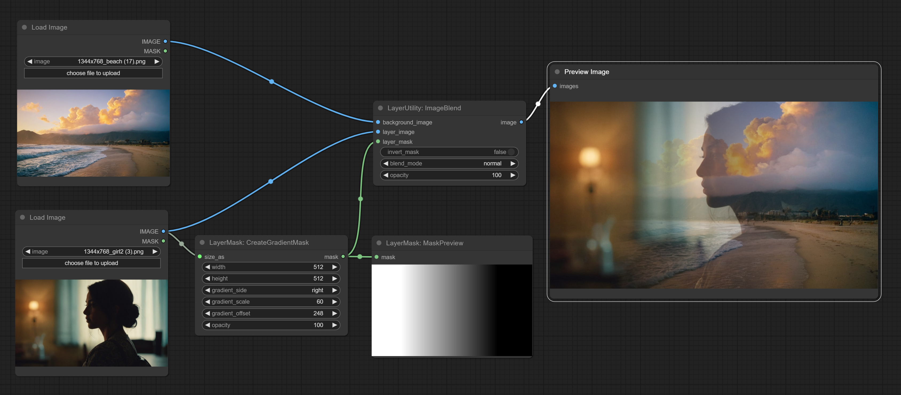
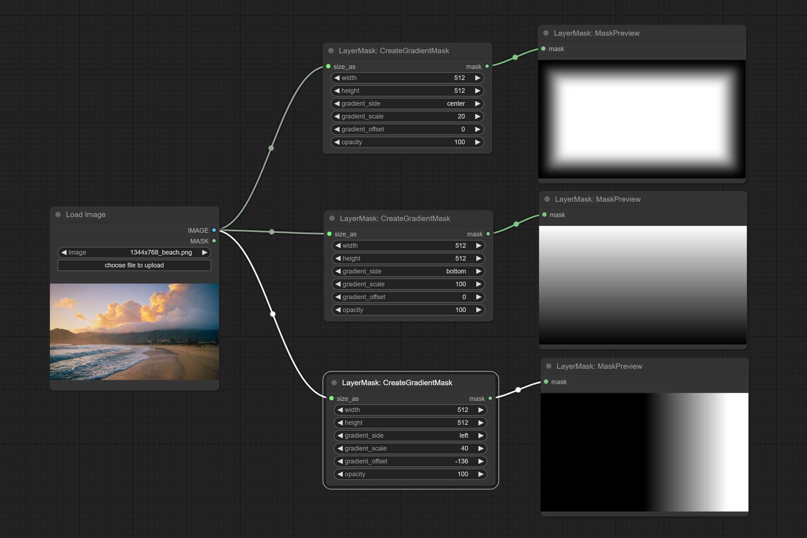

Node options:  
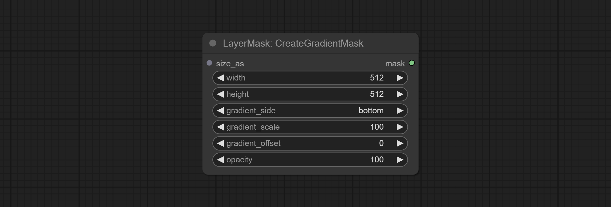
* size_as<sup>*</sup>: The input image or mask here will generate the output image and mask according to their size. this input takes priority over the width and height below.
* width: Width of the image. If there is a size_as input, this setting will be ignored.
* height: Height of the image. If there is a size_as input, this setting will be ignored.
* gradient_side: Generate gradient from which edge. There are five directions: top, bottom, left, right and center.
* gradient_scale: Gradient distance. The default value of 100 indicates that one side of the gradient is completely transparent and the other side is completely opaque. The smaller the value, the shorter the distance from transparent to opaque.
* gradient_offset: Gradient position offset. When ```gradient_side``` is center, the size of the gradient area is adjusted here, positive values are smaller, and negative values are enlarged.
* opacity: The opacity of the gradient.

<sup>*</sup>Only limited to input image and mask. forcing the integration of other types of inputs will result in node errors.  


### <a id="table1">MaskStroke</a>
Generate mask contour strokes.
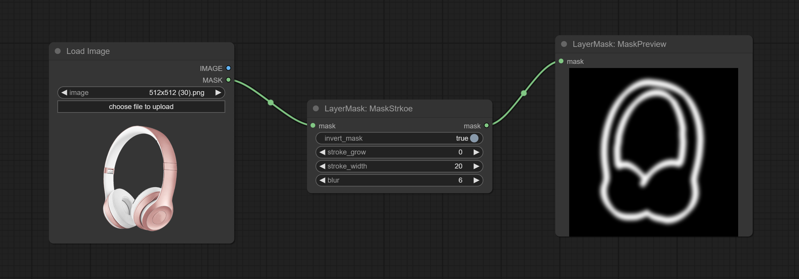

Node options:  
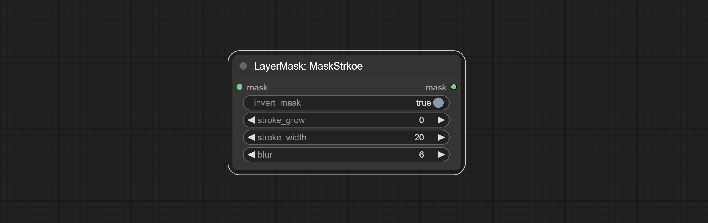
* invert_mask: Whether to reverse the mask.
* stroke_grow: Stroke expansion/contraction amplitude, positive values indicate expansion and negative values indicate contraction.
* stroke_width: Stroke width.
* blur: Blur of stroke.

### <a id="table1">MaskPreview</a>
Preview the input mask
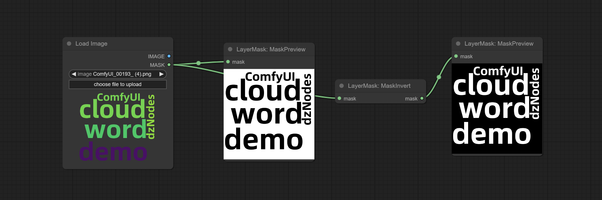


### <a id="table1">MaskInvert</a>
Invert the mask
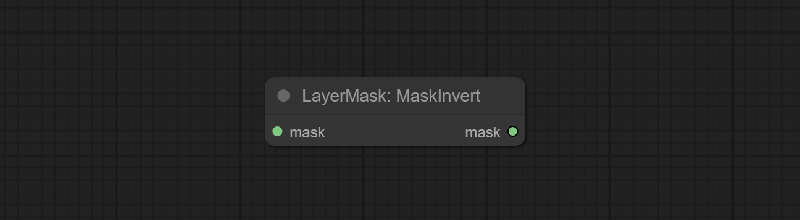


# <a id="table1">LayerFilter</a>
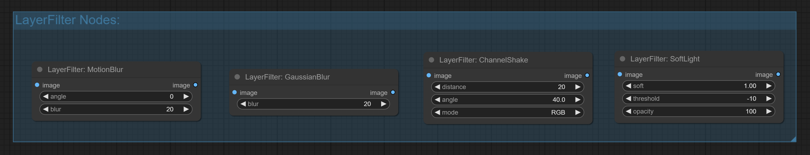

### <a id="table1">Sharp</a> & Soft
Enhance or smooth out details for image.


Node options:
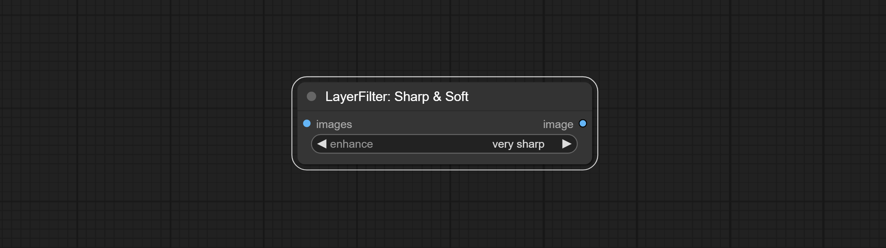
* enhance: Provide 4 presets, which are very sharp, sharp, soft and very soft.

### <a id="table1">SkinBeauty</a>
Make the skin look smoother.
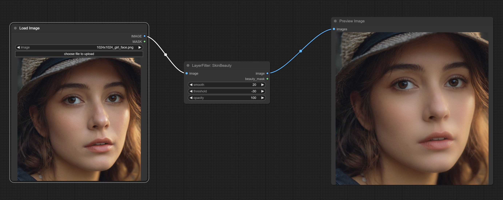

Node options:
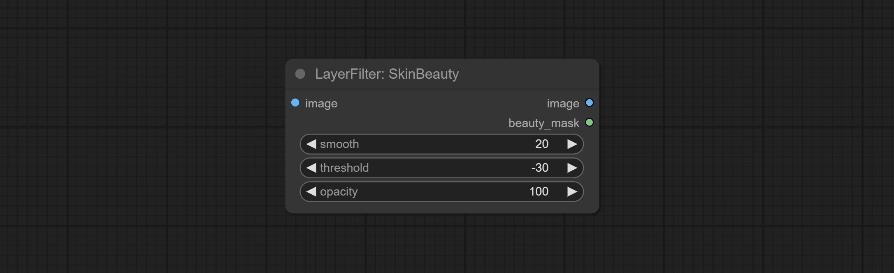
* smooth: Skin smoothness.
* threshold: Smooth range. the larger the range with the smaller value.
* opacity: The opacity of the smoothness.


### <a id="table1">WaterColor</a>
Watercolor painting effect
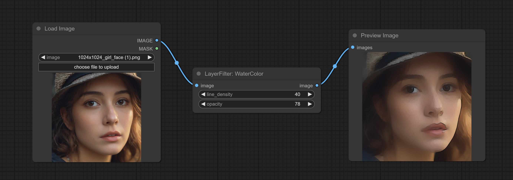

Node option:

* line_density: The black line density.
* opacity: The opacity of watercolor effects.


### <a id="table1">SoftLight</a>
Soft light effect, the bright highlights on the screen appear blurry.
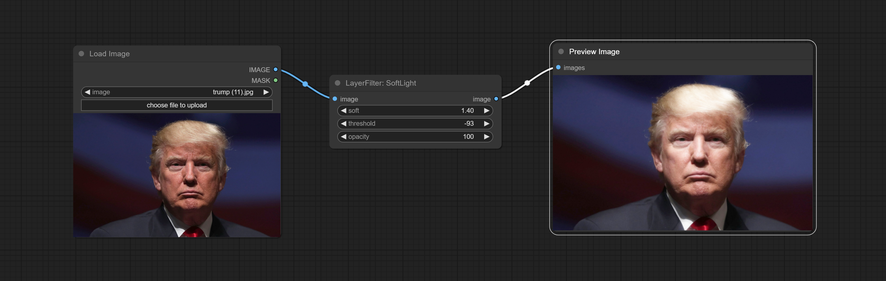

Node options:

* soft: Size of soft light.
* threshold: Soft light range. the light appears from the brightest part of the picture. in lower value, the range will be larger, and in higher value, the range will be smaller.
* opacity: Opacity of the soft light.


### <a id="table1">ChannelShake</a>
Channel misalignment. similar to the effect of Tiktok logo.
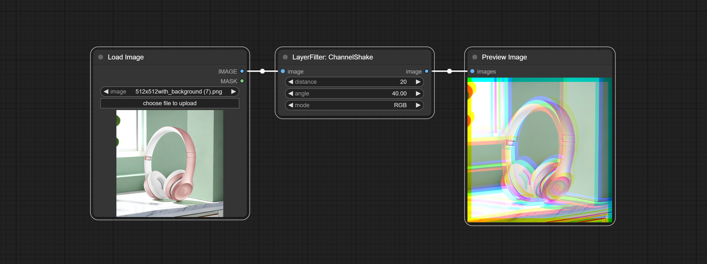

Node options:
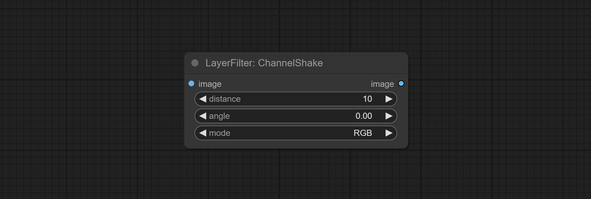
* distance: Distance of channel separation.
* angle: Angle of channel separation.
* mode: Channel shift arrangement order.


### <a id="table1">HDR</a> Effects
enhances the dynamic range and visual appeal of input images.
This node is reorganize and encapsulate of  [HDR Effects (SuperBeasts.AI)](https://github.com/SuperBeastsAI/ComfyUI-SuperBeasts), thanks to the original author.
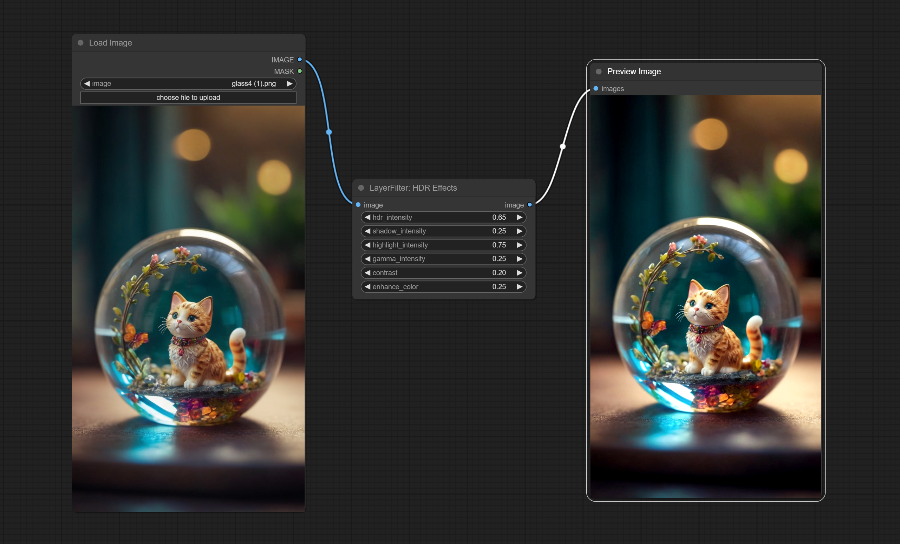

Node options:

* hdr_intensity: Range: 0.0 to 5.0, Controls the overall intensity of the HDR effect, Higher values result in a more pronounced HDR effect.
* shadow_intensity: Range: 0.0 to 1.0，Adjusts the intensity of shadows in the image，Higher values darken the shadows and increase contrast.
* highlight_intensity: Range: 0.0 to 1.0，Adjusts the intensity of highlights in the image，Higher values brighten the highlights and increase contrast.
* gamma_intensity: Range: 0.0 to 1.0，Controls the gamma correction applied to the image，Higher values increase the overall brightness and contrast.
* contrast: Range: 0.0 to 1.0，Enhances the contrast of the image, Higher values result in more pronounced contrast.
* enhance_color: Range: 0.0 to 1.0，Enhances the color saturation of the image, Higher values result in more vibrant colors.


### <a id="table1">Film</a>
Simulate the grain, dark edge, and blurred edge of the film, support input depth map to simulate defocus.    
This node is reorganize and encapsulate of [digitaljohn/comfyui-propost](https://github.com/digitaljohn/comfyui-propost), thanks to the original author.


Node options:
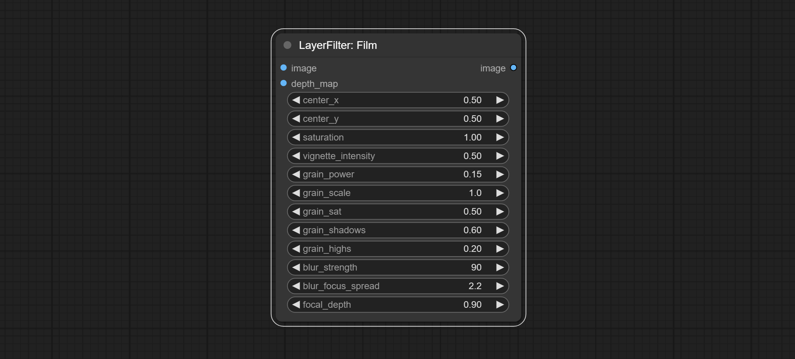
* image: The input image.
* depth_map: Input depth map to simulate defocus effect. it is an optional input. if there is no input, will simulates radial blur at the edges of the image.
* center_x: The horizontal axis of the center point position of the dark edge and radial blur, where 0 represents the leftmost side, 1 represents the rightmost side, and 0.5 represents at the center.
* center_y: The vertical axis of the center point position of the dark edge and radial blur, where 0 represents the leftmost side, 1 represents the rightmost side, and 0.5 represents at the center.
* saturation: Color saturation, 1 is the original value.
* grain_power: Grain intensity. larger value means more pronounced the noise.
* grain_scale: Grain size.
* grain_sat: The color saturation of grain. 0 represents mono noise, and the larger the value, the more prominent the color.
* grain_shadows: Grain intensity of dark part.
* grain_highs: Grain intensity of light part.
* blur_strength: The strength of blur. larger value means more blurry it becomes.
* blur_focus_spread: Focus diffusion range. larger value means larger clear range.
* focal_depth: Simulate the focal distance of defucus. 0 indicates that focus is farthest, and 1 indicates that is closest. this setting only valid when input the depth_map.

### <a id="table1">LightLeak</a>
Simulate the light leakage effect of the film. please download the [light_leak.pkl(Baidu Netdisk)](https://pan.baidu.com/s/1QY1ZyYm885krrqDB2t8lPg?pwd=yvs3) or [light_leak.pkl(Google Drive)]([light_leak.pkl(Google Drive)(https://drive.google.com/file/d/1DcH2Zkyj7W3OiAeeGpJk1eaZpdJwdCL-/view?usp=sharing)), copy the file to ```ComfyUI/models/layerstyle``` folder.


Node options:
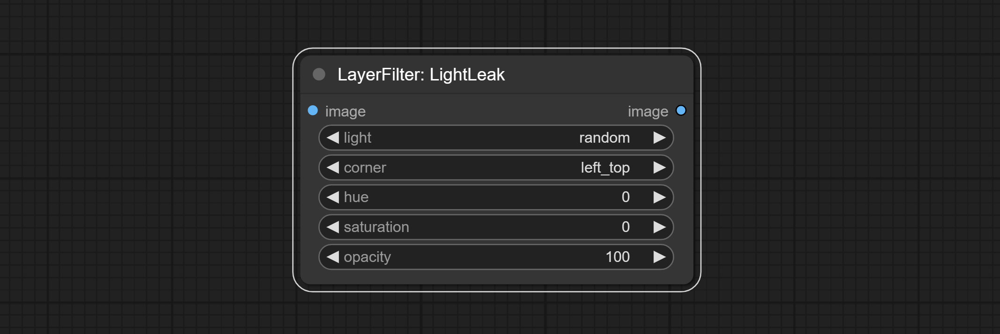
* light: 32 types of light spots are provided. random is a random selection.
* corner: There are four options for the corner where the light appears: top left, top right, bottom left, and bottom right.
* hue: The hue of the light.
* saturation: The color saturation of the light.
* opacity: The opacity of the light.

### <a id="table1">ColorMap</a>
Pseudo color heat map effect.


Node options:
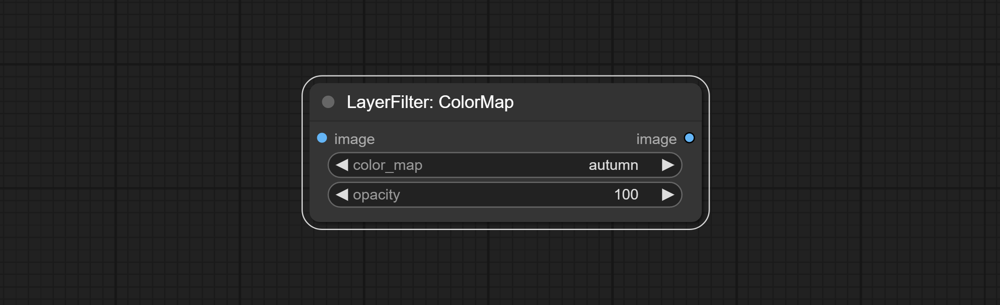
* color_map: Effect type. there are a total of 22 types of effects, as shown in the above figure.
* opacity: The opacity of the color map effect.


### <a id="table1">MotionBlur</a>
Make the image motion blur


Node options:
* angle: The angle of blur.
* blur: The size of blur.

### <a id="table1">GaussianBlur</a>
Make the image gaussian blur
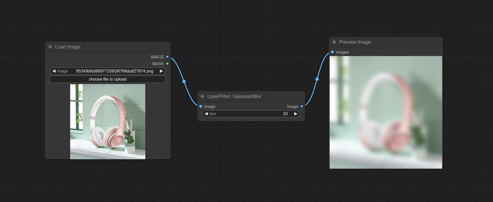

Node options:
* blur: The size of blur.

## Annotation for <a id="table1">notes</a>
<sup>1</sup>  The layer_image, layer_mask and the background_image(if have input), These three items must be of the same size.    

<sup>2</sup>  The mask not a mandatory input item. the alpha channel of the image is used by default. If the image input does not include an alpha channel, the entire image's alpha channel will be automatically created. if have masks input simultaneously, the alpha channel will be overwrite by the mask.    

<sup>3</sup>  The <a id="table1">blend</a> mode include **normal, multply, screen, add, subtract, difference, darker, color_burn, color_dodge, linear_burn, linear_dodge, overlay, soft_light, hard_light, vivid_light, pin_light, linear_light, and hard_mix.** all of 19 blend modes in total.    
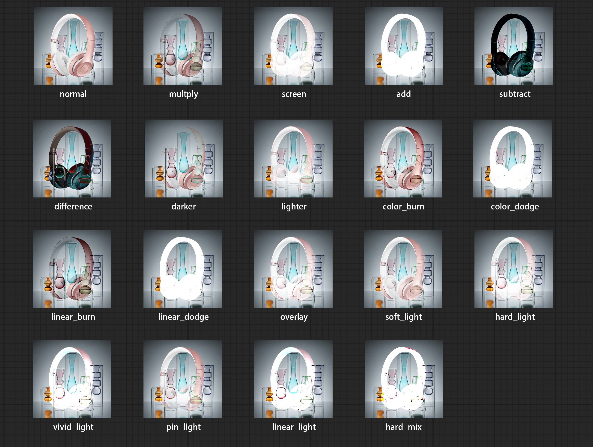
<font size="1">*Preview of the blend mode  </font><br />     

<sup>4</sup>  The RGB color described by hexadecimal RGB format, like '#FA3D86'.    

<sup>5</sup>  The layer_image and layer_mask must be of the same size.    

# statement
LayerStyle nodes follows the MIT license, Some of its functional code comes from other open-source projects. Thanks to the original author. If used for commercial purposes, please refer to the original project license to authorization agreement.
