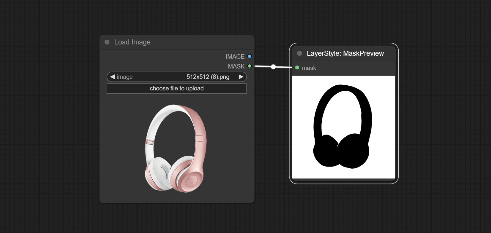

# ComfyUI Layer Style
A set of nodes for ComfyUI that generate image like Adobe Photoshop's Layer Style.

Currently completed the Drop Shadow, OuterGlow, and some auxiliary nodes. follow-up work is in progress.

[中文说明点这里](./README_CN.MD)

## Update
* Commit MaskInvert node.
* Commit ColorPick node.
* Commit Stroke node.
* Commit MaskPreview node.
* Commit ImageOpacity node.
* The layer_mask is not a mandatory input now. it is allowed to use layers and masks with different shapes, but the size must be consistent.
* Commit ImageBlend node.
* Commit OuterGlow node.
* Commit DropShadow node.

## Node Description

### DropShadow:
Generate shadow


Node options:

* background_image<sup>1</sup>: The background image.
* layer_image<sup>1</sup>: Layer image for composite.
* layer_mask<sup>1,2</sup>: Mask for layer_image, shadows are generated according to their shape.
* invert_mask: Whether to reverse the mask.
* blend_mode<sup>3</sup>: Blending mode of shadows.
* opacity: Opacity of shadow.
* distance_x: Horizontal offset of shadow.
* distance_y: Vertical offset of shadow.
* grow: Shadow expansion amplitude.
* blur: Shadow blur level.
* shadow_color: Shadow color, described in hexadecimal RGB format.

Output type:
* image


### OuterGlow:
Generate outer glow


Node options:

* background_image<sup>1</sup>: The background image.
* layer_image<sup>1</sup>: Layer image for composite.
* layer_mask<sup>1,2</sup><sup>2</sup>: Mask for layer_image, shadows are generated according to their shape.
* invert_mask: Whether to reverse the mask.
* blend_mode<sup>3</sup>: Blending mode of glow.
* opacity: Opacity of glow.
* grow: Glow expansion amplitude.
* blur: Gkow blur level.
* glow_color: Glow color, described in hexadecimal RGB format.


Output type:
* image

### Stroke:
Generate a stroke of layer。


Node options:   

* background_image<sup>1</sup>: The background image.
* layer_image<sup>1</sup>: Layer image for composite.
* layer_mask<sup>1,2</sup>: Mask for layer_image, shadows are generated according to their shape.
* invert_mask: Whether to reverse the mask.
* blend_mode<sup>3</sup>: Blending mode of stroke.
* opacity: Opacity of stroke.
* shrink<sup>*</sup>: Stroke shrinkage amplitude.
* expansion<sup>*</sup>: Stroke expansion amplitude.
* stroke_color: Stroke color, described in hexadecimal RGB format.

<sup>*</sup>The width of the stroke is equal to shrink plus expansion value. Setting two values separately can make it more convenient to adjust the border range.

Output type:
* image

### ImageBlend:
Composit  layer image and background image, multiple blend modes are available for option, and transparency can be set.


Node options:

* background_image<sup>1</sup>: The background image.
* layer_image<sup>1</sup>: Layer image for composite.
* layer_mask<sup>1,2</sup>: Mask for layer_image.
* invert_mask: Whether to reverse the mask.
* blend_mode<sup>3</sup>: Blending mode.
* opacity: Opacity of blend.

Output type:
* image

### ImageOpacity:
Adjust image opacity


Node option:   
* image<sup>1</sup>: Image input, supporting RGB and RGBA. if is RGB, the alpha channel of the entire image will be automatically added.
* mask<sup>1,2</sup> : Mask input.
* invert_mask: Whether to reverse the mask.
* opacity: Opacity of image.

Output type:
* image(RGBA)
* mask


### MaskPreview:
Preview the input mask


input：mask

### MaskInvert:
Invert the mask


Input:
* mask

Output type: 
* mask

### ColorPicker:
Modify web extensions from [mtb nodes](https://github.com/melMass/comfy_mtb). Select colors on the color palette and output RGB values.


Node options:
* mode： The output format is available in hexadecimal (HEX) and decimal (DEC).  

Output Type： 
* string


### Annotation:
<sup>1</sup>  The layer_image, layer_mask and the background_image(if have input), These three items must be of the same size.。

<sup>2</sup>  The mask not a mandatory input item. the alpha channel of the image is used by default. If the image input does not include an alpha channel, the entire image's alpha channel will be automatically created. if have masks input simultaneously, the alpha channel will be overwrite by the mask.

<sup>3</sup>  The blend mode include **_normal, multply, screen, add, subtract, difference, darker_** and **_lighter_**.

## Example workflow
image Some JSON workflow files in the workflow directory, that is example for ComfyUI.

## The following tasks are in the planned list
### Layer Style node:
* Inner Shadow
* Inner Glow
* Texture
* Color Overlay
* Gradient Overlay
* Neon
### Auxiliary node:
* invert mask
* mask soft crop
* mask motion blur
* mask radial blur


## How to install 

* Open the cmd window in the plugin directory of ComfyUI, like "ComfyUI\custom_nodes\"，type```git clone https://github.com/chflame163/ComfyUI_LayerStyle.git```
or download the zip file and extracted, copy the resulting folder to ComfyUI\custom_ Nodes\

* Install dependency packages, open the cmd window in the WordCloud plugin directory like "ComfyUI\custom_ Nodes\ComfyUI_WordCloud" and enter the following command:
```..\..\..\python_embeded\python.exe -m pip install -r requirements.txt```

* Restart ComfyUI