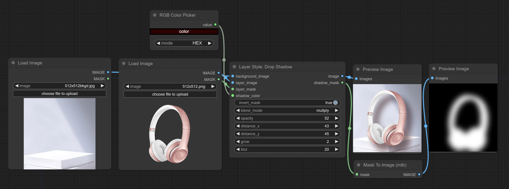

# ComfyUI Layer Style：
ComfyUI插件，通过一组节点实现仿照Adobe Photoshop的图层样式。
Drop Shadow是首个完成的节点，后续工作进行中。

## 节点说明：

### Drop Shadow:
生成阴影。


选项说明：   
* background_image<sup>1</sup>: 背景图像。
* layer_image<sup>1</sup>: 用于合成的层图像。
* layer_mask<sup>1</sup>: 层图像的遮罩，阴影按此生成。
* invert_mask: 是否反转遮罩。
* blend_mode: 阴影的混合方式，包括normal、multply、screen、add、subtract、difference、darker和lighter。
* opacity: 阴影的不透明度。
* distance_x: 阴影的水平方向偏移量。
* distance_y: 阴影的垂直方向偏移量。
* grow: 阴影扩张幅度。
* blur：阴影模糊程度。
* shadow_color: 阴影颜色，使用16进制RGB格式描述。

<sup>1</sup>  background_image, layer_image, layer_mask这三项必须是相同的尺寸。

输出：
* image：完成的图像。
* shadow_mask：阴影的通道。

## 使用示例：

在workflow目录下有json格式的工作流示例文件。

## 安装方法：  

* 在CompyUI插件目录(例如“CompyUI\custom_nodes\”)中打开cmd窗口，键入```git clone https://github.com/chflame163/ComfyUI_LayerStyle.git```安装。或者下载解压zip文件，将得到的文件夹复制到 ComfyUI\custom_nodes\
* 安装依赖包，在资源管理器ComfyUI\custom_nodes\ComfyUI_WordCloud 插件目录位置打开cmd窗口，输入以下命令：  
```..\..\..\python_embeded\python.exe -m pip install -r requirements.txt```
* 重新打开ComfyUI。
