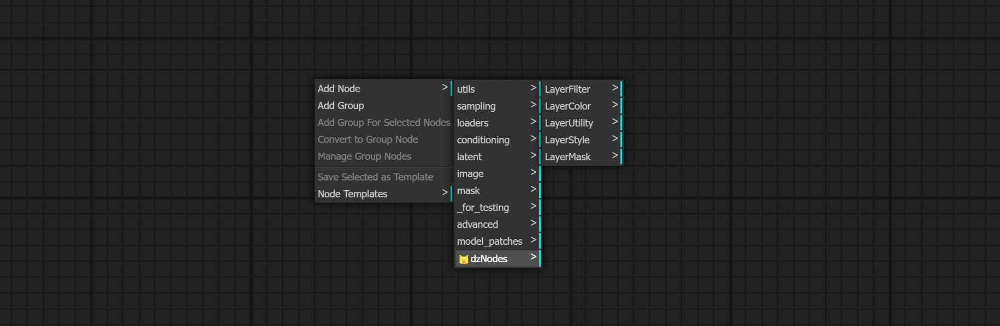
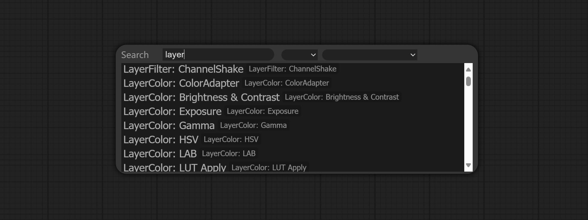
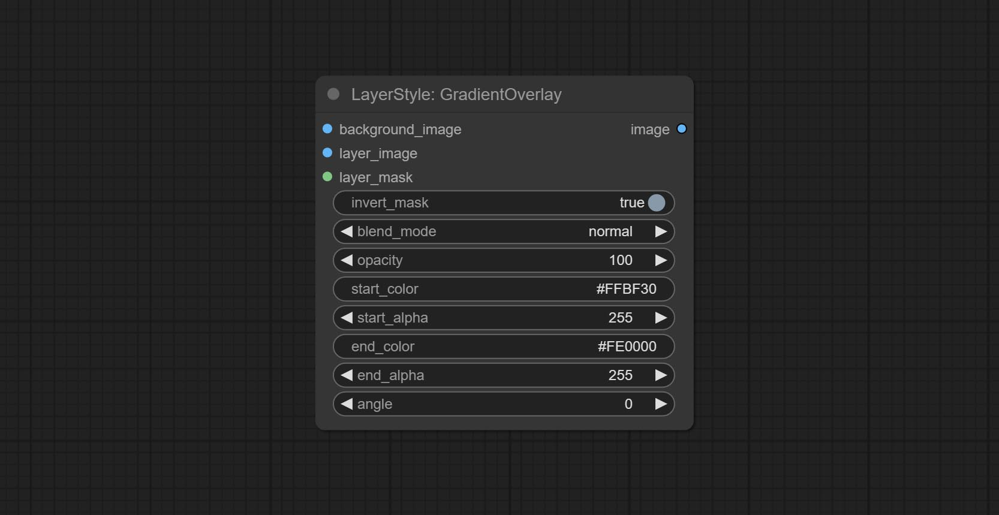

# ComfyUI Layer Style

商业合作请联系email [chflame@163.com](mailto:chflame@163.com)


一组为ComfyUI设计的节点，可以合成图层达到类似Photoshop的功能。这些节点将PhotoShop的一部分基本功能迁移到ComfyUI，旨在集中工作流程，减少软件切换的频率。  

    
<font size="1">*此图工作流(title_example_workflow.json) 在 workflow 目录中.   </font><br /> 


## 工作流用示例
在workflow目录下有json格式的工作流示例文件，示范了如何在ComfyUI中使用这些节点。


## 安装方法

* 推荐使用 ComfyUI Manager 安装。
* 或者在CompyUI插件目录(例如“CompyUI\custom_nodes\”)中打开cmd窗口，键入    
```
git clone https://github.com/chflame163/ComfyUI_LayerStyle.git
```
     
* 或者下载解压zip文件，将得到的文件夹复制到 ```ComfyUI\custom_nodes\```。   

* 安装依赖包，在资源管理器```ComfyUI\custom_nodes\ComfyUI_LayerStyle``` 插件目录位置打开cmd窗口，输入以下命令：     
```
..\..\..\python_embeded\python.exe -m pip install -r requirements.txt
```


  重新打开ComfyUI。

## 常见问题
如果节点不能正常加载，或者使用中出现错误，请在ComfyUI终端窗口查看报错信息。以下是常见的错误及解决方法。

### ModuleNotFoundError: No module named 'psd_tools'
这个错误是```psd_tools```没有正确安装。    

解决方法：
* 关闭ComfyUI，在插件目录下打开终端窗口，执行以下命令:
```../../../python_embeded/python.exe -s -m pip install psd_tools```
如果安装psd_tool中出现```ModuleNotFoundError: No module named 'docopt'```错误，请下载[docopt的whl](https://www.piwheels.org/project/docopt/)手动安装。在终端执行以下命令:
```../../../python_embeded/python.exe -s -m pip install path/docopt-0.6.2-py2.py3-none-any.whl``` path为whl文件的路径名。

### Cannot import name 'guidedFilter' from 'cv2.ximgproc'
这个错误是```opencv-contrib-python```没有正确安装，或者安装后又安装了其他opencv包导致。    


### NameError: name 'guidedFilter' is not defined
问题原因同上。

###  Cannot import name 'VitMatteImageProcessor' from 'transformers' 
这个错误是由于```transformers``` 版本过低造成的

### insightface 加载缓慢
这是由于```protobuf``` 版本过低造成的。

## 以上三个依赖包的问题，请双击运行插件目录下的```repair_dependency.bat```(官方便携包)或者```repair_dependency_aki.bat```(秋叶整合包)自动修复。 

### ValueError: Trimap did not contain foreground values (xxxx...)
这个错误是由于使用PyMatting方法处理遮罩边缘时，遮罩面积过大或者过小引起的。     

解决方法：
* 请调整参数，改变遮罩有效面积。或者换用其他的方法处理边缘。

### Requests.exceptions.ProxyError: HTTPSConnectionPool(xxxx...)
出现这个错误，请检查网络环境。


## 如何找到本节点组
* 在ComfyUI画布点击右键 - Add Node, 找到 "😺dzNodes"。    
    

* 或者在ComfyUI画布双击, 在搜索框输入"layer"。
    


## 更新说明
<font size="4">**如果本插件更新后出现依赖包错误，请重新安装相关依赖包。

* [CropByMaskV2](#CropByMaskV2) 增加裁切尺寸按倍数取整选项。
* 添加 [CheckMask](#CheckMask) 节点, 用于检测遮罩是否包含足够的有效区域。
* 添加 [HSVValue](#HSVValue) 节点, 用于转换色值为HSV值。
* [BooleanOperatorV2](#BooleanOperatorV2), [NumberCalculatorV2](#NumberCalculatorV2), [Integer](#Integer), [Float](#Float), [Boolean](#Boolean)节点增加string输出，将值输出为字符串，以配合[SwitchCase](#SwitchCase)使用。
* 添加 [SwitchCase](#SwitchCase) 节点, 根据匹配字符串切换输出。可用于任意类型的数据切换。
* 添加 [String](#String) 节点, 用于输出字符串。这是TextBox简化版节点。
* 添加 [If](#If) 节点，根据布尔值条件输入切换输出。可用于任意类型的数据切换。
* 添加 [StringCondition](#StringCondition) 节点, 可判断文本中是否包含或不包含子字符串。
* 添加 [NumberCalculatorV2](#NumberCalculatorV2) 节点，增加开方运算。添加 [BooleanOperatorV2](#BooleanOperatorV2) 节点, 增加大小于、大小于等于逻辑判断。这两个节点可接入数值输入也可在节点内输入数值。注意:数值输入更优先，当有输入时节点内数值将无效。
* 添加 [SD3NegativeConditioning](#SD3NegativeConditioning) 节点, 把SD3的Negative Conditioning 的4个节点封装为一个单独节点。
* [ImageRemoveAlpha](#ImageRemoveAlpha) 节点增加mask可选输入。
* 添加 [HLFrequencyDetailRestore](#HLFrequencyDetailRestore)节点, 使用低频滤波加保留高频来恢复图像细节，图像融合性更好。
* 添加 [AddGrain](#AddGrain) 和 [MaskGrain](#MaskGrain) 节点, 为图片或遮罩添加噪声。
* 添加 [FilmV2](#FilmV2) 节点, 在之前基础上增加了fastgrain方法，生成噪点速度加快了10倍。
* 添加 [ImageToMask](#ImageToMask) 节点，可将图片转为遮罩。支持以LAB，RGBA, YUV 和 HSV模式的任意通道转换为遮罩，同时提供色阶调整。支持mask可选输入以获取仅包括有效部分的遮罩。
* 部分节点中blackpoint和whitepoint选项改为滑块调节，便于更直观显示。包括[MaskEdgeUltraDetailV2](#MaskEdgeUltraDetailV2), [SegmentAnythingUltraV2](#SegmentAnythingUltraV2), [RmBgUltraV2](#RmBgUltraV2)，[PersonMaskUltraV2](#PersonMaskUltraV2)，[BiRefNetUltra](#BiRefNetUltra), [SegformerB2ClothesUltra](#SegformerB2ClothesUltra), [BlendIfMask](#BlendIfMask) 和 [Levels](#Levels)。
* [ImageScaleRestoreV2](#ImageScaleRestoreV2) 和[ImageScaleByAspectRatioV2](#ImageScaleByAspectRatioV2) 节点增加TotalPixel方法缩放图片。
* 添加 [MediapipeFacialSegment](#MediapipeFacialSegment) 节点， 用于分割面部五官，包括左右眉、眼睛、嘴唇和牙齿。
* 添加 [BatchSelector](#BatchSelector) 节点， 用于从批量图片或遮罩中获取指定的图片或遮罩。
* LayerUtility大类新建子目录SystemIO, Data, Prompt。一部分节点被分类到子目录。
* 添加 [MaskByColor](#MaskByColor) 节点, 根据选择的颜色生成遮罩。
* 添加 [LoadPSD](#LoadPSD) 节点, 读取psd格式并输出图层图片。注意这个节点需要安装psd_tools依赖包，如果安装psd_tool中出现```ModuleNotFoundError: No module named 'docopt'```错误，请下载[docopt的whl](https://www.piwheels.org/project/docopt/)手动安装。
* 添加 [SegformerB2ClothesUltra](#SegformerB2ClothesUltra)节点，用于分割人物服装。模型分割代码来自[StartHua](https://github.com/StartHua/Comfyui_segformer_b2_clothes)，感谢原作者。
* [SaveImagePlus](#SaveImagePlus)节点增加输出工作流为json功能，支持使用```%date```和```%time```在路径和文件名嵌入时间，增加预览开关。
* 添加 [SaveImagePlus](#SaveImagePlus)节点，可自定义保存图片的目录，文件名增加时间戳，选择保存格式，设置图片压缩率，设置是否保存工作流，以及可选给图片添加隐形水印。
* 添加 [AddBlindWaterMark](#AddBlindWaterMark), [ShowBlindWaterMark](#ShowBlindWaterMark)节点，为图片增加隐形水印和解码水印。添加 [CreateQRCode](#CreateQRCode), [DecodeQRCode](#DecodeQRCode)节点，可生成二维码图片和解码二维码。
* [ImageScaleRestoreV2](#ImageScaleRestoreV2), [ImageScaleByAspectRatioV2](#ImageScaleByAspectRatioV2), [ImageAutoCropV2](#ImageAutoCropV2)节点增加```width```和```height```选项，可指定宽度或高度为固定值。
* 添加 [PurgeVRAM](#PurgeVRAM) 节点, 清理显存和内存。
* 添加 [AutoAdjust](#AutoAdjust) 节点, 自动调整图片对比度和白平衡。
* 添加 [RGBValue](#RGBValue) 节点, 将色值输出为单独的R, G, B三个10进制数值。这个想法来自[vxinhao](https://github.com/vxinhao/color2rgb)，感谢。
* 添加[seed](#seed) 节点，输出种子值。[ImageMaskScaleAs](#ImageMaskScaleAs), [ImageScaleBySpectRatio](#ImageScaleBySpectRatio), [ImageScaleBySpectRatioV2](#ImageScaleBySpectRatioV2), [ImageScaleRestore](#ImageScaleRestore), [ImageScaleRestoreV2](#ImageScaleRestoreV2) 节点增加```width```, ```height``` 输出。
* 添加 [Levels](#Levels) 节点, 可以实现与Photoshop相同的色阶调整功能。[Sharp&Soft](#Sharp)增加"None"选项。
* 添加 [BlendIfMask](#BlendIfMask) 节点，该节点与 ImgaeBlendV2 或者 ImageBlendAdvanceV2 配合，可以实现与Photoshop相同的混合颜色带功能。
* 添加 [ColorTemperature](#ColorTemperature) 和 [ColorBalance](#ColorBalance) 节点，用于调整图片色温和色彩平衡。
* 更新 [混合模式](#混合模式)到V2版本，现在支持多达30种混合模式。新增的混合模式适用于所有支持混合模式节点的V2版本，包括ImageBlend V2, ImageBlendAdvance V2, DropShadow V2, InnerShadow V2, OuterGlow V2, InnerGlow V2, Stroke V2, ColorOverlay V2, GradientOverlay V2。
混合模式V2的部分代码来自[Virtuoso Nodes for ComfyUI](https://github.com/chrisfreilich/virtuoso-nodes)的```Blend Modes```节点。感谢原作者。
* 添加 [YoloV8Detect](#YoloV8Detect) 节点。
* 添加 [QWenImage2Prompt](#QWenImage2Prompt)节点, 用本地模型反推提示词。(需要下载模型到models文件夹)
* 添加 [BooleanOperator](#BooleanOperator), [NumberCalculator](#NumberCalculator), [TextBox](#TextBox), [Integer](#Integer), [Float](#Float), [Boolean](#Boolean)节点。这些节点可进行数学和逻辑运算。
* 添加 [ExtendCanvasV2](#ExtendCanvasV2) 节点，支持color值输入。
* 添加 [AutoBrightness](#AutoBrightness) 节点，可自动调整图片亮度。
* [CreateGradientMask](#CreateGradientMask) 节点增加 ```center``` 选项。
* 添加 [GetColorToneV2](#GetColorToneV2) 节点, 可选择背景或主体的主色和平均色。
* 添加[ImageRewardFilter](#ImageRewardFilter) 节点, 可过滤掉品质欠佳的图片。
* Ultra 节点增加VITMatte(local)方法，如果之前已经下载了模型，可选择此方法避免访问huggingface.co。
* 添加 [HDR Effect](#HDR) 节点，增强图片动态范围。这个节点是[HDR Effects (SuperBeasts.AI)](https://github.com/SuperBeastsAI/ComfyUI-SuperBeasts)的重新封装。感谢原作者。
* 添加 [CropBoxResolve](#CropBoxResolve) 节点。
* 添加 [BiRefNetUltra](#BiRefNetUltra) 节点, 使用BiRefNet模型去除背景，有更好的识别能力，同时具有超高的边缘细节。
* 添加 [ImageAutoCropV2](#ImageAutoCropV2) 节点，可选择不去除背景，支持mask输入，支持按长边或短边尺寸缩放。
* 添加 [ImageHub](#ImageHub) 节点，支持最多9组Image和Mask切换，支持随机输出。
* 添加 [TextJoin](#TextJoin) 节点。
* 添加 [PromptEmbellish](#PromptEmbellish) 节点, 对简单的提示词润色，支持图片输入参考，支持中文输入。
* Ultra 节点全面升级到V2版本，增加了VITMatte边缘处理方法，此方法适合处理半透明区域。包括 [MaskEdgeUltraDetailV2](#MaskEdgeUltraDetailV2), [SegmentAnythingUltraV2](#SegmentAnythingUltraV2), [RmBgUltraV2](#RmBgUltraV2) 以及 [PersonMaskUltraV2](#PersonMaskUltraV2) 节点。
* 添加 [Color of Shadow & Highlight](#Highlight) 节点，可对暗部和亮部分别进行色彩调整。添加 [Shadow & Highlight Mask](#Shadow) 节点, 可输出暗部和亮部的遮罩。
* 添加 [CropByMaskV2](#CropByMaskV2) 节点，在原节点基础上支持```crop_box```输入，方便裁切相同尺寸的图层。
* 添加 [SimpleTextImage](#SimpleTextImage) 节点。从文字生成简单排版的图片以及遮罩。这个节点参考了[ZHO-ZHO-ZHO/ComfyUI-Text_Image-Composite](https://github.com/ZHO-ZHO-ZHO/ComfyUI-Text_Image-Composite)的部分功能和代码。
* 添加 [PromptTagger](#PromptTagger) 节点，根据图片反推提示词，可以替换关键词。需要申请Google Studio API使用。升级节点[ColorImageV2](#ColorImageV2)和[GradientImageV2](#GradientImageV2)，支持用户自定义预设尺寸和size_as输入。
* 添加 [Lama](#Lama) 节点，根据图像遮罩擦除物体。本节点是对[IOPaint](https://www.iopaint.com)的封装。
* 添加 [ImageRemoveAlpha](#ImageRemoveAlpha) 和 [ImageCombineAlpha](#ImageCombineAlpha) 节点，可移除或合并图片的alpha通道。
* 添加 [ImageScaleRestoreV2](#ImageScaleRestoreV2) 和 [ImageScaleByAspectRatioV2](#ImageScaleByAspectRatioV2) 节点。支持按指定的长边或短边尺寸缩放图像。
* 添加 [PersonMaskUltra](#PersonMaskUltra) 节点，为人物生成脸、头发、身体皮肤、衣服或配饰的遮罩。本节点的模型代码来自[a-person-mask-generator](https://github.com/djbielejeski/a-person-mask-generator)。
* 添加 [LightLeak](#LightLeak) 节点，这个滤镜模拟胶片漏光效果。 
* 添加 [Film](#Film) 节点, 这个滤镜模拟胶片的颗粒、暗边和边缘模糊，支持输入深度图模拟虚焦，是[digitaljohn/comfyui-propost](https://github.com/digitaljohn/comfyui-propost)的重新封装。
* 添加 [ImageAutoCrop](#ImageAutoCrop) 节点, 这个节点是为生成训练模型的图片素材而设计的。
* 添加 [ImageScaleByAspectRatio](#ImageScaleByAspectRatio) 节点， 可按画幅比例缩放图像。
* 改正 [LUT Apply](#LUT) 节点渲染出现色阶的bug, 并增加log色彩空间支持。*log色彩空间图片请加载专门的log lut。
* 添加 [CreateGradientMask](#CreateGradientMask) 节点。添加 [LayerImageTransform](#LayerImageTransform) 和 [LayerMaskTransform](#LayerMaskTransform) 节点。
* 添加 [MaskEdgeUltraDetail](#MaskEdgeUltraDetail) 节点，给粗糙的遮罩进行处理获得超精细的边缘。添加 [Exposure](#Exposure) 节点，调整图像曝光。
* 添加 [Sharp & Soft](#Sharp) 节点，可提升或抹平图像细节。新增[MaskByDifferent](#MaskByDifferent)节点，比较两张图片并输出Mask。新增[SegmentAnythingUltra](#SegmentAnythingUltra)节点，提升遮罩边缘质量。*如果没有安装SegmentAnything, 需要手动下载模型。
* 所有节点已全面支持批量图片，为创作视频提供方便。( CropByMask 节点仅支持相同尺寸的切除, 如果输入批量mask_for_crop，将使用第一张的数据。)
* 添加 [RemBgUltra](#RemBgUltra) 和 [PixelSpread](#PixelSpread) 节点，显著提升了遮罩质量。*RemBgUltra需手动下载模型。
* 添加 [TextImage](#TextImage) 节点，生成文字图像和遮罩。
* 图像之间的[混合模式](#混合模式)增加新类型，现在支持多达19种混合模式。新增color_burn颜色加深, color_dodge颜色减淡, linear_burn线性加深, linear_dodge线性减淡, overlay叠加, soft_light柔光, hard_light强光, vivid_light亮光, pin_light点光, linear_light线性光, hard_mix实色混合。新增的混合模式适用于所有支持混合模式的节点。
* 添加 [ColorMap](#ColorMap) 滤镜节点，用于制作伪彩色热力图效果。
* 添加 [WaterColor](#WaterColor) 和 [SkinBeauty](#SkinBeauty) 节点。这是两个图像滤镜，生成水彩画和磨皮效果。
* 添加 [ImageShift](#ImageShift) 节点，使图片产生位移，可输出位移接缝遮罩，方便制作连续贴图。
* 添加 [ImageMaskScaleAs](#ImageMaskScaleAs) 节点，可根据参考图片调整图像或遮罩大小。
* 添加 [ImageScaleRestore](#ImageScaleRestore) 节点，用于配合CropByMask进行局部放大修复工作。
* 添加 [CropByMask](#CropByMask) 和 [RestoreCropBox](#RestoreCropBox)节点。此二者配合可将图片局部裁切重绘然后还原。
* 添加 [ColorAdapter](#ColorAdapter) 节点，可自动调整图片色调。
* 添加 [MaskStroke](#MaskStroke) 节点，可产生mask描边。
* 添加 [LayerColor](#LayerColor)节点组，用于调整图像颜色。包括[LUT Apply](#LUT)，[Gamma](#Gamma), [Brightness & Contrast](#Brightness), [RGB](#RGB), [YUV](#YUV), [LAB](#LAB)和[HSV](#HSV)。
* 添加 [ImageChannelSplit](#ImageChannelSplit)和[ImageChannelMerge](#ImageChannelMerge)节点。
* 添加 [MaskMotionBlur](#MaskMotionBlur)节点。
* 添加 [SoftLight](#SoftLight)节点。
* 添加 [ChannelShake](#ChannelShake)节点，这是一个滤镜，能产生类似抖音logo的通道错位效果。
* 添加 [MaskGradient](#MaskGradient)节点，可使mask产生渐变。
* 添加 [GetColorTone](#GetColorTone)节点，可以获取图片的主色或平均色。添加[MaskGrow](#MaskGrow)和[MaskEdgeShrink](#MaskEdgeShrink)节点。
* 添加 [MaskBoxDetect](#MaskBoxDetect)节点，可以通过mask自动探测位置并输出到合成节点。添加[XY to Percent](#Percent)节点，将绝对坐标转换为percent坐标。添加[GaussianBlur](#GaussianBlur)节点。添加[GetImageSize](#GetImageSize)节点。
* 添加 [ExtendCanvas](#ExtendCanvas)节点。
* 添加 [ImageBlendAdvance](#ImageBlendAdvance)节点。这个节点允许合成尺寸不同的背景图和图层，提供了更加自由的合成体验。
  添加 [PrintInfo](#PrintInfo)节点作为工作流调试辅助工具。
* 添加 [ColorImage](#ColorImage)和[GradientImage](#GradientImage)节点，用于生成纯色和渐变色图像。
* 添加 [GradientOverlay](#GradientOverlay),[ColorOverlay](#ColorOverlay)节点。增加无效mask输入判断，当输入无效mask时将其忽略。
* 添加 [InnerGlow](#InnerGlow), [InnerShadow](#InnerShadow), [MotionBlur](#MotionBlur)节点。
* 所有已完成的节点重新命名，节点分为4组：LayerStyle, LayerMask, LayerUtility, LayerFilter。
  因为重新命名，包含旧版节点的工作流需手动替换新版节点。
* [OuterGlow](#OuterGlow)节点修改，增加亮度、灯光颜色、辉光颜色选项。
* 添加 [MaskInvert](#MaskInvert)节点。
* 添加 [Stroke](#Stroke)节点。
* 添加 [MaskPreview](#MaskPreview)节点。
* 添加 [ImageOpacity](#ImageOpacity)节点。
* layer_mask修改为非必选, 默认使用layer_image的alpha通道，允许通过输入mask改变之，但是尺寸必须一致。
* 添加 [ImageBlend](#ImageBlend)节点。
* 添加 [OuterGlow](#OuterGlow)节点。
* 首个节点 [DropShadow](#DropShadow)提交。

## 节点说明
节点按照功能分为5组：LayerStyle, LayerColor, LayerMask, LayerUtility和LayerFilter。
* [LayerStyle](#LayerStyle)节点组提供仿照Adobe Photoshop的图层样式。
    
* [LayerColor](#LayerColor)节点组提供调整颜色功能。
    
* [LayerMask](#LayerMask)节点组提供Mask辅助工具。
    
* [LayerUtility](#LayerUtility)节点组提供图层合成工具和工作流相关的辅助节点。
    
* [LayerFilter](#LayerFilter)节点组提供图像效果滤镜。
    


# <a id="table1">LayerStyle</a>
    
    


### <a id="table1">DropShadow</a>
生成阴影。
    

节点选项说明:   
    
* background_image<sup>1</sup>: 背景图像。
* layer_image<sup>1</sup>: 用于合成的层图像。
* layer_mask<sup>1,2</sup>: 层图像的遮罩，阴影按此生成。
* invert_mask: 是否反转遮罩。
* blend_mode<sup>3</sup>: 阴影的混合模式。
* opacity: 阴影的不透明度。
* distance_x: 阴影的水平方向偏移量。
* distance_y: 阴影的垂直方向偏移量。
* grow: 阴影扩张幅度。
* blur:阴影模糊程度。
* shadow_color<sup>4</sup>: 阴影颜色。
* [节点注解](#节点注解)


### <a id="table1">OuterGlow</a>
生成外发光。
    

节点选项说明:   
    
* background_image<sup>1</sup>: 背景图像。
* layer_image<sup>1</sup>: 用于合成的层图像。
* layer_mask<sup>1,2</sup>: 层图像的遮罩，外发光按此生成。
* invert_mask: 是否反转遮罩。
* blend_mode<sup>3</sup>: 发光的混合模式。
* opacity: 发光的不透明度。
* brightness: 发光亮度。
* glow_range: 发光范围。
* blur:发光模糊程度。
* light_color<sup>4</sup>: 发光中心颜色。
* glow_colo<sup>4</sup>: 辉光外围颜色。
* [节点注解](#节点注解)


### <a id="table1">InnerShadow</a>
生成内阴影。
    

节点选项说明:   
    
* background_image<sup>1</sup>: 背景图像。
* layer_image<sup>1</sup>: 用于合成的层图像。
* layer_mask<sup>1,2</sup>: 层图像的遮罩，阴影按此生成。
* invert_mask: 是否反转遮罩。
* blend_mode<sup>3</sup>: 阴影的混合模式。
* opacity: 阴影的不透明度。
* distance_x: 阴影的水平方向偏移量。
* distance_y: 阴影的垂直方向偏移量。
* grow: 阴影扩张幅度。
* blur:阴影模糊程度。
* shadow_color<sup>4</sup>: 阴影颜色。
* [节点注解](#节点注解)


### <a id="table1">InnerGlow</a>
生成内发光。
    

节点选项说明:   
    
* background_image<sup>1</sup>: 背景图像。
* layer_image<sup>1</sup>: 用于合成的层图像。
* layer_mask<sup>1,2</sup>: 层图像的遮罩，发光按此生成。
* invert_mask: 是否反转遮罩。
* blend_mode<sup>3</sup>: 发光的混合模式。
* opacity: 发光的不透明度。
* brightness: 发光亮度。
* glow_range: 发光范围。
* blur:发光模糊程度。
* light_color<sup>4</sup>: 发光中心颜色。
* glow_colo<sup>4</sup>: 辉光外围颜色。
* [节点注解](#节点注解)


### <a id="table1">Stroke</a>
生成描边。
    

节点选项说明:   
    
* background_image<sup>1</sup>: 背景图像。
* layer_image<sup>1</sup>: 用于合成的层图像。
* layer_mask<sup>1，2</sup>: 层图像的遮罩，描边按此生成。
* invert_mask: 是否反转遮罩。
* blend_mode<sup>3</sup>: 描边的混合模式。
* opacity: 不透明度。
* stroke_grow: 描边扩张/收缩幅度，正值是扩张，负值是收缩。
* stroke_width: 描边宽度。
* blur: 描边模糊。
* stroke_color<sup>4</sup>: 描边颜色。
* [节点注解](#节点注解)


### <a id="table1">GradientOverlay</a>
渐变覆盖
    

节点选项说明:   
    
* background_image<sup>1</sup>: 背景图像。
* layer_image<sup>1</sup>: 用于合成的层图像。
* layer_mask<sup>1，2</sup>: 层图像的遮罩。
* invert_mask: 是否反转遮罩。
* blend_mode<sup>3</sup>: 描边的混合模式。
* opacity: 不透明度。
* start_color: 渐变开始端的颜色。
* start_alpha: 渐变开始端的透明度。
* end_color: 渐变结束端的颜色。
* end_alpha: 渐变结束端的透明度。
* angle: 渐变旋转角度。
* [节点注解](#节点注解)


### <a id="table1">ColorOverlay</a>
颜色覆盖
    

节点选项说明:  
    
* background_image<sup>1</sup>: 背景图像。
* layer_image<sup>1</sup>: 用于合成的层图像。
* layer_mask<sup>1，2</sup>: 层图像的遮罩。
* invert_mask: 是否反转遮罩。
* blend_mode<sup>3</sup>: 描边的混合模式。
* opacity: 不透明度。
* color: 覆盖的颜色。
* [节点注解](#节点注解)

# <a id="table1">LayerColor</a>
    
    

### <a id="table1">LUT</a> Apply
将LUT应用到图像。仅支持.cube格式的LUT文件。
    

节点选项说明:  
    
* LUT<sup>*</sup>: 这里列出了LUT文件夹中可用的.cube文件列表，选中的LUT文件将被应用到图像。
* color_space: 普通图片请选择linear, log色彩空间的图片请选择log。

<sup>*</sup><font size="3">LUT文件夹在```resource_dir.ini```中定义，这个文件位于插件根目录下, 默认名字是```resource_dir.ini.example```, 初次使用这个文件需将文件后缀改为.ini。用文本编辑软件打开，找到“LUT_dir=”开头的这一行，编辑“=”之后为自定义文件夹路径名。这个文件夹里面所有的.cube文件将在ComfyUI初始化时被收集并显示在节点的列表中。如果ini中设定的文件夹无效，将启用插件自带的LUT文件夹。</font>


### <a id="table1">AutoAdjust</a>
自动调整图片的亮度，对比度和白平衡。提供一些手动调整选项以弥补自动调整的不足。
    

节点选项说明:  
    
* strength: 调整的强度。数值越大，与原图的差别越大。
* brightness: 亮度手动调整。
* contrast: 对比度手动调整。
* saturation: 色彩饱和度手动调整。
* red: 红色通道手动调整。
* green: 绿色通道手动调整。
* blue: 蓝色通道手动调整。

### <a id="table1">AutoBrightness</a>
将过暗或过亮的图片自动调整到适中的亮度，支持遮罩输入。有遮罩输入时仅以遮罩部分的内容作为自动亮度的数据来源。输出仍然是整个调整后的图像。
    

节点选项说明:  
    
* strength: 自动调整亮度的强度。数值越大，越偏向中间值，与原图的差别越大。
* saturation: 色彩饱和度。亮度改变通常会导致色彩饱和度发生变化，可在此适当调整补偿。

### <a id="table1">ColorAdapter</a>
自动调整图片色调，使之与参考图片相似。
    

节点选项说明:  
    
* opacity: 图像调整色调之后的不透明度。

### <a id="table1">Exposure</a>
改变图像的曝光。
    

节点选项说明:  
* exposure: 曝光值。更高的数值表示更亮的曝光。

### Color of Shadow & <a id="table1">Highlight</a>
调整图像暗部和亮部的颜色。
    

节点选项说明:  
    
* image: 图像输入。
* mask: 可选输入。如果有输入，将只调整遮罩范围内的颜色。
* shadow_brightness: 暗部的亮度。
* shadow_saturation: 暗部的色彩饱和度。
* shadow_hue: 暗部的色相。
* shadow_level_offset: 暗部取值的偏移量，更大的数值使更多靠近明亮的区域纳入暗部。
* shadow_range: 暗部的过渡范围。
* highlight_brightness: 亮部的亮度。
* highlight_saturation: 亮部的色彩饱和度。
* highlight_hue: 亮部的色相。
* highlight_level_offset: 亮部取值的偏移量，更小的数值使更多靠近阴暗的区域纳入亮部。
* highlight_range: 亮部的过渡范围。

### <a id="table1">ColorTemperature</a>
    
改变图像的色温。

节点选项说明:  
    
* temperature: 色温值。范围在-100到100之间。值越高，色温越高(偏蓝)；越低，色温越低(偏黄)。

### <a id="table1">ColorBalance</a>
    
改变图像的色彩平衡。

节点选项说明:  
    
* cyan_red: 青-红平衡。负值为偏青，正值为偏红。
* magenta_green: 品-绿平衡。负值为偏品，正值为偏绿。
* yellow_blue: 黄-蓝平衡。负值为偏黄，正值为偏蓝。

### <a id="table1">Levels</a>
    
改变图像色阶。

节点选项说明:  
    
* channel: 选择要调整的通道。有RGB, red, green, blue可供选择。
* black_point<sup>*</sup>: 图像输入黑点值。取值范围0-255, 默认值0。
* white_point<sup>*</sup>: 图像输入白点值。取值范围0-255, 默认值255。
* gray_point: 图像输入灰点值。取值范围0.01-9.99, 默认1。
* output_black_point<sup>*</sup>: 图像输出黑点值。取值范围0-255, 默认值0。
* output_white_point<sup>*</sup>: 图像输出黑点值。取值范围0-255, 默认值255。

<sup>*</sup><font size="3">如果 black_point 或 output_black_point 数值大于 white_point 或 output_white_point，则两个数值将交换，较大的数值作为white_point使用，较小的数值作为black_point使用。</font>


### <a id="table1">Gamma</a>
改变图像的Gamma值。

节点选项说明:  
    
* gamma: 图像的Gamma值。

### <a id="table1">Brightness</a> & Contrast
改变图像的亮度、对比度和饱和度。

节点选项说明:  
    
* brightness: 图像的亮度。
* contrast: 图像的对比度。
* saturation: 图像的色彩饱和度。


### <a id="table1">RGB</a>
对图像的RGB各通道进行调整。

节点选项说明:  
    
* R: 图像的R通道。
* G: 图像的G通道。
* B: 图像的B通道。

### <a id="table1">YUV</a>
对图像的YUV各通道进行调整。

节点选项说明:  
    
* Y: 图像的Y通道。
* U: 图像的U通道。
* V: 图像的V通道。

### <a id="table1">LAB</a>
对图像的LAB各通道进行调整。

节点选项说明:  
    
* L: 图像的L通道。
* A: 图像的A通道。
* B: 图像的B通道。

### <a id="table1">HSV</a>
对图像的HSV各通道进行调整。

节点选项说明:  
    
* H: 图像的H通道。
* S: 图像的S通道。
* V: 图像的V通道。

# <a id="table1">LayerUtility</a>
    


### <a id="table1">ImageBlendAdvance</a>
用于合成图层，允许在背景图片上合成与之不同尺寸的图层图片，并且设置位置和变换。提供多种混合模式供选择，可设置透明度。

节点提供了图层变换方法和抗锯齿选项。有助于提高合成画质。

节点提供了mask输出可用于后续工作流。
    

节点选项说明:   
    
* background_image: 背景图像。
* layer_image<sup>5</sup>: 用于合成的层图像。
* layer_mask<sup>2,5</sup>: 层图像的遮罩。
* invert_mask: 是否反转遮罩。
* blend_mode<sup>3</sup>: 图层混合模式。
* opacity: 不透明度。
* x_percent: 图层在背景图上的水平位置，用百分比表示，最左侧是0，最右侧是100，可以是小于0或者超过100，那表示图层有部分内容在画面之外。
* y_percent: 图层在背景图上的垂直位置，用百分比表示，最上侧是0，最下侧是100。例如设置为50表示垂直居中，20是偏上，80则是偏下。
* mirror: 镜像翻转。提供2种翻转模式, 水平翻转和垂直翻转。
* scale: 图层放大倍数，1.0 表示原大。
* aspect_ratio: 图层长宽比。1.0 是原始比例，大于此值表示拉长，小于此值表示压扁。
* rotate: 图层旋转度数。
* transform_method: 用于图层放大和旋转的采样方法，包括lanczos、bicubic、hamming、bilinear、box和nearest。不同的采样方法会影响合成的画质和画面处理时间。
* anti_aliasing: 抗锯齿，范围从0-16，数值越大，锯齿越不明显。过高的数值将显著降低节点的处理速度。
* [节点注解](#节点注解)

### <a id="table1">CropByMask</a>
将图片按照mask范围裁切，可设置四周边框保留大小。这个节点与[RestoreCropBox](#RestoreCropBox)和[ImageScaleRestore](#ImageScaleRestore)配合使用，可以对图片的局部进行裁切，放大修改后贴回原处。
    

节点选项说明:   
    
* image<sup>5</sup>: 输入的图像。
* mask_for_crop<sup>5</sup>: image的遮罩，将自动按照遮罩范围进行裁切。
* invert_mask: 是否反转遮罩。
* detect: 探测方法，```min_bounding_rect```是大块形状最小外接矩形, ```max_inscribed_rect```是大块形状最大内接矩形, ```mask_area```是遮罩像素有效区域。
* top_reserve: 裁切顶端保留大小。
* bottom_reserve: 裁切底部保留大小。
* left_reserve: 裁切左侧保留大小。
* right_reserve: 裁切右侧保留大小。
* [节点注解](#节点注解)

输出:
* croped_image: 裁切后的图片。
* croped_mask: 裁切后的遮罩。
* crop_box: 裁切box数据，在RestoreCropBox节点恢复时使用。
* box_preview: 裁切位置预览图，红色是探测到的范围，绿色是加上保留边框后裁切的范围。

### <a id="table1">CropByMaskV2</a>
CropByMask的V2升级版。支持crop_box输入，方便裁切相同尺寸的图层。

在CropByMask基础上做了如下改变: 
    
* ```mask_for_crop```更名为```mask```。
* 增加```crop_box```可选输入，如果这里有输入将忽略遮罩探测，直接使用此数据裁切。
* 增加```round_to_multiple```选项，使裁切边长倍数取整。例如设置为8，宽和高将强制设置为8的倍数。


### <a id="table1">RestoreCropBox</a>
将被[CropByMask](#CropByMask)裁切后的图片恢复到原图。

节点选项说明:   
    
* background_image: 裁切前的原图。
* croped_image<sup>5</sup>: 裁切后的图片。如果中间经过放大处理，恢复前需将尺寸还原。
* croped_mask<sup>2,5</sup>: 裁切后的遮罩。
* crop_box: 裁切时的box数据。
* invert_mask: 是否反转遮罩。
* [节点注解](#节点注解)

### <a id="table1">CropBoxResolve</a>
将 ```corp_box``` 解析为 ```x``` , ```y``` , ```width``` , ```height``` 。
    

### <a id="table1">ImageScaleRestore</a>
图像缩放。此节点成对使用时，在第二个节点可自动还原图像到原始大小。
    

节点选项说明:   
    
* image<sup>5</sup>: 输入的图像。
* mask<sup>2,5</sup>: 图像的遮罩。
* original_size: 可选输入，用于恢复图片到原始大小。
* scale: 缩放比例。当有original_size输入，或者scale_by_longest_side设置为True时，此项设置将被忽略。
* scale_by_longest_side: 允许按长边尺寸缩放。
* longest_side: scale_by_longest_side被设置为True时，此项将作为是图像长边的长度。当有original_size输入时，此项设置将被忽略。
* [节点注解](#节点注解)

输出:
* image: 缩放后的图像。
* mask: 如果有mask输入，将输出缩放后的mask。
* original_size: 图像的原始大小数据，用于后续节点进行恢复。
* width: 输出图片的宽。
* height: 输出图片的高。

### <a id="table1">ImageScaleRestoreV2</a>
ImageScaleRestore的V2升级版。

节点选项说明:   
    
在ImageScaleRestore基础上做了如下改变:
* scale_by: 允许按长边、短边、宽度、高度或总像素指定尺寸缩放。此处选项设为by_scale时使用scale值，其他选项时使用scale_by_lengtt值。
* scale_by_length: 这里的数值作为scale_by指定边的长度。


### <a id="table1">ImageMaskScaleAs</a>
将图像或遮罩缩放到参考图像（或遮罩）的大小。
    

节点选项说明:   
    
* scale_as<sup>*</sup>: 参考大小。可以是图像image，也可以是遮罩mask。
* image: 待缩放的图像。此选项为可选输入，如果没有输入将输出纯黑图片。
* mask: 待缩放的遮罩。此选项为可选输入，如果没有输入将输出纯黑遮罩。
* fit: 缩放画幅宽高比模式。当原图与缩放尺寸画幅宽高比例不一致时，有3种模式可以选择, letterbox模式保留完整的画幅，空白处用黑色补足；crop模式保留完整的短边，长边超出部分将被切除；fill模式不保持画幅比例，宽高各自填满画面。
* method: 缩放的采样方法，包括lanczos、bicubic、hamming、bilinear、box和nearest。

<sup>*</sup>仅限输入image和mask, 如果强制接入其他类型输入，将导致节点错误。

输出:
* image: 如果有image输入，将输出缩放后的图像。
* mask: 如果有mask输入，将输出缩放后的遮罩。
* original_size: 图像的原始大小数据，用于后续节点进行恢复。
* width: 输出图片的宽。
* height: 输出图片的高。


### <a id="table1">ImageScaleByAspectRatio</a>
将图像或遮罩按宽高比缩放。可设置将缩放后的尺寸按8或者16的倍数取整，可按长边尺寸缩放。
    

节点选项说明:   
    
* aspect_ratio: 宽高比。此处提供了几个常见画幅比例。也可选"original"保持原图比例或者"custom"自定义比例。
* proportional_width: 比例宽。如果aspect_ratio选项不是"custom"，此处设置将被忽略。
* proportional_height: 比例高。如果aspect_ratio选项不是"custom"，此处设置将被忽略。
* fit: 缩放画幅宽高比模式。有3种模式可以选择, letterbox模式保留完整的画幅，空白处用黑色补足；crop模式保留完整的短边，长边超出部分将被切除；fill模式不保持画幅比例，宽高各自填满画面。
* method: 缩放的采样方法，包括lanczos、bicubic、hamming、bilinear、box和nearest。
* round_to_multiple: 倍数取整。例如设置为8，宽和高将强制设置为8的倍数。
* scale_by_longest_side: 允许按长边尺寸缩放。
* longest_side: scale_by_longest_side被设置为True时，此项将作为是图像长边的长度。


输出:
* image: 如果有image输入，将输出缩放后的图像。
* mask: 如果有mask输入，将输出缩放后的遮罩。
* original_size: 图像的原始大小数据，用于后续节点进行恢复。
* width: 输出图片的宽。
* height: 输出图片的高。

### <a id="table1">ImageScaleByAspectRatioV2</a>
ImageScaleByAspectRatio的V2升级版

节点选项说明:   
    
在ImageScaleByAspectRatio基础上做了如下改变:
* scale_to_side: 允许按长边、短边、宽度、高度或总像素指定尺寸缩放。
* scale_to_length: 这里的数值作为scale_to_side指定边的长度, 或者总像素数量(kilo pixels)。


### <a id="table1">QWenImage2Prompt</a>
根据图片反推提示词。这个节点是[ComfyUI_VLM_nodes](https://github.com/gokayfem/ComfyUI_VLM_nodes)中的```UForm-Gen2 Qwen Node```节点的重新封装，感谢原作者。
请从[huggingface](https://huggingface.co/unum-cloud/uform-gen2-qwen-500m)或者[百度网盘](https://pan.baidu.com/s/1ztnVX_Sh800xsWZhMDe-Ww?pwd=esyt)下载模型到```ComfyUI/models/LLavacheckpoints/files_for_uform_gen2_qwen```文件夹。

    

节点选项说明:   
* question: 对UForm-Gen-QWen模型的提示词。


### <a id="table1">PromptTagger</a>
根据图片反推提示词，可以设置替换词。这个节点目前使用Google Gemini API作为后端服务，请确保网络环境可以正常使用Gemini。
请在[Google AI Studio](https://makersuite.google.com/app/apikey)申请你的API key, 并将其填到```api_key.ini```, 这个文件位于插件根目录下, 默认名字是```api_key.ini.example```, 初次使用这个文件需将文件后缀改为.ini。用文本编辑软件打开，在```google_api_key=```后面填入你的API key并保存。
    

节点选项说明:   
    

* api: 使用的Api。目前只有"gemini-pro-vision"一个选项。
* token_limit: 生成提示词的最大token限制。
* exclude_word: 需要排除的关键词。
* replace_with_word: 替换exclude_word的关键词。

### <a id="table1">PromptEmbellish</a>
输入简单的提示词，输出经过润色的提示词，支持输入图片作为参考。这个节点目前使用Google Gemini API作为后端服务，请确保网络环境可以正常使用Gemini。
请在[Google AI Studio](https://makersuite.google.com/app/apikey)申请你的API key, 并将其填到```api_key.ini```, 这个文件位于插件根目录下, 默认名字是```api_key.ini.example```, 初次使用这个文件需将文件后缀改为.ini。用文本编辑软件打开，在```google_api_key=```后面填入你的API key并保存。
    

节点选项说明:   
    

* image: 可选项，输入图像作为提示词参考。
* api: 使用的Api。目前只有"google-gemini"一个选项。
* token_limit: 生成提示词的最大token限制。
* discribe: 在这里输入简单的描述。支持中文。


### <a id="table1">ImageShift</a>
使图片产生位移。此节点支持位移接缝遮罩的输出，方便制作连续贴图。
    

节点选项说明:   
    
* image<sup>5</sup>: 输入的图像。
* mask<sup>2,5</sup>: 图像的遮罩。
* shift_x: 位移的横向距离。
* shift_y: 位移的纵向距离。
* cyclic: 位移出界的部分是否循环。
* background_color: 背景颜色。如果cyclic设置为False,将使用这里的设置作为背景颜色。
* border_mask_width: 接缝遮罩宽度。
* border_mask_blur: 接缝遮罩模糊。
* [节点注解](#节点注解)

### <a id="table1">ImageBlend</a>
一个用于合成图层的简单节点，提供多种混合模式供选择，可设置透明度。
    

节点选项说明:   
    
* background_image<sup>1</sup>: 背景图像。
* layer_image<sup>1</sup>: 用于合成的层图像。
* layer_mask<sup>1,2</sup>: 层图像的遮罩。
* invert_mask: 是否反转遮罩。
* blend_mode<sup>3</sup>: 图层混合模式。
* opacity: 不透明度。
* [节点注解](#节点注解)

### <a id="table1">ImageOpacity</a>
调整图像不透明度。
    

节点选项说明:   
* image<sup>5</sup>: 图像输入，支持RGB和RGBA输入。
* mask<sup>2,5</sup>: 遮罩输入。
* invert_mask: 是否反转遮罩。
* opacity: 不透明度。
* [节点注解](#节点注解)

### <a id="table1">ColorPicker</a>
在色板上选取颜色并输出。
改自[mtb nodes](https://github.com/melMass/comfy_mtb)的web extensions，感谢原作者。
    

节点选项说明:
* mode： 输出格式，可选十六进制(HEX)或十进制(DEC)。

输出:
* value: 字符串格式。

### <a id="table1">RGBValue</a>
将色值输出为单独的R, G, B三个10进制数值。支持ColorPicker节点输出的HEX和DEC格式。

    

节点选项说明:
* color_value： 支持十六进制(HEX)或十进制(DEC)色值，应是string或tuple类型，强行接入其他类型将导致错误。

### <a id="table1">HSVValue</a>
将色值输出为单独的H, S, V三个10进制数值(最大值255)。支持ColorPicker节点输出的HEX和DEC格式。
    

节点选项说明:
* color_value： 支持十六进制(HEX)或十进制(DEC)色值，应是string或tuple类型，强行接入其他类型将导致错误。

### <a id="table1">GetColorTone</a>
从图片中获取主颜色或平均色。
    

节点选项说明:
    
* mode： 模式，有两种可选择，主颜色main_color和平均色average。

输出:
* RGB color in HEX: 使用16进制RGB字符串格式描述，例如 '#FA3D86'。
* HSV color in list: HSV颜色值，使用list格式描述。

### <a id="table1">GetColorToneV2</a>
GetColorTone的V2升级版。可以指定获取主体或背景的主色或平均色。
    

在GetColorTong基础上做了如下改变:
    
* color_of: 提供三个选项，entire, background和subject, 分别表示选择整个图片，背景，或主体的颜色。
* remove_background_method: 背景识别的方法, 有BiRefNet和RMBG V1.4两种可以选择。
* invert_mask: 是否反转遮罩。
* mask_grow: 遮罩扩张。对于subject, 更大的值使获得的颜色更接近主体中心的颜色。

输出:
* image: 纯色图片输出, 尺寸与输入的图片相同。


### <a id="table1">ExtendCanvas</a>
扩展画布。
    

节点选项说明:
    
* invert_mask: 是否反转遮罩。
* top: 顶部扩展值。
* bottom: 底部扩展值。
* left: 左侧扩展值。
* right: 右侧扩展值。
* color; 画布颜色

### <a id="table1">ExtendCanvasV2</a>
ExtendCanvas的V2升级版。

在ExtendCanvas基础上修改了color为字符串类型，支持外接```ColorPicker```输入。
    


### XY to <a id="table1">Percent</a>
    
将绝对坐标转换为百分比坐标。

    
节点选项说明:
* x: 坐标x值。
* y: 坐标y值。

### <a id="table1">LayerImageTransform</a>
    
这个节点用于单独对layer_image进行变换，可改变大小，旋转，改变长宽比以及镜像翻转。

    
节点选项说明:
* x: 坐标x值。
* y: 坐标y值。
* mirror: 镜像翻转。提供2种翻转模式, 水平翻转和垂直翻转。
* scale: 图层放大倍数，1.0 表示原大。
* aspect_ratio: 图层长宽比。1.0 是原始比例，大于此值表示拉长，小于此值表示压扁。
* rotate: 图层旋转度数。
* transform_method: 用于图层放大和旋转的采样方法，包括lanczos、bicubic、hamming、bilinear、box和nearest。不同的采样方法会影响合成的画质和画面处理时间。
* anti_aliasing: 抗锯齿，范围从0-16，数值越大，锯齿越不明显。过高的数值将显著降低节点的处理速度。

### <a id="table1">LayerMaskTransform</a>
与LayerImageTransform类似，这个节点用于单独对layer_mask进行变换，可改变大小，旋转，改变长宽比以及镜像翻转。

    
节点选项说明:
* x: 坐标x值。
* y: 坐标y值。
* mirror: 镜像翻转。提供2种翻转模式, 水平翻转和垂直翻转。
* scale: 图层放大倍数，1.0 表示原大。
* aspect_ratio: 图层长宽比。1.0 是原始比例，大于此值表示拉长，小于此值表示压扁。
* rotate: 图层旋转度数。
* transform_method: 用于图层放大和旋转的采样方法，包括lanczos、bicubic、hamming、bilinear、box和nearest。不同的采样方法会影响合成的画质和画面处理时间。
* anti_aliasing: 抗锯齿，范围从0-16，数值越大，锯齿越不明显。过高的数值将显著降低节点的处理速度。


### <a id="table1">ColorImage</a>
    
生成一张指定颜色和大小的图片。

    
节点选项说明:
* width: 图像宽度。
* height: 图像高度。
* color<sup>4</sup>: 颜色。

### <a id="table1">ColorImageV2</a>
ColorImage的V2升级版。

    
在ColorImage基础上做了如下改变:
* size_as<sup>*</sup>: 此处输入图像或遮罩，将按照其尺寸生成输出图像。注意，此输入优先级高于其他的尺寸设置。
* size<sup>**</sup>: 尺寸预设。预设可以用户自定义。如果有size_as输入，此处选项将被忽略。
* custom_width: 图像宽度。当size设置为"custom"时有效。如果有size_as输入，此处选项将被忽略。
* custom_height: 图像高度。当size设置为"custom"时有效。如果有size_as输入，此处选项将被忽略。

<sup>*</sup>仅限输入image和mask, 如果强制接入其他类型输入，将导致节点错误。
<sup>**</sup>预设尺寸在custom_size.ini中定义，这个文件位于插件根目录下。用文本编辑软件打开，编辑自定义尺寸。每行表示一个尺寸，第一个数值是宽度，第二个是高度，中间用小写的"x"分隔。为避免错误请不要输入多余的字符。

### <a id="table1">GradientImage</a>
    
生成一张指定大小和指定颜色渐变的图片。

    
节点选项说明:
* width: 图像宽度。
* height: 图像高度。
* angle: 渐变角度。
* start_color<sup>4</sup>: 开始端颜色。
* end_color<sup>4</sup>: 结束端颜色。

### <a id="table1">GradientImageV2</a>
GradientImage的V2升级版。

    
在GradientImage基础上做了如下改变:
* size_as<sup>*</sup>: 此处输入图像或遮罩，将按照其尺寸生成输出图像。注意，此输入优先级高于其他的尺寸设置。
* size<sup>**</sup>: 尺寸预设。预设可以用户自定义。如果有size_as输入，此处选项将被忽略。
* custom_width: 图像宽度。当size设置为"custom"时有效。如果有size_as输入，此处选项将被忽略。
* custom_height: 图像高度。当size设置为"custom"时有效。如果有size_as输入，此处选项将被忽略。

<sup>*</sup>仅限输入image和mask, 如果强制接入其他类型输入，将导致节点错误。
<sup>**</sup>预设尺寸在```custom_size.ini```中定义，这个文件位于插件根目录下, 默认名字是```custom_size.ini.example```, 初次使用这个文件需将文件后缀改为.ini。用文本编辑软件打开，编辑自定义尺寸。每行表示一个尺寸，第一个数值是宽度，第二个是高度，中间用小写的"x"分隔。为避免错误请不要输入多余的字符。


### <a id="table1">ImageRewardFilter</a>
    
对批量图片评分并输出排名靠前的图片。这个节点使用了[ImageReward](https://github.com/THUDM/ImageReward)作为图片评分，感谢原作者。

    
节点选项说明:
* prompt: 可选输入。将prompt在此输入将作为依据判定其与图片的符合程度。
* output_nun: 输出的图片数量。此数值应小于图片批量。

输出：
* images: 按评分顺序从高到低输出的批量图片。
* obsolete_images: 淘汰的图片。同样按评分顺序从高到低输出。


### <a id="table1">SimpleTextImage</a>
    
从文字生成简单排版的图片以及遮罩。这个节点参考了[ZHO-ZHO-ZHO/ComfyUI-Text_Image-Composite](https://github.com/ZHO-ZHO-ZHO/ComfyUI-Text_Image-Composite)的部分功能和代码，感谢原作者。  

    
节点选项说明:
* size_as<sup>*</sup>: 此处输入图像或遮罩，将按照其尺寸生成输出图像和遮罩。注意，此输入优先级高于下面的width和height。
* text: 文字输入。
* font_file<sup>**</sup>: 这里列出了font文件夹中可用的字体文件列表，选中的字体文件将被用来生成图像。
* align: 对齐选项。有居中，靠左和靠右三个选项。
* char_per_line: 每行字符数量，超过的部分将自动换行。
* leading: 行间距。
* font_size: 字体大小。
* text_color: 文字颜色。
* stroke_width: 描边宽度。
* stroke_color: 描边颜色。
* x_offset: 文字位置的水平偏移量。
* y_offset: 文字位置的垂直偏移量。
* width: 画面的宽度。如果有size_as输入，此设置将被忽略。
* height: 画面的高度。如果有size_as输入，此设置将被忽略。


<sup>*</sup>仅限输入image和mask, 如果强制接入其他类型输入，将导致节点错误。
<sup>**</sup>font文件夹在```resource_dir.ini```中定义，这个文件位于插件根目录下, 默认名字是```resource_dir.ini.example```, 初次使用这个文件需将文件后缀改为.ini。用文本编辑软件打开，找到“FONT_dir=”开头的这一行，编辑“=”之后为自定义文件夹路径名。这个文件夹里面所有的.ttf和.otf文件将在ComfyUI初始化时被收集并显示在节点的列表中。如果ini中设定的文件夹无效，将启用插件自带的font文件夹。


### <a id="table1">TextImage</a>
    
从文字生成图片以及遮罩。支持字间距行间距调整，横排竖排调整，可设置文字的随机变化，包括大小和位置的随机变化。

    
节点选项说明:
* size_as<sup>*</sup>: 此处输入图像或遮罩，将按照其尺寸生成输出图像和遮罩。注意，此输入优先级高于下面的width和height。
* font_file<sup>**</sup>: 这里列出了font文件夹中可用的字体文件列表，选中的字体文件将被用来生成图像。
* spacing: 字间距,以像素为单位。
* leading: 行间距,以像素为单位。
* horizontal_border: 侧边边距。此处数值表示的是百分比，例如50表示起点位于两侧的正中央。如果文字是横排，是左侧边距，竖排则是右侧边距。
* vertical_border: 顶部边距。此处数值表示的是百分比，例如10表示起点位于距顶部10%的位置。
* scale: 文字总体大小。文字的初始大小是根据画面尺寸和文字内容自动计算，默认以最长的行或者列适配画面宽或者高。调整此处数值将整体放大和缩小文字。此处数值表示的是百分比，例如60表示缩放到60%。
* variation_range: 字符随机变化范围。此数值大于0时，字符将产生大小和位置的随机变化，数值越大，变化幅度越大。
* variation_seed: 随机变化的种子。固定此数值，每次产生的单个文字的变化不会改变。
* layout: 文字排版。有横排和竖排可选择。
* width: 画面的宽度。如果有size_as输入，此设置将被忽略。
* height: 画面的高度。如果有size_as输入，此设置将被忽略。
* text_color: 文字颜色。
* background_color: 背景颜色。


<sup>*</sup>仅限输入image和mask, 如果强制接入其他类型输入，将导致节点错误。
<sup>**</sup>font文件夹在```resource_dir.ini```中定义，这个文件位于插件根目录下, 默认名字是```resource_dir.ini.example```, 初次使用这个文件需将文件后缀改为.ini。用文本编辑软件打开，找到“FONT_dir=”开头的这一行，编辑“=”之后为自定义文件夹路径名。这个文件夹里面所有的.ttf和.otf文件将在ComfyUI初始化时被收集并显示在节点的列表中。如果ini中设定的文件夹无效，将启用插件自带的font文件夹。


### <a id="table1">LaMa</a>
    
根据图像遮罩擦除物体。本节点是对[IOPaint](https://www.iopaint.com)的封装，由 SOTA AI 模型提供支持， 感谢原作者。   
提供[LaMa](https://github.com/advimman/lama), [LDM](https://github.com/CompVis/latent-diffusion), [ZITS](https://github.com/DQiaole/ZITS_inpainting),[MAT](https://github.com/fenglinglwb/MAT),  [FcF](https://github.com/SHI-Labs/FcF-Inpainting), [Manga](https://github.com/msxie92/MangaInpainting) 模型以及 SPREAD 擦除方法。请查看链接了解各个模型的介绍。  
请下载模型文件 [lama models(百度网盘)](https://pan.baidu.com/s/1LllR9TJHP1G9uEwWT3Mvkg?pwd=tvzv) 或者 [lama models(Google Drive)](https://drive.google.com/drive/folders/1Aq0a4sybb3SRxi7j1e1_ZbBRjaWDdP9e?usp=sharing), 将文件放到```ComfyUI/models/lama```

节点选项说明:
    
* lama_model: 选择模型或方法。
* device: 在正确安装torch和Nvidia CUDA驱动程序后，使用cuda将明显提高运行速度。
* invert_mask: 是否反转遮罩。
* grow: 遮罩扩张幅度。正值是向外扩张，负值是向内收缩。
* blur: 遮罩模糊幅度。

### <a id="table1">ImageChannelSplit</a>
    
将图像通道拆分为单独的图片。

节点选项说明:
    
* mode: 通道模式。包含RGBA, YCbCr, LAB和HSV。

### <a id="table1">ImageChannelMerge</a>
    
将各通道合并为一张图片。

节点选项说明:
    
* mode: 通道模式。包含RGBA, YCbCr, LAB和HSV。

### <a id="table1">ImageRemoveAlpha</a>
    
移除图片的alpha通道，将图片转换为RGB模式。可选择填充背景以及设置背景颜色。

节点选项说明:
    
* RGBA_image: 输入的图像，支持RGBA或RGB模式。
* mask:可选输入遮罩。如果有输入遮罩将优先使用, 忽略RGBA_image自带的alpha。
* fill_background: 是否填充背景。
* background_color<sup>4</sup>: 背景颜色。


### <a id="table1">ImageCombineAlpha</a>
    
将图片与遮罩合并为包含alpha通道的RGBA模式的图片。


### <a id="table1">ImageAutoCrop</a>
    
自动抠图并按照遮罩裁切图片。可指定生成图片的背景颜色、长宽比和大小。这个节点是为生成训练模型的图片素材而设计的。  
*请参照 [SegmentAnythingUltra](#SegmentAnythingUltra) 和 [RemBgUltra](#RemBgUltra) 节点的模型安装方法安装模型。 


节点选项说明:
    
* background_color<sup>4</sup>: 背景颜色。
* aspect_ratio: 输出的宽高比。这里提供了常见的画幅比例， "custom"为自定义比例。
* proportional_width: 比例宽。如果aspect_ratio选项不是"custom"，此处设置将被忽略。
* proportional_height: 比例高。如果aspect_ratio选项不是"custom"，此处设置将被忽略。
* scale_by_longest_side: 允许按长边尺寸缩放。
* longest_side: scale_by_longest_side被设置为True时，此项将作为是图像长边的长度。
* detect: 探测方法，min_bounding_rect是最小外接矩形, max_inscribed_rect是最大内接矩形。
* border_reserve: 保留边框。在探测到的遮罩主体区域之外扩展裁切范围。
* ultra_detail_range: 遮罩边缘超精细处理范围，0为不处理，可以节省生成时间。
* matting_method: 生成遮罩的方法。有Segment Anything和 RMBG 1.4两种方法。RMBG 1.4运行速度更快。
* sam_model: 此处选择Segment Anything所使用的sam模型。
* grounding_dino_model: 此处选择Segment Anything所使用的grounding_dino模型。
* sam_threshold: Segment Anything的阈值。
* sam_prompt: Segment Anything的提示词。

输出:
cropped_image: 裁切并更换背景后的图像。
box_preview: 裁切位置预览。
cropped_mask: 裁切后的遮罩。

### <a id="table1">ImageAutoCropV2</a>

```ImageAutoCrop```的V2升级版，在之前基础上做了如下改变：  
    

* 增加```mask```可选输入。当有mask输入时，直接使用该输入跳过内置遮罩生成。
* 增加```fill_background```, 当此项设置为False时将不处理背景，并且超出画幅的部分不纳入输出范围。
* ```aspect_ratio```增加```original```(原始画面宽高比)选项。
* scale_by: 允许按长边、短边、宽度或高度指定尺寸缩放。
* scale_by_length: 这里的数值作为scale_by指定边的长度。

### <a id="table1">HLFrequencyDetailRestore</a>
使用低频滤波加保留高频来恢复图像细节。相比[kijai's DetailTransfer](https://github.com/kijai/ComfyUI-IC-Light), 这个节点在保留细节的同时，与环境的融合度更好。
    

节点选项说明:  
    
* image: 背景图片输入。
* detail_image: 细节原图输入。
* mask: 可选输入，如果有遮罩输入则仅恢复遮罩部分的细节。
* keep_high_freq: 保留的高频部分范围。数值越大，保留的高频细节越丰富。
* erase_low_freq: 擦除的低频部分范围。数值越大，擦除的低频范围越多。
* mask_blur: 遮罩边缘模糊度。仅在有遮罩输入的情况下有效。


### <a id="table1">GetImageSize</a>
    
获取图片的宽度和高度。

输出:
* width: 图像宽度。
* height: 图像高度。
* original_size: 图像的原始大小数据，用于后续节点进行恢复。

### <a id="table1">ImageHub</a>
从多路输入图片和遮罩中切换其中一组输出，支持9组输入。所有的输入项都是可选项。如果一组输入中只有image或者只有mask, 缺失项将输出为None。
    

节点选项说明:  
    
* output: 切换输出。数值是对应的输入组。当```random_output```选项为True时，此项设置将被忽略。
* random_output: 当此项为True时, 将忽略```output```设置，在所有的有效输入中随机输出一组。


### <a id="table1">BatchSelector</a>
从批量图片或遮罩中获取指定的图片或遮罩。
    

节点选项说明:  
    
* images: 批量图片输入。此输入为可选项。
* masks: 批量遮罩输入。此输入为可选项。
* select: 选择输出的图片或遮罩在批量的索引值，0为第一张。可以输入多个值，中间用任意非数字字符分隔，包括不仅限于逗号，句号，分号，空格或者字母，甚至中文。
注意:如果数值超出批量，将输出最后一张。如果没有对应的输入，将输出一个空的64x64图片或64x64黑色遮罩。


### <a id="table1">TextJoin</a>
    
将多段文字组合为一段。


### <a id="table1">PrintInfo</a>
    
用于给工作流调试提供辅助。当运行时，任何接上这个节点的对象的属性将被打印到控制台。

这个节点允许任意类型的输入。

### <a id="table1">TextBox</a>
    
输出字符串。

### <a id="table1">String</a>
    
输出字符串。与TextBox作用相同。

### <a id="table1">Integer</a>
    
输出一个整数。

### <a id="table1">Float</a>
    
输出一个浮点数，精度是小数点后5位。

### <a id="table1">Boolean</a>
    
输出一个布尔值。

### <a id="table1">NumberCalculator</a>
    
对两个数值进行数学运算并输出整数和浮点数结果<sup>*</sup>。支持的运算包括```+```、```-```、```*```、```/```、```**```、```//```、```%```。

<sup>*</sup>  输入仅支持布尔值、整数和浮点数，强行接入其他数据将导致错误。

### <a id="table1">NumberCalculatorV2</a>
  
NumberCalculator的升级版，增加了节点内数值输入，增加了开方运算。开方运算选项为```nth_root```
注意:数值输入更优先，当有输入时节点内数值将无效。


### <a id="table1">BooleanOperator</a>
    
对两个数值进行布尔运算并输出结果<sup>*</sup>。支持的运算包括```==```、```!=```、```and```、```or```、```xor```、```not```、```min```、```max```。

<sup>*</sup>  输入仅支持布尔值、整数和浮点数，强行接入其他数据将导致错误。数值之间的```and```运算输出较大的数，```or```运算输出较小的数。


### <a id="table1">BooleanOperatorV2</a>
  
BooleanOperator的升级版，增加了节点内数值输入，增加了大于、小于、大于等于、小于等于的判断。
注意:数值输入更优先，当有输入时节点内数值将无效。


### <a id="table1">StringCondition</a>
    
判断文本中是否包含或不包含子字符串，输出布尔值。

节点选项说明:    
  
* text: 输入的文本。
* condition: 判断条件。```include```判断是否包含子字符串，```exclude```判断是否不包含子字符串。
* sub_string: 子字符串文本。


### <a id="table1">CheckMask</a>
检测遮罩是否包含足够的有效区域, 输出布尔值。

节点选项说明:    
    
* white_point: 判断遮罩是否有效的白点值，高于此值被计入有效。
* area_percent: 有效区域所占百分比。检测有效区域占比超过此值则输出True。

### <a id="table1">If</a>
    
根据布尔值条件输入切换输出。可用于任意类型的数据切换，包括且不限于数值、字符串、图片、遮罩、模型、latent、pipe管线等。

节点选项说明:    
    
* if_condition: 条件输入。支持布尔值、整数、浮点数和字符串输入。输入数值时，0被判断为False；输入字符串时，空字符串被判断为Flase。
* when_True: 当条件为True时，将输出此项。
* when_False: 当条件为False时，将输出此项。


### <a id="table1">SwitchCase</a>
    
根据匹配字符串切换输出。可用于任意类型的数据切换，包括且不限于数值、字符串、图片、遮罩、模型、latent、pipe管线等。最多支持3组case切换。
将case与```switch_condition```进行比较，如果相同，则输出对应的输入项。如果有相同的case则按顺序优先输出。如果没有匹配的case，则输出默认的输入项。请注意，字符串区分大小写和中英文全角半角。

节点选项说明:    
    
* input_default: 用于默认输出的输入项。此输入是必选项。
* input_1: 用于匹配```case_1```的输入项。此输入是可选项。
* input_2: 用于匹配```case_2```的输入项。此输入是可选项。
* input_3: 用于匹配```case_3```的输入项。此输入是可选项。
* switch_condition: 用于与case判断的字符串。
* case_1: case_1字符串。
* case_2: case_2字符串。
* case_3: case_3字符串。


### <a id="table1">PurgeVRAM</a>
    
清理GPU显存。可以接入任意类型的输入，当执行到这个节点时将清理VRAM以及RAM中的垃圾对象。通常放置在推理任务完成的节点之后，例如VAE Decode节点。

节点选项说明:  
* purge_cache: 清理缓存。
* purge_models: 清理已加载的模型。


### <a id="table1">SaveImagePlus</a>
    
增强版的保存图片节点。可自定义保存图片的目录，文件名增加时间戳，选择保存格式，设置图片压缩率，设置是否保存工作流，以及可选给图片添加隐形水印(以肉眼无法觉察的方式添加信息，使用配套的```ShowBlindWaterMark```节点可以解码水印)。可选择是否同时输出工作流的json文件。

节点选项说明:
    
* iamge: 输入的图片。
* custom_path<sup>*</sup>: 用户自定义目录，请按正确的格式输入目录名。如果为空则保存在ComfyUI默认的output目录。
* filename_prefix<sup>*</sup>:文件名前缀。。
* timestamp: 为文件名加上时间戳，可选择日期、时间到秒和时间到毫秒。
* format:图片保存格式。目前提供png和jpg两种。注意RGBA模式的图片仅支持png格式。
* quality:图片质量，数值范围10-100，数值越高，图片质量越好，文件的体积也对应增大。
* meta_data:是否保存元数据即工作流信息到png文件。如果不希望泄露工作流，请把这里设置为false。
* blind_watermark:这里输入的文字（不支持多语言）将被转换为二维码作为隐形水印保存，使用```ShowBlindWaterMark```节点可以解码水印。注意有水印的图片建议保存为png格式，质量较低的jpg格式将导致水印信息丢失。
* save_workflow_as_json: 是否同时输出工作流为json文件(输出的json与图片在同一目录)。
* preview: 预览开关。

<sup>*</sup>输入```%date```表示当前日期(YY-mm-dd)，```%time```表示当前时间(HH-MM-SS)。可以输入```/```表示子目录。例如```%date/name_%time``` 将输出图片到```YY-mm-dd```文件夹下，以```name_HH-MM-SS```为文件名前缀。

### <a id="table1">AddBlindWaterMark</a>
    
给图片添加隐形水印。以肉眼无法觉察的方式添加水印图片，使用```ShowBlindWaterMark```节点可以解码水印。

节点选项说明:
    
* iamge: 输入的图片。
* watermark_image: 水印图片。这里输入的图片将自动转为正方形的黑白图片作为水印。建议使用二维码作为水印。


### <a id="table1">ShowBlindWaterMark</a>
对```AddBlindWaterMark``` 和 ```SaveImagePlus``` 节点添加的隐形水印解码。
    


### <a id="table1">CreateQRCode</a>
生成一个正方形的二维码图片。

节点选项说明:  
    
* size: 生成图片的边长。
* border: 二维码四周边框的大小，数值越大，边框越宽。
* text: 这里输入二维码文字内容，不支持多语言。

### <a id="table1">DecodeQRCode</a>
解码二维码。

节点选项说明:  
    
* image: 输入二维码图片。
* pre_blur: 预模糊，对难以识别的二维码可以尝试调整此数值。

### <a id="table1">LoadPSD</a>
    
    
加载PSD格式文件，并导出图层。
注意这个节点需要安装psd_tools依赖包，如果安装psd_tool中出现```ModuleNotFoundError: No module named 'docopt'```错误，请下载[docopt的whl](https://www.piwheels.org/project/docopt/)手动安装。

节点选项说明:  
    
* image: 这里列出了```ComfyUI/input```下的*.psd文件，之前加载过的psd图片可以从这里选择。
* file_path: psd文件的完整路径以及文件名。
* include_hidden_layer: 是否包括隐藏图层。
* find_layer_by: 查找图层的方法，可选择按图层索引编号或者图层名称查找。图层组被作为一个图层对待。
* layer_index: 图层索引编号，0是最下面的图层，依次递增。如果include_hidden_layer设置为false，隐藏的图层不计入。设为-1则输出最上层的图层。
* layer_name: 图层名称。注意大小写和标点符号必须完全匹配。

输出:
flat_image: psd预览图。
layer_iamge: 查找的图层输出。
all_layers: 包含全部图层的批量图片。

### <a id="table1">SD3NegativeConditioning</a>
  
把SD3的Negative Conditioning 的4个节点封装为一个单独节点。

节点选项说明:  
    
* zero_out_start: 设置Negative ConditioningZeroOut的ConditioningSetTimestepRange start值, 此数值与Negative的ConditioningSetTimestepRange end值相同。


# <a id="table1">LayerMask</a>
    


### <a id="table1">BlendIfMask</a>
Photoshop图层样式-混合颜色带功能的复现。该节点输出一个mask，用于在ImageBlend或者ImageBlendAdvance节点进行图层合成。
mask为可选输入项，如果这里输入遮罩，将作用于输出结果。
    

节点选项说明:  
    
* invert_mask: 是否反转遮罩。
* blend_if: 混合色带的通道选择。有```gray```, ```red```, ```green```, ```blue```四个选项。
* black_point: 黑点值，取值范围从0-255。
* black_range: 暗部过渡范围。数值越大，暗部遮罩的过渡层次越丰富。
* white_point: 白点值，取值范围从0-255。
* white_range: 亮部过渡范围。数值越大，亮部遮罩的过渡层次越丰富。


### <a id="table1">MaskBoxDetect</a>
探测mask所在区域，并输出位置和大小。
    

节点选项说明:  
    
* detect: 探测方法，```min_bounding_rect```是大块形状最小外接矩形, ```max_inscribed_rect```是大块形状最大内接矩形, ```mask_area```是遮罩像素有效区域。
* x_adjust: 修正探测之后的水平偏移。
* y_adjust: 修正探测之后的垂直偏移。
* scale_adjust: 修正探测之后的缩放偏移。

输出：
* box_preview: 探测结果预览图。红色表示探测到的结果，绿色表示加上修正后的输出结果。
* x_percent: 水平位置以百分比输出。
* y_percent: 垂直位置以百分比输出。
* width: 宽度输出。
* height: 高度输出。
* x: 左上角位置x坐标输出。
* y: 左上角位置y坐标输出。

### <a id="table1">SegmentAnythingUltra</a>
对[ComfyUI Segment Anything](https://github.com/storyicon/comfyui_segment_anything)的改进，结合了spacepxl的[ComfyUI-Image-Filters](https://github.com/spacepxl/ComfyUI-Image-Filters)的Alpha Matte节点，使遮罩有更具细节的边缘，感谢原作者。

*请参照ComfyUI Segment Anything的安装方法安装模型。如果已经正确安装了ComfyUI Segment Anything，可跳过此步骤。
* 从 [这里](https://huggingface.co/bert-base-uncased/tree/main) 下载 config.json，model.safetensors，tokenizer_config.json，tokenizer.json 和 vocab.txt 5个文件到 ```ComfyUI/models/bert-base-uncased```文件夹。
* 下载 [GroundingDINO_SwinT_OGC config file](https://huggingface.co/ShilongLiu/GroundingDINO/resolve/main/GroundingDINO_SwinT_OGC.cfg.py), [GroundingDINO_SwinT_OGC model](https://huggingface.co/ShilongLiu/GroundingDINO/resolve/main/groundingdino_swint_ogc.pth), 
[GroundingDINO_SwinB config file](https://huggingface.co/ShilongLiu/GroundingDINO/resolve/main/GroundingDINO_SwinB.cfg.py), [GroundingDINO_SwinB model](https://huggingface.co/ShilongLiu/GroundingDINO/resolve/main/groundingdino_swinb_cogcoor.pth) 到 ```ComfyUI/models/grounding-dino```文件夹。
* 下载 [sam_vit_h](https://dl.fbaipublicfiles.com/segment_anything/sam_vit_h_4b8939.pth)，[sam_vit_l](https://dl.fbaipublicfiles.com/segment_anything/sam_vit_l_0b3195.pth), 
[sam_vit_b](https://dl.fbaipublicfiles.com/segment_anything/sam_vit_b_01ec64.pth), [sam_hq_vit_h](https://huggingface.co/lkeab/hq-sam/resolve/main/sam_hq_vit_h.pth),
[sam_hq_vit_l](https://huggingface.co/lkeab/hq-sam/resolve/main/sam_hq_vit_l.pth), [sam_hq_vit_b](https://huggingface.co/lkeab/hq-sam/resolve/main/sam_hq_vit_b.pth), 
[mobile_sam](https://github.com/ChaoningZhang/MobileSAM/blob/master/weights/mobile_sam.pt) 这几个文件到```ComfyUI/models/sams```文件夹。

    
    

节点选项说明:  
    
* sam_model: 选择SAM模型。
* ground_dino_model: 选择Grounding DINO模型。
* threshold: SAM阈值。
* detail_range: 边缘细节范围。
* black_point: 边缘黑色采样阈值。
* white_point: 边缘黑色采样阈值。
* process_detail: 此处设为False将跳过边缘处理以节省运行时间。
* prompt: SAM的prompt输入。


### <a id="table1">SegmentAnythingUltraV2</a>
SegmentAnythingUltra的V2升级版，增加了VITMatte边缘处理方法。(注意:超过2K尺寸的图片使用此方法将占用大量内存)
    

在SegmentAnythingUltra的基础上做了如下改变:  
    
* detail_method: 边缘处理方法。提供了VITMatte, VITMatte(local), PyMatting, GuidedFilter。如果首次使用VITMatte后模型已经下载，之后可以使用VITMatte(local)。
* detail_erode: 遮罩边缘向内侵蚀范围。数值越大，向内修复的范围越大。
* detail_dilate: 遮罩边缘向外扩张范围。数值越大，向外修复的范围越大。


### <a id="table1">RemBgUltra</a>
去除背景。与类似的背景移除节点相比，这个节点具有超高的边缘细节。
本节点结合了spacepxl的[ComfyUI-Image-Filters](https://github.com/spacepxl/ComfyUI-Image-Filters)的Alpha Matte节点，以及ZHO-ZHO-ZHO的[ComfyUI-BRIA_AI-RMBG](https://github.com/ZHO-ZHO-ZHO/ComfyUI-BRIA_AI-RMBG)的功能，感谢原作者。

*将[BRIA Background Removal v1.4](https://huggingface.co/briaai/RMBG-1.4)模型文件(model.pth)下载至```ComfyUI/models/rmbg/RMBG-1.4```文件夹。该模型由 BRIA AI 开发，可作为非商业用途的开源模型。    


    

节点选项说明:  
    
* detail_range: 边缘细节范围。
* black_point: 边缘黑色采样阈值。
* white_point: 边缘黑色采样阈值。
* process_detail: 此处设为False将跳过边缘处理以节省运行时间。

### <a id="table1">RmBgUltraV2</a>
RemBgUltra的V2升级版，增加了VITMatte边缘处理方法。(注意:超过2K尺寸的图片使用此方法将占用大量内存)

在RemBgUltra的基础上做了如下改变:  
    
* detail_method: 边缘处理方法。提供了VITMatte, VITMatte(local), PyMatting, GuidedFilter。如果首次使用VITMatte后模型已经下载，之后可以使用VITMatte(local)。
* detail_erode: 遮罩边缘向内侵蚀范围。数值越大，向内修复的范围越大。
* detail_dilate: 遮罩边缘向外扩张范围。数值越大，向外修复的范围越大。

### <a id="table1">BiRefNetUltra</a>
使用BiRefNet模型去除背景，有更好的识别能力，同时具有超高的边缘细节。
本节点模型部分的代码来自vipery的[ComfyUI-BiRefNet](https://github.com/viperyl/ComfyUI-BiRefNet)，感谢原作者。

*从[https://huggingface.co/ViperYX/BiRefNet](https://huggingface.co/ViperYX/BiRefNet/tree/main)下载```BiRefNet-ep480.pth```,```pvt_v2_b2.pth```,```pvt_v2_b5.pth```,```swin_base_patch4_window12_384_22kto1k.pth```, ```swin_large_patch4_window12_384_22kto1k.pth```5个文件至```ComfyUI/models/BiRefNet```文件夹。

    

节点选项说明:  
    
* detail_method: 边缘处理方法。提供了VITMatte, VITMatte(local), PyMatting, GuidedFilter。如果首次使用VITMatte后模型已经下载，之后可以使用VITMatte(local)。
* detail_erode: 遮罩边缘向内侵蚀范围。数值越大，向内修复的范围越大。
* detail_dilate: 遮罩边缘向外扩张范围。数值越大，向外修复的范围越大。
* black_point: 边缘黑色采样阈值。
* white_point: 边缘黑色采样阈值。
* process_detail: 此处设为False将跳过边缘处理以节省运行时间。


### <a id="table1">PersonMaskUltra</a>
为人物生成脸、头发、身体皮肤、衣服或配饰的遮罩。与之前的A Person Mask Generator节点相比，这个节点具有超高的边缘细节。
本节点的模型代码来自[a-person-mask-generator](https://github.com/djbielejeski/a-person-mask-generator)，边缘处理代码来自spacepxl的[ComfyUI-Image-Filters](https://github.com/spacepxl/ComfyUI-Image-Filters)，感谢原作者。

    

节点选项说明:  
    
* face: 脸部识别。
* hair: 头发识别。
* body: 身体皮肤识别。
* clothes: 衣服识别。
* accessories: 配饰(例如背包)识别。
* background: 背景识别。
* confidence: 识别阈值，更低的值将输出更多的遮罩范围。
* detail_range: 边缘细节范围。
* black_point: 边缘黑色采样阈值。
* white_point: 边缘黑色采样阈值。
* process_detail: 此处设为False将跳过边缘处理以节省运行时间。


### <a id="table1">PersonMaskUltraV2</a>
PersonMaskUltra的V2升级版，增加了VITMatte边缘处理方法。(注意:超过2K尺寸的图片使用此方法将占用大量内存)

在PersonMaskUltra的基础上做了如下改变:  
    
* detail_method: 边缘处理方法。提供了VITMatte, VITMatte(local), PyMatting, GuidedFilter。如果首次使用VITMatte后模型已经下载，之后可以使用VITMatte(local)。
* detail_erode: 遮罩边缘向内侵蚀范围。数值越大，向内修复的范围越大。
* detail_dilate: 遮罩边缘向外扩张范围。数值越大，向外修复的范围越大。


### <a id="table1">SegformerB2ClothesUltra</a>
   
为人物生成脸、头发、手臂、腿以及服饰的遮罩，主要用于分割服装。模型分割代码来自[StartHua](https://github.com/StartHua/Comfyui_segformer_b2_clothes)，感谢原作者。
与comfyui_segformer_b2_clothes节点相比，这个节点具有超高的边缘细节。(注意:生成边缘超过2K尺寸的图片使用VITMatte方法将占用大量内存)    

*从[https://huggingface.co/mattmdjaga/segformer_b2_clothes](https://huggingface.co/mattmdjaga/segformer_b2_clothes)下载全部文件至```ComfyUI/models/segformer_b2_clothes```文件夹。

节点选项说明:  
    
* face: 脸部识别。
* hair: 头发识别。
* hat: 帽子识别。
* sunglass: 墨镜识别。
* left_arm:左手臂识别。
* right_arm:右手臂识别。
* left_leg:左腿识别。
* right_leg:右腿识别。
* skirt:短裙识别。
* pants:裤子识别。
* dress:连衣裙识别。
* belt:腰带识别。
* shoe:鞋子识别。
* bag:背包识别。
* scarf:围巾识别。
* detail_method: 边缘处理方法。提供了VITMatte, VITMatte(local), PyMatting, GuidedFilter。如果首次使用VITMatte后模型已经下载，之后可以使用VITMatte(local)。
* detail_erode: 遮罩边缘向内侵蚀范围。数值越大，向内修复的范围越大。
* detail_dilate: 遮罩边缘向外扩张范围。数值越大，向外修复的范围越大。
* black_point: 边缘黑色采样阈值。
* white_point: 边缘黑色采样阈值。
* process_detail: 此处设为False将跳过边缘处理以节省运行时间。


### <a id="table1">YoloV8Detect</a>
使用YoloV8模型检测人脸、手部box区域，或者人物分割。支持输出所选择数量的通道。
请在 [GoogleDrive](https://drive.google.com/drive/folders/1I5TISO2G1ArSkKJu1O9b4Uvj3DVgn5d2) 或者 [百度网盘](https://pan.baidu.com/s/1ImoJrzL1zDgaCqaSzrNEtw?pwd=5xgk) 下载模型文件并放到 ```ComfyUI/models/yolo``` 文件夹。

    

节点选项说明:  
    
* yolo_model: yolo模型选择。带有```seg```名字的模型可以输出分割的mask, 否则只能输出box区域的遮罩。
* mask_merge: 选择合并的遮罩。```all```是合并全部遮罩输出。选数值是输出多少个遮罩，按识别置信度排序合并输出。

输出:
* mask: 输出的遮罩。
* yolo_plot_image: yolo识别结果预览图。
* yolo_masks: yolo识别出来的所有遮罩，每个单独的遮罩输出为一个mask。


### <a id="table1">MediapipeFacialSegment</a>
使用Mediapipe模型检测人脸五官，分割左右眉、眼睛、嘴唇和牙齿。
    

节点选项说明:  
    
* left_eye: 左眼识别开关。
* left_eyebrow: 左眉识别开关。
* right_eye: 右眼识别开关。
* right_eyebrow: 右眉识别开关。
* lips: 嘴唇识别开关。
* tooth: 牙齿识别开关。


### <a id="table1">MaskByColor</a>
根据颜色生成遮罩。
    

节点选项说明:  
    
* image: 图像输入。
* mask: 遮罩输入。此输入是可选项，如果有遮罩则仅遮罩内的颜色被纳入范围。
* color: 颜色选择器。点击色块选择颜色，可以使用选色器面板上的吸管拾取屏幕颜色。注意:使用吸管时，需将浏览器窗口最大化。
* color_in_HEX<sup>4</sup>: 输入色值。如果此项有输入，则优先使用，忽略```color```选取的颜色。
* threshold: 遮罩范围阈值，数值越大，遮罩范围越大。
* fix_gap: 修补遮罩中的空隙。如果遮罩中有比较明显的空隙，适当调高此数值。
* fix_threshold: 修补遮罩的阈值。 
* invert_mask: 是否反转遮罩。

### <a id="table1">ImageToMask</a>
将图片转为遮罩。支持以LAB，RGBA, YUV 和 HSV模式的任意通道转换为遮罩，同时提供色阶调整。支持mask可选输入以获取仅包括有效部分的遮罩。
    

节点选项说明:  
    
* image: 图像输入。
* mask: 遮罩输入。此输入是可选项，如果有遮罩则仅遮罩内的颜色被纳入范围。
* channel: 通道选择。可以选择LAB，RGBA, YUV 和 HSV模式的任意一个通道。
* black_point<sup>*</sup>: 遮罩黑点值。取值范围0-255, 默认值0。
* white_point<sup>*</sup>: 遮罩白点值。取值范围0-255, 默认值255。
* gray_point: 遮罩灰点值。取值范围0.01-9.99, 默认1。
* invert_output_mask: 是否反转遮罩。

<sup>*</sup><font size="3">如果 black_point 或 output_black_point 数值大于 white_point 或 output_white_point，则两个数值将交换，较大的数值作为white_point使用，较小的数值作为black_point使用。</font>    


### <a id="table1">Shadow</a> & Highlight Mask
生成图像暗部和亮部的遮罩。
    

节点选项说明:  
    
* image: 图像输入。
* mask: 可选输入。如果有输入，将只调整遮罩范围内的颜色。
* shadow_level_offset: 暗部取值的偏移量，更大的数值使更多靠近明亮的区域纳入暗部。
* shadow_range: 暗部的过渡范围。
* highlight_level_offset: 亮部取值的偏移量，更小的数值使更多靠近阴暗的区域纳入亮部。
* highlight_range: 亮部的过渡范围。  


### <a id="table1">PixelSpread</a>
对图像的遮罩边缘部分进行像素扩张预处理，可有效改善图像合成的边缘。
    

节点选项说明:  
    
* invert_mask: 是否反转遮罩。
* mask_grow: 遮罩扩张幅度。

### <a id="table1">MaskByDifferent</a>
计算两张图像不同之处，并输出为遮罩。
    

节点选项说明:  
    
* gain: 计算增益。调高此值，微弱的差异将更显著的呈现。
* fix_gap: 修补遮罩内部缝隙。更高的值将修补更大的缝隙。
* fix_threshold: 修补阈值。
* main_subject_detect: 此项设为True将开启主体侦测，忽略主体之外的差异。


### <a id="table1">MaskEdgeUltraDetail</a>
处理较粗糙的遮罩使其获得超精细边缘。
本节点结合了spacepxl的[ComfyUI-Image-Filters](https://github.com/spacepxl/ComfyUI-Image-Filters)的Alpha Matte和Guided Filter Alpha两者功能，感谢原作者。
    

节点选项说明:  
    
* method: 提供PyMatting和OpenCV-GuidedFilter两种方法处理边缘。PyMatting处理速度较慢，但是对于视频，建议使用这种方法获得更平滑的遮罩序列。
* mask_grow: 遮罩扩张幅度。正值是向外扩张，负值是向内收缩。对于较粗糙的遮罩，通常使用负值使其边缘收缩以获得更好的效果。
* fix_gap: 修补遮罩中的空隙。如果遮罩中有比较明显的空隙，适当调高此数值。
* fix_threshold: 修补遮罩的阈值。
* detail_range: 边缘细节范围。
* black_point: 边缘黑色采样阈值。
* white_point: 边缘黑色采样阈值。

### <a id="table1">MaskEdgeUltraDetailV2</a>
MaskEdgeUltraDetail的V2升级版，增加了VITMatte边缘处理方法，此方法适合处理半透明区域。(注意:超过2K尺寸的图片使用此方法将占用大量内存)    

下图为三种方法输出区别的示例。
    

在MaskEdgeUltraDetail的基础上做了如下改变:  
    
* method: 边缘处理方法。增加了VITMatte和VITMatte(local)方法。如果首次使用VITMatte后模型已经下载，之后可以使用VITMatte(local)。
* edge_erode: 遮罩边缘向内侵蚀范围。数值越大，向内修复的范围越大。
* edge_dilate: 遮罩边缘向外扩张范围。数值越大，向外修复的范围越大。


### <a id="table1">MaskGrow</a>
对mask进行扩张收缩边缘和模糊处理
    

节点选项说明:  
    
* invert_mask: 是否反转遮罩。
* grow: 扩张幅度。正值是向外扩张，负值是向内收缩。
* blur: 模糊。

### <a id="table1">MaskEdgeShrink</a>
使mask边缘平滑地过渡收缩，并保留边缘细节。
    

节点选项说明:  
    
* invert_mask: 是否反转遮罩。
* shrink_level: 收缩平滑级别。
* soft: 平滑幅度。
* edge_shrink: 边缘收缩幅度。
* edge_reserve: 保留边缘细节幅度, 100为完全保留，0为完全不保留。

MaskGrow与MaskEdgeShrink效果对比
    

### <a id="table1">MaskMotionBlur</a>
使mask产生运动模糊。
    

节点选项说明:  
    
* invert_mask: 是否反转遮罩。
* blur: 模糊大小。
* angle: 模糊角度。

### <a id="table1">MaskGradient</a>
使mask从一侧产生渐变。请注意此节点与CreateGradientMask的区别。
    

节点选项说明:  
    
* invert_mask: 是否反转遮罩。
* gradient_side: 从哪个边产生渐变。有四个方向：顶侧top、底侧bottom、左侧left、右侧right。
* gradient_scale: 渐变距离。默认值100表示渐变产生一侧完全透明，另一侧完全不透明。数值越小，从透明到不透明的距离越短。
* gradient_offset: 渐变位置偏移。
* opacity: 渐变的不透明度。

### <a id="table1">CreateGradientMask</a>
创建一个渐变的遮罩。请注意此节点与MaskGradient的区别。
    
    

节点选项说明:  
    
* size_as<sup>*</sup>: 此处输入图像或遮罩，将按照其尺寸生成输出图像和遮罩。注意，此输入优先级高于下面的width和height。
* width: 画面的宽度。如果有size_as输入，此设置将被忽略。
* height: 画面的高度。如果有size_as输入，此设置将被忽略。
* gradient_side: 从哪个边产生渐变。有5个方向：顶侧top、底侧bottom、左侧left、右侧right和中央center。
* gradient_scale: 渐变距离。默认值100表示渐变产生一侧完全透明，另一侧完全不透明。数值越小，从透明到不透明的距离越短。
* gradient_offset: 渐变位置偏移。```gradient_side```为center时这里调整渐变区域的大小，正值是变小，负值是扩大。
* opacity: 渐变的不透明度。 

<sup>*</sup>仅限输入image和mask, 如果强制接入其他类型输入，将导致节点错误。  


### <a id="table1">MaskStroke</a>
产生mask轮廓描边。
    

节点选项说明:  
    
* invert_mask: 是否反转遮罩。
* stroke_grow: 描边扩张/收缩幅度，正值是扩张，负值是收缩。
* stroke_width: 描边宽度。
* blur: 描边模糊。

### <a id="table1">MaskGrain</a>
为遮罩生成噪声。
    

节点选项说明:  
    
* grain: 噪声强度。
* invert_mask: 是否反转遮罩。


### <a id="table1">MaskPreview</a>
预览mask
    


### <a id="table1">MaskInvert</a>
mask反转
    


# <a id="table1">LayerFilter</a>
    

### <a id="table1">Sharp</a> & Soft
为图像增强细节或抹平细节。
    

节点选项说明:
    
* enhance: 提供四个预设档位，分别是very sharp、sharp、soft和very soft。选None则不做任何处理。

### <a id="table1">SkinBeauty</a>
磨皮效果。
    

节点选项说明:
    
* smooth: 皮肤平滑度。
* threshold: 磨皮范围。数值越小范围越大。
* opacity: 磨皮的不透明度。


### <a id="table1">WaterColor</a>
水彩画效果。
    

节点选项说明:
    
* line_density: 线条密度。
* opacity: 水彩效果的不透明度。


### <a id="table1">SoftLight</a>
柔光效果。
    

节点选项说明:
    
* soft: 柔光大小。
* threshold: 柔光范围。柔光从画面最明亮的部分呈现。数值越低范围越大，越高范围越小。
* opacity: 柔光的不透明度。

### <a id="table1">ChannelShake</a>
通道错位。类似抖音logo的效果。
    

节点选项说明:
    
* distance: 通道分离的距离。
* angle: 通道分离的角度。
* mode: 通道错位排列顺序。

* 
### <a id="table1">HDR</a> Effects
增强图像的动态范围。
这个节点是[HDR Effects (SuperBeasts.AI)](https://github.com/SuperBeastsAI/ComfyUI-SuperBeasts)的重新封装。感谢原作者。
    

节点选项说明:
    
* hdr_intensity: 范围0-5, 控制HDR效果的整体强度, 数值越高，效果越明显。
* shadow_intensity: 范围0-1，调整图像阴影部分的强度，较高的值会使阴影变暗并增加对比度。
* highlight_intensity: 范围0-1，调整图像高光部分的强度，较高的值可使高光变亮并增加对比度。
* gamma_intensity: 范围0-1，用于图像的伽玛校正，值越高，整体亮度和对比度越高。
* contrast: 范围0-1，增强图像的对比度, 值越高，对比度越明显。
* enhance_color: 范围0-1，增强图像的色彩饱和度, 值越高，颜色越鲜艳。


### <a id="table1">Film</a>
模拟胶片的颗粒、暗边和边缘模糊，支持输入深度图模拟虚焦。    
这个节点是[digitaljohn/comfyui-propost](https://github.com/digitaljohn/comfyui-propost)的重新封装，感谢原作者。
    

节点选项说明:
    
* image: 输入的图片。
* depth_map: 深度图输入，由此模拟虚焦效果。此项是可选输入，如果没有输入则模拟为图片边缘的径向模糊。
* center_x: 暗边和径向模糊的中心点位置横坐标，0表示最左侧，1表示最右侧，0.5表示在中心。
* center_y: 暗边和径向模糊的中心点位置纵坐标，0表示最上方，1表示最下方，0.5表示在中心。
* saturation: 颜色饱和度，1为原始值。
* grain_power: 噪点强度。数值越大，噪点越明显。
* grain_scale: 噪点颗粒大小。数值越大，颗粒越大。
* grain_sat: 噪点的色彩饱和度。0表示黑白噪点，数值越大，彩色越明显。
* grain_shadows: 暗部噪点强度。
* grain_highs: 亮部噪点强度。
* blur_strength: 模糊强度。数值越大越模糊。
* blur_focus_spread: 焦点扩散范围。数值越大，清晰的范围越大。
* focal_depth: 模拟虚焦的焦点距离。0表示焦点在最远，1表示焦点在最近。此项设置只在depth_map有输入时才生效。

### <a id="table1">FilmV2</a>
Film节点的升级版, 在之前基础上增加了fastgrain方法，生成噪点速度加快了10倍。fastgrain的代码来自[github.com/spacepxl/ComfyUI-Image-Filters](https://github.com/spacepxl/ComfyUI-Image-Filters)的BetterFilmGrain部分，感谢原作者。
    


### <a id="table1">LightLeak</a>
模拟胶片漏光效果。请下载[light_leak.pkl(百度网盘)](https://pan.baidu.com/s/1QY1ZyYm885krrqDB2t8lPg?pwd=yvs3)或[light_leak.pkl(Google Drive)(https://drive.google.com/file/d/1DcH2Zkyj7W3OiAeeGpJk1eaZpdJwdCL-/view?usp=sharing)将文件复制到```ComfyUI/models/layerstyle``` 文件夹。
    

节点选项说明:
    
* light: 提供了32种光斑。random为随机选择。
* corner: 光斑出现的角落，有左上、右上、左下和右下4个选项。
* hue: 光斑的色相。
* saturation: 光斑的色彩饱和度。
* opacity: 光斑的不透明度。

### <a id="table1">ColorMap</a>
伪彩色热力图效果。
    

节点选项说明:
    
* color_map: 效果类型。共22种，各种类型的效果如上图所示。
* opacity: 伪彩色效果的不透明度。

### <a id="table1">MotionBlur</a>
运动模糊。
    

节点选项说明:
* angle: 模糊角度。
* blur: 模糊大小。

### <a id="table1">GaussianBlur</a>
高斯模糊。
    

节点选项说明:
* blur: 模糊大小。

### <a id="table1">AddGrain</a>
给图片增加噪声。
    

节点选项说明:
    
* grain_power: 噪声强度。
* grain_scale: 噪声的大小。
* grain_sat: 噪声的色彩饱和度。


## <a id="table1">节点注解</a>
<sup>1</sup>  image、mask和background_image(如果有输入)这三项必须是相同的尺寸。    

<sup>2</sup>  mask不是必须的输入项，默认使用image的alpha通道，如果image输入不包含alpha通道将自动创建整个图像的alpha通道。如果输入mask，原本的alpha通道将被mask覆盖。    

<sup>3</sup>   <a id="table1">混合模式</a> 包括normal、multply、screen、add、subtract、difference、darker、lighter、color_burn、color_dodge、linear_burn、linear_dodge、overlay、soft_light、hard_light、vivid_light、pin_light、linear_light、hard_mix, 共19种混合模式。    
    
<font size="1">*混合模式预览</font><br />     


<sup>3</sup>   <a id="table1">混合模式V2</a>  包括nomal, dissolve, darken, multiply, color burn, linear burn, darker color, lighten, screen, color dodge, linear dodge(add), lighter color, dodge, overlay, soft light, hard light, vivid light, linear light, pin light, hard mix, difference, exclusion, subtract, divide, hue, saturation, color, luminosity, grain extract, grain merge共30种模式。    
混合模式V2的部分代码来自[Virtuoso Nodes for ComfyUI](https://github.com/chrisfreilich/virtuoso-nodes)的```Blend Modes```节点。感谢原作者。
    
<font size="1">*混合模式V2版预览</font><br />     

<sup>4</sup>  颜色使用16进制RGB字符串格式描述，例如 '#FA3D86'。    

<sup>5</sup>  image和mask这两项必须是相同的尺寸。    

## Star 记录 

[](https://star-history.com/#chflame163/ComfyUI_LayerStyle&Date)

##  声明
LayerStyle节点遵照MIT开源协议，有部分功能代码和模型来自其他开源项目，感谢原作者。如果作为商业用途，请查阅原项目授权协议使用。
