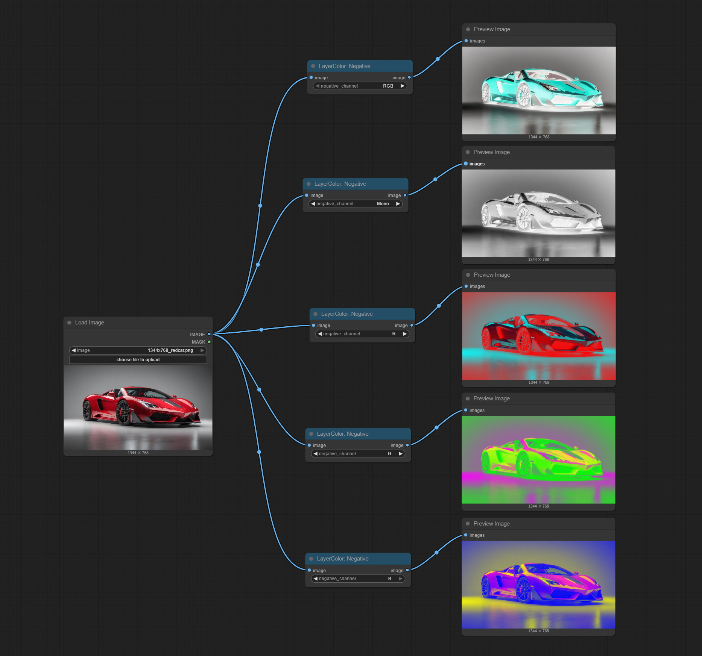
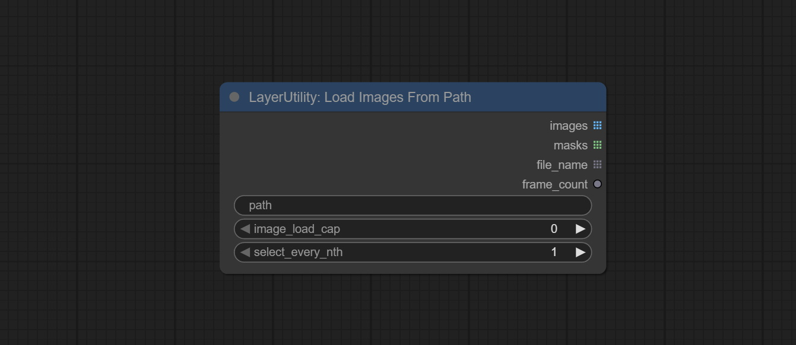
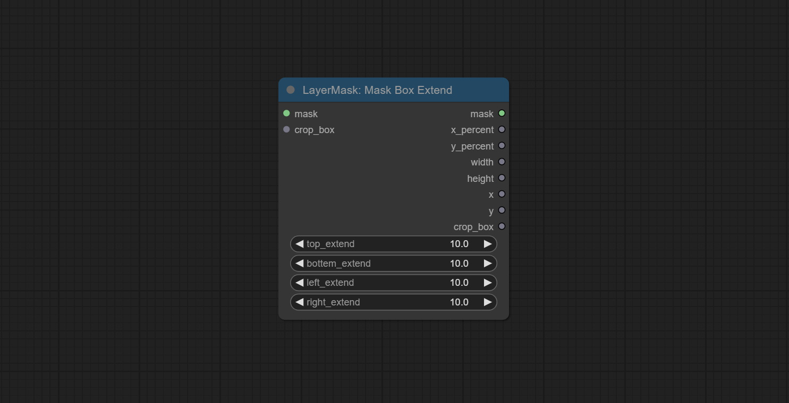

# ComfyUI Layer Style

## 重要通知
分拆部分依赖易出问题的节点至[ComfyUI_LayerStyle_Advance](https://github.com/chflame163/ComfyUI_LayerStyle_Advance)仓库。包括下列节点：    
LayerMask: BiRefNetUltra, LayerMask: BiRefNetUltraV2, LayerMask: LoadBiRefNetModel, LayerMask: LoadBiRefNetModelV2,    
LayerMask: EVFSAMUltra, LayerMask: Florence2Ultra, LayerMask: LoadFlorence2Model, LayerUtility: Florence2Image2Prompt,    
LayerUtility: GetColorTone, LayerUtility: GetColorToneV2, LayerMask: HumanPartsUltra, LayerMask: BenUltra, LayerMask: LoadBenModel,           
LayerUtility: ImageAutoCrop, LayerUtility: ImageAutoCropV2, LayerUtility: ImageAutoCropV3,    
LayerUtility: ImageRewardFilter, LayerUtility: LoadJoyCaption2Model, LayerUtility: JoyCaption2Split,    
LayerUtility: JoyCaption2, LayerUtility: JoyCaption2ExtraOptions, LayerUtility: LaMa,    
LayerUtility: LlamaVision, LayerUtility: LoadPSD, LayerMask: MaskByDifferent, LayerMask: MediapipeFacialSegment,    
LayerMask: BBoxJoin, LayerMask: DrawBBoxMask, LayerMask: ObjectDetectorFL2, LayerMask: ObjectDetectorMask,    
LayerMask: ObjectDetectorYOLO8, LayerMask: ObjectDetectorYOLOWorld, LayerMask: PersonMaskUltra, LayerMask: PersonMaskUltra V2,    
LayerUtility: PhiPrompt, LayerUtility: PromptEmbellish, LayerUtility: PromptTagger, LayerUtility: CreateQRCode, LayerUtility: DecodeQRCode,    
LayerUtility: QWenImage2Prompt, LayerMask: SAM2Ultra, LayerMask: SAM2VideoUltra, LayerUtility: SaveImagePlus, LayerUtility: SD3NegativeConditioning,    
LayerMask: SegmentAnythingUltra, LayerMask: SegmentAnythingUltra V2, LayerMask: TransparentBackgroundUltra,     
LayerUtility: UserPromptGeneratorTxt2ImgPrompt, LayerUtility: UserPromptGeneratorTxt2ImgPromptWithReference, LayerUtility: UserPromptGeneratorReplaceWord,    
LayerUtility: AddBlindWaterMark, LayerUtility: ShowBlindWaterMark, LayerMask: YoloV8Detect

如果最近更新了插件，请安装[ComfyUI_LayerStyle_Advance](https://github.com/chflame163/ComfyUI_LayerStyle_Advance)保证之前的工作流不会缺失节点。
如果因为拆分仓库导致问题，请回滚插件版本到```3d4a3526a9d1a19671a133e9215077bda520ee5d```
在插件目录打开终端，使用下列命令回滚版本：****
```
git reset --hard 3d4a3526a9d1a19671a133e9215077bda520ee5d
```


商业合作请联系email [chflame@163.com](mailto:chflame@163.com)


一组为ComfyUI设计的节点，可以合成图层达到类似Photoshop的功能。这些节点将PhotoShop的一部分基本功能迁移到ComfyUI，旨在集中工作流程，减少软件切换的频率。  

    
<font size="1">*此图工作流(title_example_workflow.json) 在 workflow 目录中.   </font><br /> 


## 工作流用示例
在workflow目录下有json格式的工作流示例文件，示范了如何在ComfyUI中使用这些节点。


## 安装方法
(以ComfyUI官方便携包和秋叶整合包为例，其他ComfyUI环境请修改依赖环境目录)

### 安装插件
* 推荐使用 ComfyUI Manager 安装。
* 或者在CompyUI插件目录(例如“CompyUI\custom_nodes\”)中打开cmd窗口，键入    
```
git clone https://github.com/chflame163/ComfyUI_LayerStyle.git
```
     
* 或者下载解压zip文件，将得到的文件夹复制到 ```ComfyUI\custom_nodes\```。   

### 安装依赖包

* 官方便携包请双击运行插件目录下的```install_requirements.bat```，秋叶整合包请双击运行插件目录下的```install_requirements_aki.bat```，然后等待安装完成。

* 或者在资源管理器```ComfyUI\custom_nodes\ComfyUI_LayerStyle``` 插件目录位置打开cmd窗口，  

&emsp;&emsp;官方便携包输入以下命令：

```
..\..\..\python_embeded\python.exe -s -m pip install -r requirements.txt
.\repair_dependency.bat
```
&emsp;&emsp;秋叶整合包输入以下命令：

```
..\..\python\python.exe -s -m pip install -r requirements.txt
.\repair_dependency_aki.bat
```
* 重新打开ComfyUI。

### 下载模型
国内用户请从[百度网盘](https://pan.baidu.com/s/1T_uXMX3OKIWOJLPuLijrgA?pwd=1yye)或者[夸克网盘](https://pan.quark.cn/s/4802d6bca7cb), 海外用户请从[huggingface](https://huggingface.co/chflame163/ComfyUI_LayerStyle/tree/main), 
下载全部模型文件并复制到```ComfyUI\models```文件夹。这个链接提供了本插件需要的所有的模型文件。
或者按各个节点的说明下载模型文件。     
以Ultra命名的节点使用vitmatte模型，请下载[vitmatte模型](https://huggingface.co/hustvl/vitmatte-small-composition-1k/tree/main)到```ComfyUI/models/vitmatte```文件夹，上面的下载链接也包括了这个模型。

## 常见问题
如果节点不能正常加载，或者使用中出现错误，请在ComfyUI终端窗口查看报错信息。以下是常见的错误及解决方法。

### Warning: xxxx.ini not found, use default xxxx..
这个警告信息是找不到ini文件的提示，不影响使用。如果不想看到这些警告，请修改插件目录下所有的 ```*.ini.example``` 文件名为```*.ini```。

### Cannot import name 'guidedFilter' from 'cv2.ximgproc'
这个错误是```opencv-contrib-python```没有正确安装，或者安装后又安装了其他opencv包导致。

### NameError: name 'guidedFilter' is not defined
问题原因同上。
#### 以上问题，请双击运行插件目录下的```repair_dependency.bat```(官方便携包)或者```repair_dependency_aki.bat```(秋叶整合包)自动修复。

### Cannot import name 'VitMatteImageProcessor' from 'transformers' 
这个错误是由于```transformers``` 版本过低造成的

### insightface 加载缓慢
这是由于```protobuf``` 版本过低造成的。 

### onnxruntime::python::CreateExecutionProviderInstance CUDA_PATH is set but CUDA wasn't able to be loaded. Please install the correct version of CUDA and cuDNN as mentioned in the GPU requirements page 
解决方法：
请重新安装```onnxruntime```依赖包

###  Error loading model xxx: We couldn't connect to huggingface.co ...
请检查网络环境。如果在中国不能正常访问huggingface.co，请尝试修改huggingface_hub包强制使用hf_mirror镜像。
* 在```huggingface_hub```包的目录(通常在虚拟环境内的```Lib/site-packages/huggingface_hub```)中找到```constants.py```,
在```import os```之后增加一行
```
os.environ['HF_ENDPOINT'] = 'https://hf-mirror.com'
```

### ValueError: Trimap did not contain foreground values (xxxx...)
这个错误是由于使用PyMatting方法处理遮罩边缘时，遮罩面积过大或者过小引起的。     

解决方法：
* 请调整参数，改变遮罩有效面积。或者换用其他的方法处理边缘。

### Requests.exceptions.ProxyError: HTTPSConnectionPool(xxxx...)
出现这个错误，请检查网络环境。


## 如何找到本节点组
* 在ComfyUI画布点击右键 - Add Node, 找到 "😺dzNodes"。    
    

* 或者在ComfyUI画布双击, 在搜索框输入"layer"。Florence2Image2Prompt
    


## 更新说明
<font size="4">**如果本插件更新后出现依赖包错误，请双击运行插件目录下的```install_requirements.bat```(官方便携包)，或 ```install_requirements_aki.bat```(秋叶整合包) 重新安装依赖包。

* 添加 [ImageCompositeHandleMask](#ImageCompositeHandleMask) 节点， 用于生成局部羽化遮罩以及对应的裁切数据。
* 添加 [DrawRoundedRectangle](#DrawRoundedRectangle) 节点， 用于生成圆角矩形遮罩。
* 添加 [FluxKontextImageScale](#FluxKontextImageScale) 节点，基于官方节点修改，用于将图像大小调整为更适合FluxKontext的大小。对于非标准宽高比的图像，自动调整比例以保持所有画面信息。
* 添加 [MaskBoxExtend](#MaskBoxExtend) 节点，用于生成遮罩BBOX扩展范围并输出为Mask。
* 添加 [ColorNegative](#ColorNegative)节点，用于将图片颜色反转。
* 添加 [LoadImagesFromPath](#LoadImagesFromPath) 和 [ImageTaggerSaveV2](#ImageTaggerSaveV2) 节点，用于从文件夹加载图片列表并保存对应文件名的图片和标签。 
* 添加 [SegformerUltraV3](SegformerUltraV3), [LoadSegformerModel](LoadSegformerModel), [SegformerClothesSetting](SegformerClothesSetting) 和 [SegformerFashionSetting](SegformerFashionSetting) 节点，将模型与设置分离加载，在使用多个节点时节省资源。
* 添加多语言，除英语外，增加支持5种语言：中文、法语、日语、韩语和俄语。该功能使用[ComfyUI-Globalization-Node-Translation](https://github.com/yamanacn/ComfyUI-Globalization-Node-Translation)制作，感谢原作者。 
* 添加 [HalfTone](#HalfTone) 节点，用于对图像进行半色调处理。
* 增加模型下载夸克网盘链接。
* 支持numpy 2.x依赖包。
* 添加 [PurgeVRAM V2](#PurgeVRAMV2) 节点，不强制执行，增加any输出，便于在流程中灵活释放显存。
* 添加 [ChoiceTextPreset](#ChoiceTextPreset) 和 [TextPreseter](#TextPreseter) 节点，用于预设文本和选择预设文本输出。
* [StringCondition](#StringCondition) 节点增加比较字符串是否相同功能。
* 添加 [NameToColor](#NameToColor)节点，根据颜色名称输出颜色。
* 添加 [ImageMaskScaleAsV2](#ImageMaskScaleAsV2)节点，在原节点基础上增加背景颜色设置。
* 添加 [RoundedRectangle](#RoundedRectangle) 节点，用于创建圆角矩形及遮罩。
* 添加 [AnyRerouter](#AnyRerouter) 节点，用于将任意类型数据中转转发。
* 添加 [ICMask](#ICMask) 和 [ICMaskCropBack](#ICMaskCropBack) 节点，用于生成一致性上下文图片和遮罩，以及自动回裁。代码来自[lrzjason/Comfyui-In-Context-Lora-Utils](https://github.com/lrzjason/Comfyui-In-Context-Lora-Utils) 感谢原作者@小志Jason
* 添加 [GetMainColorsV2](#GetMainColorsV2) 节点，增加按颜色面积排序，并在预览图中输出色值和比例。这部分代码由@HL完善，感谢。
* 优化依赖包。优化部分图形算法。
* 分拆部分依赖易出问题的节点至[ComfyUI_LayerStyle_Advance](#https://github.com/chflame163/ComfyUI_LayerStyle_Advance)仓库。包括下列节点：    
LayerMask: BiRefNetUltra, LayerMask: BiRefNetUltraV2, LayerMask: LoadBiRefNetModel, LayerMask: LoadBiRefNetModelV2,    
LayerMask: EVFSAMUltra, LayerMask: Florence2Ultra, LayerMask: LoadFlorence2Model, LayerUtility: Florence2Image2Prompt,    
LayerUtility: GetColorTone, LayerUtility: GetColorToneV2, LayerMask: HumanPartsUltra,    
LayerUtility: ImageAutoCrop, LayerUtility: ImageAutoCropV2, LayerUtility: ImageAutoCropV3,    
LayerUtility: ImageRewardFilter, LayerUtility: LoadJoyCaption2Model, LayerUtility: JoyCaption2Split,    
LayerUtility: JoyCaption2, LayerUtility: JoyCaption2ExtraOptions, LayerUtility: LaMa,    
LayerUtility: LlamaVision, LayerUtility: LoadPSD, LayerMask: MaskByDifferent, LayerMask: MediapipeFacialSegment,    
LayerMask: BBoxJoin, LayerMask: DrawBBoxMask, LayerMask: ObjectDetectorFL2, LayerMask: ObjectDetectorMask,    
LayerMask: ObjectDetectorYOLO8, LayerMask: ObjectDetectorYOLOWorld, LayerMask: PersonMaskUltra, LayerMask: PersonMaskUltra V2,    
LayerUtility: PhiPrompt, LayerUtility: PromptEmbellish, LayerUtility: PromptTagger, LayerUtility: CreateQRCode, LayerUtility: DecodeQRCode,    
LayerUtility: QWenImage2Prompt, LayerMask: SAM2Ultra, LayerMask: SAM2VideoUltra, LayerUtility: SaveImagePlus, LayerUtility: SD3NegativeConditioning,    
LayerMask: SegmentAnythingUltra, LayerMask: SegmentAnythingUltra V2, LayerMask: TransparentBackgroundUltra,     
LayerUtility: UserPromptGeneratorTxt2ImgPrompt, LayerUtility: UserPromptGeneratorTxt2ImgPromptWithReference, LayerUtility: UserPromptGeneratorReplaceWord,    
LayerUtility: AddBlindWaterMark, LayerUtility: ShowBlindWaterMark, LayerMask: YoloV8Detect

* 添加 [LoadImageFromPath](LoadImageFromPath) 节点，可将一个文件夹中的图片加载为图片列表输出，支持单个文件名对应列表输出。
* 合并[alexisrolland](https://github.com/alexisrolland) 提交的分支，添加Image Blend Advanced v3 和 Drop Shadow v3 节点，支持透明背景。
* 添加[BenUltra](#BenUltra) 和 [LoadBenModel](#LoadBenModel)节点。这两个节点是[PramaLLC/BEN](https://huggingface.co/PramaLLC/BEN) 项目在ComfyUI中的实现。    
从 [huggingface](https://huggingface.co/PramaLLC/BEN/tree/main) 或 [百度网盘](https://pan.baidu.com/s/17mdBxfBl_R97mtNHuiHsxQ?pwd=2jn3)下载```BEN_Base.pth``` 和 ```config.json``` 两个文件并复制到 ```ComfyUI/models/BEN```文件夹。
* 合并[jimlee2048](https://github.com/jimlee2048)提交的PR, 添加[LoadBiRefNetModelV2](#LoadBiRefNetModelV2) 节点，支持加载RMBG 2.0模型。    
从 [huggingface](https://huggingface.co/briaai/RMBG-2.0/tree/main) 或 [百度网盘](https://pan.baidu.com/s/1viIXlZnpTYTKkm2F-QMj_w?pwd=axr9) 下载全部文件并复制到```ComfyUI/models/BiRefNet/RMBG-2.0```文件夹。
* Florence2 节点更新支持 base-PromptGen-v2.0 和 large-PromptGen-v2.0 模型。从 [huggingface](https://huggingface.co/chflame163/ComfyUI_LayerStyle/tree/main/ComfyUI/models/florence2) 或 [BaiduNetdisk](https://pan.baidu.com/s/1BVvXt3N7zrBnToyF-GrC_A?pwd=xm0x) 下载  ```base-PromptGen-v2.0``` 和 ```large-PromptGen-v2.0``` 两个文件夹并复制到 ```ComfyUI/models/florence2```。
* [SAM2Ultra](#SAM2Ultra) 及 ObjectDetector 节点支持图像批次。
* [SAM2Ultra](#SAM2Ultra) 及 [SAM2VideoUltra](#SAM2VideoUltra) 节点增加支持SAM2.1模型，包括[kijai](https://github.com/kijai)量化版fp16模型。请从请从[百度网盘](https://pan.baidu.com/s/1xaQYBA6ktxvAxm310HXweQ?pwd=auki) 或者 [huggingface.co/Kijai/sam2-safetensors](https://huggingface.co/Kijai/sam2-safetensors/tree/main)下载模型文件并复制到```ComfyUI/models/sam2```文件夹。 
* 添加 [JoyCaption2Split](#JoyCaption2Split) 和 [LoadJoyCaption2Model](#LoadJoyCaption2Model) 节点，在多个JoyCaption2节点时共用模型提高效率。
* [SegmentAnythingUltra](#SegmentAnythingUltra) 和 [SegmentAnythingUltraV2](#SegmentAnythingUltraV2) 增加 ```cache_model``` 参数，便于灵活管理显存。
* 鉴于[LlamaVision](#LlamaVision)节点对 ```transformers``` 的要求版本较高而影响某些旧版第三方插件的加载，LayerStyle 插件已将默认要求降低到4.43.2， 如有运行LlamaVision的需求请自行升级至4.45.0以上。
* 添加 [JoyCaption2](#JoyCaption2) 和 [JoyCaption2ExtraOptions](#JoyCaption2ExtraOptions) 节点，使用JoyCaption-alpha-two模型生成提示词。
请从 [百度网盘](https://pan.baidu.com/s/1dOjbUEacUOhzFitAQ3uIeQ?pwd=4ypv) 以及 [百度网盘](https://pan.baidu.com/s/1mH1SuW45Dy6Wga7aws5siQ?pwd=w6h5) ， 
或者 [huggingface/Orenguteng](https://huggingface.co/Orenguteng/Llama-3.1-8B-Lexi-Uncensored-V2/tree/main) 以及 [huggingface/unsloth](https://huggingface.co/unsloth/Meta-Llama-3.1-8B-Instruct/tree/main) 下载整个文件夹，并复制到ComfyUI/models/LLM,
从 [百度网盘](https://pan.baidu.com/s/1pkVymOsDcXqL7IdQJ6lMVw?pwd=v8wp) 或者 [huggingface/google](https://huggingface.co/google/siglip-so400m-patch14-384/tree/main) 下载整个文件夹，并复制到ComfyUI/models/clip,
从 [百度网盘](https://pan.baidu.com/s/12TDwZAeI68hWT6MgRrrK7Q?pwd=d7dh) 或者 [huggingface/John6666](https://huggingface.co/John6666/joy-caption-alpha-two-cli-mod/tree/main)下载 ```cgrkzexw-599808``` 文件夹，并复制到ComfyUI/models/Joy_caption。
* 添加 [LlamaVision](#LlamaVision) 节点，使用Llama 3.2 视觉模型生成提示词。运行这个节点需要transformers升级到4.45.0以上。
请从 [百度网盘](https://pan.baidu.com/s/18oHnTrkNMiwKLMcUVrfFjA?pwd=4g81) 或 [huggingface/SeanScripts](https://huggingface.co/SeanScripts/Llama-3.2-11B-Vision-Instruct-nf4/tree/main)下载整个文件夹，并复制到ComfyUI/models/LLM。
* 添加 [RandomGeneratorV2](#RandomGeneratorV2) 节点，增加最小随机范围和种子选项。 
* 添加 [TextJoinV2](#TextJoinV2) 节点，在TextJion基础上增加分隔符选项。
* 添加 [GaussianBlurV2](#GaussianBlurV2) 节点，参数精度提升到0.01。
* 添加 [UserPromptGeneratorTxtImgWithReference](#UserPromptGeneratorTxtImgWithReference) 节点。 
* 添加 [GrayValue](#GrayValue) 节点，输出RGB色值对应的灰度值。
* [LUT Apply](#LUT), [TextImageV2](#TextImageV2), [TextImage](#TextImage), [SimpleTextImage](#SimpleTextImage) 等节点支持在 ```resource_dir.ini``` 中定义多个文件夹，之间用逗号，分号或者空格分隔。同时支持刷新实时更新。
* 添加 [HumanPartsUltra](#HumanPartsUltra) 节点，用于人物肢体分割。本节点是基于[metal3d/ComfyUI_Human_Parts](https://github.com/metal3d/ComfyUI_Human_Parts) 的重新封装，感谢原作者。
请从[百度网盘](https://pan.baidu.com/s/1-6uwH6RB0FhIVfa3qO7hhQ?pwd=d862) 或 [huggingface](https://huggingface.co/Metal3d/deeplabv3p-resnet50-human/tree/main) 下载模型文件并复制到 ```ComfyUI\models\onnx\human-parts``` 文件夹。
* ObjectDetector 节点添加按置信度排序选项。
* 添加 [DrawBBoxMask](#DrawBBoxMask) 节点，用于将 ObjectDetector 节点输出的BBox转为遮罩。
* 添加 [UserPromptGeneratorTxtImg](#UserPromptGeneratorTxtImg) 以及 [UserPromptGeneratorReplaceWord](#UserPromptGeneratorReplaceWord) 节点, 用于生成文生图提示词和替换提示词内容。
* 添加 [PhiPrompt](#PhiPrompt) 节点，使用Micrisoft Phi 3.5文字及视觉模型进行本地推理。可以用于生成提示词，加工提示词或者反推图片的提示词。运行这个模型需要至少16GB的显存。        
请从[百度网盘](https://pan.baidu.com/s/1BdTLdaeGC3trh1U3V-6XTA?pwd=29dh) 或者 [huggingface.co/microsoft/Phi-3.5-vision-instruct](https://huggingface.co/microsoft/Phi-3.5-vision-instruct/tree/main) 和 [huggingface.co/microsoft/Phi-3.5-mini-instruct](https://huggingface.co/microsoft/Phi-3.5-mini-instruct/tree/main) 下载全部模型文件并放到 ```ComfyUI\models\LLM``` 文件夹。
* 添加 [GetMainColors](#GetMainColors) 节点，可获得图片的5个主要颜色。 添加 [ColorName](#ColorName) 节点，可获得颜色名称。
* 复制 [Brightness & Contrast](#Brightness) 节点为 [BrightnessContrastV2](#BrightnessContrastV2), [Color of Shadow & Highlight](#Highlight) 节点为 [ColorofShadowHighlight](#HighlightV2), [Shadow & Highlight Mask](#Shadow) 为 [Shadow Highlight Mask V2](#ShadowV2), 以避免节点名称中的"&"字符造成ComfyUI工作流解析错误。 
* 添加 [VQAPrompt](#VQAPrompt) 和 [LoadVQAModel](#LoadVQAModel) 节点。      
请从[百度网盘](https://pan.baidu.com/s/1ILREVgM0eFJlkWaYlKsR0g?pwd=yw75) 或者 [huggingface.co/Salesforce/blip-vqa-capfilt-large](https://huggingface.co/Salesforce/blip-vqa-capfilt-large/tree/main) 和 [huggingface.co/Salesforce/blip-vqa-base](https://huggingface.co/Salesforce/blip-vqa-base/tree/main) 下载全部模型文件并放到 ```ComfyUI\models\VQA```文件夹。
* [Florence2Ultra](#Florence2Ultra),  [Florence2Image2Prompt](#Florence2Image2Prompt) 和 [LoadFlorence2Model](#LoadFlorence2Model) 节点支持MiaoshouAI/Florence-2-large-PromptGen-v1.5 和 MiaoshouAI/Florence-2-base-PromptGen-v1.5 模型。
请从[百度网盘](https://pan.baidu.com/s/1xOL6x6LijIMSh_3woErjJg?pwd=t3xa) 或者 [huggingface.co/MiaoshouAI/Florence-2-large-PromptGen-v1.5](https://huggingface.co/MiaoshouAI/Florence-2-large-PromptGen-v1.5/tree/main) 以及[huggingface.co/MiaoshouAI/Florence-2-base-PromptGen-v1.5](https://huggingface.co/MiaoshouAI/Florence-2-base-PromptGen-v1.5/tree/main) 下载全部模型文件并放到 ```ComfyUI\models\florence2```文件夹。 
* 添加 [BiRefNetUltraV2](#BiRefNetUltraV2) 和 [LoadBiRefNetModel](#LoadBiRefNetModel) 节点，支持使用最新的BiRefNet模型。
从[百度网盘](https://pan.baidu.com/s/12z3qUuqag3nqpN2NJ5pSzg?pwd=ek65) 或 [GoogleDrive](https://drive.google.com/drive/folders/1s2Xe0cjq-2ctnJBR24563yMSCOu4CcxM) 下载 ```BiRefNet-general-epoch_244.pth``` 到 ComfyUI/Models/BiRefNet/pth 文件夹。也可以下载更多的BiRefNet模型放到这里。
* [ExtendCanvasV2](#ExtendCanvasV2) 节点支持负值输入，负值将被裁剪。
* 节点默认标题颜色改为蓝绿色，LayerStyle, LayerColor, LayerMask, LayerUtility 和 LayerFilter 的节点分别用不同的颜色区分。
* 合并 [heshengtao](https://github.com/heshengtao) 提交的PR, 添加[TextImageV2](#TextImageV2)节点，修改图片文字节点的缩放，字体间隔跟随缩放，坐标不再以文字左上角，而是整行文字的中心点。感谢作者的贡献。
* ObjectDectector节点组增加sort bbox功能， 可按从左到右、从上到下、从大到小排序，选择物体更直观方便。昨天发布的节点已放弃，请手动更换为新版节点(对不起)。
* 添加 [SAM2Ultra](#SAM2Ultra), [SAM2VideoUltra](#SAM2VideoUltra), [ObjectDetectorFL2](#ObjectDetectorFL2), [ObjectDetectorYOLOWorld](#ObjectDetectorYOLOWorld), [ObjectDetectorYOLO8](#ObjectDetectorYOLO8), [ObjectDetectorMask](#ObjectDetectorMask) 和 [BBoxJoin](#BBoxJoin)节点。
请从[百度网盘](https://pan.baidu.com/s/1xaQYBA6ktxvAxm310HXweQ?pwd=auki) 或者 [huggingface.co/Kijai/sam2-safetensors](https://huggingface.co/Kijai/sam2-safetensors/tree/main)下载全部模型文件并复制到```ComfyUI/models/sam2```文件夹; 
从 [百度网盘](https://pan.baidu.com/s/1QpjajeTA37vEAU2OQnbDcQ?pwd=nqsk) 或[GoogleDrive](https://drive.google.com/drive/folders/1nrsfq4S-yk9ewJgwrhXAoNVqIFLZ1at7?usp=sharing)下载模型文件并复制到```ComfyUI/models/yolo-world```文件夹。 
本次更新引入了新的依赖，请重新安装依赖包。 
* 添加 [RandomGenerator](#RandomGenerator) 节点，用于生成指定范围内的随机数，有int，float，bool输出，支持按图片批量生成不同的随机数。
* 添加 [EVF-SAMUltra](#EVFSAMUltra) 节点，是[EVF-SAM](https://github.com/hustvl/EVF-SAM)在ComfyUI中的实现。请从[百度网盘](https://pan.baidu.com/s/1EvaxgKcCxUpMbYKzLnEx9w?pwd=69bn) 或者 [huggingface/EVF-SAM2](https://huggingface.co/YxZhang/evf-sam2/tree/main), [huggingface/EVF-SAM](https://huggingface.co/YxZhang/evf-sam/tree/main) 下载全部模型文件并复制到```ComfyUI/models/EVF-SAM```文件夹(请将模型保存在各自子目录中)。
由于引入了新的依赖，插件升级后请重新安装依赖包。
* 添加 [ImageTaggerSave](#ImageTaggerSave) 和 [ImageAutoCropV3](#ImageAutoCropV3) 节点，用于实现训练集自动裁切打标工作流(工作流```image_tagger_save_example.json```在workflow目录中)。
* 添加 [CheckMaskV2](#CheckMaskV2) 节点，增加了```simple```方法以更快速检测遮罩。
* 添加 [ImageReel ](#ImageReel) 和 [ImageReelComposit](#ImageReelComposit) 节点，可将多张图片显示在一起。
* [NumberCalculatorV2](#NumberCalculatorV2) 和 [NumberCalculator](#NumberCalculator) 节点增加 ```min``` 和 ```max``` 方法。
* 优化节点加载速度。    
* [Florence2Image2Prompt](#Florence2Image2Prompt) 增加thwri/CogFlorence-2-Large-Freeze 和 thwri/CogFlorence-2.1-Large 模型支持。请从[百度网盘](https://pan.baidu.com/s/1hzw9-QiU1vB8pMbBgofZIA?pwd=mfl3) 或 [huggingface/CogFlorence-2-Large-Freeze](https://huggingface.co/thwri/CogFlorence-2-Large-Freeze/tree/main) 和 [huggingface/CogFlorence-2.1-Large](https://huggingface.co/thwri/CogFlorence-2.1-Large/tree/main) 下载模型文件并复制到```ComfyUI/models/florence2```文件夹。 
* 合并来自[ClownsharkBatwing](https://github.com/ClownsharkBatwing)的分支“使用GPU进行颜色混合模式”，某些图层的混合速度提高了十倍以上。
* 添加 [Florence2Ultra](#Florence2Ultra),  [Florence2Image2Prompt](#Florence2Image2Prompt) 和 [LoadFlorence2Model](#LoadFlorence2Model) 节点。
* [TransparentBackgroundUltra](#TransparentBackgroundUltra) 节点增加新模型支持。请按说明下载模型文件。
* 添加 [SegformerUltraV2](#SegformerUltraV2), [SegfromerFashionPipeline](#SegfromerFashionPipeline) 和 [SegformerClothesPipeline](#SegformerClothesPipeline) 节点, 用于分割服饰。请按说明下载模型文件。
* 添加 ```install_requirements.bat``` 和 ```install_requirements_aki.bat``` 文件, 一键解决安装依赖包问题。
* 添加[TransparentBackgroundUltra](#TransparentBackgroundUltra) 节点，基于transparent-background模型，用于去除背景。
* [Ultra](#Ultra) 节点的VitMatte模型改为本地调用，请下载[所有的vitmatte模型文件](https://huggingface.co/hustvl/vitmatte-small-composition-1k/tree/main)到```ComfyUI/models/vitmatte```文件夹。
* [GetColorToneV2](#GetColorToneV2) 节点的取色选项增加```mask```方法，可精确获取遮罩内的主色和平均色。
* [ImageScaleByAspectRatioV2](#ImageScaleByAspectRatioV2) 节点增加background_color选项。 
* [LUT Apply](#LUT) 节点增加strenght选项。
* 添加 [AutoAdjustV2](#AutoAdjustV2) 节点，增加可选遮罩输入，增加多种自动调色模式支持。
* 由于gemini-pro-vision即将停止服务， [PromptTagger](#PromptTagger) 和 [PromptEmbellish](#PromptEmbellish) 添加"gemini-1.5-flash" API以继续使用。 
* [Ultra](#Ultra) 节点增加```VitMatte```方法在CUDA设备运行选项，运行速度提升5倍。
* 添加 [QueueStop](#QueueStop) 节点，用于停止队列。
* 优化[Ultra](#Ultra)节点的```VitMatte```方法在处理大尺寸图片时的性能。
* [CropByMaskV2](#CropByMaskV2) 增加裁切尺寸按倍数取整选项。
* 添加 [CheckMask](#CheckMask) 节点, 用于检测遮罩是否包含足够的有效区域。
* 添加 [HSVValue](#HSVValue) 节点, 用于转换色值为HSV值。
* [BooleanOperatorV2](#BooleanOperatorV2), [NumberCalculatorV2](#NumberCalculatorV2), [Integer](#Integer), [Float](#Float), [Boolean](#Boolean)节点增加string输出，将值输出为字符串，以配合[SwitchCase](#SwitchCase)使用。
* 添加 [SwitchCase](#SwitchCase) 节点, 根据匹配字符串切换输出。可用于任意类型的数据切换。
* 添加 [String](#String) 节点, 用于输出字符串。这是TextBox简化版节点。
* 添加 [If](#If) 节点，根据布尔值条件输入切换输出。可用于任意类型的数据切换。
* 添加 [StringCondition](#StringCondition) 节点, 可判断文本中是否包含或不包含子字符串。
* 添加 [NumberCalculatorV2](#NumberCalculatorV2) 节点，增加开方运算。添加 [BooleanOperatorV2](#BooleanOperatorV2) 节点, 增加大小于、大小于等于逻辑判断。这两个节点可接入数值输入也可在节点内输入数值。注意:数值输入更优先，当有输入时节点内数值将无效。
* 添加 [SD3NegativeConditioning](#SD3NegativeConditioning) 节点, 把SD3的Negative Conditioning 的4个节点封装为一个单独节点。
* [ImageRemoveAlpha](#ImageRemoveAlpha) 节点增加mask可选输入。
* 添加 [HLFrequencyDetailRestore](#HLFrequencyDetailRestore)节点, 使用低频滤波加保留高频来恢复图像细节，图像融合性更好。
* 添加 [AddGrain](#AddGrain) 和 [MaskGrain](#MaskGrain) 节点, 为图片或遮罩添加噪声。
* 添加 [FilmV2](#FilmV2) 节点, 在之前基础上增加了fastgrain方法，生成噪点速度加快了10倍。
* 添加 [ImageToMask](#ImageToMask) 节点，可将图片转为遮罩。支持以LAB，RGBA, YUV 和 HSV模式的任意通道转换为遮罩，同时提供色阶调整。支持mask可选输入以获取仅包括有效部分的遮罩。
* 部分节点中blackpoint和whitepoint选项改为滑块调节，便于更直观显示。包括[MaskEdgeUltraDetailV2](#MaskEdgeUltraDetailV2), [SegmentAnythingUltraV2](#SegmentAnythingUltraV2), [RmBgUltraV2](#RmBgUltraV2)，[PersonMaskUltraV2](#PersonMaskUltraV2)，[BiRefNetUltra](#BiRefNetUltra), [SegformerB2ClothesUltra](#SegformerB2ClothesUltra), [BlendIfMask](#BlendIfMask) 和 [Levels](#Levels)。
* [ImageScaleRestoreV2](#ImageScaleRestoreV2) 和[ImageScaleByAspectRatioV2](#ImageScaleByAspectRatioV2) 节点增加TotalPixel方法缩放图片。
* 添加 [MediapipeFacialSegment](#MediapipeFacialSegment) 节点， 用于分割面部五官，包括左右眉、眼睛、嘴唇和牙齿。
* 添加 [BatchSelector](#BatchSelector) 节点， 用于从批量图片或遮罩中获取指定的图片或遮罩。
* LayerUtility大类新建子目录SystemIO, Data, Prompt。一部分节点被分类到子目录。
* 添加 [MaskByColor](#MaskByColor) 节点, 根据选择的颜色生成遮罩。
* 添加 [LoadPSD](#LoadPSD) 节点, 读取psd格式并输出图层图片。注意这个节点需要安装psd_tools依赖包，如果安装psd_tool中出现```ModuleNotFoundError: No module named 'docopt'```错误，请下载[docopt的whl](https://www.piwheels.org/project/docopt/)手动安装。
* 添加 [SegformerB2ClothesUltra](#SegformerB2ClothesUltra)节点，用于分割人物服装。模型分割代码来自[StartHua](https://github.com/StartHua/Comfyui_segformer_b2_clothes)，感谢原作者。
* [SaveImagePlus](#SaveImagePlus)节点增加输出工作流为json功能，支持使用```%date```和```%time```在路径和文件名嵌入时间，增加预览开关。
* 添加 [SaveImagePlus](#SaveImagePlus)节点，可自定义保存图片的目录，文件名增加时间戳，选择保存格式，设置图片压缩率，设置是否保存工作流，以及可选给图片添加隐形水印。
* 添加 [AddBlindWaterMark](#AddBlindWaterMark), [ShowBlindWaterMark](#ShowBlindWaterMark)节点，为图片增加隐形水印和解码水印。添加 [CreateQRCode](#CreateQRCode), [DecodeQRCode](#DecodeQRCode)节点，可生成二维码图片和解码二维码。
* [ImageScaleRestoreV2](#ImageScaleRestoreV2), [ImageScaleByAspectRatioV2](#ImageScaleByAspectRatioV2), [ImageAutoCropV2](#ImageAutoCropV2)节点增加```width```和```height```选项，可指定宽度或高度为固定值。
* 添加 [PurgeVRAM](#PurgeVRAM) 节点, 清理显存和内存。
* 添加 [AutoAdjust](#AutoAdjust) 节点, 自动调整图片对比度和白平衡。
* 添加 [RGBValue](#RGBValue) 节点, 将色值输出为单独的R, G, B三个10进制数值。这个想法来自[vxinhao](https://github.com/vxinhao/color2rgb)。
* 添加[seed](#seed) 节点，输出种子值。[ImageMaskScaleAs](#ImageMaskScaleAs), [ImageScaleBySpectRatio](#ImageScaleBySpectRatio), [ImageScaleBySpectRatioV2](#ImageScaleBySpectRatioV2), [ImageScaleRestore](#ImageScaleRestore), [ImageScaleRestoreV2](#ImageScaleRestoreV2) 节点增加```width```, ```height``` 输出。
* 添加 [Levels](#Levels) 节点, 可以实现与Photoshop相同的色阶调整功能。[Sharp&Soft](#Sharp)增加"None"选项。
* 添加 [BlendIfMask](#BlendIfMask) 节点，该节点与 ImgaeBlendV2 或者 ImageBlendAdvanceV2 配合，可以实现与Photoshop相同的混合颜色带功能。
* 添加 [ColorTemperature](#ColorTemperature) 和 [ColorBalance](#ColorBalance) 节点，用于调整图片色温和色彩平衡。
* 更新 [混合模式](#混合模式)到V2版本，现在支持多达30种混合模式。新增的混合模式适用于所有支持混合模式节点的V2版本，包括ImageBlend V2, ImageBlendAdvance V2, DropShadow V2, InnerShadow V2, OuterGlow V2, InnerGlow V2, Stroke V2, ColorOverlay V2, GradientOverlay V2。
混合模式V2的部分代码来自[Virtuoso Nodes for ComfyUI](https://github.com/chrisfreilich/virtuoso-nodes)的```Blend Modes```节点。感谢原作者。
* 添加 [YoloV8Detect](#YoloV8Detect) 节点。
* 添加 [QWenImage2Prompt](#QWenImage2Prompt)节点, 用本地模型反推提示词。(需要下载模型到models文件夹)
* 添加 [BooleanOperator](#BooleanOperator), [NumberCalculator](#NumberCalculator), [TextBox](#TextBox), [Integer](#Integer), [Float](#Float), [Boolean](#Boolean)节点。这些节点可进行数学和逻辑运算。
* 添加 [ExtendCanvasV2](#ExtendCanvasV2) 节点，支持color值输入。
* 添加 [AutoBrightness](#AutoBrightness) 节点，可自动调整图片亮度。
* [CreateGradientMask](#CreateGradientMask) 节点增加 ```center``` 选项。
* 添加 [GetColorToneV2](#GetColorToneV2) 节点, 可选择背景或主体的主色和平均色。
* 添加[ImageRewardFilter](#ImageRewardFilter) 节点, 可过滤掉品质欠佳的图片。
* [Ultra](#Ultra) 节点增加VITMatte(local)方法，如果之前已经下载了模型，可选择此方法避免访问huggingface.co。
* 添加 [HDR Effect](#HDR) 节点，增强图片动态范围。这个节点是[HDR Effects (SuperBeasts.AI)](https://github.com/SuperBeastsAI/ComfyUI-SuperBeasts)的重新封装。感谢原作者。
* 添加 [CropBoxResolve](#CropBoxResolve) 节点。
* 添加 [BiRefNetUltra](#BiRefNetUltra) 节点, 使用BiRefNet模型去除背景，有更好的识别能力，同时具有超高的边缘细节。
* 添加 [ImageAutoCropV2](#ImageAutoCropV2) 节点，可选择不去除背景，支持mask输入，支持按长边或短边尺寸缩放。
* 添加 [ImageHub](#ImageHub) 节点，支持最多9组Image和Mask切换，支持随机输出。
* 添加 [TextJoin](#TextJoin) 节点。
* 添加 [PromptEmbellish](#PromptEmbellish) 节点, 对简单的提示词润色，支持图片输入参考，支持中文输入。
* [Ultra](#Ultra) 节点全面升级到V2版本，增加了VITMatte边缘处理方法，此方法适合处理半透明区域。包括 [MaskEdgeUltraDetailV2](#MaskEdgeUltraDetailV2), [SegmentAnythingUltraV2](#SegmentAnythingUltraV2), [RmBgUltraV2](#RmBgUltraV2) 以及 [PersonMaskUltraV2](#PersonMaskUltraV2) 节点。
* 添加 [Color of Shadow & Highlight](#Highlight) 节点，可对暗部和亮部分别进行色彩调整。添加 [Shadow & Highlight Mask](#Shadow) 节点, 可输出暗部和亮部的遮罩。
* 添加 [CropByMaskV2](#CropByMaskV2) 节点，在原节点基础上支持```crop_box```输入，方便裁切相同尺寸的图层。
* 添加 [SimpleTextImage](#SimpleTextImage) 节点。从文字生成简单排版的图片以及遮罩。这个节点参考了[ZHO-ZHO-ZHO/ComfyUI-Text_Image-Composite](https://github.com/ZHO-ZHO-ZHO/ComfyUI-Text_Image-Composite)的部分功能和代码。
* 添加 [PromptTagger](#PromptTagger) 节点，根据图片反推提示词，可以替换关键词。需要申请Google Studio API使用。升级节点[ColorImageV2](#ColorImageV2)和[GradientImageV2](#GradientImageV2)，支持用户自定义预设尺寸和size_as输入。
* 添加 [Lama](#Lama) 节点，根据图像遮罩擦除物体。本节点是对[IOPaint](https://www.iopaint.com)的封装。
* 添加 [ImageRemoveAlpha](#ImageRemoveAlpha) 和 [ImageCombineAlpha](#ImageCombineAlpha) 节点，可移除或合并图片的alpha通道。
* 添加 [ImageScaleRestoreV2](#ImageScaleRestoreV2) 和 [ImageScaleByAspectRatioV2](#ImageScaleByAspectRatioV2) 节点。支持按指定的长边或短边尺寸缩放图像。
* 添加 [PersonMaskUltra](#PersonMaskUltra) 节点，为人物生成脸、头发、身体皮肤、衣服或配饰的遮罩。本节点的模型代码来自[a-person-mask-generator](https://github.com/djbielejeski/a-person-mask-generator)。
* 添加 [LightLeak](#LightLeak) 节点，这个滤镜模拟胶片漏光效果。 
* 添加 [Film](#Film) 节点, 这个滤镜模拟胶片的颗粒、暗边和边缘模糊，支持输入深度图模拟虚焦，是[digitaljohn/comfyui-propost](https://github.com/digitaljohn/comfyui-propost)的重新封装。
* 添加 [ImageAutoCrop](#ImageAutoCrop) 节点, 这个节点是为生成训练模型的图片素材而设计的。
* 添加 [ImageScaleByAspectRatio](#ImageScaleByAspectRatio) 节点， 可按画幅比例缩放图像。
* 改正 [LUT Apply](#LUT) 节点渲染出现色阶的bug, 并增加log色彩空间支持。*log色彩空间图片请加载专门的log lut。
* 添加 [CreateGradientMask](#CreateGradientMask) 节点。添加 [LayerImageTransform](#LayerImageTransform) 和 [LayerMaskTransform](#LayerMaskTransform) 节点。
* 添加 [MaskEdgeUltraDetail](#MaskEdgeUltraDetail) 节点，给粗糙的遮罩进行处理获得超精细的边缘。添加 [Exposure](#Exposure) 节点，调整图像曝光。
* 添加 [Sharp & Soft](#Sharp) 节点，可提升或抹平图像细节。新增[MaskByDifferent](#MaskByDifferent)节点，比较两张图片并输出Mask。新增[SegmentAnythingUltra](#SegmentAnythingUltra)节点，提升遮罩边缘质量。*如果没有安装SegmentAnything, 需要手动下载模型。
* 所有节点已全面支持批量图片，为创作视频提供方便。( CropByMask 节点仅支持相同尺寸的切除, 如果输入批量mask_for_crop，将使用第一张的数据。)
* 添加 [RemBgUltra](#RemBgUltra) 和 [PixelSpread](#PixelSpread) 节点，显著提升了遮罩质量。*RemBgUltra需手动下载模型。
* 添加 [TextImage](#TextImage) 节点，生成文字图像和遮罩。
* 图像之间的[混合模式](#混合模式)增加新类型，现在支持多达19种混合模式。新增color_burn颜色加深, color_dodge颜色减淡, linear_burn线性加深, linear_dodge线性减淡, overlay叠加, soft_light柔光, hard_light强光, vivid_light亮光, pin_light点光, linear_light线性光, hard_mix实色混合。新增的混合模式适用于所有支持混合模式的节点。
* 添加 [ColorMap](#ColorMap) 滤镜节点，用于制作伪彩色热力图效果。
* 添加 [WaterColor](#WaterColor) 和 [SkinBeauty](#SkinBeauty) 节点。这是两个图像滤镜，生成水彩画和磨皮效果。
* 添加 [ImageShift](#ImageShift) 节点，使图片产生位移，可输出位移接缝遮罩，方便制作连续贴图。
* 添加 [ImageMaskScaleAs](#ImageMaskScaleAs) 节点，可根据参考图片调整图像或遮罩大小。
* 添加 [ImageScaleRestore](#ImageScaleRestore) 节点，用于配合CropByMask进行局部放大修复工作。
* 添加 [CropByMask](#CropByMask) 和 [RestoreCropBox](#RestoreCropBox)节点。此二者配合可将图片局部裁切重绘然后还原。
* 添加 [ColorAdapter](#ColorAdapter) 节点，可自动调整图片色调。
* 添加 [MaskStroke](#MaskStroke) 节点，可产生mask描边。
* 添加 [LayerColor](#LayerColor)节点组，用于调整图像颜色。包括[LUT Apply](#LUT)，[Gamma](#Gamma), [Brightness & Contrast](#Brightness), [RGB](#RGB), [YUV](#YUV), [LAB](#LAB)和[HSV](#HSV)。
* 添加 [ImageChannelSplit](#ImageChannelSplit)和[ImageChannelMerge](#ImageChannelMerge)节点。
* 添加 [MaskMotionBlur](#MaskMotionBlur)节点。
* 添加 [SoftLight](#SoftLight)节点。
* 添加 [ChannelShake](#ChannelShake)节点，这是一个滤镜，能产生类似抖音logo的通道错位效果。
* 添加 [MaskGradient](#MaskGradient)节点，可使mask产生渐变。
* 添加 [GetColorTone](#GetColorTone)节点，可以获取图片的主色或平均色。添加[MaskGrow](#MaskGrow)和[MaskEdgeShrink](#MaskEdgeShrink)节点。
* 添加 [MaskBoxDetect](#MaskBoxDetect)节点，可以通过mask自动探测位置并输出到合成节点。添加[XY to Percent](#Percent)节点，将绝对坐标转换为percent坐标。添加[GaussianBlur](#GaussianBlur)节点。添加[GetImageSize](#GetImageSize)节点。
* 添加 [ExtendCanvas](#ExtendCanvas)节点。
* 添加 [ImageBlendAdvance](#ImageBlendAdvance)节点。这个节点允许合成尺寸不同的背景图和图层，提供了更加自由的合成体验。
  添加 [PrintInfo](#PrintInfo)节点作为工作流调试辅助工具。
* 添加 [ColorImage](#ColorImage)和[GradientImage](#GradientImage)节点，用于生成纯色和渐变色图像。
* 添加 [GradientOverlay](#GradientOverlay),[ColorOverlay](#ColorOverlay)节点。增加无效mask输入判断，当输入无效mask时将其忽略。
* 添加 [InnerGlow](#InnerGlow), [InnerShadow](#InnerShadow), [MotionBlur](#MotionBlur)节点。
* 所有已完成的节点重新命名，节点分为4组：LayerStyle, LayerMask, LayerUtility, LayerFilter。
  因为重新命名，包含旧版节点的工作流需手动替换新版节点。
* [OuterGlow](#OuterGlow)节点修改，增加亮度、灯光颜色、辉光颜色选项。
* 添加 [MaskInvert](#MaskInvert)节点。
* 添加 [Stroke](#Stroke)节点。
* 添加 [MaskPreview](#MaskPreview)节点。
* 添加 [ImageOpacity](#ImageOpacity)节点。
* layer_mask修改为非必选, 默认使用layer_image的alpha通道，允许通过输入mask改变之，但是尺寸必须一致。
* 添加 [ImageBlend](#ImageBlend)节点。
* 添加 [OuterGlow](#OuterGlow)节点。
* 首个节点 [DropShadow](#DropShadow)提交。

## 节点说明
节点按照功能分为5组：LayerStyle, LayerColor, LayerMask, LayerUtility和LayerFilter。
* [LayerStyle](#LayerStyle)节点组提供仿照Adobe Photoshop的图层样式。
    
* [LayerColor](#LayerColor)节点组提供调整颜色功能。
    
* [LayerMask](#LayerMask)节点组提供Mask辅助工具。
    
* [LayerUtility](#LayerUtility)节点组提供图层合成工具和工作流相关的辅助节点。
    
* [LayerFilter](#LayerFilter)节点组提供图像效果滤镜。
    


# <a id="table1">LayerStyle</a>
    
    


### <a id="table1">DropShadow</a>
生成阴影。
    

节点选项说明:   
    
* background_image<sup>1</sup>: 背景图像。
* layer_image<sup>1</sup>: 用于合成的层图像。
* layer_mask<sup>1,2</sup>: 层图像的遮罩，阴影按此生成。
* invert_mask: 是否反转遮罩。
* blend_mode<sup>3</sup>: 阴影的混合模式。
* opacity: 阴影的不透明度。
* distance_x: 阴影的水平方向偏移量。
* distance_y: 阴影的垂直方向偏移量。
* grow: 阴影扩张幅度。
* blur:阴影模糊程度。
* shadow_color<sup>4</sup>: 阴影颜色。
* [节点注解](#节点注解)


### <a id="table1">OuterGlow</a>
生成外发光。
    

节点选项说明:   
    
* background_image<sup>1</sup>: 背景图像。
* layer_image<sup>1</sup>: 用于合成的层图像。
* layer_mask<sup>1,2</sup>: 层图像的遮罩，外发光按此生成。
* invert_mask: 是否反转遮罩。
* blend_mode<sup>3</sup>: 发光的混合模式。
* opacity: 发光的不透明度。
* brightness: 发光亮度。
* glow_range: 发光范围。
* blur:发光模糊程度。
* light_color<sup>4</sup>: 发光中心颜色。
* glow_colo<sup>4</sup>: 辉光外围颜色。
* [节点注解](#节点注解)


### <a id="table1">InnerShadow</a>
生成内阴影。
    

节点选项说明:   
    
* background_image<sup>1</sup>: 背景图像。
* layer_image<sup>1</sup>: 用于合成的层图像。
* layer_mask<sup>1,2</sup>: 层图像的遮罩，阴影按此生成。
* invert_mask: 是否反转遮罩。
* blend_mode<sup>3</sup>: 阴影的混合模式。
* opacity: 阴影的不透明度。
* distance_x: 阴影的水平方向偏移量。
* distance_y: 阴影的垂直方向偏移量。
* grow: 阴影扩张幅度。
* blur:阴影模糊程度。
* shadow_color<sup>4</sup>: 阴影颜色。
* [节点注解](#节点注解)


### <a id="table1">InnerGlow</a>
生成内发光。
    

节点选项说明:   
    
* background_image<sup>1</sup>: 背景图像。
* layer_image<sup>1</sup>: 用于合成的层图像。
* layer_mask<sup>1,2</sup>: 层图像的遮罩，发光按此生成。
* invert_mask: 是否反转遮罩。
* blend_mode<sup>3</sup>: 发光的混合模式。
* opacity: 发光的不透明度。
* brightness: 发光亮度。
* glow_range: 发光范围。
* blur:发光模糊程度。
* light_color<sup>4</sup>: 发光中心颜色。
* glow_colo<sup>4</sup>: 辉光外围颜色。
* [节点注解](#节点注解)


### <a id="table1">Stroke</a>
生成描边。
    

节点选项说明:   
    
* background_image<sup>1</sup>: 背景图像。
* layer_image<sup>1</sup>: 用于合成的层图像。
* layer_mask<sup>1，2</sup>: 层图像的遮罩，描边按此生成。
* invert_mask: 是否反转遮罩。
* blend_mode<sup>3</sup>: 描边的混合模式。
* opacity: 不透明度。
* stroke_grow: 描边扩张/收缩幅度，正值是扩张，负值是收缩。
* stroke_width: 描边宽度。
* blur: 描边模糊。
* stroke_color<sup>4</sup>: 描边颜色。
* [节点注解](#节点注解)


### <a id="table1">GradientOverlay</a>
渐变覆盖
    

节点选项说明:   
    
* background_image<sup>1</sup>: 背景图像。
* layer_image<sup>1</sup>: 用于合成的层图像。
* layer_mask<sup>1，2</sup>: 层图像的遮罩。
* invert_mask: 是否反转遮罩。
* blend_mode<sup>3</sup>: 描边的混合模式。
* opacity: 不透明度。
* start_color: 渐变开始端的颜色。
* start_alpha: 渐变开始端的透明度。
* end_color: 渐变结束端的颜色。
* end_alpha: 渐变结束端的透明度。
* angle: 渐变旋转角度。
* [节点注解](#节点注解)


### <a id="table1">ColorOverlay</a>
颜色覆盖
    

节点选项说明:  
    
* background_image<sup>1</sup>: 背景图像。
* layer_image<sup>1</sup>: 用于合成的层图像。
* layer_mask<sup>1，2</sup>: 层图像的遮罩。
* invert_mask: 是否反转遮罩。
* blend_mode<sup>3</sup>: 描边的混合模式。
* opacity: 不透明度。
* color: 覆盖的颜色。
* [节点注解](#节点注解)

# <a id="table1">LayerColor</a>
    
    

### <a id="table1">LUT</a> Apply
将LUT应用到图像。仅支持.cube格式的LUT文件。
    

节点选项说明:  
    
* LUT<sup>*</sup>: 这里列出了LUT文件夹中可用的.cube文件列表，选中的LUT文件将被应用到图像。
* color_space: 普通图片请选择linear, log色彩空间的图片请选择log。
* strength: 范围0~100, LUT应用强度。数值越大，与原图的差别越大, 数值越小，越接近原图。

<sup>*</sup><font size="3">LUT文件夹在```resource_dir.ini```中定义，这个文件位于插件根目录下, 默认名字是```resource_dir.ini.example```, 初次使用这个文件需将文件后缀改为.ini。
用文本编辑软件打开，找到“LUT_dir=”开头的这一行，编辑“=”之后为自定义文件夹路径名。这个文件夹里面所有的.cube文件将在ComfyUI初始化时被收集并显示在节点的列表中。
支持定义多个文件夹，之间用逗号，分号或者空格分隔。
如果ini中设定的文件夹无效，将启用插件自带的LUT文件夹。</font>


### <a id="table1">AutoAdjust</a>
自动调整图片的亮度，对比度和白平衡。提供一些手动调整选项以弥补自动调整的不足。
    

节点选项说明:  
    
* strength: 调整的强度。数值越大，与原图的差别越大。
* brightness: 亮度手动调整。
* contrast: 对比度手动调整。
* saturation: 色彩饱和度手动调整。
* red: 红色通道手动调整。
* green: 绿色通道手动调整。
* blue: 蓝色通道手动调整。

### <a id="table1">AutoAdjustV2</a>
在AutoAdjust基础上增加遮罩输入, 仅计算遮罩内的内容进行自动调色。增加多种自动调整模式。
    

在AutoAdjust基础上进行了如下改变:  
    
* mask:可选遮罩输入。
* mode: 自动调整模式。"RGB"按RGB三个通道自动调整，"lum + sat"按亮度和饱和度自动调整，"luminance"按亮度自动调整，"saturation"按饱和度自动调整, "mono"按灰度自动调整并输出单色。

### <a id="table1">AutoBrightness</a>
将过暗或过亮的图片自动调整到适中的亮度，支持遮罩输入。有遮罩输入时仅以遮罩部分的内容作为自动亮度的数据来源。输出仍然是整个调整后的图像。
    

节点选项说明:  
    
* strength: 自动调整亮度的强度。数值越大，越偏向中间值，与原图的差别越大。
* saturation: 色彩饱和度。亮度改变通常会导致色彩饱和度发生变化，可在此适当调整补偿。

### <a id="table1">ColorAdapter</a>
自动调整图片色调，使之与参考图片相似。
    

节点选项说明:  
    
* opacity: 图像调整色调之后的不透明度。

### <a id="table1">Exposure</a>
改变图像的曝光。
    

节点选项说明:  
* exposure: 曝光值。更高的数值表示更亮的曝光。

### Color of Shadow & <a id="table1">Highlight</a>
调整图像暗部和亮部的颜色。
    

节点选项说明:  
    
* image: 图像输入。
* mask: 可选输入。如果有输入，将只调整遮罩范围内的颜色。
* shadow_brightness: 暗部的亮度。
* shadow_saturation: 暗部的色彩饱和度。
* shadow_hue: 暗部的色相。
* shadow_level_offset: 暗部取值的偏移量，更大的数值使更多靠近明亮的区域纳入暗部。
* shadow_range: 暗部的过渡范围。
* highlight_brightness: 亮部的亮度。
* highlight_saturation: 亮部的色彩饱和度。
* highlight_hue: 亮部的色相。
* highlight_level_offset: 亮部取值的偏移量，更小的数值使更多靠近阴暗的区域纳入亮部。
* highlight_range: 亮部的过渡范围。

### Color of Shadow <a id="table1">HighlightV2</a>
Color of Shadow & Highlight 节点的复制品，去掉了节点名称中的"&"字符以避免ComfyUI工作流解析错误。

### <a id="table1">ColorTemperature</a>
    
改变图像的色温。

节点选项说明:  
    
* temperature: 色温值。范围在-100到100之间。值越高，色温越高(偏蓝)；越低，色温越低(偏黄)。

### <a id="table1">ColorBalance</a>
    
改变图像的色彩平衡。

节点选项说明:  
    
* cyan_red: 青-红平衡。负值为偏青，正值为偏红。
* magenta_green: 品-绿平衡。负值为偏品，正值为偏绿。
* yellow_blue: 黄-蓝平衡。负值为偏黄，正值为偏蓝。

### <a id="table1">Levels</a>
    
改变图像色阶。

节点选项说明:  
    
* channel: 选择要调整的通道。有RGB, red, green, blue可供选择。
* black_point<sup>*</sup>: 图像输入黑点值。取值范围0-255, 默认值0。
* white_point<sup>*</sup>: 图像输入白点值。取值范围0-255, 默认值255。
* gray_point: 图像输入灰点值。取值范围0.01-9.99, 默认1。
* output_black_point<sup>*</sup>: 图像输出黑点值。取值范围0-255, 默认值0。
* output_white_point<sup>*</sup>: 图像输出黑点值。取值范围0-255, 默认值255。

<sup>*</sup><font size="3">如果 black_point 或 output_black_point 数值大于 white_point 或 output_white_point，则两个数值将交换，较大的数值作为white_point使用，较小的数值作为black_point使用。</font>


### <a id="table1">Gamma</a>
改变图像的Gamma值。

节点选项说明:  
    
* gamma: 图像的Gamma值。

### <a id="table1">Brightness</a> & Contrast
改变图像的亮度、对比度和饱和度。

节点选项说明:  
    
* brightness: 图像的亮度。
* contrast: 图像的对比度。
* saturation: 图像的色彩饱和度。

### <a id="table1">BrightnessContrastV2</a>
```Brightness & Contrast```节点的复制品，去掉了节点名称中的"&"字符以避免ComfyUI工作流解析错误。

### <a id="table1">RGB</a>
对图像的RGB各通道进行调整。

节点选项说明:  
    
* R: 图像的R通道。
* G: 图像的G通道。
* B: 图像的B通道。

### <a id="table1">YUV</a>
对图像的YUV各通道进行调整。

节点选项说明:  
    
* Y: 图像的Y通道。
* U: 图像的U通道。
* V: 图像的V通道。

### <a id="table1">LAB</a>
对图像的LAB各通道进行调整。

节点选项说明:  
    
* L: 图像的L通道。
* A: 图像的A通道。
* B: 图像的B通道。

### <a id="table1">HSV</a>
对图像的HSV各通道进行调整。

节点选项说明:  
    
* H: 图像的H通道。
* S: 图像的S通道。
* V: 图像的V通道。

### <a id="table1">ColorNegative</a>
对图像进行颜色反转，可以选择RGB反转，黑白反转，以及RGB的各通道单独反转。
    

节点选项说明:  
    
* negative_channel: 选择进行反转的通道。

# <a id="table1">LayerUtility</a>
    


### <a id="table1">ImageBlendAdvance</a>
用于合成图层，允许在背景图片上合成与之不同尺寸的图层图片，并且设置位置和变换。提供多种混合模式供选择，可设置透明度。

节点提供了图层变换方法和抗锯齿选项。有助于提高合成画质。

节点提供了mask输出可用于后续工作流。
    

节点选项说明:   
    
* background_image: 背景图像。
* layer_image<sup>5</sup>: 用于合成的层图像。
* layer_mask<sup>2,5</sup>: 层图像的遮罩。
* invert_mask: 是否反转遮罩。
* blend_mode<sup>3</sup>: 图层混合模式。
* opacity: 不透明度。
* x_percent: 图层在背景图上的水平位置，用百分比表示，最左侧是0，最右侧是100，可以是小于0或者超过100，那表示图层有部分内容在画面之外。
* y_percent: 图层在背景图上的垂直位置，用百分比表示，最上侧是0，最下侧是100。例如设置为50表示垂直居中，20是偏上，80则是偏下。
* mirror: 镜像翻转。提供2种翻转模式, 水平翻转和垂直翻转。
* scale: 图层放大倍数，1.0 表示原大。
* aspect_ratio: 图层长宽比。1.0 是原始比例，大于此值表示拉长，小于此值表示压扁。
* rotate: 图层旋转度数。
* transform_method: 用于图层放大和旋转的采样方法，包括lanczos、bicubic、hamming、bilinear、box和nearest。不同的采样方法会影响合成的画质和画面处理时间。
* anti_aliasing: 抗锯齿，范围从0-16，数值越大，锯齿越不明显。过高的数值将显著降低节点的处理速度。
* [节点注解](#节点注解)

### <a id="table1">ImageCompositeHandleMask</a>
用于生成局部羽化遮罩以及对应的裁切数据。节点提供了mask输出可用于后续工作流。
    

节点选项说明:   
    
* background_image: 背景图像。
* layer_image: 用于合成的层图像。
* layer_mask: 层图像的遮罩。
* invert_mask: 是否反转遮罩。
* opacity: 不透明度。
* x_percent: 图层在背景图上的水平位置，用百分比表示，最左侧是0，最右侧是100，可以是小于0或者超过100，那表示图层有部分内容在画面之外。
* y_percent: 图层在背景图上的垂直位置，用百分比表示，最上侧是0，最下侧是100。例如设置为50表示垂直居中，20是偏上，80则是偏下。
* scale: 图层放大倍数，1.0 表示原大。
* mirror: 镜像翻转。提供2种翻转模式, 水平翻转和垂直翻转。
* rotate: 图层旋转度数。
* anti_aliasing: 抗锯齿，范围从0-16，数值越大，锯齿越不明显。过高的数值将显著降低节点的处理速度。
* handle_detect: 羽化遮罩位置检测方法，有mask_area和layer_bbox两种。mask_area检测合成对象的遮罩有效区域，layer_bbox检测合成对象外框。
* top_handle: 遮罩顶部羽化幅度。数值为遮罩平均边长的百分比。
* bottom_handle: 遮罩底部羽化幅度。数值为遮罩平均边长的百分比。
* left_handle: 遮罩左侧羽化幅度。数值为遮罩平均边长的百分比。
* right_handle: 遮罩右侧羽化幅度。数值为遮罩平均边长的百分比。
* handle_mask_outradius: 羽化遮罩圆角半径。
* top_reserve: 裁切顶端保留大小。
* bottom_reserve: 裁切底部保留大小。
* left_reserve: 裁切左侧保留大小。
* right_reserve: 裁切右侧保留大小。
* round_to_multiple: 使裁切边长倍数取整。例如设置为8，宽和高将强制设置为8的倍数。

输出:
* image: 合成后的图片。
* mask: 合成后的遮罩。
* layer_bbox_mask: 合成对象外框遮罩。
* handle_mask: 羽化遮罩。
* handle_crop_bbox: 羽化遮罩裁切数据。
* handle_overrange: 羽化遮罩是否超出背景图范围。输出格式为包括"top","bottom","left","right"的字符串。

### <a id="table1">CropByMask</a>
将图片按照mask范围裁切，可设置四周边框保留大小。这个节点与[RestoreCropBox](#RestoreCropBox)和[ImageScaleRestore](#ImageScaleRestore)配合使用，可以对图片的局部进行裁切，放大修改后贴回原处。
    

节点选项说明:   
    
* image<sup>5</sup>: 输入的图像。
* mask_for_crop<sup>5</sup>: image的遮罩，将自动按照遮罩范围进行裁切。
* invert_mask: 是否反转遮罩。
* detect: 探测方法，```min_bounding_rect```是大块形状最小外接矩形, ```max_inscribed_rect```是大块形状最大内接矩形, ```mask_area```是遮罩像素有效区域。
* top_reserve: 裁切顶端保留大小。
* bottom_reserve: 裁切底部保留大小。
* left_reserve: 裁切左侧保留大小。
* right_reserve: 裁切右侧保留大小。
* [节点注解](#节点注解)

输出:
* croped_image: 裁切后的图片。
* croped_mask: 裁切后的遮罩。
* crop_box: 裁切box数据，在RestoreCropBox节点恢复时使用。
* box_preview: 裁切位置预览图，红色是探测到的范围，绿色是加上保留边框后裁切的范围。

### <a id="table1">CropByMaskV2</a>
CropByMask的V2升级版。支持crop_box输入，方便裁切相同尺寸的图层。

在CropByMask基础上做了如下改变: 
    
* ```mask_for_crop```更名为```mask```。
* 增加```crop_box```可选输入，如果这里有输入将忽略遮罩探测，直接使用此数据裁切。
* 增加```round_to_multiple```选项，使裁切边长倍数取整。例如设置为8，宽和高将强制设置为8的倍数。


### <a id="table1">RestoreCropBox</a>
将被[CropByMask](#CropByMask)裁切后的图片恢复到原图。

节点选项说明:   
    
* background_image: 裁切前的原图。
* croped_image<sup>5</sup>: 裁切后的图片。如果中间经过放大处理，恢复前需将尺寸还原。
* croped_mask<sup>2,5</sup>: 裁切后的遮罩。
* crop_box: 裁切时的box数据。
* invert_mask: 是否反转遮罩。
* [节点注解](#节点注解)

### <a id="table1">CropBoxResolve</a>
将 ```corp_box``` 解析为 ```x``` , ```y``` , ```width``` , ```height``` 。
    

### <a id="table1">ImageScaleRestore</a>
图像缩放。此节点成对使用时，在第二个节点可自动还原图像到原始大小。
    

节点选项说明:   
    
* image<sup>5</sup>: 输入的图像。
* mask<sup>2,5</sup>: 图像的遮罩。
* original_size: 可选输入，用于恢复图片到原始大小。
* scale: 缩放比例。当有original_size输入，或者scale_by_longest_side设置为True时，此项设置将被忽略。
* scale_by_longest_side: 允许按长边尺寸缩放。
* longest_side: scale_by_longest_side被设置为True时，此项将作为是图像长边的长度。当有original_size输入时，此项设置将被忽略。
* [节点注解](#节点注解)

输出:
* image: 缩放后的图像。
* mask: 如果有mask输入，将输出缩放后的mask。
* original_size: 图像的原始大小数据，用于后续节点进行恢复。
* width: 输出图片的宽。
* height: 输出图片的高。

### <a id="table1">ImageScaleRestoreV2</a>
ImageScaleRestore的V2升级版。

节点选项说明:   
    
在ImageScaleRestore基础上做了如下改变:
* scale_by: 允许按长边、短边、宽度、高度或总像素指定尺寸缩放。此处选项设为by_scale时使用scale值，其他选项时使用scale_by_lengtt值。
* scale_by_length: 这里的数值作为scale_by指定边的长度。


### <a id="table1">ImageMaskScaleAs</a>
将图像或遮罩缩放到参考图像（或遮罩）的大小。
    

节点选项说明:   
    
* scale_as<sup>*</sup>: 参考大小。可以是图像image，也可以是遮罩mask。
* image: 待缩放的图像。此选项为可选输入，如果没有输入将输出纯黑图片。
* mask: 待缩放的遮罩。此选项为可选输入，如果没有输入将输出纯黑遮罩。
* fit: 缩放画幅宽高比模式。当原图与缩放尺寸画幅宽高比例不一致时，有3种模式可以选择, letterbox模式保留完整的画幅，空白处用黑色补足；crop模式保留完整的短边，长边超出部分将被切除；fill模式不保持画幅比例，宽高各自填满画面。
* method: 缩放的采样方法，包括lanczos、bicubic、hamming、bilinear、box和nearest。

<sup>*</sup>仅限输入image和mask, 如果强制接入其他类型输入，将导致节点错误。

输出:
* image: 如果有image输入，将输出缩放后的图像。
* mask: 如果有mask输入，将输出缩放后的遮罩。
* original_size: 图像的原始大小数据，用于后续节点进行恢复。
* width: 输出图片的宽。
* height: 输出图片的高。

### <a id="table1">ImageMaskScaleAsV2</a>
ImageMaskScaleAs的升级版，在原节点基础上增加背景颜色设置。
    

新增选项:   
    
* background_color: 扩展背景颜色。

### <a id="table1">ImageScaleByAspectRatio</a>
将图像或遮罩按宽高比缩放。可设置将缩放后的尺寸按8或者16的倍数取整，可按长边尺寸缩放。
    

节点选项说明:   
    
* aspect_ratio: 宽高比。此处提供了几个常见画幅比例。也可选"original"保持原图比例或者"custom"自定义比例。
* proportional_width: 比例宽。如果aspect_ratio选项不是"custom"，此处设置将被忽略。
* proportional_height: 比例高。如果aspect_ratio选项不是"custom"，此处设置将被忽略。
* fit: 缩放画幅宽高比模式。有3种模式可以选择, letterbox模式保留完整的画幅，空白处用黑色补足；crop模式保留完整的短边，长边超出部分将被切除；fill模式不保持画幅比例，宽高各自填满画面。
* method: 缩放的采样方法，包括lanczos、bicubic、hamming、bilinear、box和nearest。
* round_to_multiple: 倍数取整。例如设置为8，宽和高将强制设置为8的倍数。
* scale_by_longest_side: 允许按长边尺寸缩放。
* longest_side: scale_by_longest_side被设置为True时，此项将作为是图像长边的长度。


输出:
* image: 如果有image输入，将输出缩放后的图像。
* mask: 如果有mask输入，将输出缩放后的遮罩。
* original_size: 图像的原始大小数据，用于后续节点进行恢复。
* width: 输出图片的宽。
* height: 输出图片的高。

### <a id="table1">ImageScaleByAspectRatioV2</a>
ImageScaleByAspectRatio的V2升级版

节点选项说明:   
    
在ImageScaleByAspectRatio基础上做了如下改变:
* scale_to_side: 允许按长边、短边、宽度、高度或总像素指定尺寸缩放。
* scale_to_length: 这里的数值作为scale_to_side指定边的长度, 或者总像素数量(kilo pixels)。
* background_color<sup>4</sup>: 背景色。

### <a id="table1">ICMask</a>
用于生成一致性上下文图片和遮罩。代码来自[lrzjason/Comfyui-In-Context-Lora-Utils](https://github.com/lrzjason/Comfyui-In-Context-Lora-Utils) 感谢原作者@小志Jason


节点选项说明:   
    

* first_image: 用作上下文参考的图像。
* first_mask: 可选输入，上下文参考图像的遮罩。
* second_image: 用于重绘的图像。
* second_mask: 用于重绘的图像的遮罩。
* patch_mode: 拼接模式，有三种模式：auto、patch_right 和 patch_bottom。patch_right为左右拼接，patch_bottom为上下拼接，auto为自动模式。
* output_length: 输出图像的长边尺寸。
* patch_color: 填充颜色。

输出:
* image: 输出图像。
* mask: 输出遮罩。
* icmask_data: 图像的拼接信息，用于后续节点进行自动裁切。

### <a id="table1">ICMaskCropBack</a>
对ICMask生成的图像推理输出进行裁切。

节点选项说明:   
    

* image: 图像输入。
* icmask_data: 从ICMask输出的拼接信息。

### <a id="table1">FluxKontextImageScale</a>
基于官方节点修改，用于将图像大小调整为更适合FluxKontext的大小。对于非标准宽高比的图像，自动调整比例以保持所有画面信息。    
下图示例对一张4K分辨率的图片使用该节点保持画面的完整信息，通过FluxKontext模型推理改变了图片背景，然后通过 [HLFrequencyDetailRestore](#HLFrequencyDetailRestore) 节点实现了4K画质的细节恢复。    
<font size="1">*此图工作流(flux_kontext_image_scale_example.json) 在 workflow 目录中.   </font><br />


节点选项说明:   
    

* image: 输入的图片。
* method: 缩放的采样方法，包括lanczos、bicubic、hamming、bilinear、box和nearest。

输出:
* image: 输出图像。

### <a id="table1">VQAPrompt</a>
使用blip-vqa模型进行视觉问答。本节点的部分代码参考自[celoron/ComfyUI-VisualQueryTemplate](https://github.com/celoron/ComfyUI-VisualQueryTemplate)，感谢原作者。    
*请从[百度网盘](https://pan.baidu.com/s/1ILREVgM0eFJlkWaYlKsR0g?pwd=yw75) 或者 [huggingface.co/Salesforce/blip-vqa-capfilt-large](https://huggingface.co/Salesforce/blip-vqa-capfilt-large/tree/main) 和 [huggingface.co/Salesforce/blip-vqa-base](https://huggingface.co/Salesforce/blip-vqa-base/tree/main) 下载全部模型文件并放到 ```ComfyUI\models\VQA```文件夹。

 

节点选项说明:


* image: 图片输入。
* vqa_model: vqa模型输入。从[LoadVQAModel](#LoadVQAModel)节点加载模型。
* question: 任务文本输入。单个的问题用大括号"{}"包围，该问题的答案将在原位置替换问题文本输出。可以在一次问答中使用多个问题分别用大括号定义。
例如, 对于一个物品放在场景中的图片，问题为:"{object color} {object} on the {scene}"。


### <a id="table1">LoadVQAModel</a>
加载blip-vqa模型。    

节点选项说明:


* model: 目前有两种模型可选，"blip-vqa-base"和"blip-vqa-capfilt-large"。
* precision: 模型精度，有"fp16"和"fp32"两个选项。
* device: 模型运行设备，有"cpu"和"cuda"两个选项。

### <a id="table1">ImageShift</a>
使图片产生位移。此节点支持位移接缝遮罩的输出，方便制作连续贴图。
    

节点选项说明:   
    
* image<sup>5</sup>: 输入的图像。
* mask<sup>2,5</sup>: 图像的遮罩。
* shift_x: 位移的横向距离。
* shift_y: 位移的纵向距离。
* cyclic: 位移出界的部分是否循环。
* background_color<sup>4</sup>: 背景颜色。如果cyclic设置为False,将使用这里的设置作为背景颜色。
* border_mask_width: 接缝遮罩宽度。
* border_mask_blur: 接缝遮罩模糊。
* [节点注解](#节点注解)

### <a id="table1">ImageBlend</a>
一个用于合成图层的简单节点，提供多种混合模式供选择，可设置透明度。
    

节点选项说明:   
    
* background_image<sup>1</sup>: 背景图像。
* layer_image<sup>1</sup>: 用于合成的层图像。
* layer_mask<sup>1,2</sup>: 层图像的遮罩。
* invert_mask: 是否反转遮罩。
* blend_mode<sup>3</sup>: 图层混合模式。
* opacity: 不透明度。
* [节点注解](#节点注解)

### <a id="table1">ImageReel</a>
将多张图片显示在一个卷轴中。可为卷轴中的每张图片添加文字注解。配合[ImageReelComposite](#ImageReelComposit)节点可将多个卷轴拼合为一张图片。
    

节点选项说明:   
    
* image1: 第一张图片。必须输入。
* image2: 第二张图片。可选输入图片。
* image3: 第三张图片。可选输入图片。
* image4: 第四张图片。可选输入图片。
* image1_text: 第一张图片的文字注解。
* image2_text: 第二张图片的文字注解。
* image3_text: 第三张图片的文字注解。
* image4_text: 第四张图片的文字注解。
* reel_height: 卷轴高度。
* border: 卷轴中图片的边框宽度。

输出：
* reel:卷轴，用于输入[ImageReelComposite](#ImageReelComposit)节点。 

### <a id="table1">ImageReelComposite</a>
将多个卷轴拼合为一张图片。

节点选项说明:   
    
* reel_1: 第一个卷轴。必须输入。
* reel_2: 第二个卷轴。可选输入。
* reel_3: 第三个卷轴。可选输入。
* reel_4: 第四个卷轴。可选输入。
* font_file<sup>*</sup>: 字体文件。
* border: 卷轴的边框宽度。
* color_theme: 主题色。    
<sup>*</sup>font文件夹在```resource_dir.ini```中定义，这个文件位于插件根目录下, 默认名字是```resource_dir.ini.example```, 初次使用这个文件需将文件后缀改为.ini。
用文本编辑软件打开，找到“FONT_dir=”开头的这一行，编辑“=”之后为自定义文件夹路径名。
支持定义多个文件夹，之间用逗号，分号或者空格分隔。
文件夹里面所有的.ttf和.otf文件将在ComfyUI初始化时被收集并显示在节点的列表中。
如果ini中设定的文件夹无效，将启用插件自带的font文件夹。

### <a id="table1">ImageOpacity</a>
调整图像不透明度。
    

节点选项说明:   
* image<sup>5</sup>: 图像输入，支持RGB和RGBA输入。
* mask<sup>2,5</sup>: 遮罩输入。
* invert_mask: 是否反转遮罩。
* opacity: 不透明度。
* [节点注解](#节点注解)

### <a id="table1">ColorPicker</a>
在色板上选取颜色并输出。
改自[mtb nodes](https://github.com/melMass/comfy_mtb)的web extensions，感谢原作者。
    

节点选项说明:
* mode： 输出格式，可选十六进制(HEX)或十进制(DEC)。

输出:
* value: 字符串格式。

### <a id="table1">RGBValue</a>
将色值输出为单独的R, G, B三个10进制数值。支持ColorPicker节点输出的HEX和DEC格式。

    

节点选项说明:
* color_value： 支持十六进制(HEX)或十进制(DEC)色值，应是string或tuple类型，强行接入其他类型将导致错误。

### <a id="table1">HSVValue</a>
将色值输出为单独的H, S, V三个10进制数值(最大值255)。支持ColorPicker节点输出的HEX和DEC格式。
    

节点选项说明:
* color_value： 支持十六进制(HEX)或十进制(DEC)色值，应是string或tuple类型，强行接入其他类型将导致错误。

### <a id="table1">GrayValue</a>
将色值输出灰度数值。支持输出256级和100级灰度值。
    

节点选项说明:
* color_value： 支持十六进制(HEX)或十进制(DEC)色值，应是string或tuple类型，强行接入其他类型将导致错误。

输出：
* gray(256_level): 256级灰度值。整数类型，范围0~255。
* gray(100_level): 100级灰度值。整数类型，范围0~100。


### <a id="table1">GetMainColors</a>
获得图片的主色。可获得5个颜色。


节点选项:
    
* image: 图片输入。
* k_means_algorithm: K-Means 算法选项。 "lloyd" 为标准K-Means算法， "elkan" 为三角不等式算法，适合更大的图片。

输出:
* preview_image: 5个主色预览图片。
* color_1~color_5: 色值输出。输出格式为HEX格式的RGB字符串。

### <a id="table1">GetMainColorsV2</a>
在[GetMainColors](#GetMainColors)节点基础上增加按颜色面积排序，并在预览图片中显示色值和颜色面积。
这部分代码由@HL完善，感谢。


### <a id="table1">ColorName</a>
根据色值输出调色盘里最近似的颜色名称。


节点选项:
    
* color: 颜色色值输入，格式为HEX格式的RGB字符串。
* palette: 调色板。 有xkcd、wiki_color、flux_sdxl、css4、css3以及html4多种色彩映射表可选。

输出:
* color_name: 颜色名称，格式为字符串。

### <a id="table1">NameToColor</a>
从颜色名称输出彩色图片以及色值。


节点选项:

* size_as<sup>*</sup>: 此处输入图像或遮罩，将按照其尺寸生成输出图像。注意，此输入优先级高于其他的尺寸设置。
* color_name: 颜色名称。
* palette: 调色板。 有xkcd、wiki_color、flux_sdxl、css4、css3以及html4多种色彩映射表可选。
* in_palette_only: 是否只输出调色盘内的颜色。如果设置为True，仅在当前调色盘内搜索，如果没有匹配名称，输出default_color。
如果设置为False，在全部调色盘搜索，如果在所有调色盘中都没有匹配名称，则输出一个最近似名称的颜色。
* default_color: 默认颜色。如果没有搜索到匹配名称，则输出该颜色。
* size<sup>**</sup>: 尺寸预设。预设可以用户自定义。如果有size_as输入，此处选项将被忽略。
* custom_width: 图像宽度。当size设置为"custom"时有效。如果有size_as输入，此处选项将被忽略。
* custom_height: 图像高度。当size设置为"custom"时有效。如果有size_as输入，此处选项将被忽略。

<sup>*</sup>仅限输入image和mask, 如果强制接入其他类型输入，将导致节点错误。
<sup>**</sup>预设尺寸在custom_size.ini中定义，这个文件位于插件根目录下。用文本编辑软件打开，编辑自定义尺寸。每行表示一个尺寸，第一个数值是宽度，第二个是高度，中间用小写的"x"分隔。为避免错误请不要输入多余的字符。

输出:
* image: 彩色图片。
* color: 色值，格式为HEX格式的RGB字符串。


### <a id="table1">ExtendCanvas</a>
扩展画布。
    

节点选项说明:
    
* invert_mask: 是否反转遮罩。
* top: 顶部扩展值。
* bottom: 底部扩展值。
* left: 左侧扩展值。
* right: 右侧扩展值。
* color: 画布颜色

### <a id="table1">ExtendCanvasV2</a>
ExtendCanvas的V2升级版。

在ExtendCanvas基础上修改了color为字符串类型，支持外接```ColorPicker```输入。支持负值输入，负值将被裁剪。
    


### XY to <a id="table1">Percent</a>
    
将绝对坐标转换为百分比坐标。

    
节点选项说明:
* x: 坐标x值。
* y: 坐标y值。

### <a id="table1">LayerImageTransform</a>
    
这个节点用于单独对layer_image进行变换，可改变大小，旋转，改变长宽比以及镜像翻转。

    
节点选项说明:
* x: 坐标x值。
* y: 坐标y值。
* mirror: 镜像翻转。提供2种翻转模式, 水平翻转和垂直翻转。
* scale: 图层放大倍数，1.0 表示原大。
* aspect_ratio: 图层长宽比。1.0 是原始比例，大于此值表示拉长，小于此值表示压扁。
* rotate: 图层旋转度数。
* transform_method: 用于图层放大和旋转的采样方法，包括lanczos、bicubic、hamming、bilinear、box和nearest。不同的采样方法会影响合成的画质和画面处理时间。
* anti_aliasing: 抗锯齿，范围从0-16，数值越大，锯齿越不明显。过高的数值将显著降低节点的处理速度。

### <a id="table1">LayerMaskTransform</a>
与LayerImageTransform类似，这个节点用于单独对layer_mask进行变换，可改变大小，旋转，改变长宽比以及镜像翻转。

    
节点选项说明:
* x: 坐标x值。
* y: 坐标y值。
* mirror: 镜像翻转。提供2种翻转模式, 水平翻转和垂直翻转。
* scale: 图层放大倍数，1.0 表示原大。
* aspect_ratio: 图层长宽比。1.0 是原始比例，大于此值表示拉长，小于此值表示压扁。
* rotate: 图层旋转度数。
* transform_method: 用于图层放大和旋转的采样方法，包括lanczos、bicubic、hamming、bilinear、box和nearest。不同的采样方法会影响合成的画质和画面处理时间。
* anti_aliasing: 抗锯齿，范围从0-16，数值越大，锯齿越不明显。过高的数值将显著降低节点的处理速度。


### <a id="table1">ColorImage</a>
    
生成一张指定颜色和大小的图片。

    
节点选项说明:
* width: 图像宽度。
* height: 图像高度。
* color<sup>4</sup>: 颜色。

### <a id="table1">ColorImageV2</a>
ColorImage的V2升级版。

    
在ColorImage基础上做了如下改变:
* size_as<sup>*</sup>: 此处输入图像或遮罩，将按照其尺寸生成输出图像。注意，此输入优先级高于其他的尺寸设置。
* size<sup>**</sup>: 尺寸预设。预设可以用户自定义。如果有size_as输入，此处选项将被忽略。
* custom_width: 图像宽度。当size设置为"custom"时有效。如果有size_as输入，此处选项将被忽略。
* custom_height: 图像高度。当size设置为"custom"时有效。如果有size_as输入，此处选项将被忽略。

<sup>*</sup>仅限输入image和mask, 如果强制接入其他类型输入，将导致节点错误。
<sup>**</sup>预设尺寸在custom_size.ini中定义，这个文件位于插件根目录下。用文本编辑软件打开，编辑自定义尺寸。每行表示一个尺寸，第一个数值是宽度，第二个是高度，中间用小写的"x"分隔。为避免错误请不要输入多余的字符。

### <a id="table1">GradientImage</a>
    
生成一张指定大小和指定颜色渐变的图片。

    
节点选项说明:
* width: 图像宽度。
* height: 图像高度。
* angle: 渐变角度。
* start_color<sup>4</sup>: 开始端颜色。
* end_color<sup>4</sup>: 结束端颜色。

### <a id="table1">GradientImageV2</a>
GradientImage的V2升级版。

    
在GradientImage基础上做了如下改变:
* size_as<sup>*</sup>: 此处输入图像或遮罩，将按照其尺寸生成输出图像。注意，此输入优先级高于其他的尺寸设置。
* size<sup>**</sup>: 尺寸预设。预设可以用户自定义。如果有size_as输入，此处选项将被忽略。
* custom_width: 图像宽度。当size设置为"custom"时有效。如果有size_as输入，此处选项将被忽略。
* custom_height: 图像高度。当size设置为"custom"时有效。如果有size_as输入，此处选项将被忽略。

<sup>*</sup>仅限输入image和mask, 如果强制接入其他类型输入，将导致节点错误。
<sup>**</sup>预设尺寸在```custom_size.ini```中定义，这个文件位于插件根目录下, 默认名字是```custom_size.ini.example```, 初次使用这个文件需将文件后缀改为.ini。用文本编辑软件打开，编辑自定义尺寸。每行表示一个尺寸，第一个数值是宽度，第二个是高度，中间用小写的"x"分隔。为避免错误请不要输入多余的字符。


### <a id="table1">RoundedRectangle</a>
    
生成圆角矩形及遮罩。

    
节点选项说明:
* image: 图片输入。
* object_mask: 可选输入。可由此遮罩生成圆角矩形区域。如果```crop_box```有输入，则此选项将被忽略。
* crop_box: 可选输入。可由此裁剪区域生成圆角矩形区域。
* rounded_rect_radius: 圆角矩形半径。范围0-100, 数值越大圆角越明显。
* anti_aliasing: 抗锯齿，范围从0-16，数值越大，锯齿越不明显。过高的数值将显著降低节点的处理速度。
* top: 圆角矩形顶部边距，为图片高度的百分比，允许设置负值。如果有crop_box或者object_mask输入，此选项将被忽略。
* bottom: 圆角矩形底部边距，为图片高度的百分比，允许设置负值。如果有crop_box或者object_mask输入，此选项将被忽略。
* left: 圆角矩形左侧边距，为图片宽度的百分比，允许设置负值。如果有crop_box或者object_mask输入，此选项将被忽略。
* right: 圆角矩形右侧边距，为图片宽度的百分比，允许设置负值。如果有crop_box或者object_mask输入，此选项将被忽略。
* detect: 当object_mask输入时，检测遮罩区域的方法。```min_bounding_rect```是大块形状最小外接矩形, ```max_inscribed_rect```是大块形状最大内接矩形, ```mask_area```是遮罩像素有效区域。
* obj_ext_top: 当object_mask或crop_box输入时，圆角矩形区域顶部外扩范围，为区域高度的百分比，允许设置负值。
* obj_ext_bottom: 当object_mask或crop_box输入时，圆角矩形区域底部外扩范围，为区域高度的百分比，允许设置负值。
* obj_ext_left: 当object_mask或crop_box输入时，圆角矩形区域左侧外扩范围，为区域宽度的百分比，允许设置负值。
* obj_ext_right: 当object_mask或crop_box输入时，圆角矩形区域右侧外扩范围，为区域宽度的百分比，允许设置负值。


### <a id="table1">SimpleTextImage</a>
    
从文字生成简单排版的图片以及遮罩。这个节点参考了[ZHO-ZHO-ZHO/ComfyUI-Text_Image-Composite](https://github.com/ZHO-ZHO-ZHO/ComfyUI-Text_Image-Composite)的部分功能和代码，感谢原作者。  

    
节点选项说明:
* size_as<sup>*</sup>: 此处输入图像或遮罩，将按照其尺寸生成输出图像和遮罩。注意，此输入优先级高于下面的width和height。
* text: 文字输入。
* font_file<sup>**</sup>: 这里列出了font文件夹中可用的字体文件列表，选中的字体文件将被用来生成图像。
* align: 对齐选项。有居中，靠左和靠右三个选项。
* char_per_line: 每行字符数量，超过的部分将自动换行。
* leading: 行间距。
* font_size: 字体大小。
* text_color: 文字颜色。
* stroke_width: 描边宽度。
* stroke_color: 描边颜色。
* x_offset: 文字位置的水平偏移量。
* y_offset: 文字位置的垂直偏移量。
* width: 画面的宽度。如果有size_as输入，此设置将被忽略。
* height: 画面的高度。如果有size_as输入，此设置将被忽略。

<sup>*</sup>仅限输入image和mask, 如果强制接入其他类型输入，将导致节点错误。
<sup>**</sup>font文件夹在```resource_dir.ini```中定义，这个文件位于插件根目录下, 默认名字是```resource_dir.ini.example```, 初次使用这个文件需将文件后缀改为.ini。 
用文本编辑软件打开，找到“FONT_dir=”开头的这一行，编辑“=”之后为自定义文件夹路径名。
支持定义多个文件夹，之间用逗号，分号或者空格分隔。
文件夹里面所有的.ttf和.otf文件将在ComfyUI初始化时被收集并显示在节点的列表中。
如果ini中设定的文件夹无效，将启用插件自带的font文件夹。

### <a id="table1">TextImage</a>
    
从文字生成图片以及遮罩。支持字间距行间距调整，横排竖排调整，可设置文字的随机变化，包括大小和位置的随机变化。

    
节点选项说明:
* size_as<sup>*</sup>: 此处输入图像或遮罩，将按照其尺寸生成输出图像和遮罩。注意，此输入优先级高于下面的width和height。
* font_file<sup>**</sup>: 这里列出了font文件夹中可用的字体文件列表，选中的字体文件将被用来生成图像。
* spacing: 字间距,以像素为单位。
* leading: 行间距,以像素为单位。
* horizontal_border: 侧边边距。此处数值表示的是百分比，例如50表示起点位于两侧的正中央。如果文字是横排，是左侧边距，竖排则是右侧边距。
* vertical_border: 顶部边距。此处数值表示的是百分比，例如10表示起点位于距顶部10%的位置。
* scale: 文字总体大小。文字的初始大小是根据画面尺寸和文字内容自动计算，默认以最长的行或者列适配画面宽或者高。调整此处数值将整体放大和缩小文字。此处数值表示的是百分比，例如60表示缩放到60%。
* variation_range: 字符随机变化范围。此数值大于0时，字符将产生大小和位置的随机变化，数值越大，变化幅度越大。
* variation_seed: 随机变化的种子。固定此数值，每次产生的单个文字的变化不会改变。
* layout: 文字排版。有横排和竖排可选择。
* width: 画面的宽度。如果有size_as输入，此设置将被忽略。
* height: 画面的高度。如果有size_as输入，此设置将被忽略。
* text_color: 文字颜色。
* background_color<sup>4</sup>: 背景颜色。

<sup>*</sup>仅限输入image和mask, 如果强制接入其他类型输入，将导致节点错误。
<sup>**</sup>font文件夹在```resource_dir.ini```中定义，这个文件位于插件根目录下, 默认名字是```resource_dir.ini.example```, 初次使用这个文件需将文件后缀改为.ini。
用文本编辑软件打开，找到“FONT_dir=”开头的这一行，编辑“=”之后为自定义文件夹路径名。
支持定义多个文件夹，之间用逗号，分号或者空格分隔。
文件夹里面所有的.ttf和.otf文件将在ComfyUI初始化时被收集并显示在节点的列表中。
如果ini中设定的文件夹无效，将启用插件自带的font文件夹。

### <a id="table1">TextImageV2</a>
    
本节点合并自 [heshengtao](https://github.com/heshengtao) 提交的PR, 在TextImage节点基础上，修改图片文字节点的缩放，字体间隔跟随缩放，坐标不再以文字左上角，而是整行文字的中心点。感谢作者的贡献。


### <a id="table1">ImageChannelSplit</a>
    
将图像通道拆分为单独的图片。

节点选项说明:
    
* mode: 通道模式。包含RGBA, YCbCr, LAB和HSV。

### <a id="table1">ImageChannelMerge</a>
    
将各通道合并为一张图片。

节点选项说明:
    
* mode: 通道模式。包含RGBA, YCbCr, LAB和HSV。

### <a id="table1">ImageRemoveAlpha</a>
    
移除图片的alpha通道，将图片转换为RGB模式。可选择填充背景以及设置背景颜色。

节点选项说明:
    
* RGBA_image: 输入的图像，支持RGBA或RGB模式。
* mask:可选输入遮罩。如果有输入遮罩将优先使用, 忽略RGBA_image自带的alpha。
* fill_background: 是否填充背景。
* background_color<sup>4</sup>: 背景颜色。


### <a id="table1">ImageCombineAlpha</a>
    
将图片与遮罩合并为包含alpha通道的RGBA模式的图片。


### <a id="table1">HLFrequencyDetailRestore</a>
使用低频滤波加保留高频来恢复图像细节。相比[kijai's DetailTransfer](https://github.com/kijai/ComfyUI-IC-Light), 这个节点在保留细节的同时，与环境的融合度更好。
    

节点选项说明:  
    
* image: 背景图片输入。
* detail_image: 细节原图输入。
* mask: 可选输入，如果有遮罩输入则仅恢复遮罩部分的细节。
* keep_high_freq: 保留的高频部分范围。数值越大，保留的高频细节越丰富。
* erase_low_freq: 擦除的低频部分范围。数值越大，擦除的低频范围越多。
* mask_blur: 遮罩边缘模糊度。仅在有遮罩输入的情况下有效。


### <a id="table1">GetImageSize</a>
    
获取图片的宽度和高度。

输出:
* width: 图像宽度。
* height: 图像高度。
* original_size: 图像的原始大小数据，用于后续节点进行恢复。

### <a id="table1">AnyRerouter</a>
    
用于将任意类型数据中转转发，这个节点允许任意类型的输入。

### <a id="table1">ImageHub</a>
从多路输入图片和遮罩中切换其中一组输出，支持9组输入。所有的输入项都是可选项。如果一组输入中只有image或者只有mask, 缺失项将输出为None。
    

节点选项说明:  
    
* output: 切换输出。数值是对应的输入组。当```random_output```选项为True时，此项设置将被忽略。
* random_output: 当此项为True时, 将忽略```output```设置，在所有的有效输入中随机输出一组。


### <a id="table1">BatchSelector</a>
从批量图片或遮罩中获取指定的图片或遮罩。
    

节点选项说明:  
    
* images: 批量图片输入。此输入为可选项。
* masks: 批量遮罩输入。此输入为可选项。
* select: 选择输出的图片或遮罩在批量的索引值，0为第一张。可以输入多个值，中间用任意非数字字符分隔，包括不仅限于逗号，句号，分号，空格或者字母，甚至中文。
注意:如果数值超出批量，将输出最后一张。如果没有对应的输入，将输出一个空的64x64图片或64x64黑色遮罩。


### <a id="table1">ChoiceTextPreset</a>
从预设文本字典选择输出。
    

节点选项说明:  
    
* text_preset: 预设的文本。由[TextPreseter](#TextPreseter) 节点设置输出。
* choice_title: 选择预设标题，将输出此标题对应的文本内容。
* random_choice: 是否随机选择预设。
* default: 默认输出文本，0对应第一段，依次类推。注意此数值超出预设文本段落长度将导致错误。
* seed: 随机选择时使用的随机种子。
* control_after_generate: 是否在每次运行时改变种子。

输出:
* title: 文本段落标题。
* content: 文本段落内容。

### <a id="table1">TextPreseter</a>
预设文本字典，每个节点设置一段文本，支持多个节点串联。    

节点选项说明:  
    
* text_preset: 预设的文本，可选输入。多个预设文本节点可以串联。
* title: 文本段落标题。
* content: 文本段落内容。

### <a id="table1">TextJoin</a>
    
将多段文字组合为一段。

### <a id="table1">TextJoinV2</a>
    
在[TextJoin](#TextJoin) 的基础上增加了分隔符选项。

### <a id="table1">PrintInfo</a>
    
用于给工作流调试提供辅助。当运行时，任何接上这个节点的对象的属性将被打印到控制台。

这个节点允许任意类型的输入。

### <a id="table1">TextBox</a>
    
输出字符串。

### <a id="table1">String</a>
    
输出字符串。与TextBox作用相同。

### <a id="table1">Integer</a>
    
输出一个整数。

### <a id="table1">Float</a>
    
输出一个浮点数，精度是小数点后5位。

### <a id="table1">Boolean</a>
    
输出一个布尔值。

### <a id="table1">RandomGenerator</a>
用于生成指定范围内的随机数，有int，float，bool输出，支持批量和列表，支持按图片批量生成一组不同的随机数列表。
    

节点选项说明:
  
* image: 可选输入，按照图片批量生成数量相符的随机数列表。
* min_value：最小值。随机数将从最小值到最大值之间随机取值。
* max_value：最大值。随机数将从最小值到最大值之间随机取值。
* float_decimal_places：浮点数精度。
* fix_seed:是否固定随机数种子。如果此选项固定，生成的随机数将始终相同。

输出:
int: 整数随机数。
float: 浮点数随机数。
bool: 布尔随机数。

### <a id="table1">RandomGeneratorV2</a>
在[RandomGenerator](#RandomGenerator) 的基础上，增加了最小随机范围选项，以及seed选项。

节点选项说明:
  
* image: 可选输入，按照图片批量生成数量相符的随机数列表。
* min_value：最小值。随机数将从最小值到最大值之间随机取值。
* max_value：最大值。随机数将从最小值到最大值之间随机取值。
* least: 最小随机范围。随机数将至少取到该值。
* float_decimal_places：浮点数精度。
* seed: 随机数种子。
* control_after_generate: 种子值变化选项。如果此选项固定，生成的随机数将始终相同。

输出:
int: 整数随机数。
float: 浮点数随机数。
bool: 布尔随机数。

### <a id="table1">NumberCalculator</a>
    
对两个数值进行数学运算并输出整数和浮点数结果<sup>*</sup>。支持的运算包括```+```、```-```、```*```、```/```、```**```、```//```、```%```。

<sup>*</sup>  输入仅支持布尔值、整数和浮点数，强行接入其他数据将导致错误。

### <a id="table1">NumberCalculatorV2</a>
  
NumberCalculator的升级版，增加了节点内数值输入，增加了开方运算。开方运算选项为```nth_root```
注意:数值输入更优先，当有输入时节点内数值将无效。


### <a id="table1">BooleanOperator</a>
    
对两个数值进行布尔运算并输出结果<sup>*</sup>。支持的运算包括```==```、```!=```、```and```、```or```、```xor```、```not```、```min```、```max```。

<sup>*</sup>  输入仅支持布尔值、整数和浮点数，强行接入其他数据将导致错误。数值之间的```and```运算输出较大的数，```or```运算输出较小的数。


### <a id="table1">BooleanOperatorV2</a>
  
BooleanOperator的升级版，增加了节点内数值输入，增加了大于、小于、大于等于、小于等于的判断。
注意:数值输入更优先，当有输入时节点内数值将无效。


### <a id="table1">StringCondition</a>
    
判断文本中是否包含或不包含子字符串，输出布尔值。

节点选项说明:    
  
* text: 输入的文本。
* condition: 判断条件。```include```判断是否包含子字符串，```exclude```判断是否不包含子字符串, ```equal```判断是否与子字符串相等。
* sub_string: 子字符串文本。


### <a id="table1">CheckMask</a>
检测遮罩是否包含足够的有效区域, 输出布尔值。

节点选项说明:    
    
* white_point: 判断遮罩是否有效的白点值，高于此值被计入有效。
* area_percent: 有效区域所占百分比。检测有效区域占比超过此值则输出True。

### <a id="table1">CheckMaskV2</a>
在CheckMask基础上增加了```method```选项，可以选择不同的检测方法。area_percent改为浮点数，精度为小数点后2位，可检测更小的有效区域。

节点选项说明:    
    
* method: 检测方法，有```simple``` 和 ```detect_percent``` 两种。simple方法仅检测mask是否全黑，detect_percent方法检测有效区域占比。

### <a id="table1">If</a>
    
根据布尔值条件输入切换输出。可用于任意类型的数据切换，包括且不限于数值、字符串、图片、遮罩、模型、latent、pipe管线等。

节点选项说明:    
    
* if_condition: 条件输入。支持布尔值、整数、浮点数和字符串输入。输入数值时，0被判断为False；输入字符串时，空字符串被判断为Flase。
* when_True: 当条件为True时，将输出此项。
* when_False: 当条件为False时，将输出此项。


### <a id="table1">SwitchCase</a>
    
根据匹配字符串切换输出。可用于任意类型的数据切换，包括且不限于数值、字符串、图片、遮罩、模型、latent、pipe管线等。最多支持3组case切换。
将case与```switch_condition```进行比较，如果相同，则输出对应的输入项。如果有相同的case则按顺序优先输出。如果没有匹配的case，则输出默认的输入项。请注意，字符串区分大小写和中英文全角半角。

节点选项说明:    
    
* input_default: 用于默认输出的输入项。此输入是必选项。
* input_1: 用于匹配```case_1```的输入项。此输入是可选项。
* input_2: 用于匹配```case_2```的输入项。此输入是可选项。
* input_3: 用于匹配```case_3```的输入项。此输入是可选项。
* switch_condition: 用于与case判断的字符串。
* case_1: case_1字符串。
* case_2: case_2字符串。
* case_3: case_3字符串。

### <a id="table1">QueueStop</a>
    
停止当前的队列。执行到此节点时，队列将停止。上图工作流示意了如果图片大于1Mega像素时，队列将停止执行。

节点选项说明:    
    
* mode: 停止模式。如果选择```stop```,将按输入条件决定是否停止。如果选择```continue```则忽略条件继续执行队列
* stop: 如果为True，队列将停止。如果为False，队列将继续执行。


### <a id="table1">PurgeVRAM</a>
    
清理GPU显存。可以接入任意类型的输入，当执行到这个节点时将清理VRAM以及RAM中的垃圾对象。通常放置在推理任务完成的节点之后，例如VAE Decode节点。
此节点为强制执行，即接在此节点之前的所有节点都将被执行。

节点选项说明:  
* purge_cache: 清理缓存。
* purge_models: 清理已加载的模型。

### <a id="table1">PurgeVRAMV2</a>
    
与PurgeVRAM不同，此节点不是强制执行，可在流程中接入任意输入，并保持原输出，灵活清理。

### <a id="table1">ImageTaggerSave</a>  
  
用于保存训练集图片及其文本标签的节点，图片文件和文本标签文件具有相同的文件名。可自定义保存图片的目录，文件名增加时间戳，选择保存格式，设置图片压缩率。
*工作流image_tagger_save_example.json在workflow目录中。

节点选项说明:
      
* iamge: 输入的图片。
* tag_text: 文本标签。
* custom_path<sup>*</sup>: 用户自定义目录，请按正确的格式输入目录名。如果为空则保存在ComfyUI默认的output目录。
* filename_prefix<sup>*</sup>:文件名前缀。。
* timestamp: 为文件名加上时间戳，可选择日期、时间到秒和时间到毫秒。
* format:图片保存格式。目前提供png和jpg两种。
* quality:图片质量，数值范围10-100，数值越高，图片质量越好，文件的体积也对应增大。
* preview: 预览开关。

<sup>*</sup>输入```%date```表示当前日期(YY-mm-dd)，```%time```表示当前时间(HH-MM-SS)。可以输入```/```表示子目录。例如```%date/name_%time``` 将输出图片到```YY-mm-dd```文件夹下，以```name_HH-MM-SS```为文件名前缀。

### <a id="table1">ImageTaggerSaveV2</a>  
[ImageTaggerSave](#ImageTaggerSave) 节点的升级版，可配合[LoadImagesFromPath](#LoadImagesFromPath) 节点保存文件夹中对应图片的文本标签文件，并保持原文件名。

在原节点上增加了以下选项:
      
* custom_filename: 用户自定义文件名。如果此处有输入则作为保存文件名，否则使用filename_prefix作为文件名前缀。
* remove_custom_filename_ext: 是否移除原文件名中的扩展名。

### <a id="table1">LoadImagesFromPath</a>  
从指定的文件夹中加载图片。

节点选项说明:
      
* path: 文件夹路径。
* image_load_cap: 输出的文件数量。默认值0表示读取文件夹中的所有图片文件。
* select_every_nth: 每隔多少张图片加载一张图片。

输出：
* images: 输出的图片列表。
* masks: 输出图片对应的遮罩列表。
* file_name: 输出图片对应的文件名列表。
* frame_count: 输出图片总数。


# <a id="table1">LayerMask</a>
    


### <a id="table1">BlendIfMask</a>
Photoshop图层样式-混合颜色带功能的复现。该节点输出一个mask，用于在ImageBlend或者ImageBlendAdvance节点进行图层合成。
mask为可选输入项，如果这里输入遮罩，将作用于输出结果。
    

节点选项说明:  
    
* invert_mask: 是否反转遮罩。
* blend_if: 混合色带的通道选择。有```gray```, ```red```, ```green```, ```blue```四个选项。
* black_point: 黑点值，取值范围从0-255。
* black_range: 暗部过渡范围。数值越大，暗部遮罩的过渡层次越丰富。
* white_point: 白点值，取值范围从0-255。
* white_range: 亮部过渡范围。数值越大，亮部遮罩的过渡层次越丰富。


### <a id="table1">MaskBoxDetect</a>
探测mask所在区域，并输出位置和大小。
    

节点选项说明:  
    
* detect: 探测方法，```min_bounding_rect```是大块形状最小外接矩形, ```max_inscribed_rect```是大块形状最大内接矩形, ```mask_area```是遮罩像素有效区域。
* x_adjust: 修正探测之后的水平偏移。
* y_adjust: 修正探测之后的垂直偏移。
* scale_adjust: 修正探测之后的缩放偏移。

输出：
* box_preview: 探测结果预览图。红色表示探测到的结果，绿色表示加上修正后的输出结果。
* x_percent: 水平位置以百分比输出。
* y_percent: 垂直位置以百分比输出。
* width: 宽度输出。
* height: 高度输出。
* x: 左上角位置x坐标输出。
* y: 左上角位置y坐标输出。

### <a id="table1">MaskBoxExtend</a>
生成遮罩BBOX扩展范围并输出为Mask，扩展范围可设置为正值或负值，正值是扩展，负值是收缩。
    

节点选项说明:  
    
* mask: 遮罩输入。
* crop_box: MaskBoxDetect 节点输出的遮罩BBOX数据。
* top_extend: 顶部扩展范围。100表示扩展100%的BBOX高度。
* bottom_extend: 底部扩展范围。100表示扩展100%的BBOX高度。
* left_extend: 左边扩展范围。100表示扩展100%的BBOX宽度。
* right_extend: 右边扩展范围。100表示扩展100%的BBOX宽度。

输出：
* mask: BBOX扩展后的Mask。
* x_percent: 水平位置以百分比输出。
* y_percent: 垂直位置以百分比输出。
* width: 宽度输出。
* height: 高度输出。
* x: 左上角位置x坐标输出。
* y: 左上角位置y坐标输出。


## <a id="table1">Ultra</a>节点组
   
一组使用了超精细边缘遮罩处理方法的节点，最新版节点包括SegmentAnythingUltraV2, RmBgUltraV2, BiRefNetUltra, PersonMaskUltraV2, SegformerB2ClothesUltra 和 MaskEdgeUltraDetailV2。
这些节点有3种边缘处理方法:
* ```PyMatting``` 通过遮罩 trimap, 对遮罩进行closed-form matting优化边缘。
* ```GuideFilter``` 使用 opencv guidedfilter 根据颜色相似度对边缘进行羽化，对于边缘具有很强的颜色分离时效果最佳。    
以上两种方法的代码来着spacepxl的[ComfyUI-Image-Filters](https://github.com/spacepxl/ComfyUI-Image-Filters)的Alpha Matte节点，感谢原作者。
* ```VitMatte``` 使用transfromer vit模型进行高质量的边缘处理，保留边缘细节，甚至可以生成半透明遮罩。
* VitMatte的选项:```device``` 设置是否使用cuda进行vitmatte运算，cuda运算速度比cpu快5倍左右。```max_megapixels```设置vitmatte运算的最大图片尺寸，超大的图片将缩小处理。对于16G显存建议设置为3。

*请从 [百度网盘](https://pan.baidu.com/s/1xYF-V6QRwcFalEqLS7giWg?pwd=jiyz) 或者 [Huggingface](https://huggingface.co/hustvl/vitmatte-small-composition-1k/tree/main) 下载全部模型文件到```ComfyUI/models/vitmatte```文件夹。

下图为三种方法输出区别的示例。
   


### <a id="table1">RemBgUltra</a>
去除背景。与类似的背景移除节点相比，这个节点具有超高的边缘细节。
本节点结合了spacepxl的[ComfyUI-Image-Filters](https://github.com/spacepxl/ComfyUI-Image-Filters)的Alpha Matte节点，以及ZHO-ZHO-ZHO的[ComfyUI-BRIA_AI-RMBG](https://github.com/ZHO-ZHO-ZHO/ComfyUI-BRIA_AI-RMBG)的功能，感谢原作者。

*请从 [BRIA Background Removal v1.4](https://huggingface.co/briaai/RMBG-1.4)  或者 [百度网盘](https://pan.baidu.com/s/16PMfjpkXn_35T-cVYEPTZA?pwd=qi6o)下载模型文件至```ComfyUI/models/rmbg/RMBG-1.4```文件夹。该模型由 BRIA AI 开发，可作为非商业用途的开源模型。    

    

节点选项说明:  
    
* detail_range: 边缘细节范围。
* black_point: 边缘黑色采样阈值。
* white_point: 边缘白色采样阈值。
* process_detail: 此处设为False将跳过边缘处理以节省运行时间。

### <a id="table1">RmBgUltraV2</a>
RemBgUltra的V2升级版，增加了VITMatte边缘处理方法。

在RemBgUltra的基础上做了如下改变:  
    
* detail_method: 边缘处理方法。提供了VITMatte, VITMatte(local), PyMatting, GuidedFilter。如果首次使用VITMatte后模型已经下载，之后可以使用VITMatte(local)。
* detail_erode: 遮罩边缘向内侵蚀范围。数值越大，向内修复的范围越大。
* detail_dilate: 遮罩边缘向外扩张范围。数值越大，向外修复的范围越大。
* device: 设置是否使用cuda。
* max_megapixels: 设置vitmatte运算的最大尺寸。

### <a id="table1">SegformerB2ClothesUltra</a>
   
为人物生成脸、头发、手臂、腿以及服饰的遮罩，主要用于分割服装。模型分割代码来自[StartHua](https://github.com/StartHua/Comfyui_segformer_b2_clothes)，感谢原作者。
与comfyui_segformer_b2_clothes节点相比，这个节点具有超高的边缘细节。    

*从[huggingface](https://huggingface.co/mattmdjaga/segformer_b2_clothes/tree/main) 或者 [百度网盘](https://pan.baidu.com/s/1OK-HfCNyZWux5iQFANq9Rw?pwd=haxg) 下载全部文件至```ComfyUI/models/segformer_b2_clothes```文件夹。

节点选项说明:  
    
* face: 脸部识别。
* hair: 头发识别。
* hat: 帽子识别。
* sunglass: 墨镜识别。
* left_arm:左手臂识别。
* right_arm:右手臂识别。
* left_leg:左腿识别。
* right_leg:右腿识别。
* skirt:短裙识别。
* pants:裤子识别。
* dress:连衣裙识别。
* belt:腰带识别。
* shoe:鞋子识别。
* bag:背包识别。
* scarf:围巾识别。
* detail_method: 边缘处理方法。提供了VITMatte, VITMatte(local), PyMatting, GuidedFilter。如果首次使用VITMatte后模型已经下载，之后可以使用VITMatte(local)。
* detail_erode: 遮罩边缘向内侵蚀范围。数值越大，向内修复的范围越大。
* detail_dilate: 遮罩边缘向外扩张范围。数值越大，向外修复的范围越大。
* black_point: 边缘黑色采样阈值。
* white_point: 边缘白色采样阈值。
* process_detail: 此处设为False将跳过边缘处理以节省运行时间。
* device: 设置是否使用cuda。
* max_megapixels: 设置vitmatte运算的最大尺寸。


### <a id="table1">SegformerUltraV2</a>
   
   
使用segformer模型分割服饰，具有超高的边缘细节。目前支持segformer b2 clothes, segformer b3 clothes, segformer b3 fashion。

*从[huggingface](https://huggingface.co/mattmdjaga/segformer_b2_clothes/tree/main) 或者 [百度网盘](https://pan.baidu.com/s/1OK-HfCNyZWux5iQFANq9Rw?pwd=haxg) 下载全部文件至```ComfyUI/models/segformer_b2_clothes```文件夹。     
*从[huggingface](https://huggingface.co/sayeed99/segformer_b3_clothes/tree/main) 或者 [百度网盘](https://pan.baidu.com/s/18KrCqNqUwmoJlqgAGDTw9g?pwd=ap4z) 下载全部文件至```ComfyUI/models/segformer_b3_clothes```文件夹。    
*从[huggingface](https://huggingface.co/sayeed99/segformer-b3-fashion/tree/main) 或者 [百度网盘](https://pan.baidu.com/s/10vd5PmJLFNWXaRVGW6tSvA?pwd=xzqi)下载全部文件至```ComfyUI/models/segformer_b3_fashion```文件夹。    

节点选项说明:  
    
* image: 图像输入。
* segformer_pipeline: segformer管线输入。管线由SegformerClothesPipeline和SegformerFashionPipeline节点输出。
* detail_method: 边缘处理方法。提供了VITMatte, VITMatte(local), PyMatting, GuidedFilter。如果首次使用VITMatte后模型已经下载，之后可以使用VITMatte(local)。
* detail_erode: 遮罩边缘向内侵蚀范围。数值越大，向内修复的范围越大。
* detail_dilate: 遮罩边缘向外扩张范围。数值越大，向外修复的范围越大。
* black_point: 边缘黑色采样阈值。
* white_point: 边缘白色采样阈值。
* process_detail: 此处设为False将跳过边缘处理以节省运行时间。
* device: 设置是否使用cuda。
* max_megapixels: 设置vitmatte运算的最大尺寸。

### <a id="table1">SegformerClothesPipiline</a>
选择segformer clothes模型，并选择分割内容。    

节点选项说明:  
    
* model: 模型选择。目前有两种模型可供选择segformer b2 clothes, segformer b3 clothes。
* face: 脸部识别。
* hair: 头发识别。
* hat: 帽子识别。
* sunglass: 墨镜识别。
* left_arm:左手臂识别。
* right_arm:右手臂识别。
* left_leg:左腿识别。
* right_leg:右腿识别。
* left_shoe: 左鞋子识别。
* right_shoe: 右鞋子识别。
* skirt:短裙识别。
* pants:裤子识别。
* dress:连衣裙识别。
* belt:腰带识别。
* bag:背包识别。
* scarf:围巾识别。

### <a id="table1">SegformerFashionPipiline</a>
选择segformer fashion模型，并选择分割内容。    

节点选项说明:  
    
* model: 模型选择。目前只有一种模型可供选择segformer b3 fashion。
* shirt: 衬衫、罩衫识别。
* top: 上衣、t恤、运动衫识别。
* sweater: 毛衣识别。
* cardigan: 开襟毛衫识别。
* jacket: 夹克识别。
* vest: 背心识别。
* pants: 裤子识别。
* shorts: 短裤识别。
* skirt: 短裙识别。
* coat: 外套识别。
* dress: 连衣裙识别。
* jumpsuit: 连身裤识别。
* cape: 斗篷识别。
* glasses: 眼镜识别。
* hat: 帽子识别。
* hairaccessory: 头带、头巾、发饰识别。
* tie: 领带识别。
* glove: 手套识别。
* watch: 手表识别。
* belt: 皮带识别。
* legwarmer: 腿套识别。
* tights: 紧身裤和长筒袜识别。
* sock: 袜子识别。
* shoe: 鞋子识别。
* bagwallet: 背包、钱包识别。
* scarf: 围巾识别。
* umbrella: 雨伞识别。
* hood: 兜帽识别。
* collar: 衣领识别。
* lapel: 翻领识别。
* epaulette: 肩章识别。
* sleeve: 袖子识别。
* pocket: 口袋识别。
* neckline: 领口识别。
* buckle: 带扣识别。
* zipper: 拉链识别。
* applique: 贴花识别。
* bead: 珠子识别。
* bow: 蝴蝶结识别。
* flower: 花识别。
* fringe: 刘海识别。
* ribbon: 丝带识别。
* rivet: 铆钉识别。
* ruffle: 褶饰识别。
* sequin: 亮片识别。
* tassel: 流苏识别。


### <a id="table1">SegformerUltraV3</a>   
在SegformerUltraV2基础上，修改为模型与设置分离加载，在使用多个节点时节省资源。请注意设置的类型必须与模型匹配。

修改的节点选项:  

* segformer_model: Segformer模型输入，模型由LoadSegformerModel节点加载。
* segformer_setting: Segformer Label设置输入。

### <a id="table1">SegformerClothesSetting</a>

与 SegformerUltraV3 配套的SegformerClothes设置节点。在SegformerClothesPipiline节点基础上删除了model 选项。 


### <a id="table1">SegformerFashionSetting</a>
    
与 SegformerUltraV3 配套的SegformerFashion设置节点。在SegformerFashionPipiline节点基础上删除了model 选项。

### <a id="table1">LoadSegformerModel</a>
与 SegformerUltraV3 配套的模型加载节点。    

节点选项说明:  
    
* model_name: 模型选择。目前有三种模型可供选择segformer b2 clothes, segformer b3 clothes 和 segformer b3 fashion。
* devicee: 加载设备选择。


### <a id="table1">MaskEdgeUltraDetail</a>
处理较粗糙的遮罩使其获得超精细边缘。
    

节点选项说明:  
    
* method: 提供PyMatting和OpenCV-GuidedFilter两种方法处理边缘。PyMatting处理速度较慢，但是对于视频，建议使用这种方法获得更平滑的遮罩序列。
* mask_grow: 遮罩扩张幅度。正值是向外扩张，负值是向内收缩。对于较粗糙的遮罩，通常使用负值使其边缘收缩以获得更好的效果。
* fix_gap: 修补遮罩中的空隙。如果遮罩中有比较明显的空隙，适当调高此数值。
* fix_threshold: 修补遮罩的阈值。
* detail_range: 边缘细节范围。
* black_point: 边缘黑色采样阈值。
* white_point: 边缘白色采样阈值。

### <a id="table1">MaskEdgeUltraDetailV2</a>
MaskEdgeUltraDetail的V2升级版，增加了VITMatte边缘处理方法，此方法适合处理半透明区域。 
在MaskEdgeUltraDetail的基础上做了如下改变:  
    
* method: 边缘处理方法。增加了VITMatte和VITMatte(local)方法。如果首次使用VITMatte后模型已经下载，之后可以使用VITMatte(local)。
* edge_erode: 遮罩边缘向内侵蚀范围。数值越大，向内修复的范围越大。
* edge_dilate: 遮罩边缘向外扩张范围。数值越大，向外修复的范围越大。
* device: 设置是否使用cuda。
* max_megapixels: 设置vitmatte运算的最大尺寸。


### <a id="table1">MaskByColor</a>
根据颜色生成遮罩。
    

节点选项说明:  
    
* image: 图像输入。
* mask: 遮罩输入。此输入是可选项，如果有遮罩则仅遮罩内的颜色被纳入范围。
* color: 颜色选择器。点击色块选择颜色，可以使用选色器面板上的吸管拾取屏幕颜色。注意:使用吸管时，需将浏览器窗口最大化。
* color_in_HEX<sup>4</sup>: 输入色值。如果此项有输入，则优先使用，忽略```color```选取的颜色。
* threshold: 遮罩范围阈值，数值越大，遮罩范围越大。
* fix_gap: 修补遮罩中的空隙。如果遮罩中有比较明显的空隙，适当调高此数值。
* fix_threshold: 修补遮罩的阈值。 
* invert_mask: 是否反转遮罩。

### <a id="table1">ImageToMask</a>
将图片转为遮罩。支持以LAB，RGBA, YUV 和 HSV模式的任意通道转换为遮罩，同时提供色阶调整。支持mask可选输入以获取仅包括有效部分的遮罩。
    

节点选项说明:  
    
* image: 图像输入。
* mask: 遮罩输入。此输入是可选项，如果有遮罩则仅遮罩内的颜色被纳入范围。
* channel: 通道选择。可以选择LAB，RGBA, YUV 和 HSV模式的任意一个通道。
* black_point<sup>*</sup>: 遮罩黑点值。取值范围0-255, 默认值0。
* white_point<sup>*</sup>: 遮罩白点值。取值范围0-255, 默认值255。
* gray_point: 遮罩灰点值。取值范围0.01-9.99, 默认1。
* invert_output_mask: 是否反转遮罩。

<sup>*</sup><font size="3">如果 black_point 或 output_black_point 数值大于 white_point 或 output_white_point，则两个数值将交换，较大的数值作为white_point使用，较小的数值作为black_point使用。</font>    

### <a id="table1">Shadow</a> & Highlight Mask
生成图像暗部和亮部的遮罩。
    

节点选项说明:  
    
* image: 图像输入。
* mask: 可选输入。如果有输入，将只调整遮罩范围内的颜色。
* shadow_level_offset: 暗部取值的偏移量，更大的数值使更多靠近明亮的区域纳入暗部。
* shadow_range: 暗部的过渡范围。
* highlight_level_offset: 亮部取值的偏移量，更小的数值使更多靠近阴暗的区域纳入亮部。
* highlight_range: 亮部的过渡范围。  

### <a id="table1">Shadow</a> Highlight Mask V2
Shadow & Highlight Mask 节点的复制品，去掉了节点名称中的"&"字符以避免ComfyUI工作流解析错误。

### <a id="table1">PixelSpread</a>
对图像的遮罩边缘部分进行像素扩张预处理，可有效改善图像合成的边缘。
    

节点选项说明:  
    
* invert_mask: 是否反转遮罩。
* mask_grow: 遮罩扩张幅度。


### <a id="table1">MaskGrow</a>
对mask进行扩张收缩边缘和模糊处理
    

节点选项说明:  
    
* invert_mask: 是否反转遮罩。
* grow: 扩张幅度。正值是向外扩张，负值是向内收缩。
* blur: 模糊。

### <a id="table1">MaskEdgeShrink</a>
使mask边缘平滑地过渡收缩，并保留边缘细节。
    

节点选项说明:  
    
* invert_mask: 是否反转遮罩。
* shrink_level: 收缩平滑级别。
* soft: 平滑幅度。
* edge_shrink: 边缘收缩幅度。
* edge_reserve: 保留边缘细节幅度, 100为完全保留，0为完全不保留。

MaskGrow与MaskEdgeShrink效果对比
    

### <a id="table1">MaskMotionBlur</a>
使mask产生运动模糊。
    

节点选项说明:  
    
* invert_mask: 是否反转遮罩。
* blur: 模糊大小。
* angle: 模糊角度。

### <a id="table1">MaskGradient</a>
使mask从一侧产生渐变。请注意此节点与CreateGradientMask的区别。
    

节点选项说明:  
    
* invert_mask: 是否反转遮罩。
* gradient_side: 从哪个边产生渐变。有四个方向：顶侧top、底侧bottom、左侧left、右侧right。
* gradient_scale: 渐变距离。默认值100表示渐变产生一侧完全透明，另一侧完全不透明。数值越小，从透明到不透明的距离越短。
* gradient_offset: 渐变位置偏移。
* opacity: 渐变的不透明度。

### <a id="table1">CreateGradientMask</a>
创建一个渐变的遮罩。请注意此节点与MaskGradient的区别。
    
    

节点选项说明:  
    
* size_as<sup>*</sup>: 此处输入图像或遮罩，将按照其尺寸生成输出图像和遮罩。注意，此输入优先级高于下面的width和height。
* width: 画面的宽度。如果有size_as输入，此设置将被忽略。
* height: 画面的高度。如果有size_as输入，此设置将被忽略。
* gradient_side: 从哪个边产生渐变。有5个方向：顶侧top、底侧bottom、左侧left、右侧right和中央center。
* gradient_scale: 渐变距离。默认值100表示渐变产生一侧完全透明，另一侧完全不透明。数值越小，从透明到不透明的距离越短。
* gradient_offset: 渐变位置偏移。```gradient_side```为center时这里调整渐变区域的大小，正值是变小，负值是扩大。
* opacity: 渐变的不透明度。 

<sup>*</sup>仅限输入image和mask, 如果强制接入其他类型输入，将导致节点错误。  

### <a id="table1">MaskStroke</a>
产生mask轮廓描边。
    

节点选项说明:  
    
* invert_mask: 是否反转遮罩。
* stroke_grow: 描边扩张/收缩幅度，正值是扩张，负值是收缩。
* stroke_width: 描边宽度。
* blur: 描边模糊。

### <a id="table1">MaskGrain</a>
为遮罩生成噪声。
    

节点选项说明:  
    
* grain: 噪声强度。
* invert_mask: 是否反转遮罩。

### <a id="table1">DrawRoundedRectangle</a>
为遮罩生成圆角矩形边框。

节点选项说明:  
     

* size_as<sup>*</sup>: 参考大小。可以是图像image，也可以是遮罩mask。
* rounded_rect_radius: 圆角矩形半径。
* anti_aliasing: 抗锯齿采样倍数。
* width: 遮罩宽度。如果size_as输入，此设置将被忽略。
* height: 遮罩高度。如果size_as输入，此设置将被忽略。

<sup>*</sup>仅限输入image和mask, 如果强制接入其他类型输入，将导致节点错误。

### <a id="table1">MaskPreview</a>
预览mask
    

### <a id="table1">MaskInvert</a>
mask反转
    


# <a id="table1">LayerFilter</a>
    

### <a id="table1">Sharp</a> & Soft
为图像增强细节或抹平细节。
    

节点选项说明:
    
* enhance: 提供四个预设档位，分别是very sharp、sharp、soft和very soft。选None则不做任何处理。

### <a id="table1">SkinBeauty</a>
磨皮效果。
    

节点选项说明:
    
* smooth: 皮肤平滑度。
* threshold: 磨皮范围。数值越小范围越大。
* opacity: 磨皮的不透明度。


### <a id="table1">WaterColor</a>
水彩画效果。
    

节点选项说明:
    
* line_density: 线条密度。
* opacity: 水彩效果的不透明度。

### <a id="table1">HalfTone</a>
将图片转为半色调效果。
    

节点选项说明:
    
* image: 图片输入。
* mask: 可选遮罩输入。
* dot_size: 点的大小。
* angle: 点的排列角度。
* shape: 点的形状。有3个选项：circle、diamond、square。
* dot_color: 点的颜色。
* background_color: 背景颜色。
* anti_alias: 反锯齿强度。更高的值将使点的边缘更平滑，同时增加处理时间。


### <a id="table1">SoftLight</a>
柔光效果。
    

节点选项说明:
    
* soft: 柔光大小。
* threshold: 柔光范围。柔光从画面最明亮的部分呈现。数值越低范围越大，越高范围越小。
* opacity: 柔光的不透明度。

### <a id="table1">ChannelShake</a>
通道错位。类似抖音logo的效果。
    

节点选项说明:
    
* distance: 通道分离的距离。
* angle: 通道分离的角度。
* mode: 通道错位排列顺序。

* 
### <a id="table1">HDR</a> Effects
增强图像的动态范围。
这个节点是[HDR Effects (SuperBeasts.AI)](https://github.com/SuperBeastsAI/ComfyUI-SuperBeasts)的重新封装。感谢原作者。
    

节点选项说明:
    
* hdr_intensity: 范围0-5, 控制HDR效果的整体强度, 数值越高，效果越明显。
* shadow_intensity: 范围0-1，调整图像阴影部分的强度，较高的值会使阴影变暗并增加对比度。
* highlight_intensity: 范围0-1，调整图像高光部分的强度，较高的值可使高光变亮并增加对比度。
* gamma_intensity: 范围0-1，用于图像的伽玛校正，值越高，整体亮度和对比度越高。
* contrast: 范围0-1，增强图像的对比度, 值越高，对比度越明显。
* enhance_color: 范围0-1，增强图像的色彩饱和度, 值越高，颜色越鲜艳。


### <a id="table1">Film</a>
模拟胶片的颗粒、暗边和边缘模糊，支持输入深度图模拟虚焦。    
这个节点是[digitaljohn/comfyui-propost](https://github.com/digitaljohn/comfyui-propost)的重新封装，感谢原作者。
    

节点选项说明:
    
* image: 输入的图片。
* depth_map: 深度图输入，由此模拟虚焦效果。此项是可选输入，如果没有输入则模拟为图片边缘的径向模糊。
* center_x: 暗边和径向模糊的中心点位置横坐标，0表示最左侧，1表示最右侧，0.5表示在中心。
* center_y: 暗边和径向模糊的中心点位置纵坐标，0表示最上方，1表示最下方，0.5表示在中心。
* saturation: 颜色饱和度，1为原始值。
* grain_power: 噪点强度。数值越大，噪点越明显。
* grain_scale: 噪点颗粒大小。数值越大，颗粒越大。
* grain_sat: 噪点的色彩饱和度。0表示黑白噪点，数值越大，彩色越明显。
* grain_shadows: 暗部噪点强度。
* grain_highs: 亮部噪点强度。
* blur_strength: 模糊强度。数值越大越模糊。
* blur_focus_spread: 焦点扩散范围。数值越大，清晰的范围越大。
* focal_depth: 模拟虚焦的焦点距离。0表示焦点在最远，1表示焦点在最近。此项设置只在depth_map有输入时才生效。

### <a id="table1">FilmV2</a>
Film节点的升级版, 在之前基础上增加了fastgrain方法，生成噪点速度加快了10倍。fastgrain的代码来自[github.com/spacepxl/ComfyUI-Image-Filters](https://github.com/spacepxl/ComfyUI-Image-Filters)的BetterFilmGrain部分，感谢原作者。
    

### <a id="table1">LightLeak</a>
模拟胶片漏光效果。请从 [百度网盘](https://pan.baidu.com/s/18Z0lhsDAejbwlOrCZFMuNg?pwd=o8sz) 或 [Google Drive](https://drive.google.com/file/d/1DcH2Zkyj7W3OiAeeGpJk1eaZpdJwdCL-/view?usp=sharing) 下载模型文件并复制到 ```ComfyUI/models/layerstyle``` 文件夹。
    

节点选项说明:
    
* light: 提供了32种光斑。random为随机选择。
* corner: 光斑出现的角落，有左上、右上、左下和右下4个选项。
* hue: 光斑的色相。
* saturation: 光斑的色彩饱和度。
* opacity: 光斑的不透明度。

### <a id="table1">ColorMap</a>
伪彩色热力图效果。
    

节点选项说明:
    
* color_map: 效果类型。共22种，各种类型的效果如上图所示。
* opacity: 伪彩色效果的不透明度。

### <a id="table1">MotionBlur</a>
运动模糊。
    

节点选项说明:
* angle: 模糊角度。
* blur: 模糊大小。

### <a id="table1">GaussianBlur</a>
高斯模糊。
    

节点选项说明:
* blur: 模糊大小。整数，范围 1-999。

### <a id="table1">GaussianBlur</a>
高斯模糊。参数精度改为浮点数，精度为0.01

节点选项说明:
    
* blur: 模糊大小。浮点数，范围 0-1000。

### <a id="table1">AddGrain</a>
给图片增加噪声。
    

节点选项说明:
    
* grain_power: 噪声强度。
* grain_scale: 噪声的大小。
* grain_sat: 噪声的色彩饱和度。


## <a id="table1">节点注解</a>
<sup>1</sup>  image、mask和background_image(如果有输入)这三项必须是相同的尺寸。    

<sup>2</sup>  mask不是必须的输入项，默认使用image的alpha通道，如果image输入不包含alpha通道将自动创建整个图像的alpha通道。如果输入mask，原本的alpha通道将被mask覆盖。    

<sup>3</sup>   <a id="table1">混合模式</a> 包括normal、multply、screen、add、subtract、difference、darker、lighter、color_burn、color_dodge、linear_burn、linear_dodge、overlay、soft_light、hard_light、vivid_light、pin_light、linear_light、hard_mix, 共19种混合模式。    
    
<font size="1">*混合模式预览</font><br />     


<sup>3</sup>   <a id="table1">混合模式V2</a>  包括nomal, dissolve, darken, multiply, color burn, linear burn, darker color, lighten, screen, color dodge, linear dodge(add), lighter color, dodge, overlay, soft light, hard light, vivid light, linear light, pin light, hard mix, difference, exclusion, subtract, divide, hue, saturation, color, luminosity, grain extract, grain merge共30种模式。    
混合模式V2的部分代码来自[Virtuoso Nodes for ComfyUI](https://github.com/chrisfreilich/virtuoso-nodes)的```Blend Modes```节点。感谢原作者。
    
<font size="1">*混合模式V2版预览</font><br />     

<sup>4</sup>  颜色使用16进制RGB字符串格式描述，例如 '#FA3D86'。    

<sup>5</sup>  image和mask这两项必须是相同的尺寸。    

## Star 记录 

[](https://star-history.com/#chflame163/ComfyUI_LayerStyle&Date)

##  声明
LayerStyle节点遵照MIT开源协议，有部分功能代码和模型来自其他开源项目，感谢原作者。如果作为商业用途，请查阅原项目授权协议使用。
